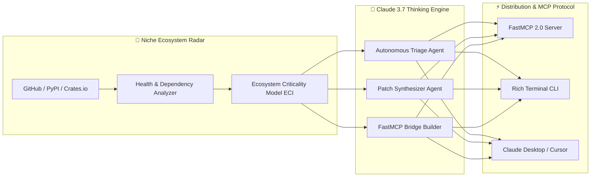

<div align="center">
  <p>
    <b>English</b> | <a href="README.vi.md">Tiếng Việt</a>
  </p>
</div>

<div align="center">

# 🌿 EcoSupport
### Autonomous Niche Ecosystem Radar & Support Platform for Open Source Foundations
**Built for the Claude for Open Source: Ecosystem Impact Track**

[](https://opensource.org/licenses/Apache-2.0)
[](https://www.rust-lang.org/)
[](https://modelcontextprotocol.io/)
[](https://www.anthropic.com/)
[]()

<p align="center">
  <b>Protecting the long-tail of open-source software with Claude 3.7 Extended Thinking & FastMCP.</b>
</p>

</div>

---

## 📖 Overview

Modern AI and software ecosystems stand upon thousands of overlooked, single-maintainer open-source packages—low-level C/Rust FFI bindings, niche scientific serialization formats, and hardware-adjacent kernels. When these packages experience maintainer burnout or security vulnerabilities, cascading failures ripple across the entire global AI stack.

**EcoSupport** is an autonomous open-source infrastructure suite engineered to:
1. **Radar**: Continuously scan and quantify fragility in niche open-source repositories using the **Ecosystem Criticality Index (ECI)**.
2. **Deep Triage**: Deconstruct complex multi-language bug reports using **Claude 3.7 Sonnet’s Extended Thinking**.
3. **Patch Synthesis**: Generate verifiable, regression-tested bug fixes and C-boundary patches with zero maintainer spam.
4. **MCP Bridge Synthesis**: Automatically convert legacy, un-agentic Python/C libraries into fully compliant, secure **FastMCP 2.0 servers**.
5. **Security Audit**: Proactively scan community MCP servers for SSRF, injection vulnerabilities, and tool-description drift.

---

## 🏛️ System Architecture



---

## 🚀 Quickstart

### 1. Installation & Build

```bash
# Clone the repository
git clone https://github.com/thannt/eco_support.git
cd eco_support

# Build Native Rust CLI (eco-support)
cargo build --release
```

### 2. Configuration
Copy the sample environment file and set your API keys:
```bash
cp .env.example .env
# Edit .env and insert your ANTHROPIC_API_KEY
```

### 3. Command Line Interface (CLI)

```bash
# 1. Scan high-risk niche repositories by category
cargo run -p eco-cli -- scan --category c-ffi --limit 5

# 2. Perform deep triage with Claude 3.7 Extended Thinking
cargo run -p eco-cli -- triage --repo "owner/repo" --issue 42 --thinking-budget 8192

# 3. Automatically synthesize an MCP Server for a niche package
cargo run -p eco-cli -- synthesize-mcp --package "custom-raster-io" --output ./mcp_servers/

# 4. Audit an MCP Server implementation for security flaws
cargo run -p eco-cli -- audit-mcp crates/eco-mcp/src/server.rs

# 5. Launch the integrated FastMCP 2.0 Server
./target/release/eco-support mcp-serve --transport stdio
```

---

## 🔌 Connecting to Claude Desktop / Cursor

Add the EcoSupport FastMCP server to your `claude_desktop_config.json`:

```json
{
  "mcpServers": {
    "eco-support": {
      "command": "/absolute/path/to/eco_support/target/release/eco-support",
      "args": ["mcp-serve", "--transport", "stdio"],
      "env": {
        "ANTHROPIC_API_KEY": "your_api_key_here"
      }
    }
  }
}
```

---

## 📂 Project Structure

```
eco_support/
├── Cargo.toml                  # Cargo Workspace Manifest (5 Crates)
├── CLAUDE.md                   # Anthropic agent instructions & standards
├── AGENTS.md                   # Multi-agent architecture and safety guardrails
├── crates/                     # Production Native Rust Engine
│   ├── eco-core/               # Claude 3.7 Client, Thinking Budget, Telemetry
│   ├── eco-radar/              # Niche Scanner & ECI Criticality Math Engine
│   ├── eco-mcp/                # FastMCP 2.0 Server & Static Security Auditor
│   ├── eco-agents/             # Autonomous Triage, Patch, & Bridge Agents
│   └── eco-cli/                # Ultra-fast (3.7MB) Terminal CLI Interface
├── docs/                       # Living 5-Perspective Documentation (Bilingual EN/VI)
│   ├── overview/               # Vibe Coder Guide & Conceptual Mindmaps
│   ├── architecture/           # System Blueprint, DAG & Benchmarks
│   ├── operations/             # SRE Runbooks & Disaster Recovery
│   ├── developers/             # Contributor Manual & FastMCP Tool API
│   └── testing/                # QA Verification & Test Strategy
├── grants/                     # Anthropic Ecosystem Grant Application Suite
├── brainstorm/                 # Red Team Analysis & Product Strategy
├── research/                   # Niche Dependency Survey & Benchmarks
└── scripts/                    # Git Automation, Guards & DocSync Validators
```

---

## 📜 License

Distributed under the **Apache 2.0 License**. See [`LICENSE`](LICENSE) for details.
