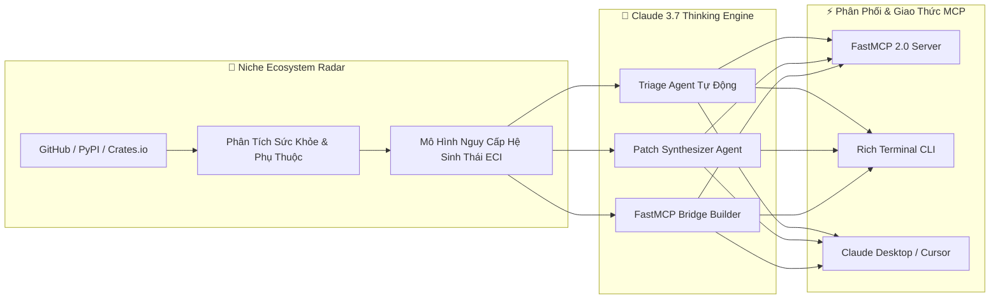

<div align="center">
  <p>
    <a href="README.md">English</a> | <b>Tiếng Việt</b>
  </p>
</div>

<div align="center">

# 🌿 EcoSupport
### Nền Tảng Radar & Hỗ Trợ Tự Động Cho Hệ Sinh Thái Mã Nguồn Mở Ngách
**Xây dựng cho chương trình Claude for Open Source: Ecosystem Impact Track**

[](https://opensource.org/licenses/Apache-2.0)
[](https://www.rust-lang.org/)
[](https://modelcontextprotocol.io/)
[](https://www.anthropic.com/)
[]()

<p align="center">
  <b>Bảo vệ các thư viện mã nguồn mở ngách bằng Claude 3.7 Extended Thinking & FastMCP.</b>
</p>

</div>

---

## 📖 Tổng Quan

Các hệ sinh thái AI và phần mềm hiện đại đang phụ thuộc vào hàng ngàn gói mã nguồn mở ít được chú ý, chỉ do một người duy trì duy nhất—từ các FFI binding C/Rust cấp thấp, định dạng tuần tự hóa khoa học ngách, đến các nhân tính toán phần cứng chuyên biệt. Khi các gói này gặp sự cố kiệt sức của maintainer hoặc lỗ hổng bảo mật, rủi ro dây chuyền sẽ ảnh hưởng đến toàn bộ hạ tầng AI toàn cầu.

**EcoSupport** là bộ hạ tầng mã nguồn mở tự động được thiết kế để:
1. **Radar Viễn Thám**: Liên tục quét và định lượng mức độ nguy cấp của các repo mã nguồn mở ngách bằng chỉ số **Ecosystem Criticality Index (ECI)**.
2. **Khám Nghiệm Sâu (Deep Triage)**: Phân tích các báo cáo lỗi phức tạp đa ngôn ngữ bằng **Claude 3.7 Sonnet Extended Thinking**.
3. **Tổng Hợp Bản Vá (Patch Synthesis)**: Tự động tạo bản vá sửa lỗi được kiểm thử hồi quy nghiêm ngặt, hoàn toàn không spam maintainer.
4. **Cầu Nối MCP (MCP Bridge Synthesis)**: Tự động chuyển đổi các thư viện C/Python truyền thống thành **FastMCP 2.0 Server** an toàn, sẵn sàng kết nối AI.
5. **Kiểm Tra An Ninh (Security Audit)**: Quét tĩnh phát hiện lỗ hổng SSRF, Command Injection và trôi lệch mô tả tool trong hệ sinh thái MCP.

---

## 🏛️ Kiến Trúc Hệ Thống



---

## 🚀 Hướng Dẫn Bắt Đầu Nhanh

### 1. Cài Đặt & Biên Dịch

```bash
# Clone repository
git clone https://github.com/thannt/eco_support.git
cd eco_support

# Biên dịch Native Rust CLI (eco-support)
cargo build --release
```

### 2. Cấu Hình
Sao chép file cấu hình mẫu và điền API key:
```bash
cp .env.example .env
# Chỉnh sửa file .env và nhập ANTHROPIC_API_KEY
```

### 3. Giao Diện Dòng Lệnh (CLI)

```bash
# 1. Quét các repository ngách có nguy cơ cao theo danh mục
cargo run -p eco-cli -- scan --category c-ffi --limit 5

# 2. Khám nghiệm sâu lỗi issue bằng Claude 3.7 Extended Thinking
cargo run -p eco-cli -- triage --repo "owner/repo" --issue 42 --thinking-budget 8192

# 3. Tự động sinh FastMCP Server cho một thư viện ngách
cargo run -p eco-cli -- synthesize-mcp --package "custom-raster-io" --output ./mcp_servers/

# 4. Kiểm tra an ninh mã nguồn MCP Server
cargo run -p eco-cli -- audit-mcp crates/eco-mcp/src/server.rs

# 5. Khởi chạy FastMCP 2.0 Server tích hợp
./target/release/eco-support mcp-serve --transport stdio
```

---

## 🔌 Kết Nối Với Claude Desktop / Cursor

Thêm server FastMCP của EcoSupport vào file `claude_desktop_config.json`:

```json
{
  "mcpServers": {
    "eco-support": {
      "command": "/duong/dan/tuyet/doi/toi/eco_support/target/release/eco-support",
      "args": ["mcp-serve", "--transport", "stdio"],
      "env": {
        "ANTHROPIC_API_KEY": "your_api_key_here"
      }
    }
  }
}
```

---

## 📂 Cấu Trúc Dự Án

```
eco_support/
├── Cargo.toml                  # Cargo Workspace Manifest (5 Crates)
├── CLAUDE.md                   # Chỉ dẫn hoạt động cho Claude Code & Agent
├── AGENTS.md                   # Đặc tả kiến trúc Multi-Agent & Hiến pháp an toàn
├── crates/                     # Engine Rust Native
│   ├── eco-core/               # Client Claude 3.7, Quản lý Token, Telemetry
│   ├── eco-radar/              # Radar quét Repo & Cỗ máy toán ECI
│   ├── eco-mcp/                # FastMCP 2.0 Server & Kiểm tra an ninh tĩnh
│   ├── eco-agents/             # Swarm Agent Triage, Patch, & Bridge
│   └── eco-cli/                # Giao diện dòng lệnh CLI (3.7MB) siêu tốc
├── docs/                       # Hệ thống tài liệu 5 góc nhìn (Song ngữ EN/VI)
│   ├── overview/               # Hướng dẫn Vibe Coder & Sơ đồ tư duy trực quan
│   ├── architecture/           # Bản thiết kế kỹ thuật, DAG & Benchmark
│   ├── operations/             # SRE Runbooks & Kịch bản ứng phó sự cố
│   ├── developers/             # Cẩm nang Developer & API MCP Tool
│   └── testing/                # Chiến lược kiểm thử QA & Xác minh
├── grants/                     # Hồ sơ dự thi Anthropic Ecosystem Grant
├── brainstorm/                 # Phân tích Red Team & Chiến lược sản phẩm
├── research/                   # Khảo sát phụ thuộc ngách 2026 & Benchmark
└── scripts/                    # Script tự động hóa Git, Guard & Kiểm tra DocSync
```

---

## 📜 Giấy Phép (License)

Phát hành theo giấy phép **Apache 2.0 License**. Xem chi tiết tại [`LICENSE`](LICENSE).
