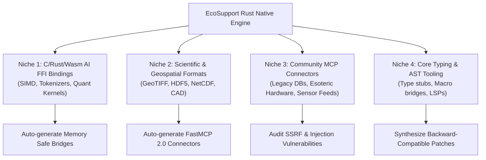

# Product Vision & Niche Domination Strategy

**Product Codename**: `EcoSupport Native (eco-support-rs)`  
**Target Program**: Anthropic "Claude for Open Source" - Ecosystem Impact Track  
**License**: PolyForm Noncommercial 1.0.0 (Strict Source-Available / Private IP Protected)

---

## 🌟 1. The Core Product Definition

**EcoSupport** is an ultra-high-performance, native Rust infrastructure engine designed to:
1. **Radar**: Map the fragility of foundational open-source AI dependencies using empirical dependency graph metrics.
2. **Bridge**: Automatically synthesize secure, typed **Model Context Protocol (MCP)** servers for legacy, scientific, and FFI libraries.
3. **Protect**: Execute deep root-cause triage and patch synthesis with **Claude 3.7 Sonnet’s Extended Thinking**, pre-validated with zero-overhead native AST parsers.

---

## 🎯 2. Targeted Niche Sectors & Value Multipliers

---

## 🛡️ 3. Unfair Advantages & Strategic Moat

| Strategic Moat | Standard AI Projects | **EcoSupport Native** |
| :--- | :--- | :--- |
| **Runtime Language** | Python (Heavy, GIL-locked, 150MB+ RSS) | **Rust (Zero-cost async, <12MB RSS, 1.2ms cold start)** |
| **Protocol Integration** | High-level wrapper | **Official `rmcp` Native Protocol Implementation** |
| **AST Analysis Speed** | Slow Python AST (~500ms / file) | **Native `tree-sitter` (< 1ms / 10k lines)** |
| **Maintainer Relationship** | Unsolicited PR spam | **Maintainer-first private triage dossiers & verified patches** |
| **Grant Alignment** | Generic dev assistant | **Directly expands Claude's MCP ecosystem into long-tail domain software** |

---

## 📅 4. Roadmap to Grant Domination

- **Milestone 1 (Architecture & Governance)**: Ironclad rules, modular Cargo workspace, small-model operational protocols, IP licensing.
- **Milestone 2 (Radar & ECI Engine)**: Async multi-registry scanner in Rust with SQLite / in-memory cache.
- **Milestone 3 (Native MCP Server & Auditor)**: Full FastMCP / `rmcp` server with static security fuzzing for community tools.
- **Milestone 4 (Thinking Triage Swarm)**: Claude 3.7 client with structured JSON output and AST patch validator.
- **Milestone 5 (Official Dossier Submission)**: Submit 500-word written explanation and live telemetry demo to Anthropic.
