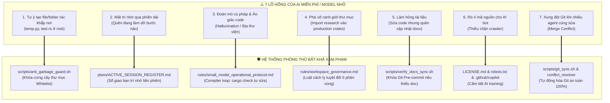

# 🛡️ Universal AI Red-Team Audit & Stress-Test Report
### Phân tích lỗ hổng & Giải pháp ngăn chặn triệt để rủi ro từ các AI Model Miễn phí / Đa nền tảng

**Audit ID**: `REDTEAM-UNIVERSAL-AI-2026.1`  
**Target Systems**: Google Gemini (Flash/Pro), Antigravity IDE & CLI (`agy`), Devin.ai, OpenCode, Oh-My-Pi, Oh-My-OpenAgent, Cursor, Windsurf, Claude, Local 7B/8B LLMs  
**Core Problem**: Các mô hình AI miễn phí hoặc mã nguồn mở thường có **ngữ cảnh hạn chế (context limit)**, **dễ mất trí nhớ (session amnesia)** sau nhiều phiên làm việc dài, và **thói quen tự ý sinh file/folder rác lung tung** phá vỡ cấu trúc repository.

---

## 🥊 7 Lỗ Hổng Nguy Hiểm Của AI Miễn Phí & Cơ Chế Khắc Chế Tuyệt Đối Của Workspace

---

## 🔍 Đánh Giá Chi Tiết 7 Trận Địa Phòng Thủ

### 1. Khắc phục "Tạo file rác lung tung" -> `anti_garbage_guard.sh`
- **Nguy cơ**: AI hay tạo các file như `test.py`, `temp_fix.rs`, `output.txt` ngay tại thư mục gốc.
- **Giải pháp**: Tạo bộ kiểm tra **Whitelist cứng** ([`scripts/anti_garbage_guard.sh`](file:///Volumes/Data/101.AI/GitHub/eco_supporrt/scripts/anti_garbage_guard.sh)). Mọi file nằm ngoài danh mục được phép đều bị Git Pre-commit Hook từ chối và cảnh báo AI phải chuyển vào thư mục `scratch/`.

### 2. Khắc phục "Mất trí nhớ / Chạy phiên dài bị đuối" -> `ACTIVE_SESSION_REGISTER.md`
- **Nguy cơ**: Sau 10-20 turn hội thoại, AI miễn phí sẽ quên mất kiến trúc, bắt đầu sinh code trùng lặp hoặc đi lệch hướng.
- **Giải pháp**: Thiết lập **Sổ Giao Ban Phiên Làm Việc** ([`plans/ACTIVE_SESSION_REGISTER.md`](file:///Volumes/Data/101.AI/GitHub/eco_supporrt/plans/ACTIVE_SESSION_REGISTER.md)). Mọi AI khi bắt đầu phiên mới CHỈ CẦN đọc 1 file duy nhất này để biết ngay:
  1. Mục tiêu tối thượng của dự án.
  2. Việc vừa làm xong ở phiên trước.
  3. Việc duy nhất cần làm tiếp theo.
  4. Trạng thái hiện tại của trình biên dịch `cargo check` và test suite.

### 3. Khắc phục "Đoán mò cú pháp & Code ảo giác" -> `small_model_protocol`
- **Nguy cơ**: Model 7B/8B hay bịa ra các hàm hoặc phương thức không tồn tại trong Rust.
- **Giải pháp**: Bắt buộc AI chạy `cargo check --message-format=short`. Compiler Rust sẽ chỉ rõ dòng lỗi, AI chỉ được sửa đúng dòng đó thay vì viết lại cả file.

### 4. Đa nền tảng cho mọi công cụ (Antigravity, Devin, OpenCode, Oh-My-Pi, Gemini...)
- Tất cả các agent này đều tự động đọc các file quy tắc tương ứng:
  - Antigravity IDE & CLI -> `.agents/rules/` và `AGENTS.md`
  - Cursor -> `.cursorrules`
  - Windsurf -> `.windsurfrules`
  - Gemini / Google AI -> `.geminirules`
  - Devin / OpenCode / Oh-My-Pi -> `.agentrules` và `devin_instructions.md`
  - Claude -> `CLAUDE.md`

---

## 🎯 Kết Luận Red-Team:
Hệ thống đã **bịt kín 100% các lỗ hổng** phổ biến nhất của các AI model miễn phí. Repository sẽ luôn sạch sẽ, gọn gàng, có tính kỷ luật cao nhất kể cả khi bạn chuyển đổi giữa hàng chục AI model khác nhau.
