# DataGuard Workspace Directory Tree

> Complete directory structure of the DataGuard project with descriptions of every file and folder.

## Directory Hierarchy

```mermaid
graph TD
    ROOT["eco_support_net_oracle/"]
    ROOT --> SRC["src/"]
    ROOT --> TESTS["tests/"]
    ROOT --> DOCS["docs/"]
    ROOT --> SCRIPTS["scripts/"]
    ROOT --> PLANS["plans/"]
    ROOT --> GITHUB[".github/"]
    ROOT --> SAMPLES["samples/"]
    ROOT --> BENCH["benchmarks/"]
    ROOT --> TOOLS["tools/"]
    ROOT --> RESEARCH["research/"]
    ROOT --> BRAINSTORM["brainstorm/"]
    ROOT --> GRANTS["grants/"]
    ROOT --> CONFIG["Config & Meta Files"]

    SRC --> CORE["DataGuard.Core"]
    SRC --> CLI["DataGuard.Cli"]
    SRC --> ORA["DataGuard.Oracle.Adapter"]
    SRC --> MYSQL["DataGuard.MySql.Adapter"]
    SRC --> PG["DataGuard.PostgreSql.Adapter"]
    SRC --> MSSQL["DataGuard.SqlServer.Adapter"]
    SRC --> ANALYZERS["DataGuard.Analyzers"]
    SRC --> CODEFIXES["DataGuard.CodeFixes"]
    SRC --> CONTRACTS["DataGuard.Contracts"]
    SRC --> VS["DataGuard.VisualStudio"]
    SRC --> VSCODE["DataGuard.VSCode"]

    CORE --> ABS["Abstractions"]
    CORE --> RULES["Rules"]
    CORE --> SOURCES["Sources"]
    CORE --> SECURITY["Security"]
    CORE --> BASELINE["Baseline"]
    CORE --> REPORTING["Reporting"]
    CORE --> VALIDATION["Validation"]
    CORE --> PLUGINS["Plugins"]
    CORE --> TELEMETRY["Telemetry"]
    CORE --> AUTODETECT["AutoDetection"]
    CORE --> ASSESS["Assessment"]
    CORE --> PUBLICAPI["PublicApi"]
    CORE --> MODELS["Models"]

    TESTS --> T1["DataGuard.Core.Tests"]
    TESTS --> T2["DataGuard.GoldenCorpus.Tests"]
    TESTS --> T3["DataGuard.Analyzers.Tests"]

    DOCS --> D0["00-directory-tree"]
    DOCS --> D1["01-overview"]
    DOCS --> D2["02-architecture"]
    DOCS --> D3["03-components"]
    DOCS --> D4["04-diagrams"]
    DOCS --> D5["05-operations"]
    DOCS --> D6["06-roadmap"]
    DOCS --> D7["07-testing"]
    DOCS --> D8["08-developers"]
```

## Root Files

| Path | Purpose | Layer | Language |
|------|---------|-------|----------|
| `AGENTS.md` | AI agent configuration and behavioral rules for coding assistants | Meta | Markdown |
| `CLAUDE.md` | Claude-specific instructions and project context | Meta | Markdown |
| `README.md` | Project overview, installation, and quick start guide (English) | Documentation | Markdown |
| `README.vi.md` | Project overview, installation, and quick start guide (Vietnamese) | Documentation | Markdown |
| `CHANGELOG.md` | Version history and release notes | Documentation | Markdown |
| `CONTRIBUTING.md` | Contributor guidelines and development workflow (English) | Documentation | Markdown |
| `CONTRIBUTING.vi.md` | Contributor guidelines and development workflow (Vietnamese) | Documentation | Markdown |
| `SECURITY.md` | Security policy and vulnerability reporting (English) | Documentation | Markdown |
| `SECURITY.vi.md` | Security policy and vulnerability reporting (Vietnamese) | Documentation | Markdown |
| `SUPPORT.md` | Support channels and community resources | Documentation | Markdown |
| `CODE_OF_CONDUCT.md` | Community code of conduct | Documentation | Markdown |
| `AI_AGENT_AUDIT.md` | Audit trail for AI agent operations on the repository | Meta | Markdown |
| `LICENSE` | MIT License | Legal | Text |
| `DataGuard.sln` | .NET solution file binding all 13 projects | Build | MSBuild XML |
| `Directory.Build.props` | Shared MSBuild properties across all projects | Build | MSBuild XML |
| `.editorconfig` | Code style and formatting rules | Config | INI |
| `Dockerfile` | Container build definition for CI/CD and distribution | Infrastructure | Dockerfile |
| `.dockerignore` | Files excluded from Docker build context | Config | Text |
| `.env.example` | Template for environment variables (connection strings, keys) | Config | Shell |
| `.gitignore` | Git ignore patterns for build artifacts, IDE files | Config | Text |
| `.gitattributes` | Git line-ending and binary file handling rules | Config | Text |
| `robots.txt` | Web crawler directives for documentation site | Config | Text |
| `devin_instructions.md` | Instructions for Devin AI agent | Meta | Markdown |
| `.windsurfrules` | Windsurf AI agent behavioral rules | Meta | Text |
| `.geminirules` | Gemini AI agent behavioral rules | Meta | Text |
| `.cursorrules` | Cursor AI agent behavioral rules | Meta | Text |
| `.agentrules` | Generic AI agent behavioral rules | Meta | Text |

## Source Projects (`src/`)

### DataGuard.Core

The core library containing all domain logic, validation rules, and abstractions.

| Path | Purpose | Layer | Language |
|------|---------|-------|----------|
| `src/DataGuard.Core/DataGuard.Core.csproj` | Project file — targets net9.0, references Roslyn, YamlDotNet | Build | MSBuild XML |
| `src/DataGuard.Core/packages.lock.json` | NuGet dependency lock file | Build | JSON |
| **Abstractions/** | | | |
| `Abstractions/Contracts.cs` | Core domain model: `IContractSource`, `IContractRule`, `ContractViolation`, `EntityDescriptor`, `StoredProcedureDescriptor`, `RawSqlDescriptor`, `ColumnDescriptor`, `ParameterDescriptor`, `DatabaseSchemaDescriptor` | Domain | C# |
| **Rules/** | | | |
| `Rules/ContractRules.cs` | Built-in validation rules: `ParameterCountRule` (DG101), `ParameterTypeMatchRule` (DG002), `ParameterDirectionRule` (DG003), `ColumnShapeMatchRule` (DG004), `NullableMismatchRule` (DG005), `NamingConventionRule` (DG006) | Domain | C# |
| `Rules/PhantomIdentifierRule.cs` | Phantom table/column detection: `PhantomTable` (DG015), `PhantomColumn` (DG016) — validates SQL references against database schema | Domain | C# |
| `Rules/RuleDependencyGraph.cs` | DAG-based rule execution ordering with dependency resolution and topological sort | Domain | C# |
| **Sources/** | | | |
| `Sources/EfModelSource.cs` | Extracts contract descriptors from EF Core `DbContext` models via reflection | Infrastructure | C# |
| `Sources/SqlServerParsers.cs` | Parses SQL Server stored procedure metadata from `sys.*` catalog views | Infrastructure | C# |
| `Sources/ManualContractSource.cs` | Loads contract descriptors from compiled assemblies (offline/manual mode) | Infrastructure | C# |
| `Sources/SqlKeywordMatcher.cs` | SQL keyword and syntax pattern matching utility | Utility | C# |
| **Security/** | | | |
| `Security/ZeroTrustCredentialProvider.cs` | Zero-trust credential resolution: Azure Key Vault, AWS Secrets Manager, HashiCorp Vault, environment variables | Infrastructure | C# |
| `Security/CredentialManager.cs` | Connection string encryption, rotation detection, secure storage | Infrastructure | C# |
| `Security/IAuditLogger.cs` | Audit logging interface and implementation for compliance tracking | Infrastructure | C# |
| `Security/SupplyChainVerifier.cs` | NuGet package integrity verification and supply chain security checks | Infrastructure | C# |
| **Baseline/** | | | |
| `Baseline/BaselineManager.cs` | Baseline creation, drift detection, snapshot management, and migration | Domain | C# |
| **Reporting/** | | | |
| `Reporting/DiagnosticEmitter.cs` | Converts violations to Roslyn `Diagnostic` objects for IDE integration | Infrastructure | C# |
| `Reporting/SarifTypes.cs` | SARIF v2.1.0 data model for CI/CD tool integration | Infrastructure | C# |
| `Reporting/ContractExport.cs` | Export contracts to JSON, YAML, and TypeScript DTO formats | Infrastructure | C# |
| `Reporting/ContractEvidence.cs` | Evidence pack generation for audit and compliance | Infrastructure | C# |
| **Validation/** | | | |
| `Validation/ConcurrentValidationEngine.cs` | Parallel validation engine with configurable degree of parallelism | Domain | C# |
| **Plugins/** | | | |
| `Plugins/RulePluginManager.cs` | MEF-based plugin system for custom rule loading and discovery | Infrastructure | C# |
| **Telemetry/** | | | |
| `Telemetry/TelemetryCollector.cs` | Optional telemetry collection for usage analytics and performance metrics | Infrastructure | C# |
| **AutoDetection/** | | | |
| `AutoDetection/AutoDetectionEngine.cs` | Auto-detects EF Core contexts, Dapper usage, database providers, and naming conventions | Domain | C# |
| **Assessment/** | | | |
| `Assessment/AssessmentEngine.cs` | Read-only environment assessment: dependency health, build status, secrets scan | Domain | C# |
| `Assessment/UpgradePlanner.cs` | Generates upgrade plans for legacy codebases migrating to modern patterns | Domain | C# |
| `Assessment/AssessmentContracts.cs` | Assessment report data models and contracts | Domain | C# |
| `Assessment/LegacySupportTable.cs` | Legacy .NET framework support matrix and compatibility data | Domain | C# |
| `Assessment/Internal/` | Internal assessment packs: `DependencyHealthPack`, `BuildCiPack`, `SecretsPack`, `InventoryPack`, `AssessmentReportWriter`, `PackagesConfigReader`, `ProjectInventoryReader` | Domain | C# |
| **Models/** | | | |
| `Models/Configuration.cs` | `DataGuardConfiguration` record with all settings: connection, ground-truth mode, naming convention, security, Oracle/SqlServer config, parallelism, telemetry | Domain | C# |
| **PublicApi/** | | | |
| `PublicApi/PublicApiSurface.cs` | `DataGuardApi` and `ValidationPipeline` — programmatic entry point for library consumers | API | C# |

### DataGuard.Cli

Command-line interface tool with 9 commands.

| Path | Purpose | Layer | Language |
|------|---------|-------|----------|
| `src/DataGuard.Cli/DataGuard.Cli.csproj` | CLI project file — targets net9.0, references System.CommandLine | Build | MSBuild XML |
| `src/DataGuard.Cli/Program.cs` | CLI entry point — defines all 9 commands: `validate`, `baseline`, `snapshot` (refresh/show/diff), `init`, `config` (show/validate), `oracle-check`, `migrate`, `assess`, `version` | Application | C# |
| `src/DataGuard.Cli/Hooks/PreCommitHookInstaller.cs` | Git pre-commit hook installer for automated validation on commit | Infrastructure | C# |

### Database Adapters

| Path | Purpose | Layer | Language |
|------|---------|-------|----------|
| **DataGuard.Oracle.Adapter/** | | | |
| `OracleDialectChecker.cs` | Oracle dialect rules: DG010 (Oracle syntax in non-Oracle), DG011 (non-Oracle function in Oracle), DG012 (provider mismatch), DG013 (SQL Server syntax leak), DG014 (unmapped types) | Domain | C# |
| `OracleReaders.cs` | Oracle metadata readers: `USER_ARGUMENTS`, `USER_TAB_COLUMNS`, `ALL_ARGUMENTS`, `ALL_TAB_COLUMNS` | Infrastructure | C# |
| `LengthMismatch.cs` | Oracle length validation rules: DG007 (length exceeds column), DG008 (byte-length overflow), DG009 (NVARCHAR2(2000) inference fallback) | Domain | C# |
| **DataGuard.MySql.Adapter/** | | | |
| `MySqlDialectChecker.cs` | MySQL dialect rules: MY001 (MySQL syntax in non-MySQL), MY002 (non-MySQL syntax in MySQL) | Domain | C# |
| `MySqlStoredProcedureParser.cs` | MySQL stored procedure metadata parser via `information_schema` | Infrastructure | C# |
| `MySqlLengthMismatchDetector.cs` | MySQL length validation rule: MY003 (entity length exceeds column) | Domain | C# |
| **DataGuard.PostgreSql.Adapter/** | | | |
| `PostgreSqlDialectChecker.cs` | PostgreSQL dialect rules: PG001 (PG syntax in non-PG), PG002 (non-PG syntax in PG) | Domain | C# |
| `PostgreSqlStoredProcedureParser.cs` | PostgreSQL function/procedure metadata parser via `information_schema.routines` | Infrastructure | C# |
| `PostgreSqlLengthMismatchDetector.cs` | PostgreSQL length validation rule: PG003 (entity length exceeds column) | Domain | C# |
| **DataGuard.SqlServer.Adapter/** | | | |
| `DataGuard.SqlServer.Adapter.csproj` | SQL Server adapter project — delegates parsing to `DataGuard.Core/Sources/SqlServerParsers.cs` | Build | MSBuild XML |

### Tooling Projects

| Path | Purpose | Layer | Language |
|------|---------|-------|----------|
| **DataGuard.Analyzers/** | | | |
| `Analyzers.cs` | Roslyn analyzers: `UnvalidatedSqlCallGenerator` (IDE incremental generator, DG001) and `ContractValidationAnalyzer` (CI semantic analyzer). Defines all diagnostic IDs DG001–DG016, DG098, DG099 | Tooling | C# |
| `IsExternalInit.cs` | Polyfill for `init` keyword support in netstandard2.0 | Utility | C# |
| `stylecop.json` | StyleCop analyzer configuration | Config | JSON |
| **DataGuard.CodeFixes/** | | | |
| `CodeFixProviders.cs` | Roslyn code fix providers: auto-generate contract attributes, fix naming conventions, add validation calls | Tooling | C# |
| **DataGuard.Contracts/** | | | |
| `ContractAttributes.cs` | `[DataContract]`, `[SqlParameter]`, `[ResultSet]` attributes for declarative contract definition | Domain | C# |
| `NameConventions.cs` | Naming convention mappings: snake_case ↔ PascalCase, UPPER_CASE ↔ PascalCase | Utility | C# |

### IDE Extensions

| Path | Purpose | Layer | Language |
|------|---------|-------|----------|
| **DataGuard.VisualStudio/** | | | |
| `DataGuardPackage.cs` | Visual Studio 2022 extension package — menu commands, tool windows, validation integration | Tooling | C# |
| `Commands/` | VS command handlers for validate, baseline, assess actions | Tooling | C# |
| `Resources/` | Extension icons, images, and embedded resources | Asset | Various |
| `source.extension.vsixmanifest` | VSIX manifest for VS 2022 extension packaging | Config | XML |
| `vs-publish.json` | VS Marketplace publishing configuration | Config | JSON |
| `overview.md` | Extension marketplace description | Documentation | Markdown |
| **DataGuard.VSCode/** | | | |
| `package.json` | VS Code extension manifest — commands, configuration, activation events | Config | JSON |
| `src/` | TypeScript source for VS Code extension | Tooling | TypeScript |
| `out/` | Compiled JavaScript output | Build | JavaScript |
| `tsconfig.json` | TypeScript compiler configuration | Config | JSON |
| `README.md` | VS Code marketplace description | Documentation | Markdown |
| `dataguard-vscode-0.1.0.vsix` | Pre-built VS Code extension package | Build | VSIX |

## Test Projects (`tests/`)

| Path | Purpose | Layer | Language |
|------|---------|-------|----------|
| **DataGuard.Core.Tests/** | | | |
| `OracleAdapterTests.cs` | Oracle adapter unit tests | Test | C# |
| `SqlServerIntegrationTests.cs` | SQL Server integration tests | Test | C# |
| `SqlServerParserIntegrationTests.cs` | SQL Server parser integration tests | Test | C# |
| `CliExitCodeTests.cs` | CLI exit code verification tests | Test | C# |
| `AssessmentPackTests.cs` | Assessment engine pack tests | Test | C# |
| `AssessmentContractTests.cs` | Assessment contract model tests | Test | C# |
| `UpgradePlannerTests.cs` | Upgrade planner tests | Test | C# |
| `DataGuard.Core.Tests.csproj` | Test project file | Build | MSBuild XML |
| **DataGuard.GoldenCorpus.Tests/** | | | |
| `GoldenCorpusTests.cs` | Golden corpus validation — verifies all rules against known-good/bad fixtures | Test | C# |
| `RuleCoverageTests.cs` | Rule coverage analysis — ensures every rule ID has corpus entries | Test | C# |
| `golden-corpus/` | Test fixture files (valid/invalid SQL, entity definitions) | Test | Various |
| **DataGuard.Analyzers.Tests/** | | | |
| `DescriptorArityTests.cs` | Diagnostic descriptor parameter arity tests | Test | C# |
| `GeneratorExecutionTests.cs` | Incremental generator execution tests | Test | C# |

## Documentation (`docs/`)

| Path | Purpose | Layer | Language |
|------|---------|-------|----------|
| `docs/README.md` | Documentation hub and navigation index (English) | Documentation | Markdown |
| `docs/README.vi.md` | Documentation hub and navigation index (Vietnamese) | Documentation | Markdown |
| `docs/00-directory-tree/` | Workspace directory tree documentation | Documentation | Markdown |
| `docs/01-overview/` | Product overview, features, pain points, quickstart | Documentation | Markdown |
| `docs/02-architecture/` | System architecture, design philosophy, component model | Documentation | Markdown |
| `docs/03-components/core/` | Core component deep-dives (abstractions, rules, sources, etc.) | Documentation | Markdown |
| `docs/03-components/adapters/` | Database adapter documentation (Oracle, MySQL, PostgreSQL, SQL Server) | Documentation | Markdown |
| `docs/03-components/tooling/` | CLI, analyzers, code fixes, VS Code, VS 2022 | Documentation | Markdown |
| `docs/03-components/contracts/` | Contract attributes and naming conventions | Documentation | Markdown |
| `docs/04-diagrams/` | Data flow, activity, sequence, state machine diagrams | Documentation | Markdown |
| `docs/05-operations/` | Installation, configuration, playbook, runbook, log guide | Documentation | Markdown |
| `docs/06-roadmap/` | Future directions and upgrade path | Documentation | Markdown |
| `docs/07-testing/` | Test strategy and QA documentation | Documentation | Markdown |
| `docs/08-developers/` | Contributor guide and development deep-dive | Documentation | Markdown |
| `docs/product-discovery/` | Market research, capability matrix, source inventory | Documentation | Markdown |
| `docs/golden-standard/` | Documentation patterns and template checklist | Documentation | Markdown |
| `docs/architecture/` | System architecture and tech stack evaluation | Documentation | Markdown |
| `docs/overview/` | Vibe coder guide for quick orientation | Documentation | Markdown |
| `docs/developers/` | Contributor deep-dive documentation | Documentation | Markdown |
| `docs/testing/` | QA test strategy documentation | Documentation | Markdown |
| `docs/operations/` | Playbook and runbook documentation | Documentation | Markdown |
| `docs/FIX_PLAN.md` | Detailed fix plan for known issues | Documentation | Markdown |
| `docs/RISKS_GAPS.md` | Risk register and gap analysis | Documentation | Markdown |
| `docs/PERFORMANCE.md` | Performance benchmarks and analysis | Documentation | Markdown |
| `docs/PRODUCT.md` | Product definition document | Documentation | Markdown |
| `docs/SOLUTION.md` | Solution architecture document | Documentation | Markdown |
| `docs/assess.md` | Assessment command documentation | Documentation | Markdown |
| `docs/cli.md` | CLI reference documentation | Documentation | Markdown |
| `docs/mcp.md` | MCP server integration documentation | Documentation | Markdown |
| `docs/contributing.md` | Contributor guide | Documentation | Markdown |
| `docs/enterprise-banking-profile.md` | Enterprise banking use case profile | Documentation | Markdown |

## Scripts (`scripts/`)

| Path | Purpose | Layer | Language |
|------|---------|-------|----------|
| `scripts/verify_docs_sync.sh` | Verifies bilingual (EN/VI) documentation synchronization | Ops | Bash |
| `scripts/preflight_agent_check.sh` | Pre-flight checks for AI agent operations | Ops | Bash |
| `scripts/anti_garbage_guard.sh` | Prevents garbage/low-quality commits from AI agents | Ops | Bash |
| `scripts/demo_scan.sh` | Demo script for running a full DataGuard scan | Ops | Bash |
| `scripts/git_conflict_resolver.sh` | Automated git merge conflict resolution helper | Ops | Bash |
| `scripts/git_sync.sh` | Git synchronization and branch management script | Ops | Bash |

## Plans (`plans/`)

| Path | Purpose | Layer | Language |
|------|---------|-------|----------|
| `plans/master-plan.md` | Master implementation plan | Planning | Markdown |
| `plans/implementation-plan.md` | Detailed implementation plan with phases | Planning | Markdown |
| `plans/ACTIVE_SESSION_REGISTER.md` | Active AI agent session tracking | Planning | Markdown |
| `plans/adr/` | Architecture Decision Records | Planning | Markdown |
| `plans/reports/` | Planning reports and analysis | Planning | Markdown |

## CI/CD & GitHub (`.github/`)

| Path | Purpose | Layer | Language |
|------|---------|-------|----------|
| `.github/workflows/ci.yml` | CI pipeline: build, test, analyze, validate | CI/CD | YAML |
| `.github/workflows/release.yml` | Release pipeline: version, pack, publish | CI/CD | YAML |
| `.github/dependabot.yml` | Dependabot dependency update configuration | CI/CD | YAML |
| `.github/codeql-config.yml` | CodeQL security scanning configuration | CI/CD | YAML |
| `.github/codeql/` | CodeQL custom queries and configurations | CI/CD | YAML |
| `.github/CODEOWNERS` | Code ownership rules for PR reviews | CI/CD | Text |
| `.github/PULL_REQUEST_TEMPLATE.md` | PR template with checklist | CI/CD | Markdown |
| `.github/ISSUE_TEMPLATE/` | Issue templates (bug, feature, question) | CI/CD | Markdown |
| `.github/copilot-instructions.md` | GitHub Copilot behavioral instructions | Meta | Markdown |
| `.github/trufflehog-exclude-paths.txt` | TruffleHog secret scanning exclusions | CI/CD | Text |

## Samples & Benchmarks

| Path | Purpose | Layer | Language |
|------|---------|-------|----------|
| `samples/DataGuard.Sample/` | Sample project demonstrating DataGuard usage | Example | C# |
| `benchmarks/DataGuard.Benchmarks/` | BenchmarkDotNet performance benchmarks | Test | C# |
| `BenchmarkDotNet.Artifacts/` | Benchmark execution results and logs | Test | Various |

## Git Hooks & Agent Rules

| Path | Purpose | Layer | Language |
|------|---------|-------|----------|
| `.githooks/commit-msg` | Commit message validation hook (conventional commits) | Ops | Shell |
| `.githooks/pre-commit` | Pre-commit validation hook (lint, format check) | Ops | Shell |
| `.githooks/pre-push` | Pre-push validation hook (tests, build) | Ops | Shell |
| `.agents/rules/` | AI agent behavioral rules | Meta | Markdown |
| `rules/` | Workspace governance, git workflow, doc sync enforcement rules | Meta | Markdown |
| `.codex/skills/` | Codex AI agent skills | Meta | Various |
| `claude/skills/` | Claude AI agent skills | Meta | Various |
| `tools/git-tools/` | Git utility scripts and helpers | Ops | Shell |

## Research & Planning

| Path | Purpose | Layer | Language |
|------|---------|-------|----------|
| `research/` | Market research, prototypes, data analysis | Research | Various |
| `brainstorm/` | Product vision, red team audits, strategy documents | Planning | Markdown |
| `grants/` | Grant applications and ecosystem impact documentation | Business | Markdown |
| `.omo/` | Oh My Pi agent orchestration state and plans | Meta | Various |
| `.omp/` | Oh My Pi harness configuration and handoffs | Meta | Various |

## Summary Statistics

| Category | Count |
|----------|-------|
| Source projects | 13 |
| Test projects | 3 |
| CLI commands | 9 |
| Validation rules (core) | 18 (DG001–DG016, DG098, DG099) |
| Validation rules (adapters) | 9 (MY001–003, PG001–003, Oracle-specific) |
| Documentation sections | 9 |
| CI/CD workflows | 2 |
| Git hooks | 3 |
| Scripts | 6 |
