# Cấu Trúc Thư Mục Workspace DataGuard

> Cây thư mục đầy đủ của dự án DataGuard với mô tả từng file và thư mục.

## Sơ Đồ Phân Cấp Thư Mục

```mermaid
graph TD
    ROOT["eco_support_net_oracle/"]
    ROOT --> SRC["src/"]
    ROOT --> TESTS["tests/"]
    ROOT --> DOCS["docs/"]
    ROOT --> SCRIPTS["scripts/"]
    ROOT --> PLANS["plans/"]
    ROOT --> GITHUB[".github/"]
    ROOT --> SAMPLES["samples/"]
    ROOT --> BENCH["benchmarks/"]
    ROOT --> TOOLS["tools/"]
    ROOT --> RESEARCH["research/"]
    ROOT --> BRAINSTORM["brainstorm/"]
    ROOT --> GRANTS["grants/"]
    ROOT --> CONFIG["Config & Meta Files"]

    SRC --> CORE["DataGuard.Core"]
    SRC --> CLI["DataGuard.Cli"]
    SRC --> ORA["DataGuard.Oracle.Adapter"]
    SRC --> MYSQL["DataGuard.MySql.Adapter"]
    SRC --> PG["DataGuard.PostgreSql.Adapter"]
    SRC --> MSSQL["DataGuard.SqlServer.Adapter"]
    SRC --> ANALYZERS["DataGuard.Analyzers"]
    SRC --> CODEFIXES["DataGuard.CodeFixes"]
    SRC --> CONTRACTS["DataGuard.Contracts"]
    SRC --> VS["DataGuard.VisualStudio"]
    SRC --> VSCODE["DataGuard.VSCode"]

    CORE --> ABS["Abstractions"]
    CORE --> RULES["Rules"]
    CORE --> SOURCES["Sources"]
    CORE --> SECURITY["Security"]
    CORE --> BASELINE["Baseline"]
    CORE --> REPORTING["Reporting"]
    CORE --> VALIDATION["Validation"]
    CORE --> PLUGINS["Plugins"]
    CORE --> TELEMETRY["Telemetry"]
    CORE --> AUTODETECT["AutoDetection"]
    CORE --> ASSESS["Assessment"]
    CORE --> PUBLICAPI["PublicApi"]
    CORE --> MODELS["Models"]

    TESTS --> T1["DataGuard.Core.Tests"]
    TESTS --> T2["DataGuard.GoldenCorpus.Tests"]
    TESTS --> T3["DataGuard.Analyzers.Tests"]

    DOCS --> D0["00-directory-tree"]
    DOCS --> D1["01-overview"]
    DOCS --> D2["02-architecture"]
    DOCS --> D3["03-components"]
    DOCS --> D4["04-diagrams"]
    DOCS --> D5["05-operations"]
    DOCS --> D6["06-roadmap"]
    DOCS --> D7["07-testing"]
    DOCS --> D8["08-developers"]
```

## File Gốc

| Đường Dẫn | Mục Đích | Lớp | Ngôn Ngữ |
|-----------|----------|-----|----------|
| `AGENTS.md` | Cấu hình và quy tắc hành vi cho AI coding assistant | Meta | Markdown |
| `CLAUDE.md` | Hướng dẫn dành riêng cho Claude và ngữ cảnh dự án | Meta | Markdown |
| `README.md` | Tổng quan dự án, cài đặt, hướng dẫn nhanh (tiếng Anh) | Tài liệu | Markdown |
| `README.vi.md` | Tổng quan dự án, cài đặt, hướng dẫn nhanh (tiếng Việt) | Tài liệu | Markdown |
| `CHANGELOG.md` | Lịch sử phiên bản và ghi chú phát hành | Tài liệu | Markdown |
| `CONTRIBUTING.md` | Hướng dẫn đóng góp và quy trình phát triển (tiếng Anh) | Tài liệu | Markdown |
| `CONTRIBUTING.vi.md` | Hướng dẫn đóng góp và quy trình phát triển (tiếng Việt) | Tài liệu | Markdown |
| `SECURITY.md` | Chính sách bảo mật và báo cáo lỗ hổng (tiếng Anh) | Tài liệu | Markdown |
| `SECURITY.vi.md` | Chính sách bảo mật và báo cáo lỗ hổng (tiếng Việt) | Tài liệu | Markdown |
| `SUPPORT.md` | Kênh hỗ trợ và tài nguyên cộng đồng | Tài liệu | Markdown |
| `CODE_OF_CONDUCT.md` | Quy tắc ứng xử cộng đồng | Tài liệu | Markdown |
| `AI_AGENT_AUDIT.md` | Nhật ký kiểm toán cho các hoạt động của AI agent | Meta | Markdown |
| `LICENSE` | Giấy phép MIT | Pháp lý | Text |
| `DataGuard.sln` | File giải pháp .NET liên kết tất cả 13 dự án | Build | MSBuild XML |
| `Directory.Build.props` | Thuộc tính MSBuild dùng chung cho tất cả dự án | Build | MSBuild XML |
| `.editorconfig` | Quy tắc định dạng và style code | Cấu hình | INI |
| `Dockerfile` | Định nghĩa build container cho CI/CD và phân phối | Hạ tầng | Dockerfile |
| `.dockerignore` | Các file bị loại khỏi ngữ cảnh build Docker | Cấu hình | Text |
| `.env.example` | Mẫu cho biến môi trường (connection string, khóa) | Cấu hình | Shell |
| `.gitignore` | Quy tắc bỏ qua cho Git (artifact build, file IDE) | Cấu hình | Text |
| `.gitattributes` | Quy tắc xử lý dòng và file nhị phân của Git | Cấu hình | Text |
| `robots.txt` | Chỉ dẫn cho web crawler trang tài liệu | Cấu hình | Text |
| `devin_instructions.md` | Hướng dẫn cho AI agent Devin | Meta | Markdown |
| `.windsurfrules` | Quy tắc hành vi cho AI agent Windsurf | Meta | Text |
| `.geminirules` | Quy tắc hành vi cho AI agent Gemini | Meta | Text |
| `.cursorrules` | Quy tắc hành vi cho AI agent Cursor | Meta | Text |
| `.agentrules` | Quy tắc hành vi chung cho AI agent | Meta | Text |

## Dự Án Nguồn (`src/`)

### DataGuard.Core

Thư viện lõi chứa toàn bộ logic miền, quy tắc validation và abstractions.

| Đường Dẫn | Mục Đích | Lớp | Ngôn Ngữ |
|-----------|----------|-----|----------|
| `src/DataGuard.Core/DataGuard.Core.csproj` | File dự án — target net9.0, tham chiếu Roslyn, YamlDotNet | Build | MSBuild XML |
| `src/DataGuard.Core/packages.lock.json` | File khóa dependency NuGet | Build | JSON |
| **Abstractions/** | | | |
| `Abstractions/Contracts.cs` | Mô hình miền lõi: `IContractSource`, `IContractRule`, `ContractViolation`, `EntityDescriptor`, `StoredProcedureDescriptor`, `RawSqlDescriptor`, `ColumnDescriptor`, `ParameterDescriptor`, `DatabaseSchemaDescriptor` | Miền | C# |
| **Rules/** | | | |
| `Rules/ContractRules.cs` | Các quy tắc validation tích hợp: `ParameterCountRule` (DG101), `ParameterTypeMatchRule` (DG002), `ParameterDirectionRule` (DG003), `ColumnShapeMatchRule` (DG004), `NullableMismatchRule` (DG005), `NamingConventionRule` (DG006) | Miền | C# |
| `Rules/PhantomIdentifierRule.cs` | Phát hiện bảng/cột ma: `PhantomTable` (DG015), `PhantomColumn` (DG016) — xác minh tham chiếu SQL với schema database | Miền | C# |
| `Rules/RuleDependencyGraph.cs` | Thứ tự thực thi quy tắc dựa trên DAG với phân giải phụ thuộc và sắp xếp topo | Miền | C# |
| **Sources/** | | | |
| `Sources/EfModelSource.cs` | Trích xuất contract descriptor từ mô hình EF Core `DbContext` qua reflection | Hạ tầng | C# |
| `Sources/SqlServerParsers.cs` | Phân tích metadata stored procedure SQL Server từ `sys.*` catalog views | Hạ tầng | C# |
| `Sources/ManualContractSource.cs` | Tải contract descriptor từ assembly đã biên chế (chế độ offline/manual) | Hạ tầng | C# |
| `Sources/SqlKeywordMatcher.cs` | Tiện ích khớp từ khóa và mẫu cú pháp SQL | Tiện ích | C# |
| **Security/** | | | |
| `Security/ZeroTrustCredentialProvider.cs` | Phân giải credential zero-trust: Azure Key Vault, AWS Secrets Manager, HashiCorp Vault, biến môi trường | Hạ tầng | C# |
| `Security/CredentialManager.cs` | Mã hóa connection string, phát hiện rotation, lưu trữ an toàn | Hạ tầng | C# |
| `Security/IAuditLogger.cs` | Interface và triển khai audit logging cho tuân thủ | Hạ tầng | C# |
| `Security/SupplyChainVerifier.cs` | Xác minh toàn vẹn gói NuGet và kiểm tra bảo mật chuỗi cung ứng | Hạ tầng | C# |
| **Baseline/** | | | |
| `Baseline/BaselineManager.cs` | Tạo baseline, phát hiện drift, quản lý snapshot, và migration | Miền | C# |
| **Reporting/** | | | |
| `Reporting/DiagnosticEmitter.cs` | Chuyển đổi violations thành đối tượng `Diagnostic` Roslyn cho tích hợp IDE | Hạ tầng | C# |
| `Reporting/SarifTypes.cs` | Mô hình dữ liệu SARIF v2.1.0 cho tích hợp CI/CD | Hạ tầng | C# |
| `Reporting/ContractExport.cs` | Xuất contract sang JSON, YAML và TypeScript DTO | Hạ tầng | C# |
| `Reporting/ContractEvidence.cs` | Tạo gói bằng chứng cho kiểm toán và tuân thủ | Hạ tầng | C# |
| **Validation/** | | | |
| `Validation/ConcurrentValidationEngine.cs` | Engine validation song song với mức độ song song có thể cấu hình | Miền | C# |
| **Plugins/** | | | |
| `Plugins/RulePluginManager.cs` | Hệ thống plugin dựa trên MEF cho tải và phát hiện quy tắc tùy chỉnh | Hạ tầng | C# |
| **Telemetry/** | | | |
| `Telemetry/TelemetryCollector.cs` | Thu thập telemetry tùy chọn cho phân tích sử dụng và metrics hiệu suất | Hạ tầng | C# |
| **AutoDetection/** | | | |
| `AutoDetection/AutoDetectionEngine.cs` | Tự động phát hiện EF Core context, sử dụng Dapper, database provider và quy tắc đặt tên | Miền | C# |
| **Assessment/** | | | |
| `Assessment/AssessmentEngine.cs` | Đánh giá môi trường chỉ đọc: sức khỏe dependency, trạng thái build, quét secrets | Miền | C# |
| `Assessment/UpgradePlanner.cs` | Tạo kế hoạch nâng cấp cho codebase cũ di chuyển sang mẫu hiện đại | Miền | C# |
| `Assessment/AssessmentContracts.cs` | Mô hình dữ liệu và contract cho báo cáo đánh giá | Miền | C# |
| `Assessment/LegacySupportTable.cs` | Ma trận hỗ trợ .NET framework cũ và dữ liệu tương thích | Miền | C# |
| `Assessment/Internal/` | Các gói đánh giá nội bộ: `DependencyHealthPack`, `BuildCiPack`, `SecretsPack`, `InventoryPack`, `AssessmentReportWriter`, `PackagesConfigReader`, `ProjectInventoryReader` | Miền | C# |
| **Models/** | | | |
| `Models/Configuration.cs` | Record `DataGuardConfiguration` với tất cả cài đặt: connection, chế độ ground-truth, quy tắc đặt tên, bảo mật, cấu hình Oracle/SqlServer, song song, telemetry | Miền | C# |
| **PublicApi/** | | | |
| `PublicApi/PublicApiSurface.cs` | `DataGuardApi` và `ValidationPipeline` — điểm vào chương trình cho người dùng thư viện | API | C# |

### DataGuard.Cli

Giao diện dòng lệnh với 9 lệnh.

| Đường Dẫn | Mục Đích | Lớp | Ngôn Ngữ |
|-----------|----------|-----|----------|
| `src/DataGuard.Cli/DataGuard.Cli.csproj` | File dự án CLI — target net9.0, tham chiếu System.CommandLine | Build | MSBuild XML |
| `src/DataGuard.Cli/Program.cs` | Điểm vào CLI — định nghĩa 9 lệnh: `validate`, `baseline`, `snapshot` (refresh/show/diff), `init`, `config` (show/validate), `oracle-check`, `migrate`, `assess`, `version` | Ứng dụng | C# |
| `src/DataGuard.Cli/Hooks/PreCommitHookInstaller.cs` | Trình cài đặt hook pre-commit Git cho validation tự động khi commit | Hạ tầng | C# |

### Database Adapters

| Đường Dẫn | Mục Đích | Lớp | Ngôn Ngữ |
|-----------|----------|-----|----------|
| **DataGuard.Oracle.Adapter/** | | | |
| `OracleDialectChecker.cs` | Quy tắc phương言 Oracle: DG010 (cú pháp Oracle ngoài Oracle), DG011 (hàm không-Oracle trong Oracle), DG012 (sai lệch provider), DG013 (rò rỉ cú pháp SQL Server), DG014 (type không ánh xạ) | Miền | C# |
| `OracleReaders.cs` | Đọc metadata Oracle: `USER_ARGUMENTS`, `USER_TAB_COLUMNS`, `ALL_ARGUMENTS`, `ALL_TAB_COLUMNS` | Hạ tầng | C# |
| `LengthMismatch.cs` | Quy tắc kiểm tra độ dài Oracle: DG007 (độ dài vượt cột), DG008 (tràn byte-length), DG009 (suy luận NVARCHAR2(2000)) | Miền | C# |
| **DataGuard.MySql.Adapter/** | | | |
| `MySqlDialectChecker.cs` | Quy tắc phương言 MySQL: MY001 (cú pháp MySQL ngoài MySQL), MY002 (cú pháp không-MySQL trong MySQL) | Miền | C# |
| `MySqlStoredProcedureParser.cs` | Trình phân tích metadata stored procedure MySQL qua `information_schema` | Hạ tầng | C# |
| `MySqlLengthMismatchDetector.cs` | Quy tắc kiểm tra độ dài MySQL: MY003 (độ dài entity vượt cột) | Miền | C# |
| **DataGuard.PostgreSql.Adapter/** | | | |
| `PostgreSqlDialectChecker.cs` | Quy tắc phương言 PostgreSQL: PG001 (cú pháp PG ngoài PG), PG002 (cú pháp không-PG trong PG) | Miền | C# |
| `PostgreSqlStoredProcedureParser.cs` | Trình phân tích metadata function/procedure PostgreSQL qua `information_schema.routines` | Hạ tầng | C# |
| `PostgreSqlLengthMismatchDetector.cs` | Quy tắc kiểm tra độ dài PostgreSQL: PG003 (độ dài entity vượt cột) | Miền | C# |
| **DataGuard.SqlServer.Adapter/** | | | |
| `DataGuard.SqlServer.Adapter.csproj` | File dự án adapter SQL Server — chuyển phân tích cho `DataGuard.Core/Sources/SqlServerParsers.cs` | Build | MSBuild XML |

### Dự Án Tooling

| Đường Dẫn | Mục Đích | Lớp | Ngôn Ngữ |
|-----------|----------|-----|----------|
| **DataGuard.Analyzers/** | | | |
| `Analyzers.cs` | Roslyn analyzers: `UnvalidatedSqlCallGenerator` (IDE incremental generator, DG001) và `ContractValidationAnalyzer` (CI semantic analyzer). Định nghĩa tất cả diagnostic ID DG001–DG016, DG098, DG099 | Tooling | C# |
| `IsExternalInit.cs` | Polyfill cho hỗ trợ `init` keyword trong netstandard2.0 | Tiện ích | C# |
| `stylecop.json` | Cấu hình StyleCop analyzer | Cấu hình | JSON |
| **DataGuard.CodeFixes/** | | | |
| `CodeFixProviders.cs` | Roslyn code fix providers: tự tạo contract attributes, sửa quy tắc đặt tên, thêm validation calls | Tooling | C# |
| **DataGuard.Contracts/** | | | |
| `ContractAttributes.cs` | Attributes `[DataContract]`, `[SqlParameter]`, `[ResultSet]` cho định nghĩa contract khai báo | Miền | C# |
| `NameConventions.cs` | Ánh xạ quy tắc đặt tên: snake_case ↔ PascalCase, UPPER_CASE ↔ PascalCase | Tiện ích | C# |

### Phần Mở Rộng IDE

| Đường Dẫn | Mục Đích | Lớp | Ngôn Ngữ |
|-----------|----------|-----|----------|
| **DataGuard.VisualStudio/** | | | |
| `DataGuardPackage.cs` | Gói mở rộng Visual Studio 2022 — lệnh menu, tool windows, tích hợp validation | Tooling | C# |
| `Commands/` | Xử lý lệnh VS cho validate, baseline, assess | Tooling | C# |
| `Resources/` | Icon, hình ảnh và tài nguyên nhúng của extension | Tài nguyên | Đa dạng |
| `source.extension.vsixmanifest` | Manifest VSIX cho đóng gói extension VS 2022 | Cấu hình | XML |
| `vs-publish.json` | Cấu hình publish VS Marketplace | Cấu hình | JSON |
| `overview.md` | Mô tả extension trên marketplace | Tài liệu | Markdown |
| **DataGuard.VSCode/** | | | |
| `package.json` | Manifest extension VS Code — lệnh, cấu hình, sự kiện kích hoạt | Cấu hình | JSON |
| `src/` | Mã nguồn TypeScript cho extension VS Code | Tooling | TypeScript |
| `out/` | Đầu ra JavaScript đã biên dịch | Build | JavaScript |
| `tsconfig.json` | Cấu hình trình biên dịch TypeScript | Cấu hình | JSON |
| `README.md` | Mô tả extension trên VS Code marketplace | Tài liệu | Markdown |
| `dataguard-vscode-0.1.0.vsix` | Gói extension VS Code đã build sẵn | Build | VSIX |

## Dự Án Kiểm Thử (`tests/`)

| Đường Dẫn | Mục Đích | Lớp | Ngôn Ngữ |
|-----------|----------|-----|----------|
| **DataGuard.Core.Tests/** | | | |
| `OracleAdapterTests.cs` | Unit test adapter Oracle | Kiểm thử | C# |
| `SqlServerIntegrationTests.cs` | Integration test SQL Server | Kiểm thử | C# |
| `SqlServerParserIntegrationTests.cs` | Integration test parser SQL Server | Kiểm thử | C# |
| `CliExitCodeTests.cs` | Kiểm tra mã thoát CLI | Kiểm thử | C# |
| `AssessmentPackTests.cs` | Test gói đánh giá | Kiểm thử | C# |
| `AssessmentContractTests.cs` | Test mô hình contract đánh giá | Kiểm thử | C# |
| `UpgradePlannerTests.cs` | Test kế hoạch nâng cấp | Kiểm thử | C# |
| `DataGuard.Core.Tests.csproj` | File dự án test | Build | MSBuild XML |
| **DataGuard.GoldenCorpus.Tests/** | | | |
| `GoldenCorpusTests.cs` | Validation golden corpus — xác minh tất cả quy tắc với fixture đã biết đúng/sai | Kiểm thử | C# |
| `RuleCoverageTests.cs` | Phân tích độ phủ quy tắc — đảm bảo mọi rule ID có mục corpus | Kiểm thử | C# |
| `golden-corpus/` | File test fixture (SQL hợp lệ/không hợp lệ, định nghĩa entity) | Kiểm thử | Đa dạng |
| **DataGuard.Analyzers.Tests/** | | | |
| `DescriptorArityTests.cs` | Test số lượng tham số diagnostic descriptor | Kiểm thử | C# |
| `GeneratorExecutionTests.cs` | Test thực thi incremental generator | Kiểm thử | C# |

## Tài Liệu (`docs/`)

| Đường Dẫn | Mục Đích | Lớp | Ngôn Ngữ |
|-----------|----------|-----|----------|
| `docs/README.md` | Trung tâm tài liệu và chỉ mục điều hướng (tiếng Anh) | Tài liệu | Markdown |
| `docs/README.vi.md` | Trung tâm tài liệu và chỉ mục điều hướng (tiếng Việt) | Tài liệu | Markdown |
| `docs/00-directory-tree/` | Tài liệu cây thư mục workspace | Tài liệu | Markdown |
| `docs/01-overview/` | Tổng quan sản phẩm, tính năng, pain points, quickstart | Tài liệu | Markdown |
| `docs/02-architecture/` | Kiến trúc hệ thống, triết lý thiết kế, mô hình thành phần | Tài liệu | Markdown |
| `docs/03-components/core/` | Chi tiết từng thành phần core (abstractions, rules, sources, v.v.) | Tài liệu | Markdown |
| `docs/03-components/adapters/` | Tài liệu adapter database (Oracle, MySQL, PostgreSQL, SQL Server) | Tài liệu | Markdown |
| `docs/03-components/tooling/` | CLI, analyzers, code fixes, VS Code, VS 2022 | Tài liệu | Markdown |
| `docs/03-components/contracts/` | Contract attributes và quy tắc đặt tên | Tài liệu | Markdown |
| `docs/04-diagrams/` | Sơ đồ luồng dữ liệu, activity, sequence, state machine | Tài liệu | Markdown |
| `docs/05-operations/` | Cài đặt, cấu hình, playbook, runbook, hướng dẫn log | Tài liệu | Markdown |
| `docs/06-roadmap/` | Hướng tương lai và lộ trình nâng cấp | Tài liệu | Markdown |
| `docs/07-testing/` | Chiến lược kiểm thử và tài liệu QA | Tài liệu | Markdown |
| `docs/08-developers/` | Hướng dẫn đóng góp và chi tiết phát triển | Tài liệu | Markdown |
| `docs/product-discovery/` | Nghiên cứu thị trường, ma trận năng lực, kiểm kê nguồn | Tài liệu | Markdown |
| `docs/golden-standard/` | Mẫu tài liệu và checklist template | Tài liệu | Markdown |
| `docs/architecture/` | Kiến trúc hệ thống và đánh giá tech stack | Tài liệu | Markdown |
| `docs/overview/` | Hướng dẫn nhanh cho developer | Tài liệu | Markdown |
| `docs/developers/` | Tài liệu chi tiết cho người đóng góp | Tài liệu | Markdown |
| `docs/testing/` | Tài liệu chiến lược kiểm thử QA | Tài liệu | Markdown |
| `docs/operations/` | Tài liệu playbook và runbook | Tài liệu | Markdown |
| `docs/FIX_PLAN.md` | Kế hoạch sửa lỗi chi tiết cho các vấn đề đã biết | Tài liệu | Markdown |
| `docs/RISKS_GAPS.md` | Đăng ký rủi ro và phân tích khoảng trống | Tài liệu | Markdown |
| `docs/PERFORMANCE.md` | Benchmark hiệu suất và phân tích | Tài liệu | Markdown |
| `docs/PRODUCT.md` | Tài liệu định nghĩa sản phẩm | Tài liệu | Markdown |
| `docs/SOLUTION.md` | Tài liệu kiến trúc giải pháp | Tài liệu | Markdown |
| `docs/assess.md` | Tài liệu lệnh assess | Tài liệu | Markdown |
| `docs/cli.md` | Tài liệu tham chiếu CLI | Tài liệu | Markdown |
| `docs/mcp.md` | Tài liệu tích hợp MCP server | Tài liệu | Markdown |
| `docs/contributing.md` | Hướng dẫn đóng góp | Tài liệu | Markdown |
| `docs/enterprise-banking-profile.md` | Profile use case ngân hàng doanh nghiệp | Tài liệu | Markdown |

## Scripts (`scripts/`)

| Đường Dẫn | Mục Đích | Lớp | Ngôn Ngữ |
|-----------|----------|-----|----------|
| `scripts/verify_docs_sync.sh` | Xác minh đồng bộ tài liệu song ngữ (EN/VI) | Vận hành | Bash |
| `scripts/preflight_agent_check.sh` | Kiểm tra trước khi AI agent thực hiện tác vụ | Vận hành | Bash |
| `scripts/anti_garbage_guard.sh` | Ngăn commit rác/chất lượng thấp từ AI agent | Vận hành | Bash |
| `scripts/demo_scan.sh` | Script demo chạy quét DataGuard đầy đủ | Vận hành | Bash |
| `scripts/git_conflict_resolver.sh` | Trình giải quyết xung đột merge Git tự động | Vận hành | Bash |
| `scripts/git_sync.sh` | Script đồng bộ Git và quản lý nhánh | Vận hành | Bash |

## Kế Hoạch (`plans/`)

| Đường Dẫn | Mục Đích | Lớp | Ngôn Ngữ |
|-----------|----------|-----|----------|
| `plans/master-plan.md` | Kế hoạch triển khai tổng thể | Kế hoạch | Markdown |
| `plans/implementation-plan.md` | Kế hoạch triển khai chi tiết theo giai đoạn | Kế hoạch | Markdown |
| `plans/ACTIVE_SESSION_REGISTER.md` | Theo dõi phiên AI agent đang hoạt động | Kế hoạch | Markdown |
| `plans/adr/` | Quyết định kiến trúc (Architecture Decision Records) | Kế hoạch | Markdown |
| `plans/reports/` | Báo cáo và phân tích kế hoạch | Kế hoạch | Markdown |

## CI/CD & GitHub (`.github/`)

| Đường Dẫn | Mục Đích | Lớp | Ngôn Ngữ |
|-----------|----------|-----|----------|
| `.github/workflows/ci.yml` | Pipeline CI: build, test, analyze, validate | CI/CD | YAML |
| `.github/workflows/release.yml` | Pipeline phát hành: version, pack, publish | CI/CD | YAML |
| `.github/dependabot.yml` | Cấu hình cập nhật dependency Dependabot | CI/CD | YAML |
| `.github/codeql-config.yml` | Cấu hình quét bảo mật CodeQL | CI/CD | YAML |
| `.github/codeql/` | Truy vấn và cấu hình CodeQL tùy chỉnh | CI/CD | YAML |
| `.github/CODEOWNERS` | Quy tắc sở hữu code cho review PR | CI/CD | Text |
| `.github/PULL_REQUEST_TEMPLATE.md` | Mẫu PR với checklist | CI/CD | Markdown |
| `.github/ISSUE_TEMPLATE/` | Mẫu issue (bug, feature, câu hỏi) | CI/CD | Markdown |
| `.github/copilot-instructions.md` | Hướng dẫn hành vi GitHub Copilot | Meta | Markdown |
| `.github/trufflehog-exclude-paths.txt` | Loại trừ quét secret TruffleHog | CI/CD | Text |

## Samples & Benchmarks

| Đường Dẫn | Mục Đích | Lớp | Ngôn Ngữ |
|-----------|----------|-----|----------|
| `samples/DataGuard.Sample/` | Dự án mẫu minh họa cách sử dụng DataGuard | Ví dụ | C# |
| `benchmarks/DataGuard.Benchmarks/` | Benchmark hiệu suất BenchmarkDotNet | Kiểm thử | C# |
| `BenchmarkDotNet.Artifacts/` | Kết quả và nhật ký thực thi benchmark | Kiểm thử | Đa dạng |

## Git Hooks & Agent Rules

| Đường Dẫn | Mục Đích | Lớp | Ngôn Ngữ |
|-----------|----------|-----|----------|
| `.githooks/commit-msg` | Hook kiểm tra thông điệp commit (conventional commits) | Vận hành | Shell |
| `.githooks/pre-commit` | Hook validation pre-commit (lint, kiểm tra định dạng) | Vận hành | Shell |
| `.githooks/pre-push` | Hook validation pre-push (test, build) | Vận hành | Shell |
| `.agents/rules/` | Quy tắc hành vi AI agent | Meta | Markdown |
| `rules/` | Quản trị workspace, quy trình Git, quy tắc đồng bộ tài liệu | Meta | Markdown |
| `.codex/skills/` | Kỹ năng AI agent Codex | Meta | Đa dạng |
| `claude/skills/` | Kỹ năng AI agent Claude | Meta | Đa dạng |
| `tools/git-tools/` | Script tiện ích Git và helper | Vận hành | Shell |

## Nghiên Cứu & Kế Hoạch

| Đường Dẫn | Mục Đích | Lớp | Ngôn Ngữ |
|-----------|----------|-----|----------|
| `research/` | Nghiên cứu thị trường, prototype, phân tích dữ liệu | Nghiên cứu | Đa dạng |
| `brainstorm/` | Tầm nhìn sản phẩm, red team audit, tài liệu chiến lược | Kế hoạch | Markdown |
| `grants/` | Đơn xin grant và tài liệu tác động hệ sinh thái | Kinh doanh | Markdown |
| `.omo/` | Trạng thái điều phối agent Oh My Pi và kế hoạch | Meta | Đa dạng |
| `.omp/` | Cấu hình harness Oh My Pi và handoffs | Meta | Đa dạng |

## Thống Kê Tổng Quan

| Danh Mục | Số Lượng |
|----------|----------|
| Dự án nguồn | 13 |
| Dự án kiểm thử | 3 |
| Lệnh CLI | 9 |
| Quy tắc validation (core) | 18 (DG001–DG016, DG098, DG099) |
| Quy tắc validation (adapters) | 9 (MY001–003, PG001–003, Oracle-specific) |
| Phần tài liệu | 9 |
| CI/CD workflows | 2 |
| Git hooks | 3 |
| Scripts | 6 |
