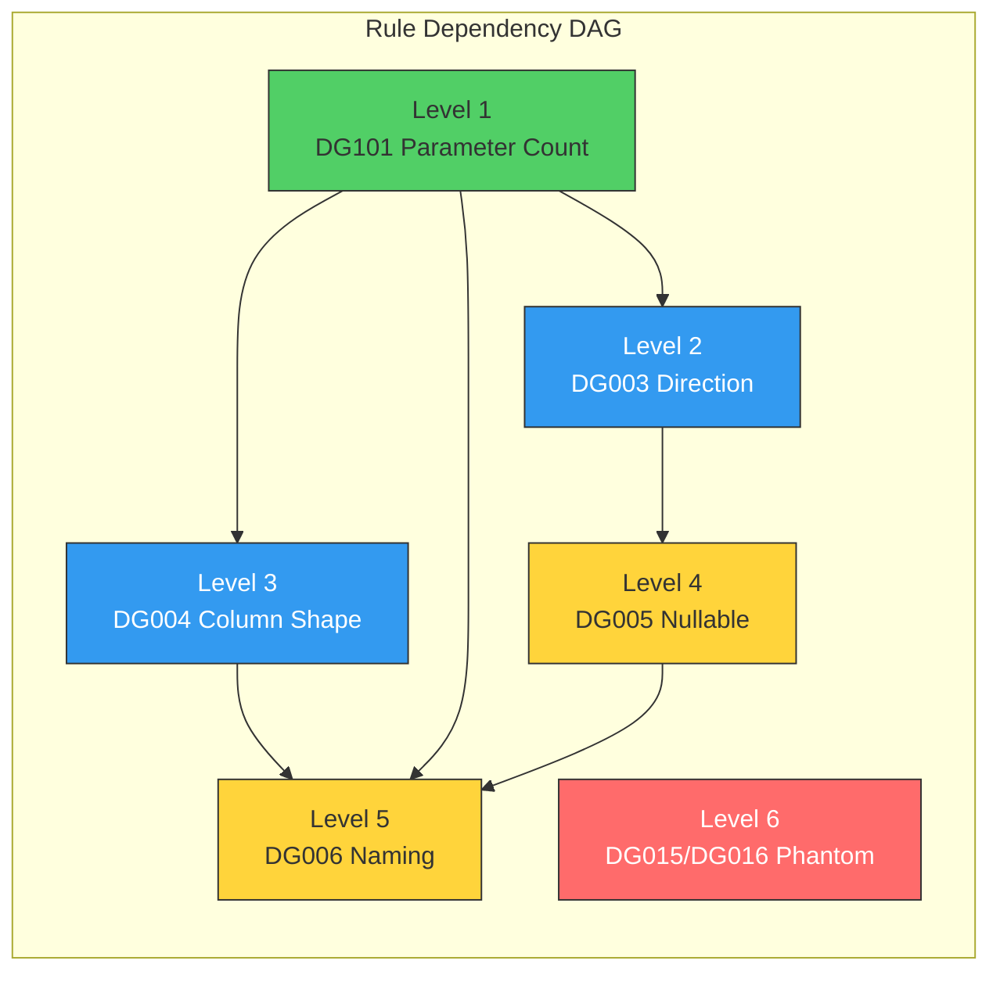
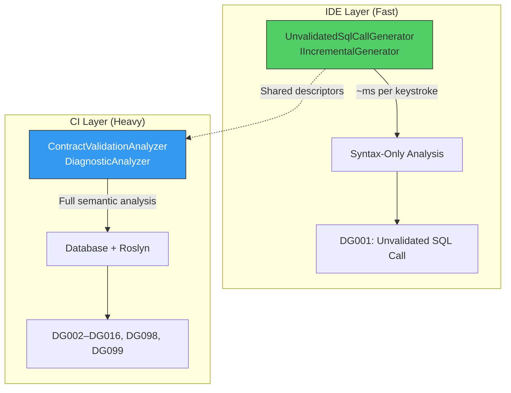
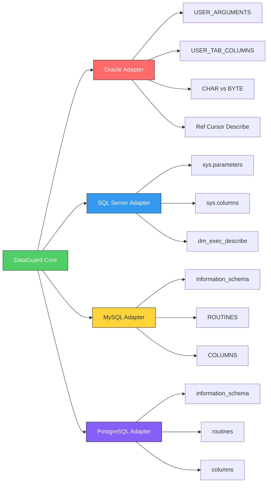
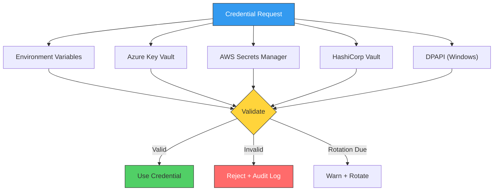
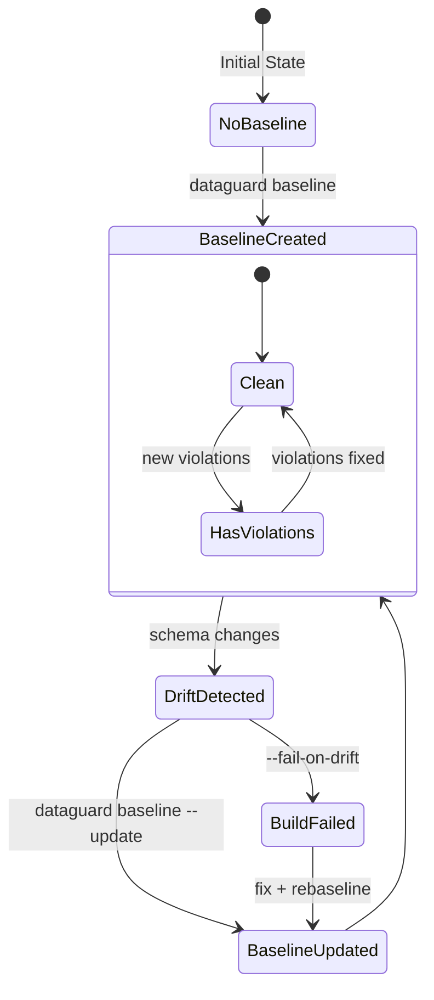

# DataGuard — Feature Showcase

> Every feature, every rule, every integration — in one place.

## Feature Map

```mermaid
graph TD
    DG["DataGuard"]
    
    DG --> VALIDATE["Validation Engine"]
    DG --> IDE["IDE Integration"]
    DG --> CLI["CLI Tool"]
    DG --> DB["Multi-Database"]
    DG --> SEC["Security"]
    DG --> BASE["Baseline & Drift"]
    DG --> REPORT["Reporting"]
    DG --> PLUGIN["Plugin System"]
    DG --> AUTO["Auto-Detection"]
    DG --> ASSESS["Assessment"]
    DG --> EXPORT["Export & DTO"]
    
    VALIDATE --> V1["18 Core Rules"]
    VALIDATE --> V2["9 Adapter Rules"]
    VALIDATE --> V3["Concurrent Engine"]
    VALIDATE --> V4["Rule Dependency DAG"]
    
    IDE --> I1["Roslyn Analyzers"]
    IDE --> I2["VS Code Extension"]
    IDE --> I3["VS 2022 Extension"]
    IDE --> I4["Code Fix Providers"]
    
    CLI --> C1["9 Commands"]
    CLI --> C2["SARIF Output"]
    CLI --> C3["Evidence Packs"]
    
    DB --> D1["Oracle"]
    DB --> D2["SQL Server"]
    DB --> D3["MySQL"]
    DB --> D4["PostgreSQL"]
    
    SEC --> S1["Zero-Trust Credentials"]
    SEC --> S2["Audit Logging"]
    SEC --> S3["Supply Chain"]
    
    BASE --> B1["Snapshot Capture"]
    BASE --> B2["Drift Detection"]
    BASE --> B3["Migration Support"]
    
    REPORT --> R1["SARIF v2.1.0"]
    REPORT --> R2["Text Output"]
    REPORT --> R3["Evidence Packs"]
    
    PLUGIN --> P1["MEF-Based"]
    PLUGIN --> P2["Custom Rules"]
    
    AUTO --> A1["EF Core Detection"]
    AUTO --> A2["Dapper Detection"]
    AUTO --> A3["Provider Detection"]
    AUTO --> A4["Naming Convention"]
    
    ASSESS --> AS1["Dependency Health"]
    ASSESS --> AS2["Build/CI Status"]
    ASSESS --> AS3["Secrets Scan"]
    ASSESS --> AS4["Upgrade Planner"]
    
    EXPORT --> E1["JSON"]
    EXPORT --> E2["YAML"]
    EXPORT --> E3["TypeScript DTOs"]
```



## 27 Validation Rules

### Core Rules (DataGuard.Core)

| Rule ID | Name | Severity | Description |
|---------|------|----------|-------------|
| **DG001** | Unvalidated SQL Call | Info | IDE-only: marks SQL calls that lack DataGuard validation attributes. Runs on every keystroke via incremental generator. |
| **DG002** | Parameter Type Match | Error | Parameter types must match between call site and stored procedure definition. Catches `int` ↔ `NUMBER`, `string` ↔ `VARCHAR2` mismatches. |
| **DG003** | Parameter Direction Match | Error | Parameter direction must match: `IN`/`OUT`/`INOUT` in database ↔ `in`/`out`/`ref` in C#. Catches forgotten `OUT` parameters. |
| **DG004** | Column Shape Match | Error | Result set columns must match entity properties. Detects added, removed, or renamed columns that break mapping. |
| **DG005** | Nullable Mismatch | Warning | Nullability must match between database column and C# property. Catches `NOT NULL` column mapped to `string?` or vice versa. |
| **DG006** | Naming Convention | Info | Validates naming convention mapping between database columns and C# properties. Supports `snake_case` ↔ `PascalCase`, `UPPER_CASE` ↔ `PascalCase`. |
| **DG098** | Missing FROM Clause | Warning | Detects `SELECT` statements without a `FROM` clause — likely incomplete or hallucinated SQL. |
| **DG099** | SQL Injection Pattern | Warning | Detects potential SQL injection patterns: string concatenation in SQL, unsanitized parameter interpolation. |

### Oracle Adapter Rules (DataGuard.Oracle.Adapter)

| Rule ID | Name | Severity | Description |
|---------|------|----------|-------------|
| **DG007** | Length Exceeds Column | Error | Entity property `MaxLength` exceeds database column length. Will cause `ORA-12899` at runtime. |
| **DG008** | Byte Length Overflow | Warning | Byte-semantics overflow risk: property may exceed column byte capacity when Oracle uses `BYTE` semantics instead of `CHAR`. Critical for multi-byte character sets (CJK, emoji). |
| **DG009** | Inferred Size Fallback | Warning | EF Core infers `NVARCHAR2(2000)` when no `MaxLength` is set with `Unicode=true`. If values exceed 2000 characters, `ORA-12899` occurs at runtime. |
| **DG010** | Oracle Syntax in Non-Oracle | Warning | Oracle-specific keywords (`ROWNUM`, `NVL`, `SYSDATE`, `DECODE`) or operators (`(+)`, `\|\|`) used in non-Oracle context. |
| **DG011** | Non-Oracle Function in Oracle | Warning | SQL Server syntax (`TOP`, `LIMIT`, `GROUP_CONCAT`, `GETDATE`) used in Oracle context. Suggests Oracle equivalents (`FETCH FIRST`, `LISTAGG`, `SYSDATE`). |
| **DG012** | Provider Option Mismatch | Error | Oracle context detected but EF Core provider is not Oracle. Missing `UseOracle()` in configuration. |
| **DG013** | SQL Server Syntax Leak | Warning | SQL Server `EXEC dbo.Procedure` syntax used in Oracle context. Oracle uses `BEGIN ... END;` block or `CALL`. |
| **DG014** | Unmapped Type Usage | Warning | Type used with Oracle EF Core raw SQL but not mapped by the Oracle provider. May cause runtime mapping failures. |

### Phantom Identifier Rules (DataGuard.Core)

| Rule ID | Name | Severity | Description |
|---------|------|----------|-------------|
| **DG015** | Phantom Table | Error | Table referenced in SQL does not exist in database schema. Common with AI-generated SQL or renamed tables. |
| **DG016** | Phantom Column | Error | Column referenced in SQL does not exist in the target table. Common with AI-generated SQL or schema evolution. |

### MySQL Adapter Rules (DataGuard.MySql.Adapter)

| Rule ID | Name | Severity | Description |
|---------|------|----------|-------------|
| **MY001** | MySQL Syntax in Non-MySQL | Warning | MySQL-specific syntax (`AUTO_INCREMENT`, `IFNULL`, `LIMIT`, backtick quoting) used in non-MySQL context. |
| **MY002** | Non-MySQL Syntax in MySQL | Warning | Non-MySQL syntax (`TOP`, `NVL`, `ISNULL`) used in MySQL context. Suggests MySQL equivalents. |
| **MY003** | Length Exceeds MySQL Column | Error | Entity property `MaxLength` exceeds MySQL column length. Will cause data truncation or error at runtime. |

### PostgreSQL Adapter Rules (DataGuard.PostgreSql.Adapter)

| Rule ID | Name | Severity | Description |
|---------|------|----------|-------------|
| **PG001** | PostgreSQL Syntax in Non-PG | Warning | PostgreSQL-specific syntax (`SERIAL`, `ILIKE`, `::` cast, `COALESCE`) used in non-PostgreSQL context. |
| **PG002** | Non-PostgreSQL Syntax in PG | Warning | Non-PostgreSQL syntax (`TOP`, `NVL`, `ISNULL`) used in PostgreSQL context. Suggests PostgreSQL equivalents. |
| **PG003** | Length Exceeds PostgreSQL Column | Error | Entity property `MaxLength` exceeds PostgreSQL column length. Will cause data truncation or error at runtime. |

### Rule Execution Model



Rules are executed in topological order based on their dependency graph. Independent rules at the same level run in parallel via the `ConcurrentValidationEngine`.

## Three Ground-Truth Modes

| Mode | Connection | Speed | Accuracy | Best For |
|------|-----------|-------|----------|----------|
| **Full** | Live database | ~2-5s | 100% (real schema) | CI/CD, pre-deploy |
| **Snapshot** | Cached JSON file | ~200ms | 100% (at capture time) | Local dev, offline |
| **Manual** | Compiled assembly | ~500ms | Partial (no DB schema) | Legacy, offline-first |

### Full Mode

Connects to Oracle, SQL Server, MySQL, or PostgreSQL and reads:
- Stored procedure parameters from catalog views (`sys.parameters`, `USER_ARGUMENTS`, `information_schema.parameters`)
- Result set columns from `sys.dm_exec_describe_first_result_set` or equivalent
- Table column metadata (types, lengths, nullability, char semantics)

### Snapshot Mode

Reads a `.dataguard-snapshot.json` file captured from a previous Full mode run. Contains:
- All stored procedure descriptors with parameters and result columns
- All table schemas with column metadata
- Database version and provider information
- Capture timestamp and schema hash for drift detection

### Manual Mode

Extracts contract descriptors from compiled assemblies via reflection:
- Reads `[DataContract]`, `[SqlParameter]`, `[ResultSet]` attributes
- Maps CLR types to database types using naming conventions
- No database connection required — works entirely offline

## IDE Integration

### Roslyn Analyzers (Dual-Layer Architecture)



**IDE Layer**: Runs on every keystroke via `IIncrementalGenerator`. Zero-allocation, minimal GC pressure. Only detects unvalidated SQL calls (DG001) — fast enough for real-time feedback.

**CI Layer**: Runs as `DiagnosticAnalyzer` in CI pipeline. Full semantic analysis with database connection. Validates all rules (DG002–DG016, DG098, DG099).

### Code Fix Providers

| Fix | Trigger | Action |
|-----|---------|--------|
| Add `[DataContract]` | DG001 on class | Adds `[DataContract]` attribute with inferred table name |
| Add `[SqlParameter]` | DG001 on method | Adds `[SqlParameter]` attributes to method parameters |
| Fix naming convention | DG006 | Suggests correct property name based on column name and convention |
| Add validation call | DG001 | Inserts `DataGuard.Validate()` call before SQL execution |

### VS Code Extension

- Real-time diagnostics via Language Server Protocol
- Command palette integration: `DataGuard: Validate`, `DataGuard: Baseline`, `DataGuard: Assess`
- Status bar indicator showing validation state
- Configurable via `.vscode/settings.json`

### Visual Studio 2022 Extension

- Menu integration: `Tools → DataGuard`
- Error List integration with squiggly underlines
- Tool window for validation results
- One-click baseline creation and drift detection

## CLI Tool — 9 Commands

| Command | Purpose | Key Options |
|---------|---------|-------------|
| `validate` | Validate contracts against database | `--connection`, `--provider`, `--format`, `--offline`, `--assembly` |
| `baseline` | Create baseline from current violations | `--connection`, `--provider`, `--output` |
| `snapshot refresh` | Refresh schema snapshot from database | `--connection`, `--provider`, `--schema` |
| `snapshot show` | Show current snapshot info | `--config` |
| `snapshot diff` | Compare current schema with snapshot | `--connection`, `--fail-on-drift` |
| `init` | Initialize DataGuard configuration | `--output`, `--provider` |
| `config show` | Show current configuration | `--config` |
| `config validate` | Validate configuration file | `--config` |
| `oracle-check` | Run Oracle-specific dialect and length checks | `--connection`, `--schema`, `--package` |
| `migrate` | Migrate legacy baseline (v1 → v2) | `--baseline` |
| `assess` | Run environment/dependency assessment | `--workspace`, `--project-filter`, `--format` |
| `version` | Show version information | — |

### Output Formats

| Format | Description | Use Case |
|--------|-------------|----------|
| `text` | Human-readable terminal output with colors and severity indicators | Local development |
| `sarif` | SARIF v2.1.0 JSON for static analysis tool integration | CI/CD pipelines |
| `evidence` | Structured evidence pack with metadata, timestamps, and hashes | Compliance/audit |

## Multi-Database Support



| Feature | Oracle | SQL Server | MySQL | PostgreSQL |
|---------|--------|-----------|-------|------------|
| Parameter metadata | `USER_ARGUMENTS` / `ALL_ARGUMENTS` | `sys.parameters` | `information_schema.routines` | `information_schema.routines` |
| Column metadata | `USER_TAB_COLUMNS` / `ALL_TAB_COLUMNS` | `sys.columns` | `information_schema.columns` | `information_schema.columns` |
| Result set discovery | Ref Cursor describe | `dm_exec_describe_first_result_set` | Procedure body parsing | Function body parsing |
| CHAR/BYTE semantics | ✅ Native | N/A | N/A | N/A |
| Package support | ✅ Oracle packages | N/A | N/A | N/A |
| Dialect rules | DG010–DG014 | — | MY001–MY002 | PG001–PG002 |
| Length rules | DG007–DG009 | — | MY003 | PG003 |

## Security Features

### Zero-Trust Credential Resolution



- **Fail-closed by default**: plaintext config-file credentials are only used when explicitly allowed (`AllowPlaintextConfigFallback = true`)
- **Rotation detection**: warns when credentials are older than `CredentialRotationWarningDays`
- **Encryption at rest**: optional `EncryptConnectionStringAtRest` with DPAPI
- **Audit logging**: every credential access is logged with timestamp, source, and outcome

### Supply Chain Verification

- NuGet package integrity checks via SHA-256 hash verification
- Known vulnerability scanning against GitHub Advisory Database
- License compliance checking
- Dependency age and maintenance status analysis

### Audit Logging

Every validation run produces an audit trail:
- Timestamp, duration, and outcome
- Rules executed and violations found
- Database connection metadata (provider, version, schema)
- Credential source (without exposing secrets)
- User/agent identity

## Baseline Management & Drift Detection



- **Baseline creation**: captures current violation state as a known-good baseline
- **Drift detection**: `snapshot diff` compares current schema against cached snapshot
- **Fail-on-drift**: `--fail-on-drift` flag causes non-zero exit when unexpected changes detected
- **Migration support**: `migrate` command upgrades v1 baselines to v2 format

## SARIF Output for CI Integration

DataGuard outputs violations in [SARIF v2.1.0](https://docs.oasis-open.org/sarif/sarif/v2.1.0/sarif-v2.1.0.html) format, compatible with:

| Platform | Integration |
|----------|------------|
| GitHub | Code Scanning / Security tab |
| Azure DevOps | Static Analysis tab |
| GitLab | SAST reports |
| SonarQube | Generic import |
| VS Code | SARIF Viewer extension |

SARIF output includes:
- Rule ID, name, and description
- Severity level (error, warning, info)
- File path and line/column location
- Code snippet context
- Fix suggestions (when available)

## Plugin Architecture (MEF)


- Drop a `.dll` implementing `IContractRule` into the plugins directory
- MEF discovers and loads it automatically
- Custom rules participate in the dependency graph and run alongside built-in rules
- Supports custom severity levels, rule IDs, and diagnostic messages

## Auto-Detection & Smart Defaults

| Detection | How It Works | Default Action |
|-----------|-------------|----------------|
| **EF Core Context** | Scans assemblies for `DbContext` subclasses | Auto-extract entity contracts |
| **Dapper Usage** | Detects `SqlMapper`, `IDbConnection` extension methods | Auto-detect raw SQL patterns |
| **Database Provider** | Reads `.csproj` references, connection string patterns | Auto-select adapter |
| **Naming Convention** | Samples column names from database | Auto-configure mapping rules |
| **Default Schema** | Reads provider-specific defaults (`dbo` for SQL Server, owner for Oracle) | Auto-fill schema config |

## Assessment Engine

For legacy codebases entering the DataGuard ecosystem:

| Pack | What It Checks | Output |
|------|---------------|--------|
| **DependencyHealth** | NuGet package versions, known vulnerabilities, outdated packages | Health score + recommendations |
| **BuildCi** | Build configuration, CI pipeline setup, test coverage | Build readiness report |
| **Secrets** | Hardcoded connection strings, API keys, credentials in source | Security findings |
| **Inventory** | Project structure, target frameworks, package references | Project inventory |

The **UpgradePlanner** generates a step-by-step migration plan for legacy .NET Framework codebases moving to .NET 9+.

## TypeScript DTO Generation

Export C# entity models as TypeScript interfaces:

```typescript
// Generated by DataGuard
export interface CustomerDto {
  id: number;
  firstName: string;
  lastName: string;
  email: string | null;
  createdAt: Date;
}
```

- Preserves nullability (`string | null`)
- Maps C# types to TypeScript equivalents
- Generates from entity descriptors or database schema
- Supports custom naming conventions for TypeScript (camelCase, PascalCase)
