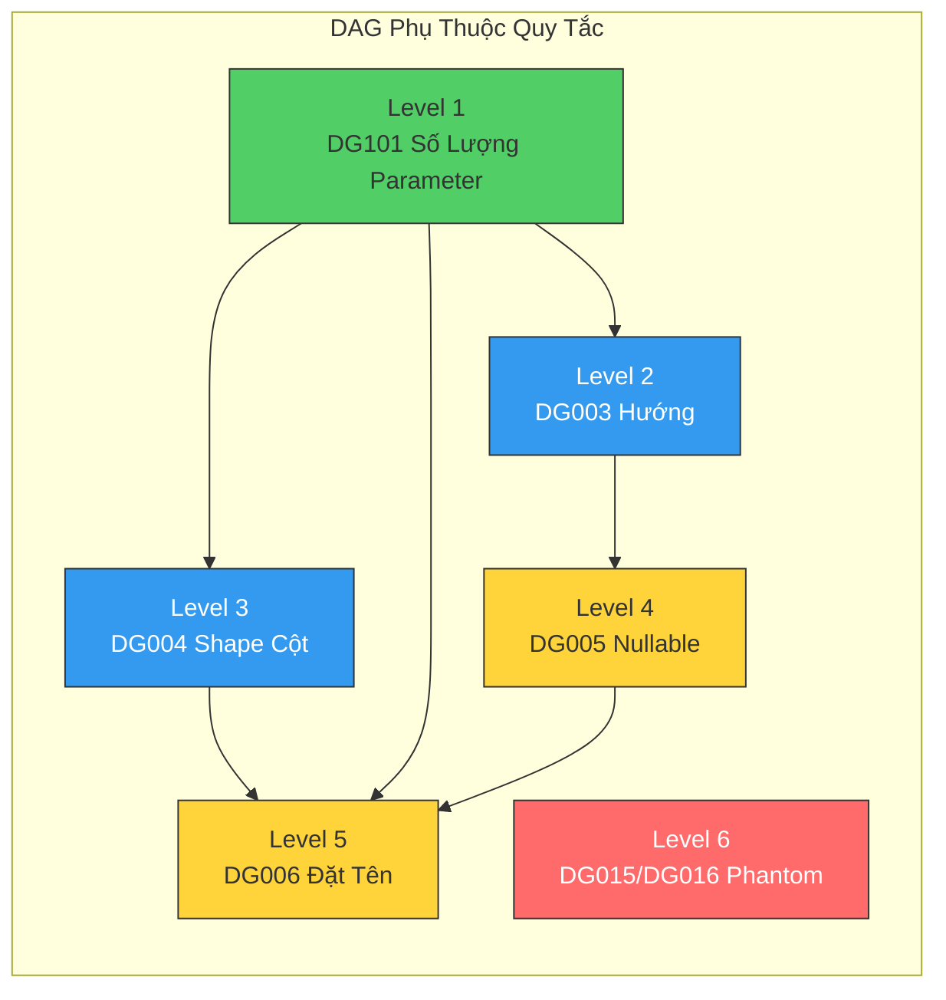
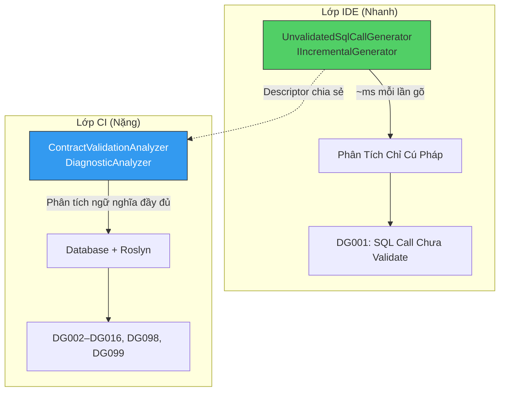
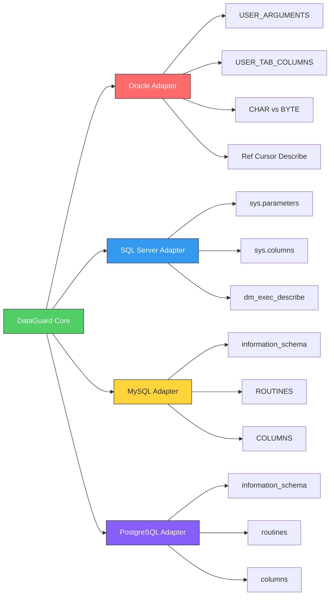
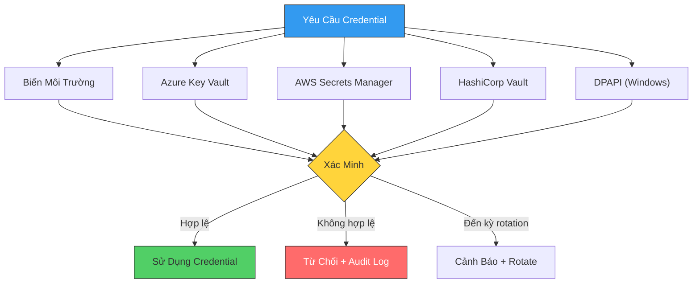
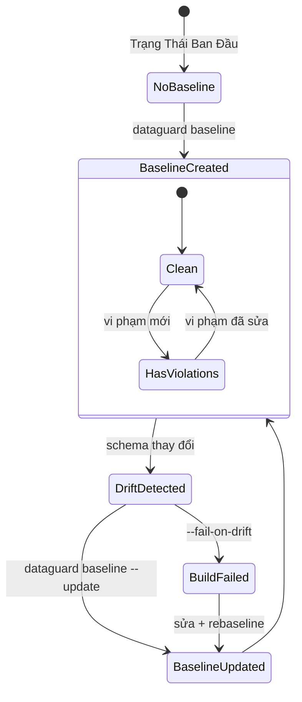
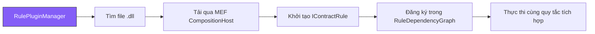

# DataGuard — Showcase Tính Năng

> Mọi tính năng, mọi quy tắc, mọi tích hợp — tất cả trong một nơi.

## Bản Đồ Tính Năng

```mermaid
graph TD
    DG["DataGuard"]
    
    DG --> VALIDATE["Engine Validation"]
    DG --> IDE["Tích Hợp IDE"]
    DG --> CLI["Công Cụ CLI"]
    DG --> DB["Multi-Database"]
    DG --> SEC["Bảo Mật"]
    DG --> BASE["Baseline & Drift"]
    DG --> REPORT["Báo Cáo"]
    DG --> PLUGIN["Hệ Thống Plugin"]
    DG --> AUTO["Tự Động Phát Hiện"]
    DG --> ASSESS["Đánh Giá"]
    DG --> EXPORT["Xuất & DTO"]
    
    VALIDATE --> V1["18 Quy Tắc Core"]
    VALIDATE --> V2["9 Quy Tắc Adapter"]
    VALIDATE --> V3["Engine Song Song"]
    VALIDATE --> V4["DAG Phụ Thuộc Quy Tắc"]
    
    IDE --> I1["Roslyn Analyzers"]
    IDE --> I2["Extension VS Code"]
    IDE --> I3["Extension VS 2022"]
    IDE --> I4["Code Fix Providers"]
    
    CLI --> C1["9 Lệnh"]
    CLI --> C2["Đầu Ra SARIF"]
    CLI --> C3["Gói Bằng Chứng"]
    
    DB --> D1["Oracle"]
    DB --> D2["SQL Server"]
    DB --> D3["MySQL"]
    DB --> D4["PostgreSQL"]
    
    SEC --> S1["Credential Zero-Trust"]
    SEC --> S2["Audit Logging"]
    SEC --> S3["Chuỗi Cung Ứng"]
    
    BASE --> B1["Chụp Snapshot"]
    BASE --> B2["Phát Hiện Drift"]
    BASE --> B3["Hỗ Trợ Migration"]
    
    REPORT --> R1["SARIF v2.1.0"]
    REPORT --> R2["Đầu Ra Text"]
    REPORT --> R3["Gói Bằng Chứng"]
    
    PLUGIN --> P1["Dựa Trên MEF"]
    PLUGIN --> P2["Quy Tắc Tùy Chỉnh"]
    
    AUTO --> A1["Phát Hiện EF Core"]
    AUTO --> A2["Phát Hiện Dapper"]
    AUTO --> A3["Phát Hiện Provider"]
    AUTO --> A4["Quy Tắc Đặt Tên"]
    
    ASSESS --> AS1["Sức Khỏe Dependency"]
    ASSESS --> AS2["Trạng Thái Build/CI"]
    ASSESS --> AS3["Quét Secrets"]
    ASSESS --> AS4["Kế Hoạch Nâng Cấp"]
    
    EXPORT --> E1["JSON"]
    EXPORT --> E2["YAML"]
    EXPORT --> E3["TypeScript DTOs"]
```



## 27 Quy Tắc Validation

### Quy Tắc Core (DataGuard.Core)

| Rule ID | Tên | Mức Độ | Mô Tả |
|---------|-----|--------|--------|
| **DG001** | SQL Call Chưa Validate | Info | Chỉ IDE: đánh dấu SQL call thiếu attribute validation DataGuard. Chạy trên mỗi lần gõ phím qua incremental generator. |
| **DG002** | Khớp Kiểu Parameter | Error | Kiểu parameter phải khớp giữa call site và định nghĩa stored procedure. Phát hiện `int` ↔ `NUMBER`, `string` ↔ `VARCHAR2`. |
| **DG003** | Khớp Hướng Parameter | Error | Hướng parameter phải khớp: `IN`/`OUT`/`INOUT` trong DB ↔ `in`/`out`/`ref` trong C#. Phát hiện parameter `OUT` bị quên. |
| **DG004** | Khớp Shape Cột | Error | Cột result set phải khớp thuộc tính entity. Phát hiện cột được thêm, xóa, hoặc đổi tên làm hỏng mapping. |
| **DG005** | Sai Lệch Nullable | Warning | Nullability phải khớp giữa cột database và thuộc tính C#. Phát hiện cột `NOT NULL` mapped sang `string?` hoặc ngược lại. |
| **DG006** | Quy Tắc Đặt Tên | Info | Kiểm tra mapping quy tắc đặt tên giữa cột database và thuộc tính C#. Hỗ trợ `snake_case` ↔ `PascalCase`, `UPPER_CASE` ↔ `PascalCase`. |
| **DG098** | Thiếu FROM Clause | Warning | Phát hiện câu lệnh `SELECT` không có `FROM` — có thể là SQL không đầy đủ hoặc hallucination. |
| **DG099** | Mẫu SQL Injection | Warning | Phát hiện mẫu SQL injection tiềm ẩn: nối chuỗi trong SQL, interpolate parameter chưa sanitize. |

### Quy Tắc Oracle Adapter (DataGuard.Oracle.Adapter)

| Rule ID | Tên | Mức Độ | Mô Tả |
|---------|-----|--------|--------|
| **DG007** | Độ Dài Vượt Cột | Error | `MaxLength` thuộc tính entity vượt độ dài cột database. Sẽ gây `ORA-12899` ở runtime. |
| **DG008** | Tràn Độ Dài Byte | Warning | Rủi ro tràn byte-semantics: thuộc tính có thể vượt dung lượng byte cột khi Oracle dùng ngữ nghĩa `BYTE` thay vì `CHAR`. Quan trọng cho bộ ký tự đa byte (CJK, emoji). |
| **DG009** | Suy Luận NVARCHAR2(2000) | Warning | EF Core suy luận `NVARCHAR2(2000)` khi không đặt `MaxLength` với `Unicode=true`. Nếu giá trị vượt 2000 ký tự, `ORA-12899` xảy ra ở runtime. |
| **DG010** | Cú Pháp Oracle Ngoài Oracle | Warning | Từ khóa Oracle (`ROWNUM`, `NVL`, `SYSDATE`, `DECODE`) hoặc toán tử (`(+)`, `\|\|`) dùng ngoài ngữ cảnh Oracle. |
| **DG011** | Hàm Không-Oracle Trong Oracle | Warning | Cú pháp SQL Server (`TOP`, `LIMIT`, `GROUP_CONCAT`, `GETDATE`) dùng trong ngữ cảnh Oracle. Đề xuất tương đương Oracle. |
| **DG012** | Sai Lệch Provider | Error | Phát hiện ngữ cảnh Oracle nhưng provider EF Core không phải Oracle. Thiếu `UseOracle()` trong cấu hình. |
| **DG013** | Rò Rỉ Cú Pháp SQL Server | Warning | Cú pháp `EXEC dbo.Procedure` của SQL Server dùng trong ngữ cảnh Oracle. Oracle dùng `BEGIN ... END;` hoặc `CALL`. |
| **DG014** | Type Chưa Ánh Xạ | Warning | Type dùng với raw SQL Oracle EF Core nhưng không được ánh xạ bởi provider. Có thể gây lỗi mapping runtime. |

### Quy Tắc Phantom Identifier (DataGuard.Core)

| Rule ID | Tên | Mức Độ | Mô Tả |
|---------|-----|--------|--------|
| **DG015** | Bảng Phantom | Error | Bảng được tham chiếu trong SQL không tồn tại trong schema database. Thường gặp với SQL do AI tạo hoặc bảng đã đổi tên. |
| **DG016** | Cột Phantom | Error | Cột được tham chiếu trong SQL không tồn tại trong bảng đích. Thường gặp với SQL do AI tạo hoặc schema tiến hóa. |

### Quy Tắc MySQL Adapter (DataGuard.MySql.Adapter)

| Rule ID | Tên | Mức Độ | Mô Tả |
|---------|-----|--------|--------|
| **MY001** | Cú Pháp MySQL Ngoài MySQL | Warning | Cú pháp MySQL (`AUTO_INCREMENT`, `IFNULL`, `LIMIT`, backtick quoting) dùng ngoài ngữ cảnh MySQL. |
| **MY002** | Cú Pháp Không-MySQL Trong MySQL | Warning | Cú pháp không-MySQL (`TOP`, `NVL`, `ISNULL`) dùng trong ngữ cảnh MySQL. Đề xuất tương đương MySQL. |
| **MY003** | Độ Dài Vượt Cột MySQL | Error | `MaxLength` thuộc tính entity vượt độ dài cột MySQL. Sẽ gây cắt dữ liệu hoặc lỗi ở runtime. |

### Quy Tắc PostgreSQL Adapter (DataGuard.PostgreSql.Adapter)

| Rule ID | Tên | Mức Độ | Mô Tả |
|---------|-----|--------|--------|
| **PG001** | Cú Pháp PG Ngoài PG | Warning | Cú pháp PostgreSQL (`SERIAL`, `ILIKE`, `::` cast, `COALESCE`) dùng ngoài ngữ cảnh PostgreSQL. |
| **PG002** | Cú Pháp Không-PG Trong PG | Warning | Cú pháp không-PostgreSQL (`TOP`, `NVL`, `ISNULL`) dùng trong ngữ cảnh PostgreSQL. Đề xuất tương đương PostgreSQL. |
| **PG003** | Độ Dài Vượt Cột PostgreSQL | Error | `MaxLength` thuộc tính entity vượt độ dài cột PostgreSQL. Sẽ gây cắt dữ liệu hoặc lỗi ở runtime. |

### Mô Hình Thực Thi Quy Tắc



Quy tắc được thực thi theo thứ tự topo dựa trên đồ thị phụ thuộc. Các quy tắc độc lập ở cùng level chạy song song qua `ConcurrentValidationEngine`.

## Ba Chế Độ Ground-Truth

| Chế Độ | Kết Nối | Tốc Độ | Độ Chính Xác | Phù Hợp Cho |
|--------|---------|--------|-------------|-------------|
| **Full** | Database trực tiếp | ~2-5s | 100% (schema thực) | CI/CD, trước deploy |
| **Snapshot** | File JSON cache | ~200ms | 100% (tại thời điểm chụp) | Dev local, offline |
| **Manual** | Assembly đã biên dịch | ~500ms | Một phần (không có schema DB) | Legacy, offline-first |

## Tích Hợp IDE

### Roslyn Analyzers (Kiến Trúc Hai Lớp)



**Lớp IDE**: Chạy trên mỗi lần gõ phím qua `IIncrementalGenerator`. Zero-allocation, áp lực GC tối thiểu. Chỉ phát hiện SQL call chưa validate (DG001) — đủ nhanh cho phản hồi thời gian thực.

**Lớp CI**: Chạy như `DiagnosticAnalyzer` trong pipeline CI. Phân tích ngữ nghĩa đầy đủ với kết nối database. Kiểm tra tất cả quy tắc (DG002–DG016, DG098, DG099).

## Công Cụ CLI — 9 Lệnh

| Lệnh | Mục Đích | Tùy Chọn Chính |
|------|----------|----------------|
| `validate` | Kiểm tra contract với database | `--connection`, `--provider`, `--format`, `--offline`, `--assembly` |
| `baseline` | Tạo baseline từ vi phạm hiện tại | `--connection`, `--provider`, `--output` |
| `snapshot refresh` | Làm mới snapshot schema từ database | `--connection`, `--provider`, `--schema` |
| `snapshot show` | Hiển thị thông tin snapshot hiện tại | `--config` |
| `snapshot diff` | So sánh schema hiện tại với snapshot | `--connection`, `--fail-on-drift` |
| `init` | Khởi tạo cấu hình DataGuard | `--output`, `--provider` |
| `config show` | Hiển thị cấu hình hiện tại | `--config` |
| `config validate` | Kiểm tra file cấu hình | `--config` |
| `oracle-check` | Chạy kiểm tra phương言 và độ dài Oracle | `--connection`, `--schema`, `--package` |
| `migrate` | Migration baseline cũ (v1 → v2) | `--baseline` |
| `assess` | Chạy đánh giá môi trường/dependency | `--workspace`, `--project-filter`, `--format` |
| `version` | Hiển thị thông tin phiên bản | — |

## Hỗ Trợ Multi-Database



## Tính Năng Bảo Mật

### Phân Giải Credential Zero-Trust



- **Đóng theo mặc định**: credential plaintext trong file cấu hình chỉ được sử dụng khi được phép rõ ràng (`AllowPlaintextConfigFallback = true`)
- **Phát hiện rotation**: cảnh báo khi credential cũ hơn `CredentialRotationWarningDays`
- **Mã hóa khi lưu trữ**: tùy chọn `EncryptConnectionStringAtRest` với DPAPI
- **Audit logging**: mọi lần truy cập credential được ghi lại với timestamp, nguồn và kết quả

## Quản Lý Baseline & Phát Hiện Drift



## Đầu Ra SARIF Cho Tích Hợp CI

DataGuard xuất vi phạm ở định dạng [SARIF v2.1.0](https://docs.oasis-open.org/sarif/sarif/v2.1.0/sarif-v2.1.0.html), tương thích với:

| Nền Tảng | Tích Hợp |
|----------|----------|
| GitHub | Code Scanning / Security tab |
| Azure DevOps | Static Analysis tab |
| GitLab | SAST reports |
| SonarQube | Generic import |
| VS Code | SARIF Viewer extension |

## Kiến Trúc Plugin (MEF)



## Tự Động Phát Hiện & Smart Defaults

| Phát Hiện | Cách Hoạt Động | Hành Động Mặc Định |
|-----------|----------------|-------------------|
| **EF Core Context** | Quét assembly tìm lớp con `DbContext` | Tự trích xuất contract entity |
| **Sử Dụng Dapper** | Phát hiện `SqlMapper`, extension method `IDbConnection` | Tự phát hiện mẫu raw SQL |
| **Database Provider** | Đọc tham chiếu `.csproj`, mẫu connection string | Tự chọn adapter |
| **Quy Tắc Đặt Tên** | Lấy mẫu tên cột từ database | Tự cấu hình mapping rules |
| **Schema Mặc Định** | Đọc mặc định provider (`dbo` cho SQL Server, owner cho Oracle) | Tự điền cấu hình schema |

## Engine Đánh Giá

Cho codebase cũ bước vào hệ sinh thái DataGuard:

| Gói | Kiểm Tra | Đầu Ra |
|-----|---------|--------|
| **DependencyHealth** | Phiên bản gói NuGet, lỗ hổng đã biết, gói lỗi thời | Điểm sức khỏe + khuyến nghị |
| **BuildCi** | Cấu hình build, thiết lập pipeline CI, độ phủ test | Báo cáo sẵn sàng build |
| **Secrets** | Connection string cứng, API key, credential trong mã nguồn | Kết quả bảo mật |
| **Inventory** | Cấu trúc dự án, target framework, tham chiếu gói | Kiểm kê dự án |

**UpgradePlanner** tạo kế hoạch migration từng bước cho codebase .NET Framework cũ chuyển sang .NET 9+.

## Xuất TypeScript DTO

Xuất mô hình entity C# thành interface TypeScript:

```typescript
// Được tạo bởi DataGuard
export interface CustomerDto {
  id: number;
  firstName: string;
  lastName: string;
  email: string | null;
  createdAt: Date;
}
```

- Giữ nguyên nullability (`string | null`)
- Ánh xạ kiểu C# sang tương đương TypeScript
- Tạo từ entity descriptor hoặc schema database
- Hỗ trợ quy tắc đặt tên tùy chỉnh cho TypeScript (camelCase, PascalCase)
