# DataGuard — Pain Points Solved

> The real-world problems that .NET/C# developers face when working with stored procedures, raw SQL, and multiple database engines — and how DataGuard solves each one.

## Pain Point Resolution Map

```mermaid
graph TD
    subgraph "Pain Points"
        P1["Parameter Mismatch<br/>Runtime Errors"]
        P2["Result Set Drift<br/>Column Changes"]
        P3["Oracle CHAR vs BYTE<br/>ORA-12899"]
        P4["NVARCHAR2(2000)<br/>Inference Fallback"]
        P5["AI-Hallucinated SQL<br/>Phantom Tables"]
        P6["Naming Convention<br/>Mismatch"]
        P7["Nullability<br/>Mismatch"]
        P8["No Compile-Time<br/>Validation"]
        P9["Legacy Migration<br/>Risks"]
        P10["Multi-DB Dialect<br/>Confusion"]
        P11["CI/CD Integration<br/>Gaps"]
        P12["Credential Security<br/>in CI"]
    end
    
    subgraph "DataGuard Solutions"
        S1["DG002, DG003, DG101"]
        S2["DG004"]
        S3["DG008"]
        S4["DG009"]
        S5["DG015, DG016"]
        S6["DG006"]
        S7["DG005"]
        S8["Roslyn Analyzers<br/>DG001"]
        S9["Assessment Engine<br/>UpgradePlanner"]
        S10["DG010–DG014<br/>MY001–003, PG001–003"]
        S11["SARIF Output<br/>CI Workflows"]
        S12["Zero-Trust<br/>Credential Provider"]
    end
    
    P1 --> S1
    P2 --> S2
    P3 --> S3
    P4 --> S4
    P5 --> S5
    P6 --> S6
    P7 --> S7
    P8 --> S8
    P9 --> S9
    P10 --> S10
    P11 --> S11
    P12 --> S12
    
    style P1 fill:#ff6b6b,stroke:#333,color:#fff
    style P2 fill:#ff6b6b,stroke:#333,color:#fff
    style P3 fill:#ff6b6b,stroke:#333,color:#fff
    style P4 fill:#ff6b6b,stroke:#333,color:#fff
    style P5 fill:#ff6b6b,stroke:#333,color:#fff
    style P6 fill:#ff6b6b,stroke:#333,color:#fff
    style P7 fill:#ff6b6b,stroke:#333,color:#fff
    style P8 fill:#ff6b6b,stroke:#333,color:#fff
    style P9 fill:#ff6b6b,stroke:#333,color:#fff
    style P10 fill:#ff6b6b,stroke:#333,color:#fff
    style P11 fill:#ff6b6b,stroke:#333,color:#fff
    style P12 fill:#ff6b6b,stroke:#333,color:#fff
    
    style S1 fill:#51cf66,stroke:#333
    style S2 fill:#51cf66,stroke:#333
    style S3 fill:#51cf66,stroke:#333
    style S4 fill:#51cf66,stroke:#333
    style S5 fill:#51cf66,stroke:#333
    style S6 fill:#51cf66,stroke:#333
    style S7 fill:#51cf66,stroke:#333
    style S8 fill:#51cf66,stroke:#333
    style S9 fill:#51cf66,stroke:#333
    style S10 fill:#51cf66,stroke:#333
    style S11 fill:#51cf66,stroke:#333
    style S12 fill:#51cf66,stroke:#333
```



---

## 1. Stored Procedure Parameter Mismatch

### The Problem

You call a stored procedure from C# with the wrong number of parameters, or with parameters in the wrong order, or with the wrong types. EF Core's `FromSqlRaw` and `ExecuteSqlRaw` don't validate parameters against the procedure definition. The error only surfaces at **runtime** — often in production, under load, at 2 AM.

```csharp
// This compiles fine but crashes at runtime if the SP signature changes
await context.Database.ExecuteSqlRawAsync(
    "BEGIN sp_update_customer({0}, {1}, {2}); END;",
    customerId, newName, newEmail);
// What if sp_update_customer adds a 4th parameter? Silent failure or exception.
```

### The Impact

- `SqlException: The parameterized query expects 3 parameters, but 4 were supplied`
- `ORA-06550: wrong number or types of arguments in call to 'SP_UPDATE_CUSTOMER'`
- Errors discovered in production, not during development
- No compile-time safety net for raw SQL calls

### How DataGuard Solves It

| Rule | What It Checks |
|------|---------------|
| **DG101** (ParameterCountRule) | Parameter count at call site matches stored procedure definition |
| **DG002** (ParameterTypeMatchRule) | Parameter types match (C# `int` ↔ Oracle `NUMBER`, C# `string` ↔ `VARCHAR2`) |
| **DG003** (ParameterDirectionRule) | Parameter direction matches (`IN`/`OUT`/`INOUT` ↔ `in`/`out`/`ref`) |

DataGuard reads the actual stored procedure metadata from the database catalog views and compares it against your C# call sites. Mismatches are reported as errors before deployment.

---

## 2. Result Set Shape Drift

### The Problem

A DBA adds a column to a table, or renames one, or changes a stored procedure's `SELECT` statement. Your C# entity still expects the old shape. EF Core's `FromSqlRaw<T>` silently maps what it can and nullifies the rest — or throws `InvalidOperationException` when the column count doesn't match.

```csharp
// This worked yesterday. Today the DBA added 'middle_name' to the result set.
var customers = await context.Customers
    .FromSqlRaw("SELECT * FROM get_active_customers()")
    .ToListAsync();
// InvalidOperationException: The data reader is incompatible with the specified type
```

### The Impact

- Silent data loss when extra columns are ignored
- Runtime exceptions when columns are missing
- No way to detect shape changes during CI/CD
- Schema evolution breaks mapping without warning

### How DataGuard Solves It

**DG004** (ColumnShapeMatchRule) compares the result set columns from the stored procedure against the entity properties. It detects:
- Added columns (new columns not mapped to entity properties)
- Removed columns (entity properties with no corresponding column)
- Renamed columns (column name doesn't match property name under the configured naming convention)
- Type mismatches (column type incompatible with property type)

---

## 3. Oracle CHAR vs BYTE Semantics (ORA-12899)

### The Problem

Oracle columns can be defined with `CHAR` or `BYTE` length semantics:

```sql
-- CHAR semantics: 100 characters (regardless of byte size)
CREATE TABLE customers (name VARCHAR2(100 CHAR));

-- BYTE semantics: 100 bytes (may be fewer characters for multi-byte encodings)
CREATE TABLE customers (name VARCHAR2(100 BYTE));
```

When your database uses `BYTE` semantics and your C# code assumes character count, inserting a 100-character string with CJK characters (3 bytes each) causes `ORA-12899: value too large for column`.

### The Impact

- `ORA-12899` errors that are intermittent and hard to reproduce
- Only happens with multi-byte characters (Chinese, Japanese, Korean, emoji)
- Works fine in development with ASCII test data
- Fails in production with real user data

### How DataGuard Solves It

| Rule | What It Checks |
|------|---------------|
| **DG007** | Entity `MaxLength` exceeds column length (direct comparison) |
| **DG008** | Byte-length overflow risk when Oracle uses BYTE semantics — calculates actual byte capacity for multi-byte character sets |
| **DG009** | EF Core infers `NVARCHAR2(2000)` when no `MaxLength` is set — warns about the 2000-character ceiling |

DataGuard reads `CHAR_USED` and `CHAR_LENGTH` from `USER_TAB_COLUMNS` to determine the actual semantics and calculates the real capacity.

---

## 4. NVARCHAR2(2000) Inference Fallback

### The Problem

When you define an entity property as `string` with `Unicode = true` but without `[MaxLength]`, EF Core's Oracle provider infers `NVARCHAR2(2000)` as the column type. This is a silent fallback — no warning, no error. If your data exceeds 2000 characters, you get `ORA-12899` at runtime.

```csharp
public class Customer
{
    public int Id { get; set; }
    
    [Unicode] // No [MaxLength] — EF Core infers NVARCHAR2(2000)
    public string Notes { get; set; } // What if notes are 3000 chars?
}
```

### The Impact

- Silent data truncation at 2000 characters
- No compile-time or build-time warning
- Discovered only when a user submits a long string
- Different behavior across databases (SQL Server uses `nvarchar(max)`)

### How DataGuard Solves It

**DG009** (InferredSizeFallbackRule) detects when:
1. An entity property has `Unicode = true` but no explicit `MaxLength`
2. The database column type is not `NVARCHAR2(2000)` (or is, but the data might exceed it)

The rule warns: *"EF Core will infer NVARCHAR2(2000) for property 'Notes' — if values exceed 2000 characters, ORA-12899 will occur at runtime."*

---

## 5. AI-Hallucinated SQL (Phantom Tables and Columns)

### The Problem

AI coding assistants generate SQL that references tables and columns that don't exist in your database. The AI "hallucinates" plausible-looking but non-existent database objects. This is increasingly common as developers use GitHub Copilot, ChatGPT, and other AI tools for SQL generation.

```csharp
// AI-generated SQL — looks correct but 'customer_preferences' table doesn't exist
var prefs = await context.Database
    .FromSqlRaw("SELECT * FROM customer_preferences WHERE customer_id = {0}", id)
    .ToListAsync();
// ORA-00942: table or view does not exist
```

### The Impact

- Runtime errors from non-existent database objects
- Wasted debugging time tracing back to AI-generated code
- No automated way to validate AI-generated SQL against actual schema
- Risk increases with AI adoption

### How DataGuard Solves It

| Rule | What It Checks |
|------|---------------|
| **DG015** (PhantomTable) | Every table referenced in SQL exists in the database schema |
| **DG016** (PhantomColumn) | Every column referenced in SQL exists in the target table |

DataGuard parses the SQL text, extracts table and column references, and validates them against the actual database schema (Full mode) or cached snapshot (Snapshot mode). Phantom references are reported as errors.

---

## 6. Naming Convention Mismatches

### The Problem

Your database uses `snake_case` for column names, but your C# code uses `PascalCase` for properties. EF Core's convention-based mapping handles the simple case, but stored procedures and raw SQL don't follow EF conventions. Manual mapping is error-prone and inconsistent.

```sql
-- Database columns
CREATE TABLE customers (
    customer_id NUMBER,
    first_name VARCHAR2(100),
    created_at TIMESTAMP
);
```

```csharp
// C# properties — different naming convention
public class Customer
{
    public int CustomerId { get; set; }  // customer_id → CustomerId
    public string FirstName { get; set; } // first_name → FirstName
    public DateTime CreatedAt { get; set; } // created_at → CreatedAt
}
```

### The Impact

- Silent mapping failures when conventions don't match
- Inconsistent mapping across the codebase
- No automated validation of convention compliance
- Onboarding friction for new developers

### How DataGuard Solves It

**DG006** (NamingConventionRule) validates that column-to-property name mapping follows the configured convention:
- `snake_case` ↔ `PascalCase` (default)
- `UPPER_CASE` ↔ `PascalCase`
- Custom conventions via configuration

The rule reports mismatches as info-level diagnostics, suggesting the correct property name.

---

## 7. Nullability Mismatches

### The Problem

A database column is `NOT NULL` but the C# property is nullable (`string?`), or vice versa. This leads to unexpected `NullReferenceException` at runtime or unnecessary null checks in business logic.

```csharp
// Database: email VARCHAR2(200) NOT NULL
// C# property: nullable — allows null in code but DB rejects it
public string? Email { get; set; } // Mismatch!
```

### The Impact

- `NullReferenceException` when null data is unexpectedly returned
- `SqlException` when null is inserted into a `NOT NULL` column
- Inconsistent null handling across the codebase
- No automated detection of nullability mismatches

### How DataGuard Solves It

**DG005** (NullableMismatchRule) compares the nullability of database columns against C# property nullability:
- `NOT NULL` column → non-nullable C# property required
- Nullable column → nullable C# property recommended
- Reports mismatches as warnings

---

## 8. No Compile-Time Validation for Raw SQL

### The Problem

EF Core provides compile-time checking for LINQ queries, but raw SQL (`FromSqlRaw`, `ExecuteSqlRaw`, Dapper's `Query<T>`) bypasses all compile-time safety. There's no way to know if your SQL is correct until you run it.

```csharp
// This compiles perfectly — no validation at all
var result = await connection.QueryAsync<Customer>(
    "SELECT id, name, email FROM customers WHERE status = @Status",
    new { Status = "active" });
// What if 'status' column was renamed to 'customer_status'?
```

### The Impact

- Zero compile-time safety for raw SQL
- Refactoring database schema doesn't trigger compile errors
- No IDE support (no IntelliSense, no squiggly lines)
- Developers rely on runtime testing to catch SQL errors

### How DataGuard Solves It

DataGuard provides a **dual-layer Roslyn analyzer**:

1. **IDE Layer** (DG001): `UnvalidatedSqlCallGenerator` runs on every keystroke via `IIncrementalGenerator`. It marks SQL calls that lack DataGuard validation attributes with a squiggly line — real-time feedback in Visual Studio and VS Code.

2. **CI Layer**: `ContractValidationAnalyzer` runs in CI pipeline with full semantic analysis and database connection. Validates all rules (DG002–DG016).

This brings compile-time (and IDE-time) safety to raw SQL for the first time in the .NET ecosystem.

---

## 9. Legacy Codebase Migration Risks

### The Problem

You're migrating a legacy .NET Framework application to .NET 9. The codebase has hundreds of stored procedure calls, raw SQL queries, and database-specific code. You don't know what will break until you try — and "try" means deploying to production.

### The Impact

- Unknown scope of database-related changes needed
- No automated assessment of migration readiness
- Risk of production failures during migration
- Manual code review is time-consuming and error-prone

### How DataGuard Solves It

The **Assessment Engine** provides a read-only analysis of your codebase:

| Pack | What It Analyzes |
|------|-----------------|
| **DependencyHealth** | NuGet packages — versions, vulnerabilities, compatibility with .NET 9 |
| **BuildCi** | Build configuration — target frameworks, CI pipeline readiness |
| **Secrets** | Security scan — hardcoded credentials, connection strings in source |
| **Inventory** | Project structure — all projects, their dependencies, and target frameworks |

The **UpgradePlanner** generates a step-by-step migration plan with:
- Ordered list of projects to migrate
- Package upgrade recommendations
- Breaking change warnings
- Estimated effort per project

---

## 10. Multi-Database Dialect Confusion

### The Problem

Your application supports multiple databases. SQL that works in SQL Server doesn't work in Oracle. Developers accidentally use `TOP` in Oracle queries, `NVL` in SQL Server, or `LIMIT` in Oracle. These dialect errors are caught only at runtime — if you're lucky.

```sql
-- SQL Server syntax — works fine
SELECT TOP 10 * FROM customers ORDER BY created_at DESC;

-- Same query in Oracle — runtime error
-- ORA-00923: FROM keyword not found where expected
```

### The Impact

- Runtime SQL errors when switching databases
- Copy-paste errors between database-specific code paths
- No automated dialect validation
- Multi-database testing is expensive and incomplete

### How DataGuard Solves It

| Rule | Database | What It Catches |
|------|----------|----------------|
| **DG010** | Non-Oracle | Oracle-specific syntax (`ROWNUM`, `NVL`, `SYSDATE`, `(+)`) used outside Oracle |
| **DG011** | Oracle | Non-Oracle syntax (`TOP`, `LIMIT`, `GROUP_CONCAT`) used in Oracle |
| **DG012** | Any | Provider mismatch — Oracle context but wrong EF Core provider |
| **DG013** | Oracle | SQL Server `EXEC dbo.` syntax leaking into Oracle context |
| **DG014** | Oracle | Unmapped types in Oracle EF Core raw SQL |
| **MY001** | Non-MySQL | MySQL-specific syntax used outside MySQL |
| **MY002** | MySQL | Non-MySQL syntax used in MySQL |
| **PG001** | Non-PG | PostgreSQL-specific syntax used outside PostgreSQL |
| **PG002** | PostgreSQL | Non-PostgreSQL syntax used in PostgreSQL |

---

## 11. CI/CD Integration Gaps

### The Problem

You want to validate database contracts in your CI pipeline, but existing tools don't integrate well with CI/CD systems. Test frameworks require database connections. Static analysis tools don't understand SQL. There's no standardized output format for contract violations.

### The Impact

- Manual validation steps in CI pipelines
- No automated contract checking on pull requests
- Violations discovered late in the development cycle
- No standardized reporting format

### How DataGuard Solves It

**SARIF v2.1.0 Output**: DataGuard outputs violations in the [SARIF](https://docs.oasis-open.org/sarif/sarif/v2.1.0/sarif-v2.1.0.html) format, which integrates natively with:

```yaml
# GitHub Actions workflow
- name: Validate Contracts
  run: dotnet dataguard validate --format sarif --output results.sarif
  
- name: Upload SARIF
  uses: github/codeql-action/upload-sarif@v3
  with:
    sarif_file: results.sarif
```

This gives you:
- Violations visible in GitHub's Security tab
- PR annotations showing exactly where violations occur
- Build failures on contract violations
- Historical tracking of violation trends

---

## 12. Credential Security in CI Pipelines

### The Problem

CI pipelines need database connection strings. Developers hardcode them in config files, paste them into CI environment variables, or store them in plain text. This creates security vulnerabilities and compliance issues.

```yaml
# Insecure — connection string in plain text
env:
  CONNECTION_STRING: "Server=prod-db;Database=app;User=sa;Password=P@ssw0rd123"
```

### The Impact

- Credentials exposed in version control
- Shared credentials across environments
- No rotation detection
- Compliance violations (SOC 2, ISO 27001, PCI-DSS)

### How DataGuard Solves It

The **Zero-Trust Credential Provider** resolves credentials from secure sources:

| Source | Priority | Description |
|--------|----------|-------------|
| Azure Key Vault | 1 | `KeyVaultUri` in config → fetches from Azure Key Vault |
| AWS Secrets Manager | 2 | `AwsRegion` in config → fetches from AWS Secrets Manager |
| HashiCorp Vault | 3 | `VaultAddress` in config → fetches from HashiCorp Vault |
| Environment Variables | 4 | `DATAGUARD_CONNECTION_STRING` env var |
| DPAPI (Windows) | 5 | Encrypted local storage |
| Config File | 6 | Only when `AllowPlaintextConfigFallback = true` (Development only) |

Additional security features:
- **Fail-closed by default**: plaintext config credentials are rejected unless explicitly allowed
- **Rotation detection**: warns when credentials exceed `CredentialRotationWarningDays`
- **Audit logging**: every credential access is logged
- **Supply chain verification**: NuGet package integrity checks

---

## Summary: Pain Points → DataGuard Rules

| # | Pain Point | DataGuard Rule(s) | Severity |
|---|-----------|-------------------|----------|
| 1 | Parameter mismatch | DG101, DG002, DG003 | Error |
| 2 | Result set drift | DG004 | Error |
| 3 | Oracle CHAR/BYTE | DG007, DG008 | Error/Warning |
| 4 | NVARCHAR2(2000) fallback | DG009 | Warning |
| 5 | AI-hallucinated SQL | DG015, DG016 | Error |
| 6 | Naming convention | DG006 | Info |
| 7 | Nullability mismatch | DG005 | Warning |
| 8 | No compile-time validation | DG001 (IDE layer) | Info |
| 9 | Legacy migration risks | Assessment Engine | — |
| 10 | Multi-DB dialect confusion | DG010–014, MY001–003, PG001–003 | Warning/Error |
| 11 | CI/CD integration gaps | SARIF output | — |
| 12 | Credential security | Zero-Trust Provider | — |
