# DataGuard — Giải Quyết Pain Points

> Các vấn đề thực tế mà lập trình viên .NET/C# gặp phải khi làm việc với stored procedure, raw SQL và nhiều engine database — và DataGuard giải quyết từng vấn đề như thế nào.

## Bản Đồ Giải Quyết Pain Points

```mermaid
graph TD
    subgraph "Pain Points"
        P1["Sai Lệch Parameter<br/>Lỗi Runtime"]
        P2["Drift Result Set<br/>Thay Đổi Cột"]
        P3["Oracle CHAR vs BYTE<br/>ORA-12899"]
        P4["NVARCHAR2(2000)<br/>Suy Luận Fallback"]
        P5["SQL AI Hallucination<br/>Bảng Phantom"]
        P6["Sai Lệch Quy Tắc<br/>Đặt Tên"]
        P7["Sai Lệch<br/>Nullability"]
        P8["Không Có Validation<br/>Compile-Time"]
        P9["Rủi Ro Migration<br/>Legacy"]
        P10["Nhầm Lẫn Phương Ngôn<br/>Multi-DB"]
        P11["Khoảng Trống<br/>Tích Hợp CI/CD"]
        P12["Bảo Mật Credential<br/>Trong CI"]
    end
    
    subgraph "Giải Pháp DataGuard"
        S1["DG002, DG003, DG101"]
        S2["DG004"]
        S3["DG008"]
        S4["DG009"]
        S5["DG015, DG016"]
        S6["DG006"]
        S7["DG005"]
        S8["Roslyn Analyzers<br/>DG001"]
        S9["Assessment Engine<br/>UpgradePlanner"]
        S10["DG010–DG014<br/>MY001–003, PG001–003"]
        S11["Đầu Ra SARIF<br/>CI Workflows"]
        S12["Zero-Trust<br/>Credential Provider"]
    end
    
    P1 --> S1
    P2 --> S2
    P3 --> S3
    P4 --> S4
    P5 --> S5
    P6 --> S6
    P7 --> S7
    P8 --> S8
    P9 --> S9
    P10 --> S10
    P11 --> S11
    P12 --> S12
    
    style P1 fill:#ff6b6b,stroke:#333,color:#fff
    style P2 fill:#ff6b6b,stroke:#333,color:#fff
    style P3 fill:#ff6b6b,stroke:#333,color:#fff
    style P4 fill:#ff6b6b,stroke:#333,color:#fff
    style P5 fill:#ff6b6b,stroke:#333,color:#fff
    style P6 fill:#ff6b6b,stroke:#333,color:#fff
    style P7 fill:#ff6b6b,stroke:#333,color:#fff
    style P8 fill:#ff6b6b,stroke:#333,color:#fff
    style P9 fill:#ff6b6b,stroke:#333,color:#fff
    style P10 fill:#ff6b6b,stroke:#333,color:#fff
    style P11 fill:#ff6b6b,stroke:#333,color:#fff
    style P12 fill:#ff6b6b,stroke:#333,color:#fff
    
    style S1 fill:#51cf66,stroke:#333
    style S2 fill:#51cf66,stroke:#333
    style S3 fill:#51cf66,stroke:#333
    style S4 fill:#51cf66,stroke:#333
    style S5 fill:#51cf66,stroke:#333
    style S6 fill:#51cf66,stroke:#333
    style S7 fill:#51cf66,stroke:#333
    style S8 fill:#51cf66,stroke:#333
    style S9 fill:#51cf66,stroke:#333
    style S10 fill:#51cf66,stroke:#333
    style S11 fill:#51cf66,stroke:#333
    style S12 fill:#51cf66,stroke:#333
```



---

## 1. Sai Lệch Parameter Stored Procedure

### Vấn Đề

Bạn gọi stored procedure từ C# với số lượng parameter sai, hoặc thứ tự sai, hoặc kiểu sai. `FromSqlRaw` và `ExecuteSqlRaw` của EF Core không kiểm tra parameter với định nghĩa procedure. Lỗi chỉ xuất hiện ở **runtime** — thường ở production, dưới tải, lúc 2 giờ sáng.

```csharp
// Biên dịch tốt nhưng crash ở runtime nếu chữ ký SP thay đổi
await context.Database.ExecuteSqlRawAsync(
    "BEGIN sp_update_customer({0}, {1}, {2}); END;",
    customerId, newName, newEmail);
// Nếu sp_update_customer thêm parameter thứ 4? Lỗi im lặng hoặc exception.
```

### Tác Động

- `SqlException: The parameterized query expects 3 parameters, but 4 were supplied`
- `ORA-06550: wrong number or types of arguments in call to 'SP_UPDATE_CUSTOMER'`
- Lỗi phát hiện ở production, không phải trong phát triển
- Không có lưới an toàn compile-time cho raw SQL calls

### DataGuard Giải Quyết Như Thế Nào

| Quy Tắc | Kiểm Tra |
|---------|---------|
| **DG101** (ParameterCountRule) | Số lượng parameter tại call site khớp định nghĩa stored procedure |
| **DG002** (ParameterTypeMatchRule) | Kiểu parameter khớp (C# `int` ↔ Oracle `NUMBER`, C# `string` ↔ `VARCHAR2`) |
| **DG003** (ParameterDirectionRule) | Hướng parameter khớp (`IN`/`OUT`/`INOUT` ↔ `in`/`out`/`ref`) |

---

## 2. Drift Shape Result Set

### Vấn Đề

DBA thêm cột vào bảng, hoặc đổi tên, hoặc thay đổi câu `SELECT` của stored procedure. Entity C# vẫn mong đợi shape cũ. `FromSqlRaw<T>` của EF Core im lặng ánh xạ những gì có thể và null phần còn lại — hoặc ném `InvalidOperationException`.

### Tác Động

- Mất dữ liệu im lặng khi cột thừa bị bỏ qua
- Exception runtime khi cột bị thiếu
- Không có cách phát hiện thay đổi shape trong CI/CD
- Tiến hóa schema làm hỏng mapping mà không cảnh báo

### DataGuard Giải Quyết Như Thế Nào

**DG004** (ColumnShapeMatchRule) so sánh cột result set từ stored procedure với thuộc tính entity. Phát hiện cột được thêm, xóa, đổi tên hoặc không tương thích kiểu.

---

## 3. Ngữ Nghĩa Oracle CHAR vs BYTE (ORA-12899)

### Vấn Đề

Cột Oracle có thể được định nghĩa với ngữ nghĩa độ dài `CHAR` hoặc `BYTE`. Khi database dùng ngữ nghĩa `BYTE` và code C# giả sử số ký tự, chèn chuỗi 100 ký tự với ký tự CJK (3 byte mỗi ký tự) gây ra `ORA-12899`.

### Tác Động

- Lỗi `ORA-12899` không liên tục và khó tái hiện
- Chỉ xảy ra với ký tự đa byte (Trung, Nhật, Hàn, emoji)
- Hoạt động tốt trong phát triển với dữ liệu test ASCII
- Thất bại ở production với dữ liệu người dùng thực

### DataGuard Giải Quyết Như Thế Nào

| Quy Tắc | Kiểm Tra |
|---------|---------|
| **DG007** | `MaxLength` entity vượt độ dài cột (so sánh trực tiếp) |
| **DG008** | Rủi ro tràn byte-length khi Oracle dùng ngữ nghĩa BYTE — tính toán dung lượng byte thực tế cho bộ ký tự đa byte |
| **DG009** | EF Core suy luận `NVARCHAR2(2000)` khi không đặt `MaxLength` — cảnh báo trần 2000 ký tự |

---

## 4. Suy Luận NVARCHAR2(2000) Fallback

### Vấn Đề

Khi bạn định nghĩa thuộc tính entity là `string` với `Unicode = true` nhưng không có `[MaxLength]`, provider Oracle của EF Core suy luận `NVARCHAR2(2000)` làm kiểu cột. Đây là fallback im lặng — không cảnh báo, không lỗi.

### Tác Động

- Cắt dữ liệu im lặng ở 2000 ký tự
- Không có cảnh báo compile-time hoặc build-time
- Chỉ phát hiện khi người dùng gửi chuỗi dài
- Hành vi khác nhau giữa các database

### DataGuard Giải Quyết Như Thế Nào

**DG009** phát hiện khi thuộc tính entity có `Unicode = true` nhưng không có `MaxLength` rõ ràng. Cảnh báo: *"EF Core sẽ suy luận NVARCHAR2(2000) cho thuộc tính 'Notes' — nếu giá trị vượt 2000 ký tự, ORA-12899 sẽ xảy ra ở runtime."*

---

## 5. SQL AI Hallucination (Bảng và Cột Phantom)

### Vấn Đề

Trợ lý coding AI tạo SQL tham chiếu đến bảng và cột không tồn tại trong database. AI "hallucinate" đối tượng database có vẻ hợp lý nhưng không tồn tại. Điều này ngày càng phổ biến khi lập trình viên sử dụng GitHub Copilot, ChatGPT và các công cụ AI khác.

### Tác Động

- Lỗi runtime từ đối tượng database không tồn tại
- Thời gian debug lãng phí truy vết về code do AI tạo
- Không có cách tự động kiểm tra SQL do AI tạo với schema thực
- Rủi ro tăng trưởng với sự phổ biến của AI

### DataGuard Giải Quyết Như Thế Nào

| Quy Tắc | Kiểm Tra |
|---------|---------|
| **DG015** (PhantomTable) | Mọi bảng được tham chiếu trong SQL tồn tại trong schema database |
| **DG016** (PhantomColumn) | Mọi cột được tham chiếu trong SQL tồn tại trong bảng đích |

---

## 6. Sai Lệch Quy Tắc Đặt Tên

### Vấn Đề

Database dùng `snake_case` cho tên cột, nhưng code C# dùng `PascalCase` cho thuộc tính. Convention-based mapping của EF Core xử lý trường hợp đơn giản, nhưng stored procedure và raw SQL không theo quy ước EF.

### Tác Động

- Lỗi mapping im lặng khi quy ước không khớp
- Mapping không nhất quán trong codebase
- Không có validation tự động cho tuân thủ quy ước
- Khó khăn cho lập trình viên mới

### DataGuard Giải Quyết Như Thế Nào

**DG006** (NamingConventionRule) kiểm tra mapping tên cột-thuộc tính theo quy ước đã cấu hình: `snake_case` ↔ `PascalCase`, `UPPER_CASE` ↔ `PascalCase`.

---

## 7. Sai Lệch Nullability

### Vấn Đề

Cột database là `NOT NULL` nhưng thuộc tính C# là nullable (`string?`), hoặc ngược lại. Dẫn đến `NullReferenceException` không mong muốn ở runtime hoặc kiểm tra null không cần thiết.

### Tác Động

- `NullReferenceException` khi dữ liệu null được trả về bất ngờ
- `SqlException` khi null được chèn vào cột `NOT NULL`
- Xử lý null không nhất quán trong codebase
- Không có phát hiện tự động sai lệch nullability

### DataGuard Giải Quyết Như Thế Nào

**DG005** (NullableMismatchRule) so sánh nullability của cột database với nullability thuộc tính C#. Báo cáo sai lệch là cảnh báo.

---

## 8. Không Có Validation Compile-Time Cho Raw SQL

### Vấn Đề

EF Core cung cấp kiểm tra compile-time cho LINQ queries, nhưng raw SQL (`FromSqlRaw`, `ExecuteSqlRaw`, Dapper's `Query<T>`) bỏ qua tất cả an toàn compile-time. Không có cách nào biết SQL đúng cho đến khi chạy.

### Tác Động

- An toàn compile-time bằng không cho raw SQL
- Refactor schema database không kích hoạt lỗi compile
- Không có hỗ trợ IDE (không IntelliSense, không gạch chân)
- Lập trình viên dựa vào runtime testing để phát hiện lỗi SQL

### DataGuard Giải Quyết Như Thế Nào

DataGuard cung cấp **Roslyn analyzer hai lớp**:

1. **Lớp IDE** (DG001): `UnvalidatedSqlCallGenerator` chạy trên mỗi lần gõ phím. Đánh dấu SQL call thiếu attribute validation DataGuard bằng gạch chân — phản hồi thời gian thực trong Visual Studio và VS Code.

2. **Lớp CI**: `ContractValidationAnalyzer` chạy trong pipeline CI với phân tích ngữ nghĩa đầy đủ và kết nối database.

---

## 9. Rủi Ro Migration Codebase Legacy

### Vấn Đề

Bạn đang migration ứng dụng .NET Framework cũ sang .NET 9. Codebase có hàng trăm stored procedure calls, raw SQL queries và code đặc thù database. Bạn không biết cái gì sẽ phá vỡ cho đến khi thử — và "thử" có nghĩa là deploy lên production.

### Tác Động

- Phạm vi thay đổi liên quan database không rõ ràng
- Không có đánh giá tự động về sự sẵn sàng migration
- Rủi ro lỗi production trong quá trình migration
- Đánh giá code thủ công tốn thời gian và dễ sai

### DataGuard Giải Quyết Như Thế Nào

**Assessment Engine** cung cấp phân tích chỉ đọc cho codebase:

| Gói | Phân Tích |
|-----|----------|
| **DependencyHealth** | Gói NuGet — phiên bản, lỗ hổng, tương thích .NET 9 |
| **BuildCi** | Cấu hình build — target framework, sự sẵn sàng pipeline CI |
| **Secrets** | Quét bảo mật — credential cứng, connection string trong mã nguồn |
| **Inventory** | Cấu trúc dự án — tất cả dự án, dependency và target framework |

**UpgradePlanner** tạo kế hoạch migration từng bước với danh sách dự án theo thứ tự, khuyến nghị nâng cấp gói, cảnh báo thay đổi phá vỡ.

---

## 10. Nhầm Lẫn Phương Ngôn Multi-Database

### Vấn Đề

Ứng dụng hỗ trợ nhiều database. SQL hoạt động trong SQL Server không hoạt động trong Oracle. Lập trình viên vô tình dùng `TOP` trong Oracle, `NVL` trong SQL Server, hoặc `LIMIT` trong Oracle.

### Tác Động

- Lỗi SQL runtime khi chuyển database
- Lỗi copy-paste giữa các code path đặc thù database
- Không có validation phương ngôn tự động
- Test multi-database tốn kém và không đầy đủ

### DataGuard Giải Quyết Như Thế Nào

| Quy Tắc | Database | Phát Hiện |
|---------|----------|----------|
| **DG010** | Không-Oracle | Cú pháp Oracle dùng ngoài Oracle |
| **DG011** | Oracle | Cú pháp không-Oracle dùng trong Oracle |
| **DG012** | Bất kỳ | Sai lệch provider |
| **DG013** | Oracle | Rò rỉ cú pháp SQL Server vào Oracle |
| **MY001/002** | MySQL | Sai lệch phương ngôn MySQL |
| **PG001/002** | PostgreSQL | Sai lệch phương ngôn PostgreSQL |

---

## 11. Khoảng Trống Tích Hợp CI/CD

### Vấn Đề

Bạn muốn kiểm tra contract database trong pipeline CI, nhưng công cụ hiện có không tích hợp tốt với hệ thống CI/CD.

### Tác Động

- Bước validation thủ công trong pipeline CI
- Không có kiểm tra contract tự động trên pull requests
- Vi phạm phát hiện muộn trong chu kỳ phát triển
- Không có định dạng báo cáo tiêu chuẩn

### DataGuard Giải Quyết Như Thế Nào

**Đầu Ra SARIF v2.1.0**: DataGuard xuất vi phạm ở định dạng SARIF, tích hợp gốc với GitHub Code Scanning, Azure DevOps, GitLab SAST, SonarQube.

```yaml
# GitHub Actions workflow
- name: Validate Contracts
  run: dotnet dataguard validate --format sarif --output results.sarif
  
- name: Upload SARIF
  uses: github/codeql-action/upload-sarif@v3
  with:
    sarif_file: results.sarif
```

---

## 12. Bảo Mật Credential Trong Pipeline CI

### Vấn Đề

Pipeline CI cần connection string database. Lập trình viên hardcode chúng trong file cấu hình, dán vào biến môi trường CI, hoặc lưu trữ dưới dạng plaintext.

### Tác Động

- Credential lộ trong version control
- Credential chia sẻ giữa các môi trường
- Không phát hiện rotation
- Vi phạm tuân thủ (SOC 2, ISO 27001, PCI-DSS)

### DataGuard Giải Quyết Như Thế Nào

**Zero-Trust Credential Provider** phân giải credential từ nguồn bảo mật:

| Nguồn | Ưu Tiên | Mô Tả |
|-------|---------|--------|
| Azure Key Vault | 1 | `KeyVaultUri` trong cấu hình → lấy từ Azure Key Vault |
| AWS Secrets Manager | 2 | `AwsRegion` trong cấu hình → lấy từ AWS Secrets Manager |
| HashiCorp Vault | 3 | `VaultAddress` trong cấu hình → lấy từ HashiCorp Vault |
| Biến Môi Trường | 4 | `DATAGUARD_CONNECTION_STRING` env var |
| DPAPI (Windows) | 5 | Lưu trữ cục bộ đã mã hóa |
| File Cấu Hình | 6 | Chỉ khi `AllowPlaintextConfigFallback = true` (chỉ Development) |

---

## Tóm Tắt: Pain Points → Quy Tắc DataGuard

| # | Pain Point | Quy Tắc DataGuard | Mức Độ |
|---|-----------|-------------------|--------|
| 1 | Sai lệch parameter | DG101, DG002, DG003 | Error |
| 2 | Drift result set | DG004 | Error |
| 3 | Oracle CHAR/BYTE | DG007, DG008 | Error/Warning |
| 4 | Suy luận NVARCHAR2(2000) | DG009 | Warning |
| 5 | SQL AI hallucination | DG015, DG016 | Error |
| 6 | Quy tắc đặt tên | DG006 | Info |
| 7 | Sai lệch nullability | DG005 | Warning |
| 8 | Không có validation compile-time | DG001 (lớp IDE) | Info |
| 9 | Rủi ro migration legacy | Assessment Engine | — |
| 10 | Nhầm lẫn phương ngôn multi-DB | DG010–014, MY001–003, PG001–003 | Warning/Error |
| 11 | Khoảng trống CI/CD | Đầu ra SARIF | — |
| 12 | Bảo mật credential | Zero-Trust Provider | — |
