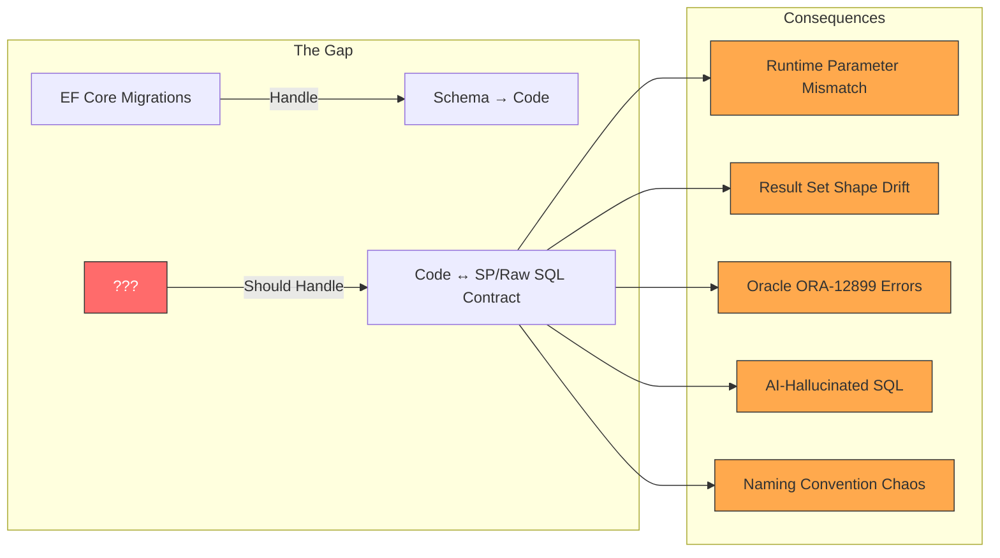
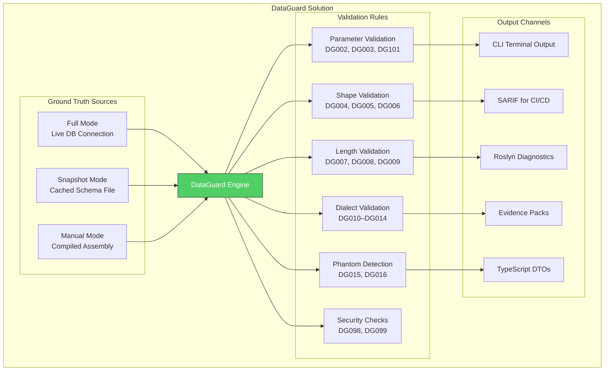
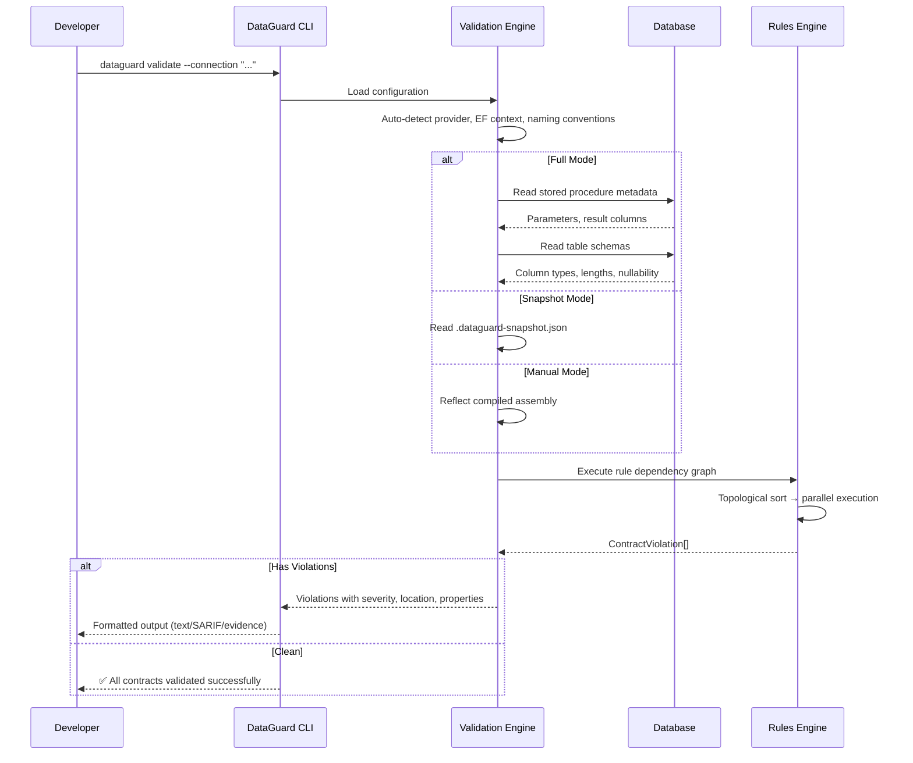
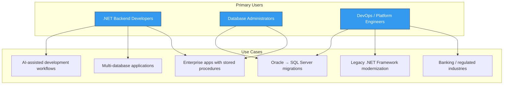

# DataGuard — Product Overview

> Contract validation between Entity Framework Core entities and database stored procedures / raw SQL.

## The Problem

Since Entity Framework issue [#245](https://github.com/dotnet/efcore/issues/245) was opened in **2014**, .NET developers have lacked a systematic way to validate that their C# entity models match the actual database schema — especially when using stored procedures, raw SQL, or database-specific features.

### What EF Core Does Well

EF Core handles **schema-first** workflows: migrations generate database schema from C# models, and scaffolding generates C# models from existing databases. The happy path is well-covered.

### What EF Core Does Not Cover

| Gap | Impact | Frequency |
|-----|--------|-----------|
| Stored procedure parameter validation | Runtime `SqlException` on parameter count/type mismatch | Daily in enterprise codebases |
| Raw SQL result set shape validation | `InvalidOperationException` when columns change | Weekly during schema evolution |
| Oracle CHAR vs BYTE semantics | `ORA-12899: value too large for column` | Intermittent, hard to reproduce |
| NVARCHAR2(2000) inference fallback | Silent data truncation at 2000 chars | Discovered in production |
| AI-generated SQL correctness | Phantom tables, hallucinated columns | Growing with AI adoption |
| Cross-dialect SQL validation | SQL Server syntax in Oracle context | During migrations |
| Naming convention mismatches | `snake_case` DB columns vs PascalCase C# properties | Every multi-DB project |

### The dbt Inspiration

The [dbt](https://docs.getdbt.com/docs/collaborate/govern/model-contracts) project introduced **model contracts** — a declarative way to define the shape of a model's output and validate it at build time. DataGuard brings this same philosophy to the .NET ecosystem, but for the **reverse direction**: validating that C# code correctly maps to database objects.

## The Solution

DataGuard provides **contract validation** between your C# entity models and database stored procedures / raw SQL queries. It operates in three ground-truth modes, each suited to different development stages.

### Three Ground-Truth Modes

| Mode | How It Works | Best For | Requires DB? |
|------|-------------|----------|--------------|
| **Full** | Connects to live database, reads `sys.*` / `USER_*` / `information_schema` catalog views | CI/CD pipelines, pre-deploy validation | Yes |
| **Snapshot** | Reads a cached JSON schema file captured from a previous Full run | Local development, offline validation, fast iteration | No |
| **Manual** | Extracts contract descriptors from compiled assemblies via reflection | Legacy codebases, offline-first workflows | No |

### How It Works

## Key Value Proposition

### For Individual Developers

- **Catch errors at build time**, not runtime — parameter mismatches, type incompatibilities, naming convention violations
- **IDE integration** via Roslyn analyzers — squiggly lines in Visual Studio and VS Code as you type
- **Oracle-specific safety** — CHAR vs BYTE semantics, NVARCHAR2(2000) fallback, dialect mismatches
- **AI code review** — detect phantom tables and hallucinated SQL from AI-generated code

### For Teams

- **CI/CD integration** — SARIF output feeds directly into GitHub Code Scanning, Azure DevOps, and other analysis platforms
- **Baseline management** — track schema drift over time, fail builds on unexpected changes
- **Audit trail** — evidence packs for compliance (SOC 2, ISO 27001, banking regulations)
- **Multi-database support** — single toolchain for Oracle, SQL Server, MySQL, PostgreSQL

### For Organizations

- **Legacy migration safety** — assess existing codebases before modernization
- **Credential security** — zero-trust credential resolution via Key Vault, AWS Secrets Manager, HashiCorp Vault
- **Plugin architecture** — extend with custom rules via MEF
- **Supply chain verification** — NuGet package integrity checks

## Target Audience

### Primary Persona: The Enterprise .NET Developer

You work on a .NET application that uses Entity Framework Core alongside stored procedures and raw SQL queries. Your database might be Oracle, SQL Server, MySQL, or PostgreSQL — or a combination. You've been bitten by runtime errors from parameter mismatches, column renames, or Oracle-specific type issues. You want a tool that catches these problems before they reach production.

### Secondary Persona: The Platform Engineer

You maintain CI/CD pipelines for multiple .NET teams. You need a standardized way to validate database contracts across projects, generate compliance evidence, and enforce security policies around credentials. DataGuard's SARIF output, baseline management, and zero-trust credential system are designed for you.

## Comparison with Alternatives

| Feature | DataGuard | EF Core Migrations | dbt Contracts | Manual Testing | SQL Unit Tests |
|---------|-----------|-------------------|---------------|----------------|----------------|
| **SP parameter validation** | ✅ Full | ❌ No | ❌ No | ⚠️ Ad-hoc | ⚠️ Partial |
| **Result set shape validation** | ✅ Full | ❌ No | ✅ Yes (models) | ❌ No | ⚠️ Partial |
| **Oracle CHAR/BYTE semantics** | ✅ DG008 | ❌ No | ❌ No | ❌ No | ❌ No |
| **NVARCHAR2(2000) fallback** | ✅ DG009 | ❌ No | ❌ No | ❌ No | ❌ No |
| **Phantom table detection** | ✅ DG015 | ❌ No | ❌ No | ❌ No | ❌ No |
| **Cross-dialect validation** | ✅ DG010–014 | ❌ No | ❌ No | ❌ No | ❌ No |
| **IDE integration** | ✅ Roslyn | ✅ Built-in | ❌ No | ❌ No | ❌ No |
| **CI/CD SARIF output** | ✅ Native | ❌ No | ✅ Yes | ❌ No | ⚠️ Partial |
| **Offline validation** | ✅ Snapshot | ❌ No | ❌ No | ❌ No | ❌ No |
| **Multi-database** | ✅ 4 engines | ⚠️ EF only | ❌ No | ⚠️ Manual | ⚠️ Manual |
| **Baseline/drift detection** | ✅ Native | ⚠️ Migrations | ✅ Yes | ❌ No | ❌ No |
| **Credential security** | ✅ Zero-trust | ❌ No | ❌ No | ❌ No | ❌ No |
| **Plugin extensibility** | ✅ MEF | ❌ No | ❌ No | ❌ No | ❌ No |
| **TypeScript DTO export** | ✅ Native | ❌ No | ❌ No | ❌ No | ❌ No |

## Technology Stack

| Component | Technology | Version |
|-----------|-----------|---------|
| Runtime | .NET | 9.0 |
| Language | C# | 13 |
| Roslyn (Analyzers) | Microsoft.CodeAnalysis | 4.x (netstandard2.0) |
| CLI Framework | System.CommandLine | 2.0 |
| Configuration | YamlDotNet | 13.x |
| Plugin System | MEF (System.Composition) | 9.0 |
| Oracle Client | Oracle.ManagedDataAccess.Core | 23.x |
| SQL Server Client | Microsoft.Data.SqlClient | 5.x |
| MySQL Client | MySqlConnector | 2.x |
| PostgreSQL Client | Npgsql | 8.x |
| Testing | xUnit, FluentAssertions, Moq | Latest |
| Benchmarking | BenchmarkDotNet | 0.14 |
| CI/CD | GitHub Actions | — |
| Container | Docker (Debian slim) | — |

## Project Status

DataGuard is an **active, production-ready** project with:

- **13 source projects** covering core logic, 4 database adapters, CLI, analyzers, code fixes, and IDE extensions
- **3 test projects** with 291+ tests including golden corpus validation
- **CI/CD pipeline** with automated build, test, and release workflows
- **Bilingual documentation** (English and Vietnamese)
- **MIT License** — open source and free to use

## Quick Links

| Resource | Path |
|----------|------|
| Quickstart Guide | [docs/01-overview/quickstart.md](quickstart.md) |
| Installation | [docs/05-operations/installation-guide.md](../05-operations/installation-guide.md) |
| CLI Reference | [docs/03-components/tooling/cli.md](../03-components/tooling/cli.md) |
| Architecture | [docs/02-architecture/system-architecture.md](../02-architecture/system-architecture.md) |
| Contributing | [CONTRIBUTING.md](../../CONTRIBUTING.md) |
| Changelog | [CHANGELOG.md](../../CHANGELOG.md) |
