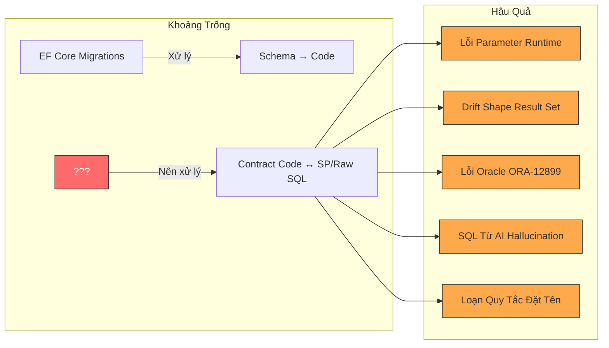
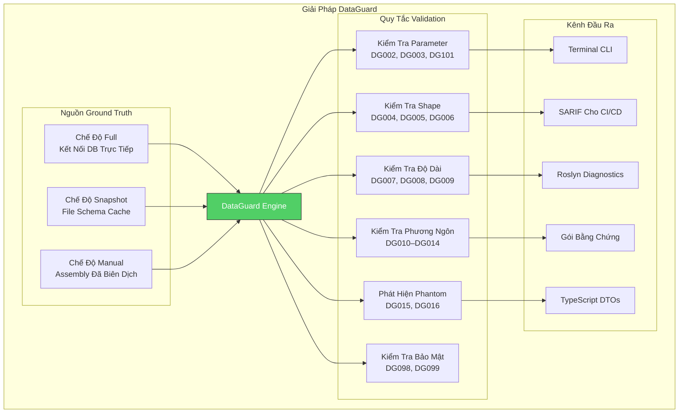
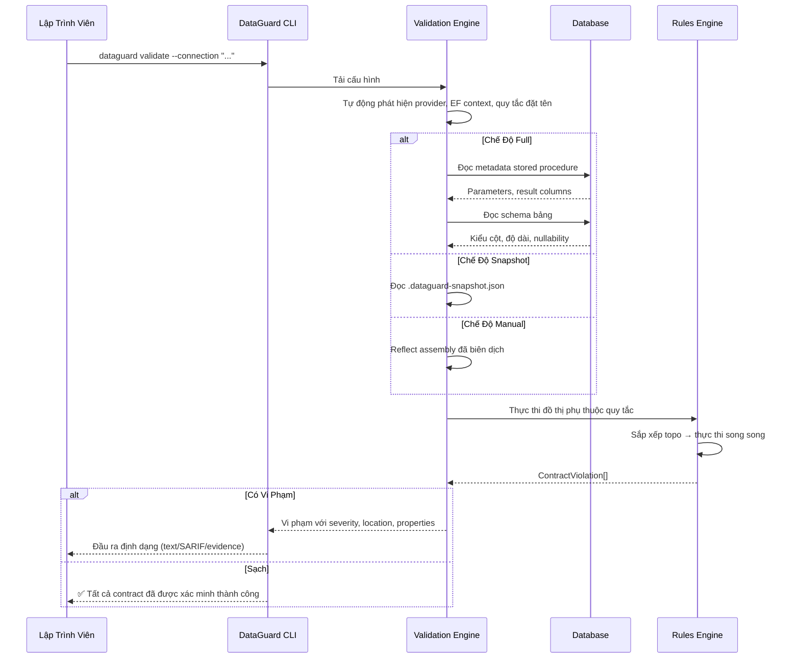
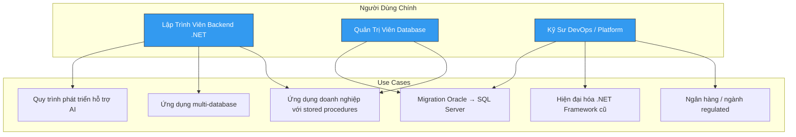

# DataGuard — Tổng Quan Sản Phẩm

> Kiểm tra contract giữa Entity Framework Core và stored procedure / raw SQL trong database.

## Vấn Đề

Kể từ khi Entity Framework issue [#245](https://github.com/dotnet/efcore/issues/245) được mở vào năm **2014**, lập trình viên .NET vẫn thiếu một cách có hệ thống để xác minh rằng mô hình entity C# khớp với schema database thực tế — đặc biệt khi sử dụng stored procedure, raw SQL, hoặc các tính năng đặc thù database.

### EF Core Xử Lý Tốt Điều Gì

EF Core xử lý tốt quy trình **schema-first**: migration tạo schema database từ mô hình C#, và scaffolding tạo mô hình C# từ database hiện có. Đường dẫn chính (happy path) được bao phủ tốt.

### EF Core Không Bao Phủ Điều Gì

| Khoảng Trống | Tần Suất | Mức Độ |
|-------------|----------|--------|
| Kiểm tra parameter stored procedure | `SqlException` runtime khi sai số lượng/kiểu parameter | Hàng ngày trong codebase doanh nghiệp |
| Kiểm tra shape result set raw SQL | `InvalidOperationException` khi cột thay đổi | Hàng tuần khi schema tiến hóa |
| Ngữ nghĩa Oracle CHAR vs BYTE | `ORA-12899: value too large for column` | Không liên tục, khó tái hiện |
| Suy luận NVARCHAR2(2000) | Cắt dữ liệu im lặng ở 2000 ký tự | Phát hiện ở production |
| Đúng đắn SQL do AI tạo | Bảng ma, cột hallucination | Tăng trưởng với sự phổ biến của AI |
| Kiểm tra SQL cross-dialect | Cú pháp SQL Server trong ngữ cảnh Oracle | Khi migration |
| Sai lệch quy tắc đặt tên | Cột `snake_case` DB vs thuộc tính PascalCase C# | Mọi dự án multi-DB |

### Cảm Hứng Từ dbt

Dự án [dbt](https://docs.getdbt.com/docs/collaborate/govern/model-contracts) giới thiệu **model contracts** — cách khai báo để định nghĩa shape đầu ra của model và kiểm tra tại thời điểm build. DataGuard mang triết lý này đến hệ sinh thái .NET, nhưng cho **hướng ngược lại**: xác minh code C# ánh xạ đúng đến đối tượng database.

## Giải Pháp

DataGuard cung cấp **kiểm tra contract** giữa mô hình entity C# và stored procedure / raw SQL queries. Hoạt động trong ba chế độ ground-truth, phù hợp với các giai đoạn phát triển khác nhau.

### Ba Chế Độ Ground-Truth

| Chế Độ | Cách Hoạt Động | Phù Hợp Cho | Cần DB? |
|--------|----------------|-------------|---------|
| **Full** | Kết nối database trực tiếp, đọc `sys.*` / `USER_*` / `information_schema` catalog views | Pipeline CI/CD, validation trước deploy | Có |
| **Snapshot** | Đọc file schema JSON cache từ lần chạy Full trước | Phát triển local, validation offline, lặp nhanh | Không |
| **Manual** | Trích xuất contract descriptor từ assembly đã biên dịch qua reflection | Codebase cũ, quy trình offline-first | Không |

### Cách Thức Hoạt Động

## Giá Trị Cốt Lõi

### Cho Lập Trình Viên Cá Nhân

- **Phát hiện lỗi tại thời điểm build**, không phải runtime — sai lệch parameter, không tương thích kiểu, vi phạm quy tắc đặt tên
- **Tích hợp IDE** qua Roslyn analyzers — gạch chân trong Visual Studio và VS Code khi bạn gõ code
- **An toàn đặc thù Oracle** — ngữ nghĩa CHAR vs BYTE, suy luận NVARCHAR2(2000), sai lệch phương ngôn
- **Đánh giá code AI** — phát hiện bảng ma và SQL hallucination từ code do AI tạo

### Cho Nhóm

- **Tích hợp CI/CD** — đầu ra SARIF tích hợp trực tiếp vào GitHub Code Scanning, Azure DevOps và các nền tảng phân tích khác
- **Quản lý baseline** — theo dõi drift schema theo thời gian, dừng build khi phát hiện thay đổi bất ngờ
- **Lịch sử kiểm toán** — gói bằng chứng cho tuân thủ (SOC 2, ISO 27001, quy định ngân hàng)
- **Hỗ trợ multi-database** — bộ công cụ duy nhất cho Oracle, SQL Server, MySQL, PostgreSQL

### Cho Tổ Chức

- **An toàn migration cũ** — đánh giá codebase hiện đại hóa trước khi hiện đại hóa
- **Bảo mật credential** — phân giải credential zero-trust qua Key Vault, AWS Secrets Manager, HashiCorp Vault
- **Kiến trúc plugin** — mở rộng với quy tắc tùy chỉnh qua MEF
- **Xác minh chuỗi cung ứng** — kiểm tra toàn vẹn gói NuGet

## Đối Tướng Mục Tiêu

### Persona Chính: Lập Trình Viên .NET Doanh Nghiệp

Bạn làm việc trên ứng dụng .NET sử dụng Entity Framework Core cùng với stored procedure và raw SQL queries. Database có thể là Oracle, SQL Server, MySQL hoặc PostgreSQL — hoặc kết hợp. Bạn đã từng gặp lỗi runtime do sai lệch parameter, đổi tên cột, hoặc vấn đề kiểu đặc thù Oracle. Bạn muốn một công cụ phát hiện những vấn đề này trước khi chúng đến production.

### Persona Phụ: Kỹ Sư Platform

Bạn duy trì pipeline CI/CD cho nhiều nhóm .NET. Bạn cần cách tiêu chuẩn hóa để kiểm tra contract database xuyên suốt các dự án, tạo bằng chứng tuân thủ, và thực thi chính sách bảo mật xung quanh credential. Đầu ra SARIF, quản lý baseline, và hệ thống credential zero-trust của DataGuard được thiết kế cho bạn.

## So Sánh Với Các Giải Pháp Thay Thế

| Tính Năng | DataGuard | EF Core Migrations | dbt Contracts | Test Thủ Công | SQL Unit Tests |
|-----------|-----------|-------------------|---------------|---------------|----------------|
| **Kiểm tra parameter SP** | ✅ Đầy đủ | ❌ Không | ❌ Không | ⚠️ Tùy biến | ⚠️ Một phần |
| **Kiểm tra shape result set** | ✅ Đầy đủ | ❌ Không | ✅ Có (models) | ❌ Không | ⚠️ Một phần |
| **Ngữ nghĩa Oracle CHAR/BYTE** | ✅ DG008 | ❌ Không | ❌ Không | ❌ Không | ❌ Không |
| **Suy luận NVARCHAR2(2000)** | ✅ DG009 | ❌ Không | ❌ Không | ❌ Không | ❌ Không |
| **Phát hiện bảng phantom** | ✅ DG015 | ❌ Không | ❌ Không | ❌ Không | ❌ Không |
| **Kiểm tra cross-dialect** | ✅ DG010–014 | ❌ Không | ❌ Không | ❌ Không | ❌ Không |
| **Tích hợp IDE** | ✅ Roslyn | ✅ Có sẵn | ❌ Không | ❌ Không | ❌ Không |
| **SARIF cho CI/CD** | ✅ Native | ❌ Không | ✅ Có | ❌ Không | ⚠️ Một phần |
| **Validation offline** | ✅ Snapshot | ❌ Không | ❌ Không | ❌ Không | ❌ Không |
| **Multi-database** | ✅ 4 engines | ⚠️ Chỉ EF | ❌ Không | ⚠️ Thủ công | ⚠️ Thủ công |
| **Baseline/phát hiện drift** | ✅ Native | ⚠️ Migrations | ✅ Có | ❌ Không | ❌ Không |
| **Bảo mật credential** | ✅ Zero-trust | ❌ Không | ❌ Không | ❌ Không | ❌ Không |
| **Mở rộng plugin** | ✅ MEF | ❌ Không | ❌ Không | ❌ Không | ❌ Không |
| **Xuất TypeScript DTO** | ✅ Native | ❌ Không | ❌ Không | ❌ Không | ❌ Không |

## Công Nghệ Sử Dụng

| Thành Phần | Công Nghệ | Phiên Bản |
|-----------|-----------|-----------|
| Runtime | .NET | 9.0 |
| Ngôn ngữ | C# | 13 |
| Roslyn (Analyzers) | Microsoft.CodeAnalysis | 4.x (netstandard2.0) |
| CLI Framework | System.CommandLine | 2.0 |
| Cấu hình | YamlDotNet | 13.x |
| Hệ thống Plugin | MEF (System.Composition) | 9.0 |
| Oracle Client | Oracle.ManagedDataAccess.Core | 23.x |
| SQL Server Client | Microsoft.Data.SqlClient | 5.x |
| MySQL Client | MySqlConnector | 2.x |
| PostgreSQL Client | Npgsql | 8.x |
| Kiểm thử | xUnit, FluentAssertions, Moq | Mới nhất |
| Benchmark | BenchmarkDotNet | 0.14 |
| CI/CD | GitHub Actions | — |
| Container | Docker (Debian slim) | — |

## Trạng Thái Dự Án

DataGuard là dự án **hoạt động, sẵn sàng cho production** với:

- **13 dự án nguồn** bao gồm logic lõi, 4 adapter database, CLI, analyzers, code fixes và extension IDE
- **3 dự án kiểm thử** với 291+ tests bao gồm validation golden corpus
- **Pipeline CI/CD** với workflow build, test và phát hành tự động
- **Tài liệu song ngữ** (tiếng Anh và tiếng Việt)
- **Giấy phép MIT** — mã nguồn mở và miễn phí sử dụng

## Liên Kết Nhanh

| Tài Nguyên | Đường Dẫn |
|-----------|----------|
| Hướng Dẫn Nhanh | [docs/01-overview/quickstart.md](quickstart.md) |
| Cài Đặt | [docs/05-operations/installation-guide.md](../05-operations/installation-guide.md) |
| Tham Chiếu CLI | [docs/03-components/tooling/cli.md](../03-components/tooling/cli.md) |
| Kiến Trúc | [docs/02-architecture/system-architecture.md](../02-architecture/system-architecture.md) |
| Đóng Góp | [CONTRIBUTING.md](../../CONTRIBUTING.md) |
| Lịch Sử Phiên Bản | [CHANGELOG.md](../../CHANGELOG.md) |
