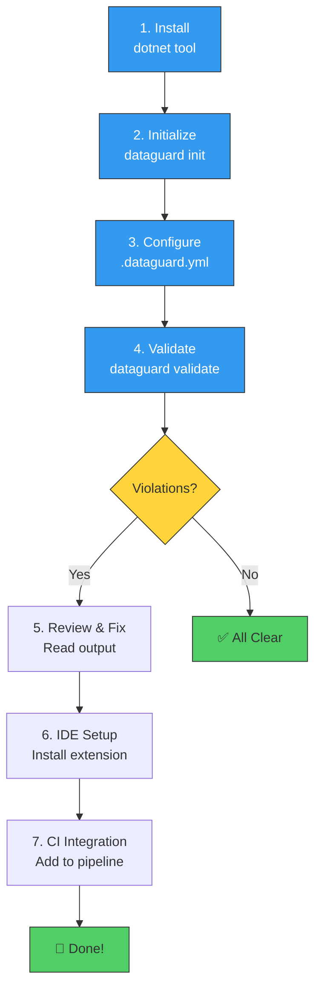
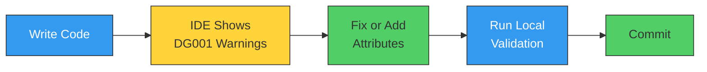
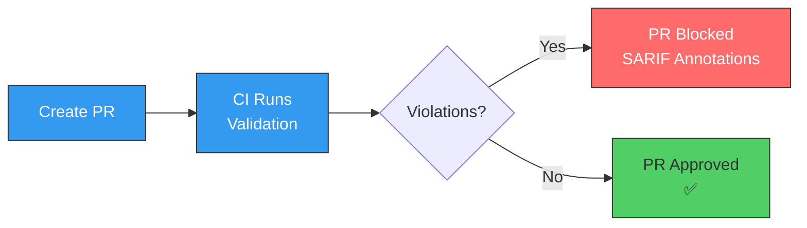
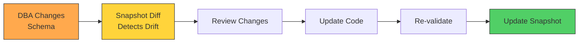

# DataGuard — 5-Minute Quickstart

> Get DataGuard running in your project in under 5 minutes. This guide covers installation, configuration, first validation, IDE setup, and CI integration.

## Quickstart Flow



---

## Step 1: Install

### Prerequisites

- .NET 9.0 SDK or later
- A .NET project with Entity Framework Core (optional but recommended)
- Database connection (Oracle, SQL Server, MySQL, or PostgreSQL) — or use offline mode

### Install as a .NET Global Tool

```bash
dotnet tool install --global DataGuard.Cli
```

### Or Install as a Local Tool

```bash
dotnet new tool-manifest
dotnet tool install --local DataGuard.Cli
```

### Verify Installation

```bash
dataguard version
# DataGuard v0.1.0 (.NET 9.0)
```

---

## Step 2: Initialize Configuration

Navigate to your project root and run:

```bash
dataguard init --provider oracle
```

This creates a `.dataguard.yml` configuration file:

```yaml
# DataGuard Configuration
# Generated by: dataguard init

# Database provider: sqlserver, oracle, mysql, postgresql
provider: oracle

# Ground truth mode: full, snapshot, manual
ground_truth_mode: snapshot

# Connection string (use environment variable in production)
# connection_string: "Server=localhost;Database=myapp;..."

# Naming convention for column ↔ property mapping
naming_convention: snake_case_to_pascal_case

# Oracle-specific settings
oracle:
  owner: MY_SCHEMA
  use_ref_cursor_describe: true
  use_all_arguments: true
  use_all_tab_columns: true

# Security settings
security:
  allow_plaintext_config_fallback: true  # Set to false in production
  enable_audit_logging: true

# Validation settings
validation:
  max_degree_of_parallelism: 0  # 0 = auto (Environment.ProcessorCount)
  validation_timeout_seconds: 300
```

### For SQL Server

```bash
dataguard init --provider sqlserver
```

```yaml
provider: sqlserver
ground_truth_mode: snapshot
naming_convention: snake_case_to_pascal_case

sql_server:
  schema: dbo
  use_first_result_set: true
```

---

## Step 3: Run Your First Validation

### With Database Connection (Full Mode)

```bash
dataguard validate --connection "Server=localhost;Database=myapp;User Id=sa;Password=..." --provider sqlserver
```

### Without Database (Snapshot Mode)

First, capture a snapshot:

```bash
dataguard snapshot refresh --connection "..." --provider oracle
```

Then validate offline:

```bash
dataguard validate --offline
```

### Without Database (Manual Mode)

If you have contract attributes in your code:

```bash
dataguard validate --offline --assembly ./bin/Debug/net9.0/MyApp.dll
```

---

## Step 4: Interpret Results

### Clean Output (No Violations)

```
✅ DataGuard Validation Complete
   Provider: Oracle
   Mode: Full
   Rules executed: 18
   Violations: 0
   Duration: 1.2s
```

### Output with Violations

```
❌ DataGuard Validation Complete
   Provider: Oracle
   Mode: Full
   Rules executed: 18
   Violations: 3
   Duration: 1.8s

┌───────┬──────────┬──────────────────────────────────────────────────────┐
│ Rule  │ Severity │ Message                                              │
├───────┼──────────┼──────────────────────────────────────────────────────┤
│ DG002 │ Error    │ Parameter 'p_status' type mismatch:                  │
│       │          │   Expected: VARCHAR2 (from DB)                       │
│       │          │   Actual: NUMBER (from C# call site)                 │
│       │          │   Location: CustomerRepository.cs:42                 │
├───────┼──────────┼──────────────────────────────────────────────────────┤
│ DG008 │ Warning  │ Byte overflow risk: property 'Name' may exceed      │
│       │          │   column 'CUSTOMER_NAME' byte capacity               │
│       │          │   in BYTE semantics                                  │
│       │          │   Location: Customer.cs:15                           │
├───────┼──────────┼──────────────────────────────────────────────────────┤
│ DG015 │ Error    │ Table 'CUSTOMER_PREFERENCES' does not exist         │
│       │          │   in database                                        │
│       │          │   Location: PreferenceService.cs:28                  │
└───────┴──────────┴──────────────────────────────────────────────────────┘
```

### Understanding Severity Levels

| Severity | Meaning | Action |
|----------|---------|--------|
| **Error** | Will cause runtime failure | Fix immediately |
| **Warning** | May cause issues in certain conditions | Review and fix |
| **Info** | Convention suggestion or unvalidated code | Consider fixing |

### SARIF Output for CI

```bash
dataguard validate --format sarif --output results.sarif --connection "..."
```

The SARIF file can be uploaded to GitHub Code Scanning, Azure DevOps, or any SARIF-compatible tool.

---

## Step 5: IDE Setup

### Visual Studio Code

1. Install the DataGuard extension from the VS Code Marketplace
2. Open your .NET project
3. DataGuard diagnostics appear automatically in the Problems panel

```json
// .vscode/settings.json (optional customization)
{
  "dataguard.provider": "oracle",
  "dataguard.configPath": ".dataguard.yml",
  "dataguard.enableOnType": true
}
```

### Visual Studio 2022

1. Install the DataGuard extension from the VS Marketplace
2. Open your .NET project
3. Access via `Tools → DataGuard → Validate Contracts`

### Roslyn Analyzer (Any IDE)

Add the analyzer NuGet package to your project:

```bash
dotnet add package DataGuard.Analyzers
```

This enables:
- **DG001**: Squiggly lines on unvalidated SQL calls (real-time, every keystroke)
- Code fix suggestions via light bulb menu

---

## Step 6: CI Integration

### GitHub Actions

```yaml
name: Contract Validation

on: [push, pull_request]

jobs:
  validate:
    runs-on: ubuntu-latest
    steps:
      - uses: actions/checkout@v4
      
      - name: Setup .NET
        uses: actions/setup-dotnet@v4
        with:
          dotnet-version: '9.0.x'
      
      - name: Install DataGuard
        run: dotnet tool install --global DataGuard.Cli
      
      - name: Validate Contracts
        run: |
          dataguard validate \
            --connection "${{ secrets.DB_CONNECTION_STRING }}" \
            --provider oracle \
            --format sarif \
            --output results.sarif
      
      - name: Upload SARIF
        uses: github/codeql-action/upload-sarif@v3
        if: always()
        with:
          sarif_file: results.sarif
```

### Azure DevOps

```yaml
- task: DotNetCoreCLI@2
  displayName: 'Install DataGuard'
  inputs:
    command: custom
    custom: tool
    arguments: 'install --global DataGuard.Cli'

- script: |
    dataguard validate \
      --connection "$(DB_CONNECTION_STRING)" \
      --provider sqlserver \
      --format sarif \
      --output $(Build.SourcesDirectory)/results.sarif
  displayName: 'Validate Contracts'

- task: PublishSecurityAnalysisLogs@3
  inputs:
    ArtifactName: 'CodeAnalysisLogs'
    ArtifactType: 'SARIF'
```

### Offline CI (No Database)

For CI environments without database access:

```yaml
- name: Capture Snapshot (on main branch)
  if: github.ref == 'refs/heads/main'
  run: |
    dataguard snapshot refresh \
      --connection "${{ secrets.DB_CONNECTION_STRING }}" \
      --provider oracle

- name: Validate Offline (on PR)
  if: github.event_name == 'pull_request'
  run: dataguard validate --offline --fail-on-drift
```

---

## Step 7: Create a Baseline

If you have existing violations that you can't fix immediately:

```bash
# Create baseline from current violations
dataguard baseline --connection "..." --provider oracle

# This creates .dataguard-baseline.json
# Future runs will only report NEW violations
```

### Check for Schema Drift

```bash
# Compare current schema with cached snapshot
dataguard snapshot diff --connection "..." --provider oracle --fail-on-drift
```

---

## Common Workflows

### Workflow 1: Daily Development



1. Write code — IDE shows DG001 warnings on unvalidated SQL calls
2. Add `[DataContract]` attributes or fix issues
3. Run `dataguard validate --offline` locally
4. Commit — pre-commit hook runs validation automatically

### Workflow 2: Pull Request Review



1. Create PR — CI pipeline runs `dataguard validate`
2. Violations appear as annotations on the PR
3. PR is blocked until violations are fixed
4. Merge only after clean validation

### Workflow 3: Schema Migration



1. DBA changes schema — `dataguard snapshot diff` detects drift
2. Review which contracts are affected
3. Update C# code to match new schema
4. Re-validate and update snapshot

---

## Configuration Reference (Minimal)

The minimal `.dataguard.yml` for each provider:

### Oracle

```yaml
provider: oracle
ground_truth_mode: full
connection_string: "Data Source=localhost:1521/XEPDB1;User Id=hr;Password=hr;"
oracle:
  owner: HR
```

### SQL Server

```yaml
provider: sqlserver
ground_truth_mode: full
connection_string: "Server=localhost;Database=MyApp;User Id=sa;Password=YourPassword123;"
sql_server:
  schema: dbo
```

### MySQL

```yaml
provider: mysql
ground_truth_mode: full
connection_string: "Server=localhost;Database=MyApp;User=root;Password=root;"
```

### PostgreSQL

```yaml
provider: postgresql
ground_truth_mode: full
connection_string: "Host=localhost;Database=MyApp;Username=postgres;Password=postgres;"
```

---

## Environment Variables

For CI/CD, use environment variables instead of config file credentials:

| Variable | Purpose |
|----------|---------|
| `DATAGUARD_CONNECTION_STRING` | Database connection string |
| `DATAGUARD_PROVIDER` | Database provider (oracle, sqlserver, mysql, postgresql) |
| `DATAGUARD_SCHEMA` | Default schema/owner |
| `DATAGUARD_PACKAGE` | Oracle package name |
| `DATAGUARD_KEY_VAULT_URI` | Azure Key Vault URI |
| `DATAGUARD_AWS_REGION` | AWS region for Secrets Manager |

---

## Next Steps

| Topic | Documentation |
|-------|--------------|
| Full CLI reference | [docs/03-components/tooling/cli.md](../03-components/tooling/cli.md) |
| Configuration guide | [docs/05-operations/configuration-guide.md](../05-operations/configuration-guide.md) |
| Architecture overview | [docs/02-architecture/system-architecture.md](../02-architecture/system-architecture.md) |
| All validation rules | [docs/01-overview/feature-showcase.md](feature-showcase.md) |
| CI/CD playbook | [docs/05-operations/playbook.md](../05-operations/playbook.md) |
| Troubleshooting | [docs/05-operations/runbook.md](../05-operations/runbook.md) |
| Contributing | [CONTRIBUTING.md](../../CONTRIBUTING.md) |

---

## Troubleshooting Quick Reference

| Problem | Solution |
|---------|---------|
| `dataguard: command not found` | Run `dotnet tool install --global DataGuard.Cli` and restart terminal |
| `Connection refused` | Check connection string, ensure database is running |
| `No contracts found` | Run `dataguard init` or add `[DataContract]` attributes to entities |
| `Snapshot not found` | Run `dataguard snapshot refresh` to capture current schema |
| `DG001 warnings everywhere` | This is expected — add `[DataContract]` attributes or use code fixes |
| `Baseline not recognized` | Ensure `.dataguard-baseline.json` is in project root |
