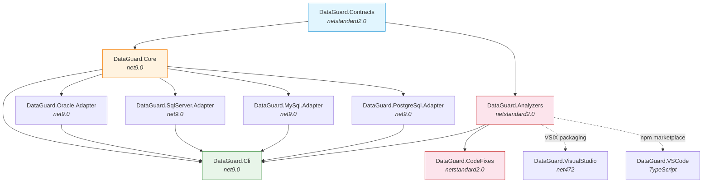
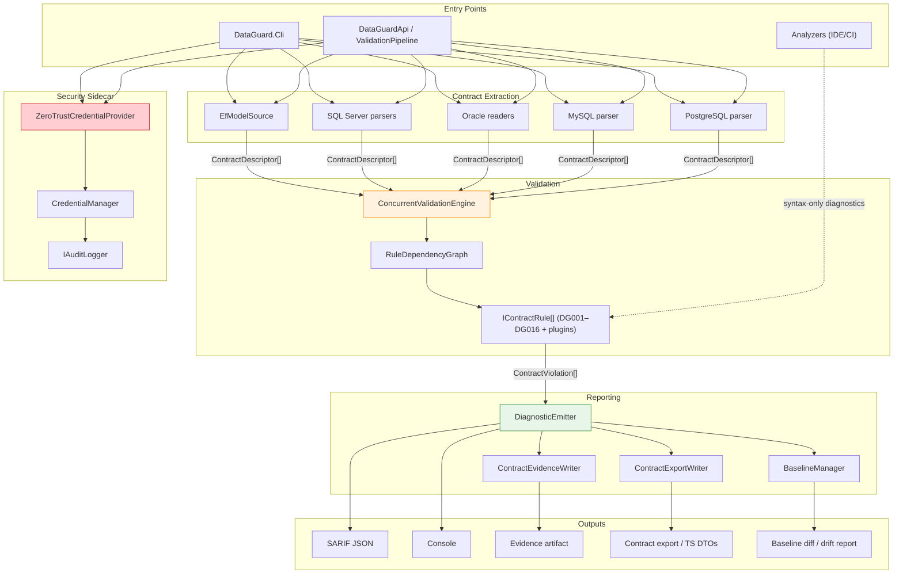
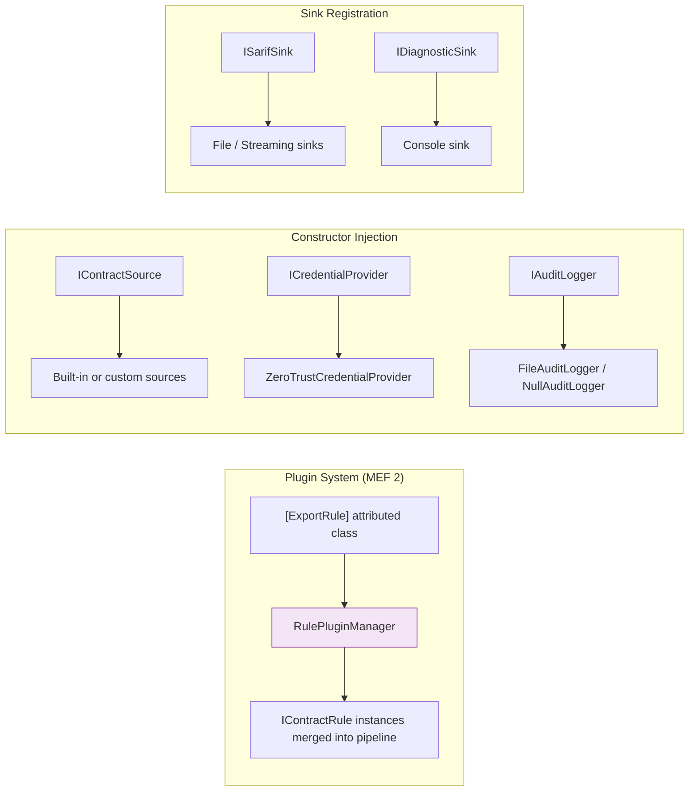
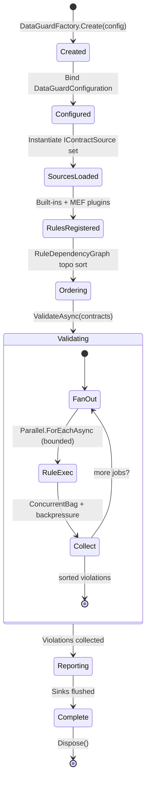

# Component Model

> Detailed component responsibilities, interface contracts, and dependency graph.

This document describes every project in the DataGuard solution, its public API surface, the interfaces that bind them together, and the data flow between components.

---

## 1. Project Dependency DAG

The solution contains **11 source projects** with a strict acyclic dependency graph. No circular dependencies exist.



**Dependency facts (from csproj `ProjectReference` declarations):**

- `DataGuard.Cli` → Core, SqlServer/Oracle/MySql/PostgreSql Adapters, Analyzers
- `DataGuard.Core` → Contracts
- Each Adapter → Core
- `DataGuard.Analyzers` → Contracts (bundled into the analyzer package so attribute types resolve at compiler load time)
- `DataGuard.CodeFixes` → Analyzers (bundled alongside Contracts in `codefixes/dotnet/cs`)
- Visual Studio / VS Code extensions consume the analyzer assemblies at packaging time — not compile-time project references

---

## 2. Project Responsibilities

### 2.1 DataGuard.Contracts

| Property | Value |
|----------|-------|
| **Target** | `netstandard2.0` |
| **Dependencies** | None |
| **Role** | Shared attributes and naming conventions |

**Public API Surface:**

| Symbol | Kind | Purpose |
|--------|------|---------|
| `SkipContractCheckAttribute` | Attribute | Opt out of validation for dynamic SQL or complex cases (method/class level) |
| `ExpectedColumnAttribute` | Attribute | Declare an expected column for manual ground-truth mode (property level) |
| `ExpectedSpParameterAttribute` | Attribute | Declare an expected stored procedure parameter with lenient direction parsing |
| `ParameterDirection` | Enum | `Input`, `Output`, `InputOutput`, `ReturnValue` |
| `NameConventions` | Static class | Shared `ToSnakeCase()` / `ToPascalCase()` conversions |

**Design rationale:** Targets `netstandard2.0` so it loads in both Roslyn analyzer hosts (compiler process) and any .NET consumer. Zero runtime dependencies. The netstandard mirror of `ParameterDirection` exists specifically so the IDE analyzer layer never needs a reference to the net9.0 engine assembly.

---

### 2.2 DataGuard.Core

| Property | Value |
|----------|-------|
| **Target** | `net9.0` |
| **Dependencies** | Contracts, EF Core 9.0.19, Roslyn 5.9.0, ScriptDom 180.102.0, AWSSDK.SecretsManager, System.Composition.Hosting |
| **Role** | Core validation engine — zero vendor-specific database dependencies |

**Internal Modules:**

| Module | Key Types | Purpose |
|--------|-----------|---------|
| **Abstractions** | `IContractSource`, `IContractRule`, `ContractViolation`, `EntityDescriptor`, `StoredProcedureDescriptor`, `RawSqlDescriptor`, `DatabaseSchemaDescriptor`, `PropertyDescriptor`, `ParameterDescriptor`, `ColumnDescriptor` | Domain model and interfaces |
| **Rules** | `ContractRuleBase`, parameter/type/direction/shape/nullability/naming rules (DG001–DG007), length & dialect rules (DG008–DG014), `PhantomIdentifierRule` (DG015/DG016) | Rule implementations |
| **Rules** | `RuleDependencyGraph`, `BuiltInRuleDependencies`, `ValidationResult` | Topological sort for optimal rule execution order |
| **Sources** | `EfModelSource` (runtime IModel + design-time snapshot), `SqlServerStoredProcedureParser`, `RawSqlParser`, `SqlParameterVisitor` | Contract extraction from EF Core and SQL Server |
| **Security** | `ZeroTrustCredentialProvider`, `CredentialHandle`, `CredentialManager`, `IAuditLogger`, `FileAuditLogger`, `AuditEntry` | Zero-trust credential handling and tamper-evident audit trail |
| **Baseline** | `BaselineManager`, `BaselineFile` v1/v2, `SnapshotTable`, `SnapshotColumn`, `DriftReport` | Snapshot capture, drift detection, schema hashing |
| **Reporting** | `DiagnosticEmitter`, `ISarifSink`, `IDiagnosticSink`, `FileSarifSink`, `StreamingSarifSink`, `ConsoleDiagnosticSink` | Multi-sink diagnostic output with redaction |
| **Reporting** | `SarifLog`, `Run`, `Result`, `Region`, `PropertyBag` | Minimal SARIF 2.1.0 type model |
| **Reporting** | `ContractEvidenceWriter`, `ContractExportWriter`, `TypeScriptContractWriter`, `ContractExport` | Evidence artifacts, contract export, TypeScript DTO generation |
| **Validation** | `ConcurrentValidationEngine` | Bounded parallelism (`MaxDegreeOfParallelism`) with violation backpressure (100K default) |
| **Plugins** | `RulePluginManager`, `ExportRuleAttribute`, `IRuleMetadata`, `IExternalToolPlugin`, `PluginAnalysisResult` | MEF 2 plugin discovery and external tool integration |
| **Telemetry** | `TelemetryCollector`, `TelemetryConfig`, `TimedOperation`, `ValidationMetrics` | Opt-in, local-only performance monitoring via System.Diagnostics.Metrics |
| **Assessment** | `AssessmentEngine`, `UpgradePlanner`, `LegacySupportTable`, internal packs (Inventory, DependencyHealth, BuildCi, Secrets) | Read-only workspace inventory and upgrade planning |
| **PublicApi** | `DataGuardApi`, `ValidationPipeline`, `ValidationResult`, `DriftReport`, `DataGuardFactory`, `ValidationPipelineExtensions` | Stable, versioned programmatic API |
| **Models** | `DataGuardConfiguration`, `GroundTruthMode`, `NamingConvention`, `OracleConfiguration`, `SqlServerConfiguration` | Configuration records |

---

### 2.3 DataGuard.Oracle.Adapter

| Property | Value |
|----------|-------|
| **Target** | `net9.0` |
| **Dependencies** | Core, `Oracle.ManagedDataAccess.Core` 23.26.300 |
| **Role** | Oracle-specific contract extraction and validation |

**Key Types:**

| Type | Purpose |
|------|---------|
| `AllArgumentsReader` | Reads SP parameters from `ALL_ARGUMENTS`; handles overloaded procedures via sequence/overload keys |
| `AllTabColumnsReader` | Reads column metadata from `ALL_TAB_COLUMNS`, including `CHAR_USED` (B=BYTE / C=CHAR semantics) |
| `NlsSessionReader` | Reads NLS session parameters for length semantics and database version |
| `RefCursorDescriber` | Describes REF CURSOR result sets using `DBMS_SQL` describe columns |
| `OracleDialectChecker` | Oracle-specific dialect validation (byte vs char, NLS settings) |
| Length mismatch logic | Oracle-aware length comparison honoring NLS length semantics |

---

### 2.4 DataGuard.SqlServer.Adapter

| Property | Value |
|----------|-------|
| **Target** | `net9.0` |
| **Dependencies** | Core, `Microsoft.Data.SqlClient` 7.0.2, ScriptDom |
| **Role** | SQL Server-specific contract extraction |

**Key Types:**

| Type | Purpose |
|------|---------|
| SP parser | Reads procedure metadata and result-set shapes over `SqlConnection` (catalog views) |
| `RawSqlParser` (Core) | Parses raw T-SQL using ScriptDom AST; visitor extracts parameters |
| `SqlParameterVisitor` | `TSqlFragmentVisitor` implementation for parameter extraction |

Note: the raw-SQL parsing surface lives in `DataGuard.Core/Sources/SqlServerParsers.cs`; this adapter project supplies the SQL Server-specific readers used by the CLI composition root.

---

### 2.5 DataGuard.MySql.Adapter

| Property | Value |
|----------|-------|
| **Target** | `net9.0` |
| **Dependencies** | Core, `MySqlConnector` |
| **Role** | MySQL-specific contract extraction |

**Key Types:**

| Type | Purpose |
|------|---------|
| `MySqlStoredProcedureParser` | Reads SP parameters from `information_schema.parameters` |
| `MySqlDialectChecker` | MySQL dialect checks |
| `MySqlLengthMismatchDetector` | MySQL-aware length mismatch detection |

---

### 2.6 DataGuard.PostgreSql.Adapter

| Property | Value |
|----------|-------|
| **Target** | `net9.0` |
| **Dependencies** | Core, `Npgsql` |
| **Role** | PostgreSQL-specific contract extraction |

**Key Types:**

| Type | Purpose |
|------|---------|
| `PostgreSqlStoredProcedureParser` | Reads routine signatures from system catalogs |
| `PostgreSqlDialectChecker` | PostgreSQL dialect checks |
| `PostgreSqlLengthMismatchDetector` | PostgreSQL-aware length mismatch detection |

---

### 2.7 DataGuard.Analyzers

| Property | Value |
|----------|-------|
| **Target** | `netstandard2.0` |
| **Dependencies** | Contracts; Roslyn 5.9.0 (PrivateAssets) |
| **Packaging** | Assemblies bundled into both `analyzers/dotnet/cs` and `generators/dotnet/cs` |
| **Role** | Roslyn analyzers — IDE light layer + CI heavy layer |

**Key Types:**

| Type | Kind | Purpose |
|------|------|---------|
| `UnvalidatedSqlCallGenerator` | `IIncrementalGenerator` | IDE light layer: syntax-only analysis on keystroke (~ms), zero-allocation value-type call sites |
| `ContractValidationAnalyzer` | `DiagnosticAnalyzer` | CI heavy layer: full semantic analysis |
| `DiagnosticIds` / `DiagnosticDescriptors` | Static classes | Shared DG-prefixed diagnostic identities |

**Packaging note:** The compiler does not resolve NuGet dependencies of analyzer/generator assemblies, so `DataGuard.Contracts.dll` is explicitly bundled next to the analyzer assembly so quick-fix attribute types resolve at load time.

---

### 2.8 DataGuard.CodeFixes

| Property | Value |
|----------|-------|
| **Target** | `netstandard2.0` |
| **Dependencies** | Analyzers (project reference); Roslyn Workspaces (PrivateAssets) |
| **Packaging** | Bundled under `codefixes/dotnet/cs` with Analyzer + Contracts DLLs |
| **Role** | Roslyn code fix providers |

---

### 2.9 DataGuard.Cli

| Property | Value |
|----------|-------|
| **Target** | `net9.0` (console executable) |
| **Dependencies** | Core, all four adapters, Analyzers, `System.CommandLine` |
| **Packaging** | `PackAsTool`, tool command name `dataguard` |
| **Role** | Command-line interface and Docker image entry point |

**Key Types:**

| Type | Purpose |
|------|---------|
| `Program` | All CLI commands built on System.CommandLine |
| `PreCommitHookInstaller` | Installs git pre-commit hooks that run contract checks |

---

### 2.10 DataGuard.VisualStudio

| Property | Value |
|----------|-------|
| **Target** | `net472` (VSIX) |
| **Dependencies** | `Microsoft.VisualStudio.SDK` 17.14, VSSDK.BuildTools |
| **Role** | Visual Studio 2022 extension: menu commands surfacing DataGuard validation inside the IDE |

---

### 2.11 DataGuard.VSCode

| Property | Value |
|----------|-------|
| **Target** | TypeScript → Node.js extension host |
| **Engines** | VS Code ≥ 1.85 |
| **Role** | VS Code extension: surfaces DataGuard diagnostics (SARIF-backed) as problems, decorations, and commands |

---

## 3. Interface Contracts

The core interfaces define the extension boundaries of the system.

### 3.1 IContractSource

```csharp
public interface IContractSource
{
    /// <summary>Stable identifier, e.g. "sqlserver-sp".</summary>
    string SourceId { get; }

    /// <summary>Human-readable display name.</summary>
    string DisplayName { get; }

    Task<IReadOnlyList<ContractDescriptor>> ExtractContractsAsync(
        CancellationToken cancellationToken = default);
}
```

**Implementations:** `EfModelSource`, `SqlServerStoredProcedureParser`, `RawSqlParser` (Core); Oracle/MySQL/PostgreSQL parsers (adapters).

**Data flow:** source → `ContractDescriptor[]` → rules engine.

---

### 3.2 IContractRule

```csharp
public interface IContractRule
{
    string RuleId { get; }                 // e.g. "DG001"
    string Name { get; }
    DiagnosticSeverity Severity { get; }
    string Description { get; }

    Task<IReadOnlyList<ContractViolation>> ValidateAsync(
        ContractDescriptor contract,
        IReadOnlyList<ContractDescriptor> allContracts,
        CancellationToken cancellationToken = default);
}
```

Each rule receives the full contract set (`allContracts`) so cross-contract rules (entity ↔ result set, SQL ↔ schema phantom detection) can correlate evidence.

**Implementations:** built-in DG001–DG016 rules plus any `[ExportRule]` plugin discovered by MEF.

---

### 3.3 ICredentialProvider

```csharp
public interface ICredentialProvider
{
    Task<CredentialHandle> GetCredentialAsync(
        string credentialName, CredentialType type,
        CancellationToken cancellationToken = default);

    Task<CredentialHandle> GetDatabaseConnectionAsync(
        CancellationToken cancellationToken = default);
}
```

`CredentialHandle` is a secure `IDisposable` wrapper: the secret is only reachable through controlled accessors and is zeroed on dispose.

**Implementation:** `ZeroTrustCredentialProvider` (vault → env var → encrypted config, fail-closed).

---

### 3.4 IAuditLogger

```csharp
public interface IAuditLogger
{
    Task LogDatabaseOperationAsync(string operation, string provider,
        string connectionStringHash, string details, bool success,
        string? errorMessage = null, CancellationToken ct = default);

    Task LogCredentialAccessAsync(string operation, string provider,
        string connectionStringHash, CancellationToken ct = default);

    Task LogConfigurationChangeAsync(string setting, string? oldValue,
        string? newValue, CancellationToken ct = default);
}
```

Connection strings are logged only as hashes. `FileAuditLogger` writes hash-chained entries (`Hash`, `PreviousHash`) for tamper evidence; `NullAuditLogger` disables logging without branching in callers.

---

## 4. Data Flow Between Components



---

## 5. Extension Points

| Extension Point | Mechanism | Discovery |
|-----------------|-----------|-----------|
| Custom rules | Implement `IContractRule` + `[ExportRule("CUSTOM001", ...)]` | MEF 2 assembly scanning (`RulePluginManager`) |
| New data sources | Implement `IContractSource` | Constructor registration on the pipeline |
| Output formats | Implement `ISarifSink` / `IDiagnosticSink` | `AddSarifSink()` / `AddDiagnosticSink()` |
| Secret backends | Implement `ICredentialProvider` | Constructor injection |
| Audit destinations | Implement `IAuditLogger` | Constructor injection |
| Third-party tools | Implement `IExternalToolPlugin` | MEF discovery, returns `PluginAnalysisResult` |
| Naming strategies | `NamingConvention` enum / `NameConventions` helpers | Configuration |



---

## 6. Component Lifecycle



---

## See Also

- [System Architecture](system-architecture.md) — High-level topology and layer design
- [Design Philosophy](design-philosophy.md) — Principles behind these interfaces
- [Tech Stack](tech-stack.md) — Dependency versions and evaluation
- [Core Abstractions](../03-components/core/abstractions.md) — Deep dive into the domain model
