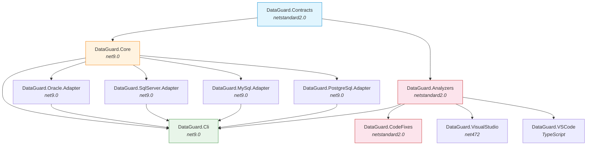
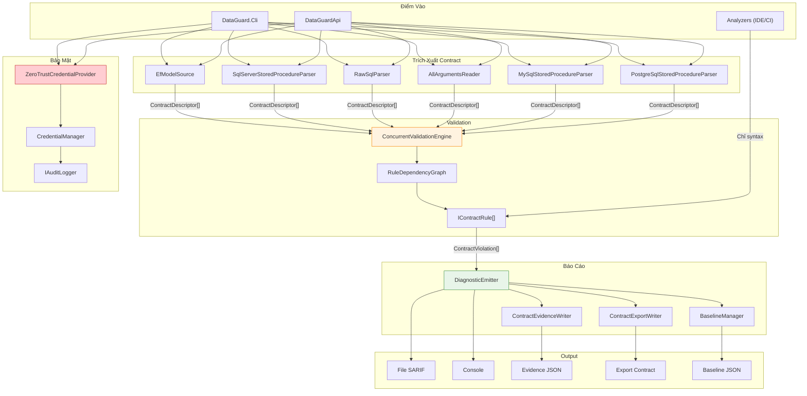
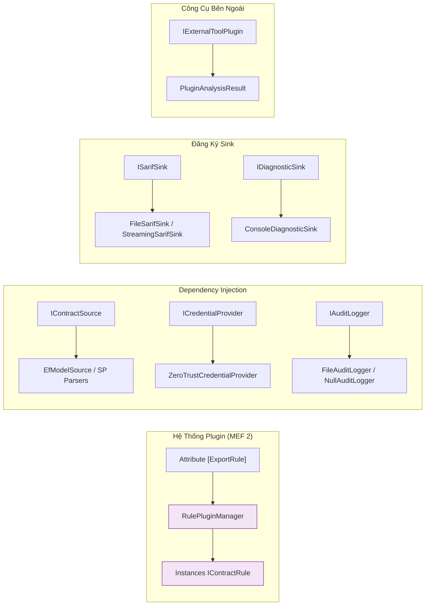
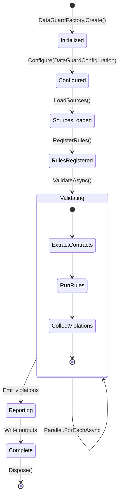

# Mô Hình Thành Phần

> Trách nhiệm thành phần chi tiết, contracts interface và đồ thị phụ thuộc.

Tài liệu này mô tả mọi dự án trong solution DataGuard, bề mặt API công khai, các interface kết nối chúng và luồng dữ liệu giữa các thành phần.

---

## 1. DAG Phụ thuộc Dự Án

Solution chứa **11 dự án nguồn** với đồ thị phụ thuộc acyclic nghiêm ngặt. Không tồn tại phụ thuộc tuần hoàn.



---

## 2. Trách Nhiệm Dự Án

### 2.1 DataGuard.Contracts

| Thuộc Tính | Giá Trị |
|------------|---------|
| **Target** | `netstandard2.0` |
| **Phụ Thuộc** | Không |
| **Vai Trò** | Attributes chia sẻ và quy ước đặt tên |

**Bề Mặt API Công Khai:**

| Ký Hiệu | Loại | Mục Đích |
|---------|------|---------|
| `SkipContractCheckAttribute` | Attribute | Bỏ qua validate cho SQL động |
| `ExpectedColumnAttribute` | Attribute | Khai báo cột mong đợi cho ground truth thủ công |
| `ExpectedSpParameterAttribute` | Attribute | Khai báo tham số SP mong đợi (direction, type) |
| `ParameterDirection` | Enum | `Input`, `Output`, `InputOutput`, `ReturnValue` |
| `NameConventions` | Static class | Chuyển đổi `ToSnakeCase()` / `ToPascalCase()` |

**Lý do thiết kế:** Nhắm `netstandard2.0` để tải trong cả Roslyn analyzers (chạy trong process compiler) và bất kỳ consumer .NET nào. Không phụ thuộc runtime.

---

### 2.2 DataGuard.Core

| Thuộc Tính | Giá Trị |
|------------|---------|
| **Target** | `net9.0` |
| **Phụ Thuộc** | `DataGuard.Contracts`, EF Core 9.0.19, Roslyn 5.9.0, ScriptDom, AWSSDK.SecretsManager |
| **Vai Trò** | Engine validation cốt lõi — không phụ thuộc database vendor |

**Các Module Nội Bộ:**

| Module | Types Chính | Mục Đích |
|--------|------------|---------|
| **Abstractions** | `IContractSource`, `IContractRule`, `ContractDescriptor`, `ContractViolation`, các descriptor records | Domain model và interfaces |
| **Rules** | `ContractRuleBase`, `ParameterCountRule` (DG001), `ParameterTypeMatchRule` (DG002), `ColumnShapeMatchRule` (DG003), `NullableMismatchRule` (DG004), `NamingConventionRule` (DG005), `LengthMismatchRule` (DG006), `DialectCheckRule` (DG007), `PhantomIdentifierRule` (DG015/DG016) | Triển khai rules |
| **Rules** | `RuleDependencyGraph`, `BuiltInRuleDependencies` | Sắp xếp topo cho thứ tự thực thi tối ưu |
| **Sources** | `EfModelSource`, `SqlServerStoredProcedureParser`, `RawSqlParser` | Trích xuất contract từ EF Core và SQL Server |
| **Security** | `ZeroTrustCredentialProvider`, `CredentialManager`, `IAuditLogger`, `FileAuditLogger` | Xử lý credential zero-trust |
| **Baseline** | `BaselineManager` | Chụp snapshot, phát hiện drift, hash schema |
| **Reporting** | `DiagnosticEmitter`, `ContractEvidenceWriter`, `ContractExportWriter`, `TypeScriptContractWriter` | Output đa định dạng |
| **Reporting** | `SarifLog`, `Run`, `Result`, `SarifLocation` | Types SARIF 2.1.0 |
| **Validation** | `ConcurrentValidationEngine` | Song song có giới hạn với áp lực ngược |
| **Plugins** | `RulePluginManager`, `ExportRuleAttribute`, `IExternalToolPlugin` | Khám phá plugin MEF 2 |
| **Telemetry** | `TelemetryCollector`, `ValidationMetrics`, `TimedOperation` | Giám sát hiệu suất tùy chọn |
| **Assessment** | `AssessmentEngine`, `UpgradePlanner`, `LegacySupportTable` | Inventory workspace và kế hoạch nâng cấp |
| **PublicApi** | `DataGuardApi`, `ValidationPipeline`, `DataGuardFactory` | API lập trình ổn định |
| **Models** | `DataGuardConfiguration`, `GroundTruthMode`, `NamingConvention` | Records cấu hình |

---

### 2.3 DataGuard.Oracle.Adapter

| Thuộc Tính | Giá Trị |
|------------|---------|
| **Target** | `net9.0` |
| **Phụ Thuộc** | `DataGuard.Core`, `Oracle.ManagedDataAccess.Core` 23.26.300 |
| **Vai Trò** | Trích xuất và validate contract đặc thù Oracle |

**Types Chính:**

| Type | Mục Đích |
|------|---------|
| `AllArgumentsReader` | Đọc tham số SP từ `ALL_ARGUMENTS` (xử lý overload qua cột sequence/overload) |
| `AllTabColumnsReader` | Đọc metadata cột từ `ALL_TAB_COLUMNS` (bao gồm `CHAR_USED` B/C cho byte/char semantics) |
| `NlsSessionReader` | Đọc tham số phiên NLS cho length semantics và phiên bản database |
| `RefCursorDescriber` | Mô tả result sets REF CURSOR bằng `DBMS_SQL` |
| `OracleDialectChecker` | Kiểm tra dialect đặc thù Oracle (byte vs char, cài đặt NLS) |
| `LengthMismatch` | Phát hiện sai lệch độ dài đặc thù Oracle |

---

### 2.4 DataGuard.SqlServer.Adapter

| Thuộc Tính | Giá Trị |
|------------|---------|
| **Target** | `net9.0` |
| **Phụ Thuộc** | `DataGuard.Core`, `Microsoft.Data.SqlClient` 7.0.2, `ScriptDom` 180.102.0 |
| **Vai Trò** | Trích xuất contract đặc thù SQL Server |

**Types Chính:**

| Type | Mục Đích |
|------|---------|
| `SqlServerStoredProcedureParser` | Đọc tham số SP qua `SqlConnection` |
| `RawSqlParser` | Parse raw SQL bằng `ScriptDom` AST visitor |
| `SqlParameterVisitor` | T-SQL fragment visitor cho trích xuất tham số |

---

### 2.5 DataGuard.MySql.Adapter

| Thuộc Tính | Giá Trị |
|------------|---------|
| **Target** | `net9.0` |
| **Phụ Thuộc** | `DataGuard.Core`, `MySqlConnector` |
| **Vai Trò** | Trích xuất contract đặc thù MySQL |

**Types Chính:**

| Type | Mục Đích |
|------|---------|
| `MySqlStoredProcedureParser` | Đọc tham số SP từ `information_schema.parameters` |
| `MySqlDialectChecker` | Kiểm tra dialect đặc thù MySQL |
| `MySqlLengthMismatchDetector` | Phát hiện sai lệch độ dài đặc thù MySQL |

---

### 2.6 DataGuard.PostgreSql.Adapter

| Thuộc Tính | Giá Trị |
|------------|---------|
| **Target** | `net9.0` |
| **Phụ Thuộc** | `DataGuard.Core`, `Npgsql` |
| **Vai Trò** | Trích xuất contract đặc thù PostgreSQL |

**Types Chính:**

| Type | Mục Đích |
|------|---------|
| `PostgreSqlStoredProcedureParser` | Đọc tham số SP từ `information_schema.routines` + `pg_proc` |
| `PostgreSqlDialectChecker` | Kiểm tra dialect đặc thù PostgreSQL |
| `PostgreSqlLengthMismatchDetector` | Phát hiện sai lệch độ dài đặc thù PostgreSQL |

---

### 2.7 DataGuard.Analyzers

| Thuộc Tính | Giá Trị |
|------------|---------|
| **Target** | `netstandard2.0` |
| **Phụ Thuộc** | `DataGuard.Contracts`, `Microsoft.CodeAnalysis.CSharp` 5.9.0 |
| **Vai Trò** | Roslyn analyzers — tầng IDE nhẹ + tầng CI nặng |

**Types Chính:**

| Type | Loại | Mục Đích |
|------|------|---------|
| `UnvalidatedSqlCallGenerator` | `IIncrementalGenerator` | Tầng IDE nhẹ: phân tích chỉ syntax khi gõ phím (~ms) |
| `ContractValidationAnalyzer` | `DiagnosticAnalyzer` | Tầng CI nặng: phân tích semantic đầy đủ với kết nối DB |
| `DiagnosticIds` | Static class | Diagnostic IDs chia sẻ (DG001–DG016) |
| `DiagnosticDescriptors` | Static class | Instances `DiagnosticDescriptor` chia sẻ |

---

### 2.8 DataGuard.CodeFixes

| Thuộc Tính | Giá Trị |
|------------|---------|
| **Target** | `netstandard2.0` |
| **Phụ Thuộc** | `DataGuard.Analyzers` |
| **Vai Trò** | Roslyn code fix providers |

**Types Chính:**

| Type | Mục Đích |
|------|---------|
| `CodeFixProviders` | Quick fixes cho diagnostics analyzer (thêm attributes, sửa tên, v.v.) |

---

### 2.9 DataGuard.Cli

| Thuộc Tính | Giá Trị |
|------------|---------|
| **Target** | `net9.0` |
| **Phụ Thuộc** | `DataGuard.Core`, cả 4 adapters, `DataGuard.Analyzers`, `System.CommandLine` |
| **Vai Trò** | Giao diện dòng lệnh — công cụ `dataguard` |

**Types Chính:**

| Type | Mục Đích |
|------|---------|
| `Program` | Entry point CLI với các lệnh `System.CommandLine` |
| `PreCommitHookInstaller` | Cài đặt git pre-commit hook |

---

### 2.10 DataGuard.VisualStudio

| Thuộc Tính | Giá Trị |
|------------|---------|
| **Target** | `net472` |
| **Phụ Thuộc** | `Microsoft.VisualStudio.SDK` 17.14 |
| **Vai Trò** | Visual Studio 2022 extension (VSIX) |

---

### 2.11 DataGuard.VSCode

| Thuộc Tính | Giá Trị |
|------------|---------|
| **Target** | TypeScript (Node.js) |
| **Phụ Thuộc** | VS Code Extension API |
| **Vai Trò** | VS Code extension (gói npm) |

---

## 3. Contracts Interface

Bốn interface cốt lõi định nghĩa các ranh giới mở rộng của hệ thống.

### 3.1 IContractSource

```csharp
public interface IContractSource
{
    string SourceId { get; }
    string DisplayName { get; }
    Task<IReadOnlyList<ContractDescriptor>> ExtractContractsAsync(
        CancellationToken cancellationToken = default);
}
```

**Triển khai:** `EfModelSource`, `SqlServerStoredProcedureParser`, `RawSqlParser`, `AllArgumentsReader` (Oracle), `MySqlStoredProcedureParser`, `PostgreSqlStoredProcedureParser`.

**Luồng dữ liệu:** Nguồn → `ContractDescriptor[]` → Rules Engine.

---

### 3.2 IContractRule

```csharp
public interface IContractRule
{
    string RuleId { get; }
    string Name { get; }
    DiagnosticSeverity Severity { get; }
    string Description { get; }
    Task<IReadOnlyList<ContractViolation>> ValidateAsync(
        ContractDescriptor contract,
        IReadOnlyList<ContractDescriptor> allContracts,
        CancellationToken cancellationToken = default);
}
```

**Triển khai:** Các rules DG001–DG016 tích hợp sẵn, cộng bất kỳ plugin `[ExportRule]` nào.

**Luồng dữ liệu:** `ContractDescriptor[]` → Rule → `ContractViolation[]`.

---

### 3.3 ICredentialProvider

```csharp
public interface ICredentialProvider
{
    Task<CredentialHandle> GetCredentialAsync(
        string credentialName, CredentialType type,
        CancellationToken cancellationToken = default);
    Task<CredentialHandle> GetDatabaseConnectionAsync(
        CancellationToken cancellationToken = default);
}
```

**Triển khai:** `ZeroTrustCredentialProvider` (kiểm tra Vault → Env Var → Config theo thứ tự ưu tiên).

---

### 3.4 IAuditLogger

```csharp
public interface IAuditLogger
{
    Task LogDatabaseOperationAsync(string operation, string provider,
        string connectionStringHash, string details, bool success,
        string? errorMessage = null, CancellationToken cancellationToken = default);
    Task LogCredentialAccessAsync(string operation, string provider,
        string connectionStringHash, CancellationToken cancellationToken = default);
    Task LogConfigurationChangeAsync(string setting, string? oldValue,
        string? newValue, CancellationToken cancellationToken = default);
}
```

**Triển khai:** `FileAuditLogger` (mục audit có hash chuỗi), `NullAuditLogger` (no-op).

---

## 4. Luồng Dữ Liệu Giữa Các Thành Phần



---

## 5. Điểm Mở Rộng



---

## 6. Vòng Đời Thành Phần



---

## Xem Thêm

- [Kiến Trúc Hệ Thống](system-architecture.vi.md) — Topology cấp cao và thiết kế tầng
- [Triết Lý Thiết Kế](design-philosophy.vi.md) — Nguyên tắc đằng sau các interface này
- [Abstractions Core](../03-components/core/abstractions.vi.md) — Tài liệu interface chi tiết
- [Rules Engine](../03-components/core/rules-engine.vi.md) — Chi tiết triển khai rules
