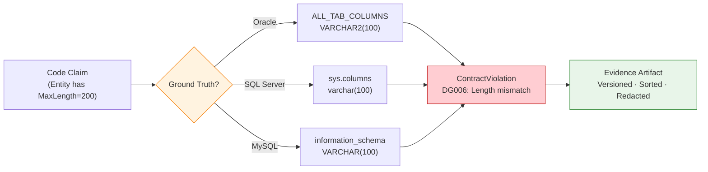
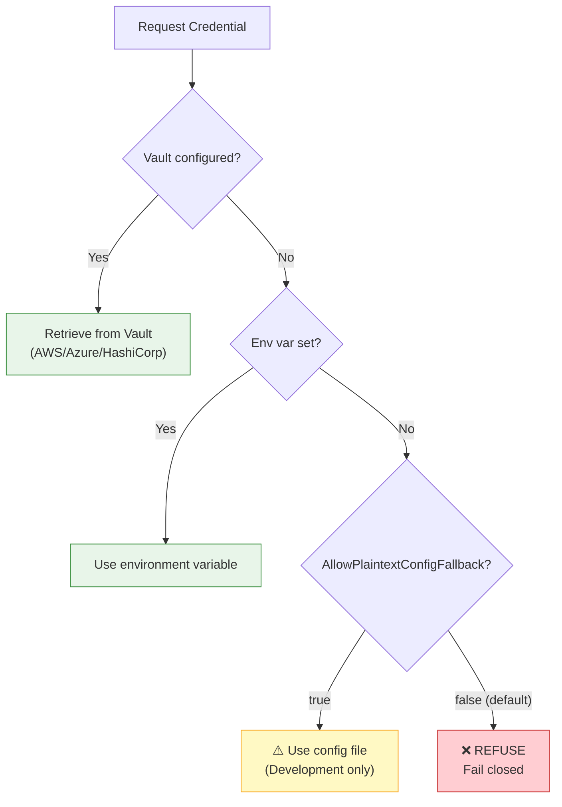
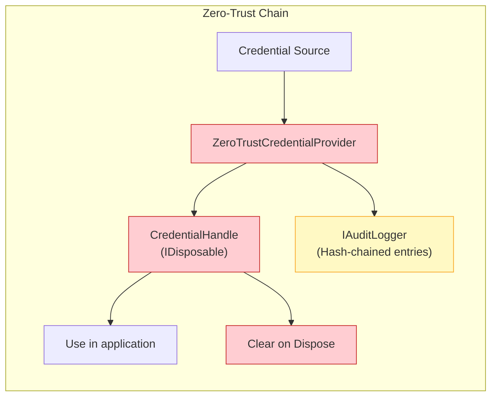
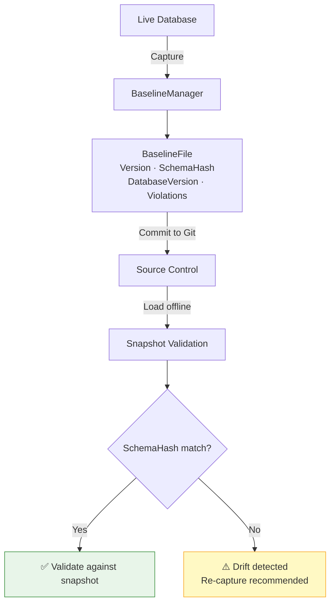
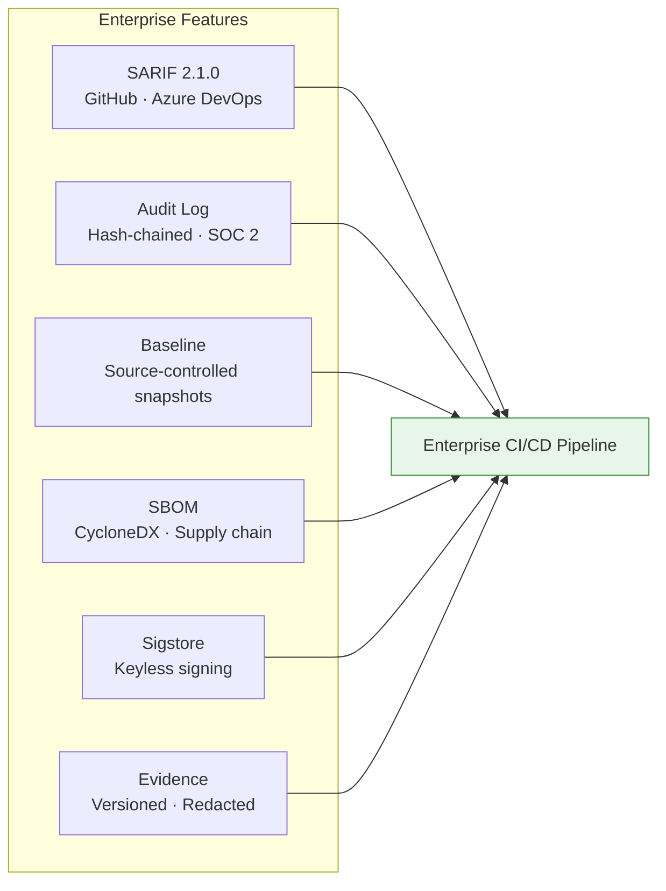
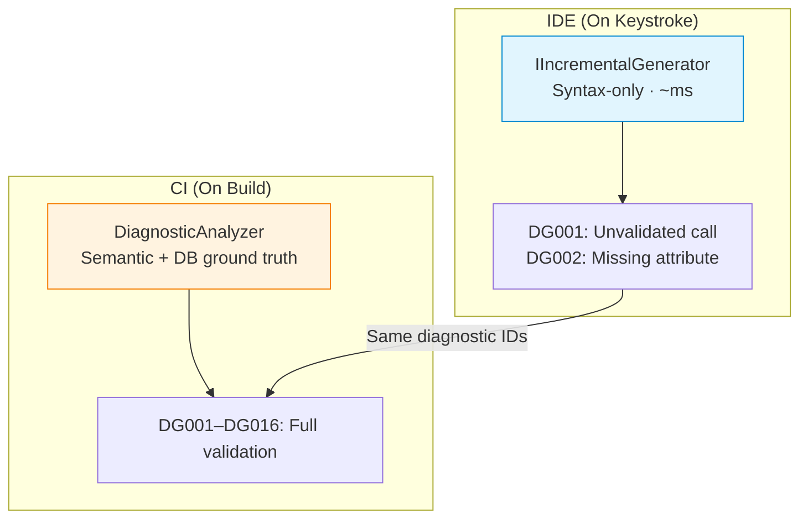
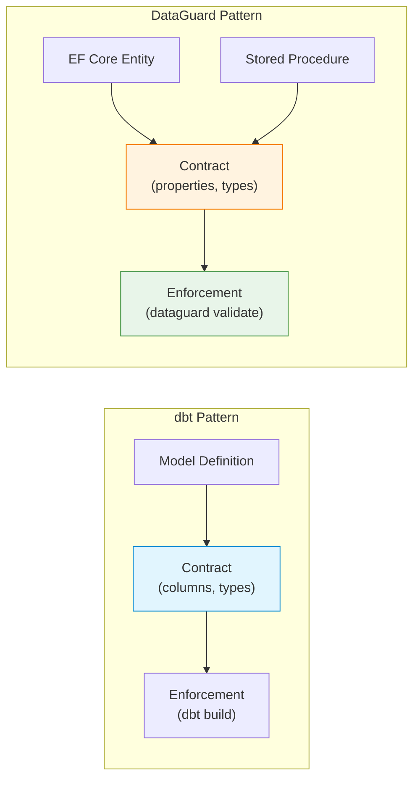
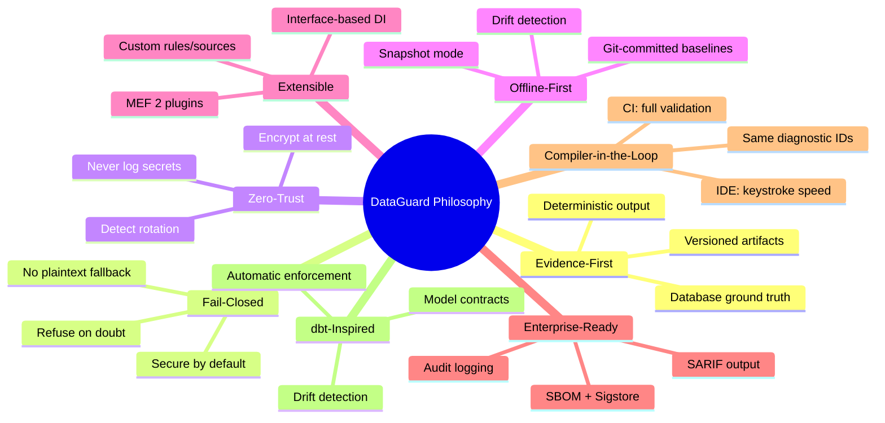

# Design Philosophy

> The principles that shape every line of DataGuard code.

DataGuard is not just a linter — it is a **contract enforcement system** for the boundary between .NET application code and database stored procedures / raw SQL. Every design decision flows from eight core principles.

---

## 1. Evidence-First

> **Every claim must be backed by database ground truth.**

DataGuard never guesses. When it reports that a stored procedure expects 5 parameters but the call site passes 4, that claim is backed by reading `ALL_ARGUMENTS` (Oracle), `sys.parameters` (SQL Server), or `information_schema` (MySQL/PostgreSQL). When it says a column is `VARCHAR2(100)` but the entity maps `MaxLength = 200`, the evidence comes from `ALL_TAB_COLUMNS`.

This principle extends to the output format. The `ContractEvidence` artifact is versioned, sorted, and redacted — a durable, machine-readable record that CI pipelines can gate on.



**In code:**
- `EfModelSource` reads the EF Core `IModel` at runtime or from a design-time `ModelSnapshot.cs`
- `AllArgumentsReader` queries `ALL_ARGUMENTS` with overload/sequence awareness
- `AllTabColumnsReader` queries `ALL_TAB_COLUMNS` including `CHAR_USED` (byte vs char semantics)
- `ContractEvidenceWriter` produces deterministic, sorted JSON with no arbitrary metadata

---

## 2. Fail-Closed

> **When in doubt, deny. Credentials never exposed; plaintext fallback disabled by default.**

The `AllowPlaintextConfigFallback` setting defaults to `false`. This means that if the only connection string available is in a plain `.config` file and no vault is configured, DataGuard refuses to proceed rather than silently downgrading to an insecure credential path.

This is a deliberate departure from "developer convenience" defaults. In production CI/CD pipelines, a silent credential downgrade is a security vulnerability, not a convenience.



**In code:**
- `ZeroTrustCredentialProvider` checks sources in priority order: Vault → Env Var → Config
- `DataGuardConfiguration.AllowPlaintextConfigFallback = false` (default)
- `CredentialHandle` clears its value on `Dispose()` — no lingering secrets in memory

---

## 3. Zero-Trust

> **Never log secrets. Encrypt at rest. Detect rotation.**

Every component that touches credentials follows zero-trust principles:

- **Never log secrets**: `ZeroTrustCredentialProvider` strips credentials from all log output. The `CredentialHandle` wrapper prevents accidental serialization.
- **Encrypt at rest**: `CredentialManager` uses `System.Security.Cryptography.ProtectedData` (DPAPI) for local encryption. Cloud vaults provide their own encryption.
- **Detect rotation**: `CredentialRotationWarningDays` triggers warnings when credentials age beyond the configured threshold.
- **Audit trail**: `FileAuditLogger` writes hash-chained `AuditEntry` records. Each entry includes `PreviousHash` for tamper detection.
- **Redact output**: `ContractEvidenceWriter.Redact()` strips `password=`, `token=`, `Authorization: Bearer` from all evidence artifacts.



---

## 4. Offline-First

> **Snapshot mode needs no database connection.**

DataGuard supports three ground truth modes:

| Mode | Database Required | Use Case |
|------|-------------------|----------|
| **Live** | Yes | CI/CD with database access |
| **Snapshot** | No (pre-captured) | Offline validation, air-gapped environments |
| **Manual** | No (attribute-based) | Early development, no DB yet |

The `BaselineManager` captures a full schema snapshot (tables, columns, data types, nullability) into a JSON file. This snapshot can be committed to source control and used for offline validation. The `SchemaHash` field enables drift detection — if the database schema changes, the snapshot becomes stale.



---

## 5. Extensible

> **MEF plugin architecture for custom rules.**

DataGuard uses MEF 2 (`System.Composition`) for plugin discovery. Custom rules are discovered by scanning assemblies for the `[ExportRule]` attribute. No configuration files, no registration code — just annotate and drop the assembly.

```csharp
[ExportRule(
    "CUSTOM001",
    Name = "Custom Naming Convention",
    Description = "Enforces custom naming convention for specific schemas",
    Category = "Naming",
    DefaultSeverity = "Warning",
    MinDataGuardVersion = "1.0.0",
    Author = "DataGuard Team",
    Tags = new[] { "naming", "custom" })]
public sealed class CustomNamingConventionRule : IContractRule
{
    // Implementation...
}
```

**Extension points:**

| Extension | Interface | Discovery |
|-----------|-----------|-----------|
| Custom rules | `IContractRule` | `[ExportRule]` attribute |
| Contract sources | `IContractSource` | Constructor injection |
| Diagnostic sinks | `ISarifSink` / `IDiagnosticSink` | `AddSarifSink()` / `AddDiagnosticSink()` |
| Credential providers | `ICredentialProvider` | Constructor injection |
| Audit loggers | `IAuditLogger` | Constructor injection |
| External tools | `IExternalToolPlugin` | MEF discovery |

---

## 6. Enterprise-Ready

> **Audit logging, SARIF output, baseline management, SBOM generation.**

DataGuard is designed for enterprise CI/CD pipelines:

- **SARIF 2.1.0 output**: Industry-standard format, natively supported by GitHub Code Scanning, Azure DevOps, and most SAST platforms.
- **Audit logging**: Hash-chained audit entries for compliance (SOC 2, ISO 27001).
- **Baseline management**: Commit baselines to source control for legacy codebase onboarding.
- **SBOM generation**: CycloneDX SBOM via `Microsoft.Sbom.DotNetTool` for supply chain transparency.
- **Sigstore signing**: Keyless OIDC signing of NuGet packages for provenance verification.
- **Evidence artifacts**: Versioned, redacted JSON for CI gate decisions.



---

## 7. Compiler-in-the-Loop

> **Roslyn analyzers catch issues on keystroke.**

DataGuard uses a **dual-layer analyzer architecture**:

| Layer | Technology | Speed | Scope |
|-------|-----------|-------|-------|
| **IDE Light** | `IIncrementalGenerator` | ~ms per keystroke | Syntax-only: unvalidated SQL calls, missing attributes |
| **CI Heavy** | `DiagnosticAnalyzer` | Seconds | Full semantic: database-connected validation |

The IDE layer runs on every keystroke and marks unvalidated SQL calls with squiggly underlines. It uses `IIncrementalGenerator` for zero-allocation, incremental caching — no GC pressure during typing.

The CI layer runs in the build pipeline and performs full contract validation with database ground truth. It uses the same diagnostic IDs as the IDE layer, so warnings seen in the IDE are a subset of CI failures.



---

## 8. dbt-Inspired

> **Model contracts pattern ported to .NET.**

DataGuard borrows the **model contracts** concept from dbt (data build tool). In dbt, you define contracts that specify the shape of your data models — column names, types, nullability. DataGuard applies the same pattern to .NET:

- **Entity contracts**: EF Core entities define the expected shape (properties, types, nullability).
- **Stored procedure contracts**: Database stored procedures define parameters and result sets.
- **Contract enforcement**: DataGuard validates that the two sides match, catching drift before it reaches production.

This is the core insight: **the boundary between application code and database is a contract, and contracts should be enforced automatically.**



---

## Philosophy Summary



---

## See Also

- [System Architecture](system-architecture.md) — How these principles manifest in the architecture
- [Component Model](component-model.md) — Interface contracts and extension points
- [Feature Showcase](../01-overview/feature-showcase.md) — Features enabled by these principles
