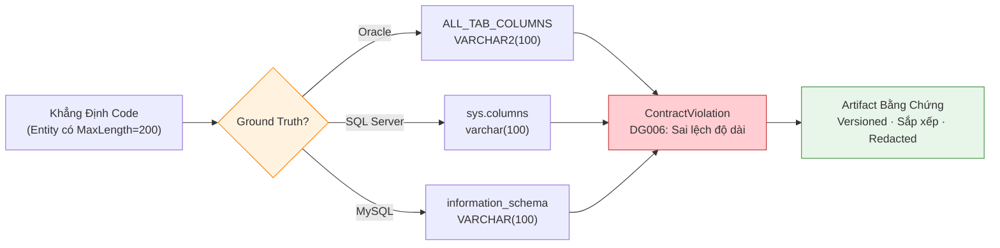
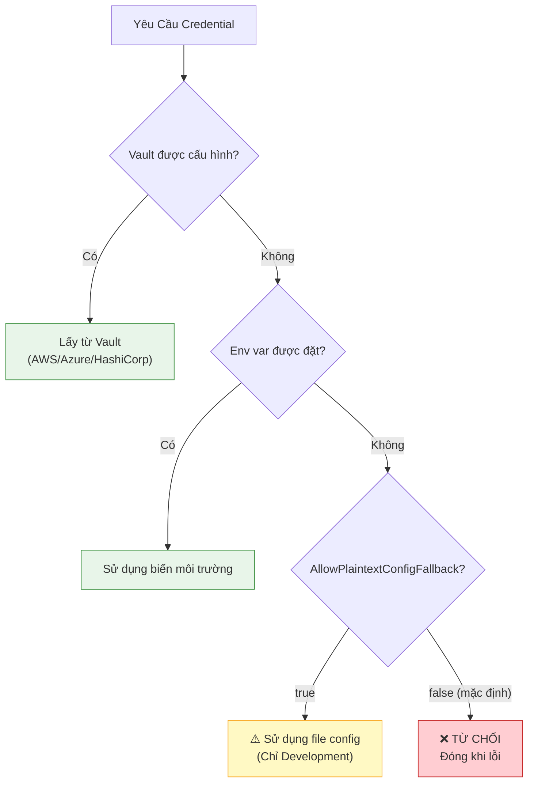
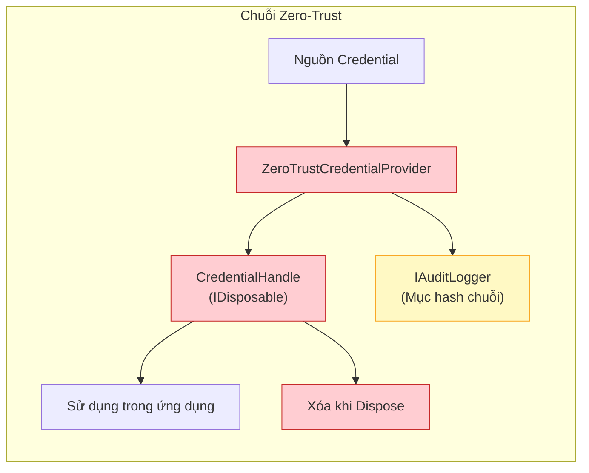
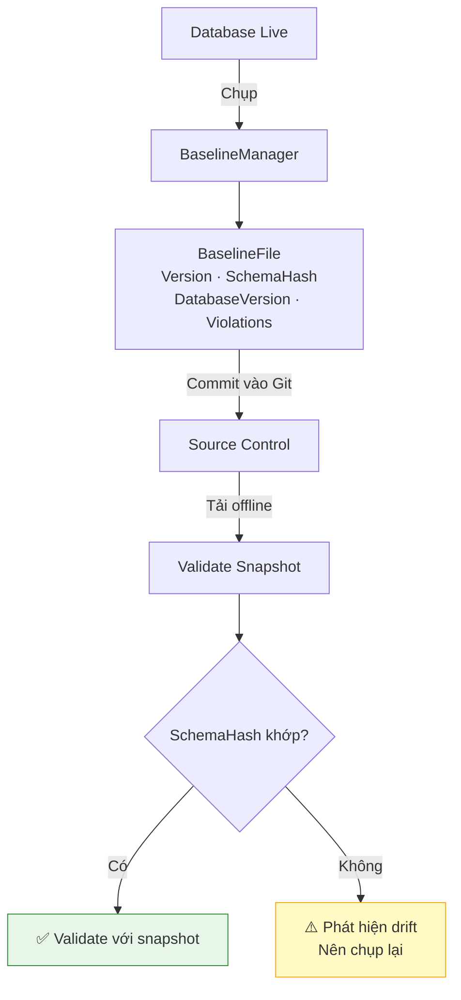
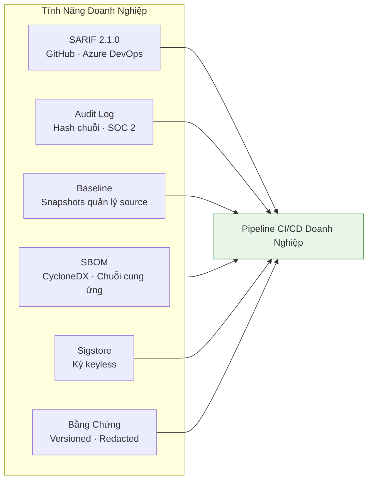
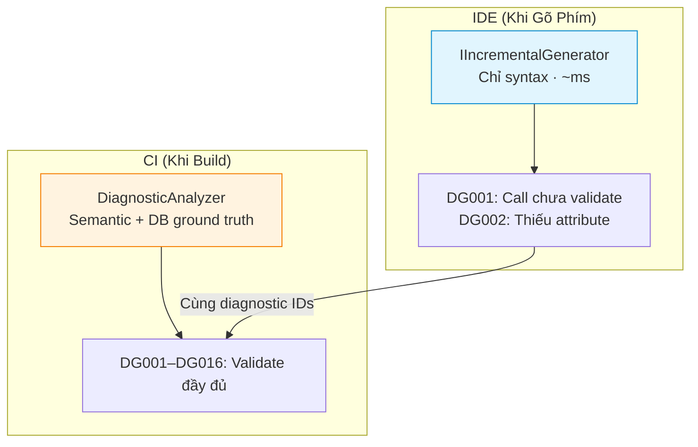
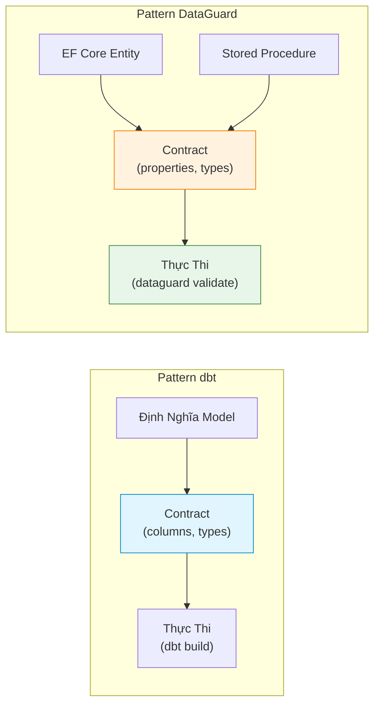
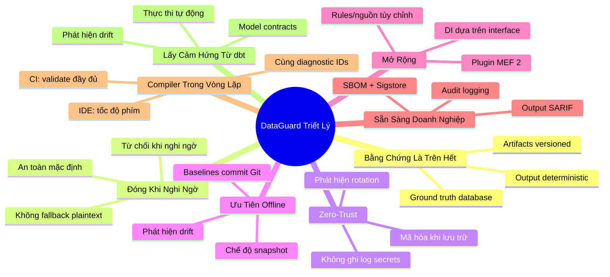

# Triết Lý Thiết Kế

> Các nguyên tắc định hình mọi dòng mã DataGuard.

DataGuard không chỉ là một linter — nó là một **hệ thống thực thi contract** cho ranh giới giữa mã ứng dụng .NET và stored procedures / raw SQL trong database. Mọi quyết định thiết kế đều bắt nguồn từ tám nguyên tắc cốt lõi.

---

## 1. Bằng Chứng Là Trên Hết

> **Mọi khẳng định phải được chứng minh bằng ground truth từ database.**

DataGuard không bao giờ đoán. Khi nó báo cáo rằng một stored procedure mong đợi 5 tham số nhưng call site chỉ truyền 4, khẳng định đó được chứng minh bằng việc đọc `ALL_ARGUMENTS` (Oracle), `sys.parameters` (SQL Server), hoặc `information_schema` (MySQL/PostgreSQL). Khi nó nói một cột là `VARCHAR2(100)` nhưng entity map `MaxLength = 200`, bằng chứng đến từ `ALL_TAB_COLUMNS`.

Nguyên tắc này mở rộng sang định dạng output. Artifact `ContractEvidence` được versioned, sắp xếp và redacted — một bản ghi bền vững, máy có thể đọc được mà pipeline CI có thể dựa vào để ra quyết định.



**Trong mã:**
- `EfModelSource` đọc EF Core `IModel` tại runtime hoặc từ `ModelSnapshot.cs` design-time
- `AllArgumentsReader` truy vấn `ALL_ARGUMENTS` với nhận thức overload/sequence
- `AllTabColumnsReader` truy vấn `ALL_TAB_COLUMNS` bao gồm `CHAR_USED` (byte vs char semantics)
- `ContractEvidenceWriter` tạo JSON deterministic, sắp xếp, không có metadata tùy ý

---

## 2. Đóng Khi Nghi Ngờ

> **Khi không chắc chắn, từ chối. Credentials không bao giờ lộ; fallback plaintext bị tắt mặc định.**

Cài đặt `AllowPlaintextConfigFallback` mặc định là `false`. Điều này có nghĩa là nếu chuỗi kết nối duy nhất có sẵn nằm trong file `.config` plain và không có vault nào được cấu hình, DataGuard từ chối tiến hành thay vì im lặng hạ cấp sang đường dẫn credential không an toàn.

Đây là sự khác biệt có chủ đích so với mặc định "tiện lợi cho developer". Trong pipeline CI/CD production, hạ cấp credential im lặng là lỗ hổng bảo mật, không phải tiện lợi.



**Trong mã:**
- `ZeroTrustCredentialProvider` kiểm tra các nguồn theo thứ tự ưu tiên: Vault → Env Var → Config
- `DataGuardConfiguration.AllowPlaintextConfigFallback = false` (mặc định)
- `CredentialHandle` xóa giá trị khi `Dispose()` — không còn secrets trong bộ nhớ

---

## 3. Zero-Trust

> **Không bao giờ ghi log secrets. Mã hóa khi lưu trữ. Phát hiện rotation.**

Mọi thành phần chạm vào credentials đều tuân theo nguyên tắc zero-trust:

- **Không bao giờ ghi log secrets**: `ZeroTrustCredentialProvider` loại bỏ credentials khỏi tất cả output log. Wrapper `CredentialHandle` ngăn chặn serialize vô ý.
- **Mã hóa khi lưu trữ**: `CredentialManager` dùng `System.Security.Cryptography.ProtectedData` (DPAPI) để mã hóa local. Cloud vaults cung cấp mã hóa riêng.
- **Phát hiện rotation**: `CredentialRotationWarningDays` kích hoạt cảnh báo khi credentials quá hạn cấu hình.
- **Nhật ký audit**: `FileAuditLogger` ghi các bản ghi `AuditEntry` hash chuỗi. Mỗi mục bao gồm `PreviousHash` để phát hiện giả mạo.
- **Redact output**: `ContractEvidenceWriter.Redact()` loại bỏ `password=`, `token=`, `Authorization: Bearer` khỏi tất cả artifacts bằng chứng.



---

## 4. Ưu Tiên Offline

> **Chế độ Snapshot không cần kết nối database.**

DataGuard hỗ trợ ba chế độ ground truth:

| Chế Độ | Cần Database | Trường Hợp Sử Dụng |
|--------|-------------|---------------------|
| **Live** | Có | CI/CD có quyền truy cập database |
| **Snapshot** | Không (đã chụp trước) | Validate offline, môi trường cách ly |
| **Manual** | Không (dựa trên attribute) | Phát triển sớm, chưa có DB |

`BaselineManager` chụp snapshot schema đầy đủ (bảng, cột, kiểu dữ liệu, nullability) vào file JSON. Snapshot này có thể commit vào source control và sử dụng cho validate offline. Trường `SchemaHash` cho phép phát hiện drift — nếu schema database thay đổi, snapshot trở nên cũ.



---

## 5. Mở Rộng

> **Kiến trúc plugin MEF cho rules tùy chỉnh.**

DataGuard sử dụng MEF 2 (`System.Composition`) để khám phá plugin. Rules tùy chỉnh được khám phá bằng cách quét assemblies tìm attribute `[ExportRule]`. Không cần file cấu hình, không cần mã đăng ký — chỉ cần annotate và đặt assembly.

```csharp
[ExportRule(
    "CUSTOM001",
    Name = "Custom Naming Convention",
    Description = "Enforces custom naming convention for specific schemas",
    Category = "Naming",
    DefaultSeverity = "Warning",
    MinDataGuardVersion = "1.0.0",
    Author = "DataGuard Team",
    Tags = new[] { "naming", "custom" })]
public sealed class CustomNamingConventionRule : IContractRule
{
    // Implementation...
}
```

**Các điểm mở rộng:**

| Mở Rộng | Interface | Khám Phá |
|---------|-----------|----------|
| Rules tùy chỉnh | `IContractRule` | Attribute `[ExportRule]` |
| Nguồn contract | `IContractSource` | Injection constructor |
| Đích chẩn đoán | `ISarifSink` / `IDiagnosticSink` | `AddSarifSink()` / `AddDiagnosticSink()` |
| Credential providers | `ICredentialProvider` | Injection constructor |
| Audit loggers | `IAuditLogger` | Injection constructor |
| Công cụ bên ngoài | `IExternalToolPlugin` | Khám phá MEF |

---

## 6. Sẵn Sàng Cho Doanh Nghiệp

> **Audit logging, output SARIF, quản lý baseline, tạo SBOM.**

DataGuard được thiết kế cho pipeline CI/CD doanh nghiệp:

- **Output SARIF 2.1.0**: Định dạng tiêu chuẩn ngành, được hỗ trợ native bởi GitHub Code Scanning, Azure DevOps và hầu hết các nền tảng SAST.
- **Audit logging**: Các mục audit hash chuỗi cho tuân thủ (SOC 2, ISO 27001).
- **Quản lý baseline**: Commit baselines vào source control cho onboard codebase cũ.
- **Tạo SBOM**: SBOM CycloneDX qua `Microsoft.Sbom.DotNetTool` cho minh bạch chuỗi cung ứng.
- **Ký Sigstore**: Ký keyless OIDC các gói NuGet để xác minh nguồn gốc.
- **Artifacts bằng chứng**: JSON versioned, redacted cho quyết định cổng CI.



---

## 7. Compiler Trong Vòng Lặp

> **Roslyn analyzers bắt vấn đề trên từng phím.**

DataGuard sử dụng **kiến trúc analyzer tầng kép**:

| Tầng | Công Nghệ | Tốc Độ | Phạm Vi |
|------|-----------|--------|---------|
| **IDE Nhẹ** | `IIncrementalGenerator` | ~ms mỗi phím | Chỉ syntax: calls SQL chưa validate, attributes thiếu |
| **CI Nặng** | `DiagnosticAnalyzer` | Giây | Semantic đầy đủ: validate kết nối database |

Tầng IDE chạy trên từng phím và đánh dấu các calls SQL chưa validate bằng gạch chân sóng. Nó dùng `IIncrementalGenerator` cho zero-allocation, caching tăng dần — không có áp lực GC khi gõ.

Tầng CI chạy trong pipeline build và thực hiện validate contract đầy đủ với ground truth database. Nó dùng cùng diagnostic IDs với tầng IDE, nên warnings thấy trong IDE là tập con của failures CI.



---

## 8. Lấy Cảm Hứng Từ dbt

> **Pattern model contracts được port sang .NET.**

DataGuard mượn khái niệm **model contracts** từ dbt (data build tool). Trong dbt, bạn định nghĩa contracts chỉ định hình dạng của data models — tên cột, kiểu, nullability. DataGuard áp dụng cùng pattern cho .NET:

- **Entity contracts**: EF Core entities định nghĩa hình dạng mong đợi (properties, types, nullability).
- **Stored procedure contracts**: Database stored procedures định nghĩa tham số và result sets.
- **Thực thi contract**: DataGuard validate rằng hai bên khớp, bắt drift trước khi đến production.

Đây là insight cốt lõi: **ranh giới giữa mã ứng dụng và database là một contract, và contracts nên được thực thi tự động.**



---

## Tóm Tắt Triết Lý



---

## Xem Thêm

- [Kiến Trúc Hệ Thống](system-architecture.vi.md) — Cách các nguyên tắc này thể hiện trong kiến trúc
- [Mô Hình Thành Phần](component-model.vi.md) — Contracts interface và điểm mở rộng
- [Giới Thiệu Tính Năng](../01-overview/feature-showcase.vi.md) — Các tính năng mà các nguyên tắc này tạo điều kiện
