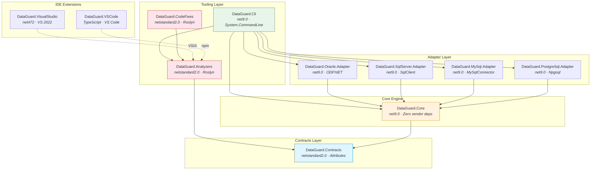
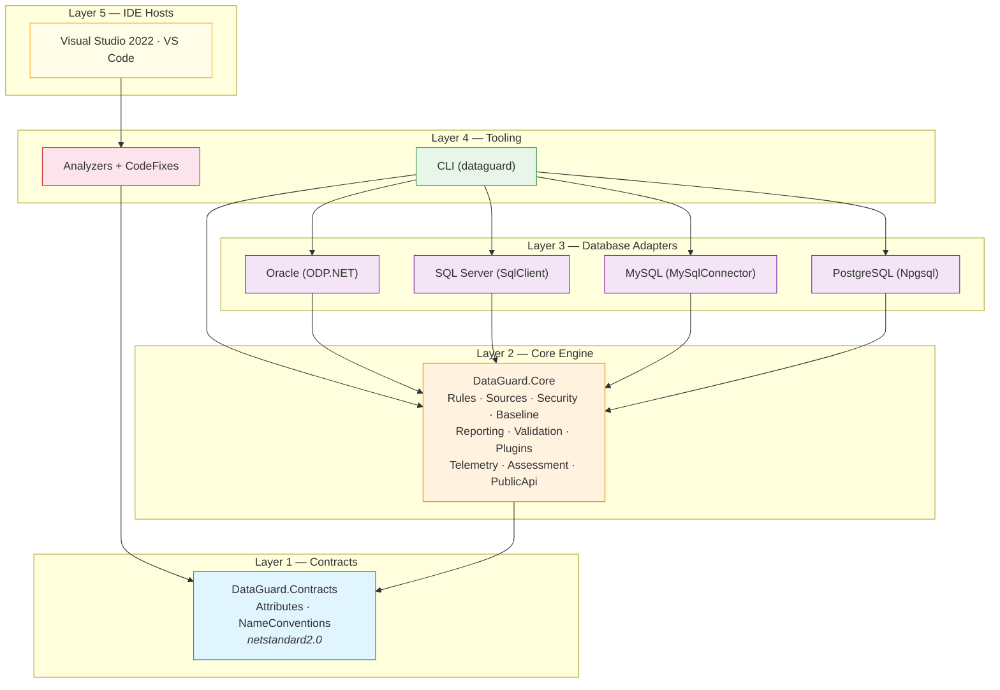
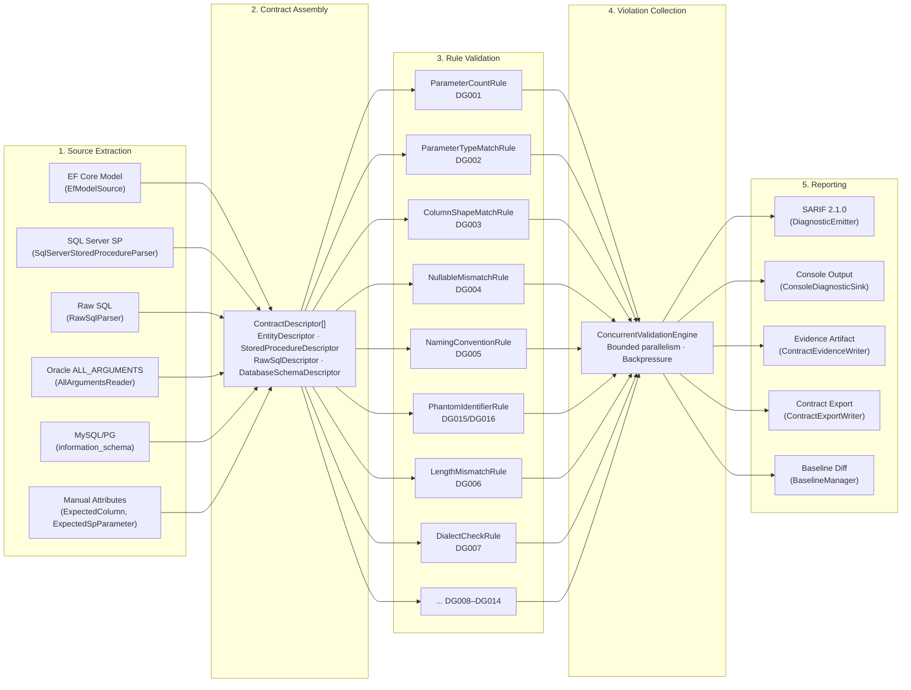
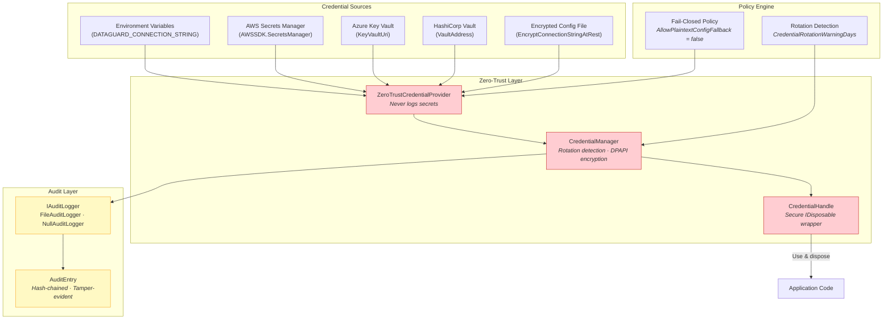
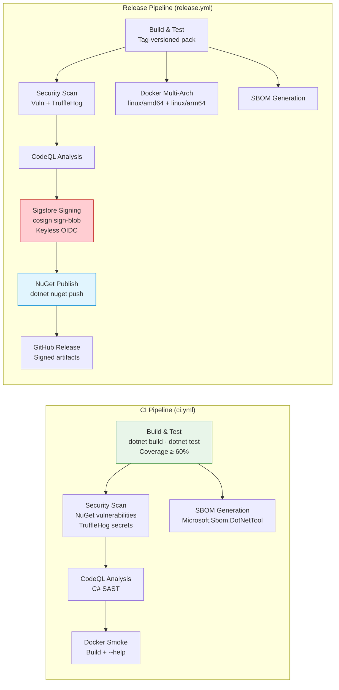
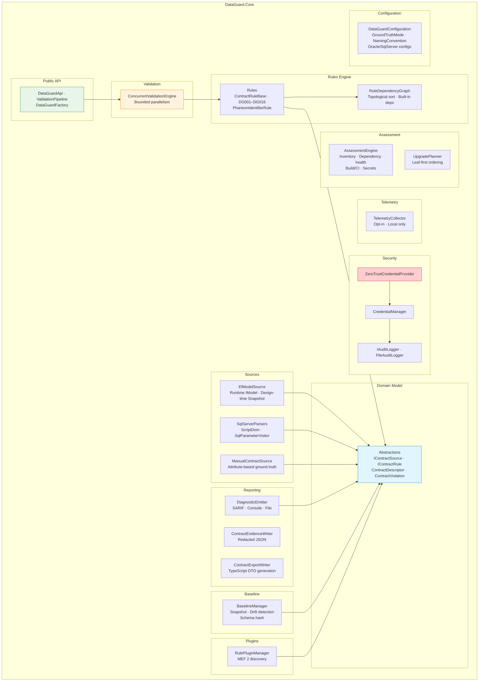

# System Architecture

> **DataGuard** — .NET 9 contract validation engine for Entity ↔ Stored Procedure / Raw SQL.

This document describes the full system architecture of DataGuard, including component topology, layer design, data flow, security architecture, and CI/CD pipeline.

---

## 1. High-Level Component Topology

DataGuard consists of **11 source projects** organized in a strict layered architecture. The Contracts layer targets `netstandard2.0` for maximum IDE compatibility; the Core engine and adapters target `net9.0`; IDE extensions target their respective host frameworks.

---

## 2. Layer Architecture

DataGuard follows a strict **bottom-up dependency model**. Each layer only depends on layers below it — never sideways or upward.

### Layer Responsibilities

| Layer | Target | Responsibility |
|-------|--------|---------------|
| **L1 — Contracts** | `netstandard2.0` | Shared attributes (`SkipContractCheck`, `ExpectedColumn`, `ExpectedSpParameter`), naming conventions (`snake_case` ↔ `PascalCase`). Zero runtime dependencies. |
| **L2 — Core Engine** | `net9.0` | Domain model (`Contracts.cs`), rules engine (DG001–DG016), contract sources (EF Core, SQL parsers), zero-trust security, baseline management, SARIF reporting, concurrent validation, MEF plugin system, telemetry, assessment engine, public API surface. |
| **L3 — Adapters** | `net9.0` | Database-specific readers. Oracle reads `ALL_ARGUMENTS`/`ALL_TAB_COLUMNS`. SQL Server uses `ScriptDom` + `SqlConnection`. MySQL/PostgreSQL use information_schema. Each adapter implements `IContractSource`. |
| **L4 — Tooling** | mixed | CLI (`System.CommandLine`), Roslyn analyzers (IDE light + CI heavy layers), code fix providers. |
| **L5 — IDE Hosts** | mixed | VS 2022 extension (VSIX, `net472`), VS Code extension (TypeScript, npm). |

---

## 3. Data Flow: Source Extraction → Rule Validation → Reporting

The validation pipeline follows a linear data flow with concurrent rule execution.

### Pipeline Stages

1. **Source Extraction** — Each `IContractSource` implementation connects to its data source (database, EF model, code attributes) and produces `ContractDescriptor` records. Sources run independently and can be parallelized.

2. **Contract Assembly** — Descriptors are collected into a unified `IReadOnlyList<ContractDescriptor>`. The assembly includes entity shapes, stored procedure parameters, result set columns, and database schema ground truth.

3. **Rule Validation** — The `ConcurrentValidationEngine` runs all registered `IContractRule` implementations against all contracts. Rules are executed with bounded parallelism (`MaxDegreeOfParallelism`) and backpressure (max 100K violations).

4. **Violation Collection** — Violations are collected in a `ConcurrentBag<ContractViolation>`, deduplicated, and sorted by `RuleId` then `Message`.

5. **Reporting** — The `DiagnosticEmitter` fans out violations to multiple sinks: SARIF files, console, evidence artifacts, contract exports, and baseline diffs.

---

## 4. Security Architecture: Zero-Trust Credential Chain

DataGuard implements a **zero-trust** security model. Credentials are never logged, never serialized in plain text, and are encrypted at rest when configured.

### Security Principles

| Principle | Implementation |
|-----------|---------------|
| **Never log secrets** | `ZeroTrustCredentialProvider` strips credentials from all log output. `CredentialHandle` clears its value on `Dispose()`. |
| **Encrypt at rest** | `CredentialManager` uses `System.Security.Cryptography.ProtectedData` (DPAPI) for local encryption. AWS/Azure/Vault provide cloud-native encryption. |
| **Detect rotation** | `CredentialRotationWarningDays` triggers warnings when credentials age beyond threshold. |
| **Fail-closed** | `AllowPlaintextConfigFallback = false` (default) prevents silent credential downgrade to plain config files. |
| **Audit trail** | `FileAuditLogger` writes hash-chained `AuditEntry` records. Each entry includes `PreviousHash` for tamper detection. |
| **Redact output** | `ContractEvidenceWriter.Redact()` strips `password=`, `token=`, `Authorization: Bearer` from all evidence artifacts. |

---

## 5. CI/CD Pipeline Architecture

DataGuard uses GitHub Actions with a **defense-in-depth** pipeline: build → test → security scan → CodeQL → sign → publish.

### Pipeline Stages

| Stage | Tool | Purpose |
|-------|------|---------|
| **Build** | `dotnet build --configuration Release` | Compile all 11 projects with `TreatWarningsAsErrors` |
| **Test** | `dotnet test` + XPlat Code Coverage | 291+ tests, 60% coverage gate |
| **Format Gate** | `dotnet format --verify-no-changes` | Enforce consistent code style |
| **Vulnerability Scan** | `dotnet list package --vulnerable` | Fail on any vulnerable NuGet package |
| **Secret Scan** | TruffleHog v3.97.0 | Verified secrets only, exclude build artifacts |
| **SAST** | CodeQL v4.37.7 | C# security analysis |
| **Signing** | Sigstore cosign v3.1.3 | Keyless OIDC signing with bundle output |
| **SBOM** | Microsoft.Sbom.DotNetTool v4.1.5 | CycloneDX SBOM for supply chain transparency |
| **Docker** | Multi-arch build | `linux/amd64` + `linux/arm64` via BuildKit |

---

## 6. Internal Module Architecture

The Core engine is organized into **12 internal modules**, each with a single responsibility.

---

## 7. Extension Points

DataGuard is designed for extensibility at every layer:

| Extension Point | Mechanism | Use Case |
|----------------|-----------|----------|
| **Custom Rules** | MEF 2 `[ExportRule]` attribute | Add domain-specific validation rules |
| **Contract Sources** | `IContractSource` interface | Add new data sources (e.g., Dapper queries) |
| **Diagnostic Sinks** | `ISarifSink` / `IDiagnosticSink` | Custom output formats (SonarQube, GitHub) |
| **Credential Providers** | `ICredentialProvider` interface | Custom secret management backends |
| **Audit Loggers** | `IAuditLogger` interface | Custom audit destinations (SIEM, database) |
| **External Tools** | `IExternalToolPlugin` interface | Integrate third-party linters |
| **Naming Conventions** | `NamingConvention` enum | Custom DB↔C# mapping strategies |

---

## 8. Technology Decisions

| Decision | Choice | Rationale |
|----------|--------|-----------|
| Target framework | `net9.0` | Latest LTS-adjacent, performance improvements, `Parallel.ForEachAsync` |
| Contracts target | `netstandard2.0` | Maximum IDE host compatibility (VS, VS Code, Roslyn) |
| SQL parsing | `ScriptDom` | Official Microsoft T-SQL parser, AST-level analysis |
| Oracle access | `ODP.NET Managed` | `ALL_ARGUMENTS`/`ALL_TAB_COLUMNS` for ground truth |
| Analyzer model | Dual-layer | IDE: `IIncrementalGenerator` (syntax-only, ~ms). CI: `DiagnosticAnalyzer` (full semantic) |
| Plugin system | MEF 2 (`System.Composition`) | Assembly-level discovery, no runtime configuration |
| Output format | SARIF 2.1.0 | Industry standard, GitHub Code Scanning native |
| Signing | Sigstore cosign | Keyless, OIDC-based, no secret management |
| Container | Multi-arch Docker | `linux/amd64` + `linux/arm64` via BuildKit |

---

## See Also

- [Design Philosophy](design-philosophy.md) — Principles behind these decisions
- [Component Model](component-model.md) — Detailed component responsibilities and interfaces
- [Technology Stack](tech-stack.md) — Full dependency evaluation
- [Data Flow Diagrams](../04-diagrams/data-flow.md) — Detailed flow visualizations
- [Sequence Diagrams](../04-diagrams/sequence-diagrams.md) — Interaction sequences
