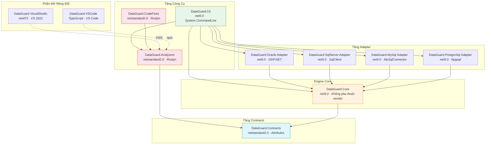
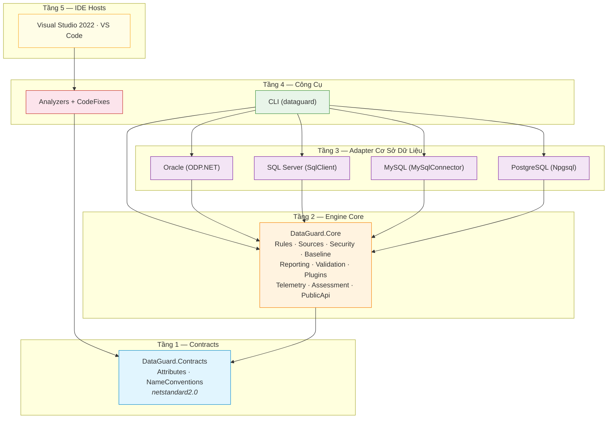
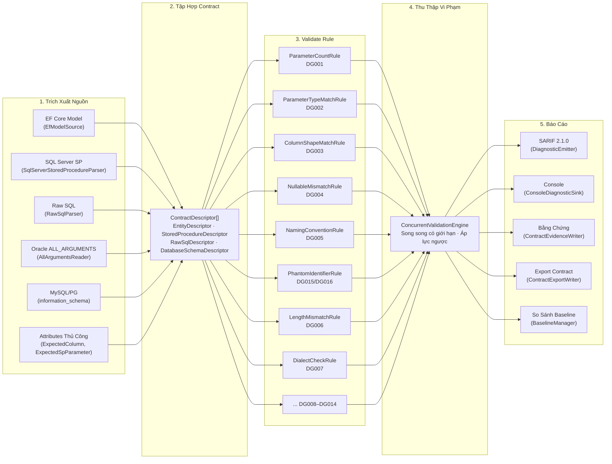
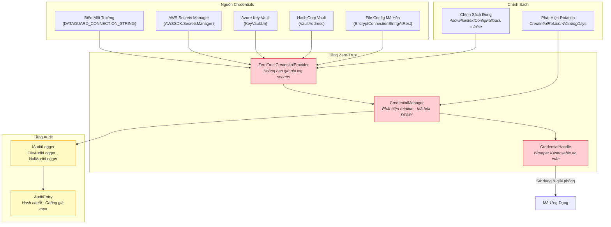
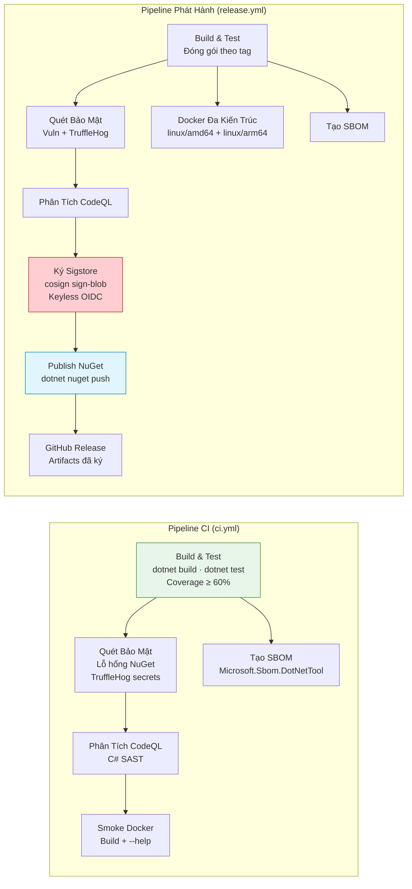
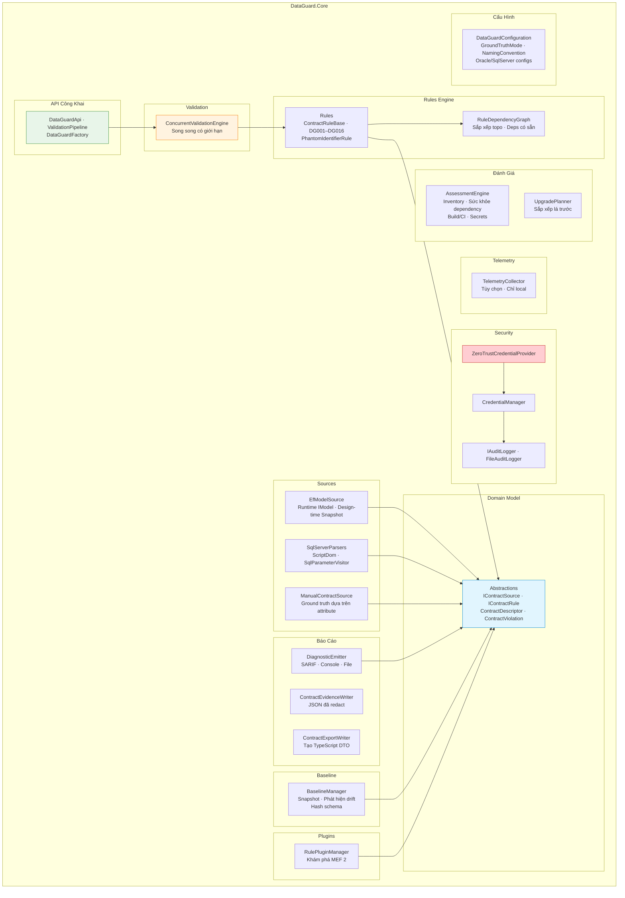

# Kiến Trúc Hệ Thống

> **DataGuard** — Công cụ .NET 9 validate contract giữa Entity ↔ Stored Procedure / Raw SQL.

Tài liệu này mô tả kiến trúc hệ thống đầy đủ của DataGuard, bao gồm topology thành phần, thiết kế tầng, luồng dữ liệu, kiến trúc bảo mật và pipeline CI/CD.

---

## 1. Topology Thành Phẩm Cao Cấp

DataGuard bao gồm **11 dự án nguồn** được tổ chức theo kiến trúc tầng nghiêm ngặt. Tầng Contracts nhắm `netstandard2.0` để tương thích IDE tối đa; engine Core và adapters nhắm `net9.0`; phần mở rộng IDE nhắm framework đặc thù của từng host.

---

## 2. Kiến Trúc Tầng

DataGuard tuân theo **mô hình phụ thuộc đi lên từ dưới**. Mỗi tầng chỉ phụ thuộc vào các tầng bên dưới — không bao giờ phụ thuộc ngang hoặc đi lên.

### Trách Nhiệm Tầng

| Tầng | Target | Trách Nhiệm |
|-------|--------|-------------|
| **L1 — Contracts** | `netstandard2.0` | Attributes chia sẻ (`SkipContractCheck`, `ExpectedColumn`, `ExpectedSpParameter`), quy ước đặt tên (`snake_case` ↔ `PascalCase`). Không phụ thuộc runtime. |
| **L2 — Core Engine** | `net9.0` | Domain model (`Contracts.cs`), rules engine (DG001–DG016), nguồn contract (EF Core, SQL parsers), bảo mật zero-trust, quản lý baseline, báo cáo SARIF, validation đồng thời, hệ thống plugin MEF, telemetry, engine đánh giá, API công khai. |
| **L3 — Adapters** | `net9.0` | Readers đặc thù database. Oracle đọc `ALL_ARGUMENTS`/`ALL_TAB_COLUMNS`. SQL Server dùng `ScriptDom` + `SqlConnection`. MySQL/PostgreSQL dùng information_schema. Mỗi adapter triển khai `IContractSource`. |
| **L4 — Công Cụ** | mixed | CLI (`System.CommandLine`), Roslyn analyzers (tầng IDE nhẹ + tầng CI nặng), code fix providers. |
| **L5 — IDE Hosts** | mixed | VS 2022 extension (VSIX, `net472`), VS Code extension (TypeScript, npm). |

---

## 3. Luồng Dữ Liệu: Trích Xuất Nguồn → Validate Rule → Báo Cáo

Pipeline validation theo luồng dữ liệu tuyến tính với thực thi rule đồng thời.

### Các Giai Đoạn Pipeline

1. **Trích Xuất Nguồn** — Mỗi triển khai `IContractSource` kết nối với nguồn dữ liệu (database, model EF, attributes code) và tạo ra các bản ghi `ContractDescriptor`. Các nguồn chạy độc lập và có thể song song hóa.

2. **Tập Hợp Contract** — Các descriptor được thu thập vào `IReadOnlyList<ContractDescriptor>` thống nhất. Bao gồm hình dạng entity, tham số stored procedure, cột result set và schema database ground truth.

3. **Validate Rule** — `ConcurrentValidationEngine` chạy tất cả các triển khai `IContractRule` đã đăng ký trên tất cả contracts. Rules được thực thi với song song có giới hạn (`MaxDegreeOfParallelism`) và áp lực ngược (tối đa 100K vi phạm).

4. **Thu Thập Vi Phạm** — Vi phạm được thu thập trong `ConcurrentBag<ContractViolation>`, loại bỏ trùng lặp và sắp xếp theo `RuleId` rồi `Message`.

5. **Báo Cáo** — `DiagnosticEmitter` phân phối vi phạm đến nhiều đích: file SARIF, console, artifacts bằng chứng, export contract và so sánh baseline.

---

## 4. Kiến Trúc Bảo Mật: Chuỗi Credential Zero-Trust

DataGuard triển khai mô hình bảo mật **zero-trust**. Credentials không bao giờ được ghi log, không bao giờ được serialize dạng plain text và được mã hóa khi lưu trữ khi được cấu hình.

### Nguyên Tắc Bảo Mật

| Nguyên Tắc | Triển Khai |
|------------|-----------|
| **Không bao giờ ghi log secrets** | `ZeroTrustCredentialProvider` loại bỏ credentials khỏi tất cả output log. `CredentialHandle` xóa giá trị khi `Dispose()`. |
| **Mã hóa khi lưu trữ** | `CredentialManager` dùng `System.Security.Cryptography.ProtectedData` (DPAPI) để mã hóa local. AWS/Azure/Vault cung cấp mã hóa cloud-native. |
| **Phát hiện rotation** | `CredentialRotationWarningDays` kích hoạt cảnh báo khi credentials quá hạn. |
| **Đóng khi lỗi** | `AllowPlaintextConfigFallback = false` (mặc định) ngăn chặn hạ cấp credential im lặng sang file config plain. |
| **Nhật ký audit** | `FileAuditLogger` ghi các bản ghi `AuditEntry` hash chuỗi. Mỗi mục bao gồm `PreviousHash` để phát hiện giả mạo. |
| **Redact output** | `ContractEvidenceWriter.Redact()` loại bỏ `password=`, `token=`, `Authorization: Bearer` khỏi tất cả artifacts bằng chứng. |

---

## 5. Kiến Trúc Pipeline CI/CD

DataGuard sử dụng GitHub Actions với pipeline **phòng thủ nhiều lớp**: build → test → security scan → CodeQL → ký → publish.

### Các Giai Đoạn Pipeline

| Giai Đoạn | Công Cụ | Mục Đích |
|-----------|---------|---------|
| **Build** | `dotnet build --configuration Release` | Biên dịch tất cả 11 dự án với `TreatWarningsAsErrors` |
| **Test** | `dotnet test` + XPlat Code Coverage | 291+ tests, cổng coverage 60% |
| **Format Gate** | `dotnet format --verify-no-changes` | Ép buộc kiểu code nhất quán |
| **Quét Lỗ Hổng** | `dotnet list package --vulnerable` | Thất bại trên bất kỳ gói NuGet có lỗ hổng |
| **Quét Secret** | TruffleHog v3.97.0 | Chỉ secrets đã xác minh, loại trừ artifacts build |
| **SAST** | CodeQL v4.37.7 | Phân tích bảo mật C# |
| **Ký** | Sigstore cosign v3.1.3 | Ký keyless OIDC với output bundle |
| **SBOM** | Microsoft.Sbom.DotNetTool v4.1.5 | SBOM CycloneDX cho minh bạch chuỗi cung ứng |
| **Docker** | Build đa kiến trúc | `linux/amd64` + `linux/arm64` qua BuildKit |

---

## 6. Kiến Trúc Module Nội Bộ

Engine Core được tổ chức thành **12 module nội bộ**, mỗi module có một trách nhiệm duy nhất.

---

## 7. Điểm Mở Rộng

DataGuard được thiết kế để mở rộng ở mọi tầng:

| Điểm Mở Rộng | Cơ Chế | Trường Hợp Sử Dụng |
|---------------|--------|---------------------|
| **Rules Tùy Chỉnh** | Attribute MEF 2 `[ExportRule]` | Thêm rules validation đặc thù domain |
| **Nguồn Contract** | Interface `IContractSource` | Thêm nguồn dữ liệu mới (ví dụ: queries Dapper) |
| **Đích Chẩn Đoán** | `ISarifSink` / `IDiagnosticSink` | Định dạng output tùy chỉnh (SonarQube, GitHub) |
| **Credential Providers** | Interface `ICredentialProvider` | Backend quản lý secret tùy chỉnh |
| **Audit Loggers** | Interface `IAuditLogger` | Đích audit tùy chỉnh (SIEM, database) |
| **Công Cụ Bên Ngoài** | Interface `IExternalToolPlugin` | Tích hợp linters bên thứ ba |
| **Quy Ước Đặt Tên** | Enum `NamingConvention` | Chiến lược mapping DB↔C# tùy chỉnh |

---

## 8. Quyết Định Công Nghệ

| Quyết Định | Lựa Chọn | Lý Do |
|------------|---------|-------|
| Target framework | `net9.0` | Gần LTS mới nhất, cải thiện hiệu suất, `Parallel.ForEachAsync` |
| Contracts target | `netstandard2.0` | Tương thích IDE host tối đa (VS, VS Code, Roslyn) |
| Parse SQL | `ScriptDom` | Parser T-SQL chính thức của Microsoft, phân tích cấp AST |
| Truy cập Oracle | `ODP.NET Managed` | `ALL_ARGUMENTS`/`ALL_TAB_COLUMNS` cho ground truth |
| Mô hình analyzer | Tầng kép | IDE: `IIncrementalGenerator` (chỉ syntax, ~ms). CI: `DiagnosticAnalyzer` (semantic đầy đủ) |
| Hệ thống plugin | MEF 2 (`System.Composition`) | Khám phá cấp assembly, không cần cấu hình runtime |
| Định dạng output | SARIF 2.1.0 | Tiêu chuẩn ngành, GitHub Code Scanning native |
| Ký | Sigstore cosign | Keyless, dựa trên OIDC, không cần quản lý secret |
| Container | Docker đa kiến trúc | `linux/amd64` + `linux/arm64` qua BuildKit |

---

## Xem Thêm

- [Triết Lý Thiết Kế](design-philosophy.md) — Nguyên tắc đằng sau các quyết định này
- [Mô Hình Thành Phần](component-model.md) — Trách nhiệm và interface chi tiết
- [Stack Công Nghệ](tech-stack.md) — Đánh giá đầy đủ các phụ thuộc
- [Sơ Đồ Luồng Dữ Liệu](../04-diagrams/data-flow.md) — Trực quan hóa luồng chi tiết
- [Sơ Đồ Tuần Tự](../04-diagrams/sequence-diagrams.md) — Các chuỗi tương tác
