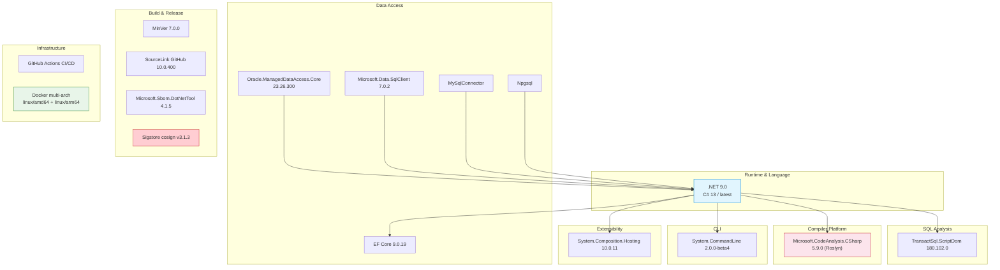
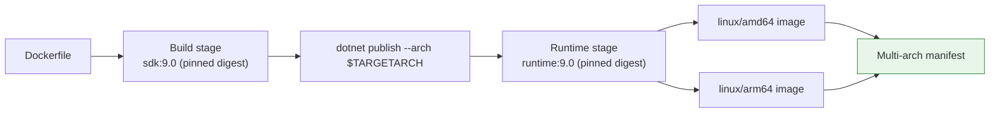

# Technology Stack

> Every dependency in DataGuard, why it was chosen, and what it does.

This document evaluates the complete technology stack of DataGuard: runtime, frameworks, libraries, tooling, and infrastructure. Versions are pinned in `Directory.Build.props` and per-project `.csproj` files with lock files (`packages.lock.json`) restored in `--locked-mode` for reproducible builds.

---

## Stack Overview

---

## 1. Runtime: .NET 9.0 + C# 13 (`LangVersion=latest`)

**Where:** All engine projects (`Core`, `Cli`, adapters).

**Why chosen:**
- `Parallel.ForEachAsync` — the backbone of `ConcurrentValidationEngine`'s bounded parallelism.
- `System.Diagnostics.Metrics` — modern native metrics API powering `TelemetryCollector`.
- Records, pattern matching, and nullable reference types across the domain model.
- Current STS release; the assessment engine's `LegacySupportTable` tracks which TFMs DataGuard itself recommends to consumers.

**Trade-offs:** .NET 9 is an STS (18-month support) release, not LTS. The Contracts/Analyzers/CodeFixes projects deliberately target `netstandard2.0` so IDE-hosted components are decoupled from the engine runtime choice.

---

## 2. Entity Framework Core 9.0.19

**Where:** `DataGuard.Core` (`EfModelSource`).

**Why chosen:**
- `IModel` is the authoritative, fully-compiled representation of the EF model: column names, CLR↔store types, nullability, max lengths, keys.
- Design-time `ModelSnapshot.cs` parsing allows contract extraction without booting the app or a database.
- Relational metadata APIs expose annotations needed by length/nullability rules.

**Evaluation:** EF Core is used read-only — DataGuard never registers providers or opens connections through it. This keeps vendor drivers out of the Core dependency graph.

---

## 3. Database Providers

| Provider | Package | Version | Ground-Truth Source |
|----------|---------|---------|---------------------|
| Oracle | `Oracle.ManagedDataAccess.Core` | 23.26.300 | `ALL_ARGUMENTS`, `ALL_TAB_COLUMNS`, `NLS_SESSION_PARAMETERS`, `DBMS_SQL` describe |
| SQL Server | `Microsoft.Data.SqlClient` | 7.0.2 | Catalog views + ScriptDom AST |
| MySQL | `MySqlConnector` | latest stable | `information_schema.parameters`, `information_schema.columns` |
| PostgreSQL | `Npgsql` | latest stable | System catalogs / information_schema routines |

**Design decision:** Each provider lives in its **own adapter project**. `DataGuard.Core` has zero vendor driver dependencies; the CLI composition root references all four. Consumers embedding only one database stack take only that adapter.

**Oracle licensing note:** `Oracle.ManagedDataAccess.Core` ships under the Oracle Distribution License, not MIT — documented in the adapter csproj description so consumers make informed choices.

### Oracle specifics

The Oracle adapter is the deepest integration because Oracle semantics are the most treacherous:

- **Overload handling** — `ALL_ARGUMENTS` carries `OVERLOAD#` and `SEQUENCE`; the reader composes unique parameter keys for overloaded PL/SQL procedures.
- **Byte vs char semantics** — `ALL_TAB_COLUMNS.CHAR_USED` distinguishes `VARCHAR2(100 BYTE)` from `VARCHAR2(100 CHAR)`; length rules honor this instead of comparing raw numbers.
- **REF CURSOR discovery** — implicit result sets are described via `DBMS_SQL.DESCRIBE_COLUMNS`, turning an opaque `SYS_REFCURSOR` into concrete column descriptors.

---

## 4. Microsoft.SqlServer.TransactSql.ScriptDom 180.102.0

**Where:** `DataGuard.Core/Sources/SqlServerParsers.cs`.

**Why chosen:**
- Official Microsoft T-SQL parser producing a full AST (`TSqlFragment` tree) — not regex scraping.
- `TSqlFragmentVisitor` pattern lets `SqlParameterVisitor` extract parameters precisely.
- Robust against dialect variants that break naive parsers (CTEs, table hints, `MERGE`).

**Evaluation:** Version 180.x tracks current SQL Server syntax. The visitor approach means raw-SQL analysis inherits Microsoft's grammar maintenance rather than a homegrown parser.

---

## 5. Roslyn (Microsoft.CodeAnalysis.CSharp 5.9.0)

**Where:** `DataGuard.Analyzers` (+ Workspaces in `CodeFixes`), `DataGuard.Core` (call-site analysis).

**Why chosen:**
- `IIncrementalGenerator` gives keystroke-speed IDE analysis with incremental caching and value-type intermediate models (`SqlCallSite` struct) for near-zero allocation.
- `DiagnosticAnalyzer` powers the CI heavy layer with full semantic model access.
- Shared `DiagnosticDescriptors` guarantee IDE squiggles and CI failures use identical IDs.

**Packaging subtleties handled:**
- Analyzer assemblies target `netstandard2.0` so they load in csc/VB hosts and Visual Studio alike.
- Because compilers don't resolve NuGet deps of analyzer assemblies, `DataGuard.Contracts.dll` is explicitly packed into `analyzers/dotnet/cs`, `generators/dotnet/cs`, and `codefixes/dotnet/cs`.
- `EnforceExtendedAnalyzerRules=true` keeps the project inside Roslyn analyzer API constraints.

---

## 6. System.CommandLine 2.0.0-beta4

**Where:** `DataGuard.Cli/Program.cs`.

**Why chosen:**
- Composable command/root/symbol model maps cleanly onto DataGuard's command tree (`validate`, `baseline`, `snapshot`, `assess`, …).
- Built-in help generation, parsing, and exit-code conventions reduce hand-written plumbing.

**Trade-offs:** Still beta after years — API churn risk exists. Isolated to the CLI project; the engine API surface (`DataGuardApi`) never leaks System.CommandLine types, so a future migration touches exactly one project.

---

## 7. MEF (System.Composition.Hosting 10.0.11)

**Where:** `DataGuard.Core/Plugins/RulePluginManager.cs`.

**Why chosen:**
- MEF 2 ("NuGet MEF", lightweight) supports attributed programming models with `[Export]`-style metadata — perfect for `[ExportRule("CUSTOM001", Name=..., Severity=...)]`.
- Assembly-directory catalog scanning discovers plugin DLLs at runtime with no config files.
- Metadata attributes carry rule identity, category, severity, minimum compatible version, author, and tags into the manager.

**Alternatives rejected:** DI-container-based plugin systems require consumers to wire registrations manually; reflection-only scanning loses metadata validation. MEF 2 hits the sweet spot: declarative, discoverable, tiny footprint.

---

## 8. MinVer 7.0.0

**Where:** `Directory.Build.props` (`PrivateAssets="all"`, `MinVerTagPrefix=v`).

**Why chosen:**
- Automatic SemVer from git tags (`v1.2.3` → package version `1.2.3`) — no version bump commits.
- CI overrides via `-p:Version=` keep release packaging deterministic while local builds stay tag-derived.

**Evaluation:** Eliminates the entire class of "forgot to bump the version" failures. Release workflow strips the `v` prefix and packs with explicit `-p:PackageVersion` so duplicate versions fail loudly.

---

## 9. SourceLink (Microsoft.SourceLink.GitHub 10.0.400)

**Where:** `Directory.Build.props` + per-package csproj (`PublishRepositoryUrl`, `IncludeSymbols`, snupkg).

**Why chosen:**
- Embedded/published symbols map binaries back to exact commit sources.
- Debuggers step into published NuGet packages seamlessly — essential for enterprise adoption where teams debug into third-party code.
- `ContinuousIntegrationBuild=true` when `CI` env var set ensures deterministic paths.

---

## 10. Docker Multi-Arch

**Where:** Root `Dockerfile`.

**Approach (verified against official dotnet-docker samples):**
- Build stage cross-compiles via `dotnet publish --arch $TARGETARCH` — no QEMU emulation.
- Runtime stage assembles per-platform images from pinned-digest `mcr.microsoft.com/dotnet/runtime:9.0` bases; final image contains zero RUN steps.
- Project-level restore (not solution restore) excludes test projects; RID normalization (`amd64`→`x64`) handled explicitly to avoid NETSDK1047.
- Non-root user baked in (`USER $APP_UID`, UID 1654).
- OCI source labels link image back to the repository.

---

## 11. GitHub Actions CI/CD

**Workflows:** `.github/workflows/ci.yml`, `.github/workflows/release.yml`.

**CI gates (every push/PR):**

| Gate | Implementation |
|------|----------------|
| Reproducible restore | `dotnet restore --locked-mode` against committed lock files |
| Zero-warning build | `TreatWarningsAsErrors` + RunAnalyzers |
| Formatting | `dotnet format --verify-no-changes` |
| Tests | `dotnet test` with XPlat coverage |
| Coverage floor | Cobertura line-coverage parse, fail < 60% |
| Vulnerability gate | `dotnet list package --vulnerable --include-transitive`, parsed JSON, explicit fail (the command always exits 0 otherwise) |
| Secret scan | TruffleHog `--only-verified` with artifact exclusion paths; weekly full-history scan |
| SAST | CodeQL (pinned SHAs everywhere) |
| Docker smoke | Buildx build + `docker run dataguard:test --help` on PR/main |

**Release pipeline (tag push `v*` or manual dispatch):**

build+test → security scan → CodeQL → **Sigstore signing** → SBOM → Docker multi-arch publish → GitHub Release.

Least-privilege throughout: top-level `permissions: contents: read`, jobs request elevated scopes individually (`id-token: write` only for cosign keyless OIDC).

---

## 12. Sigstore Cosign Signing

**Where:** `release.yml` `sign-packages` job.

**Why chosen:**
- Keyless signing via GitHub OIDC — no long-lived signing keys to store, rotate, or leak.
- Bundle output (signature + certificate + transparency-log proof in one `.sigstore.json`) enables offline verification.
- Verification pins both the certificate identity regexp (workflow path) and the OIDC issuer (`https://token.actions.githubusercontent.com`).

**Operational details encoded in the workflow:**
- cosign pinned to v3.1.3 (avoids GHSA-fx35-mq7g-6g98 affecting older bundles).
- `--yes` required because sign-blob prompts interactively outside terminals.
- Every signature is re-verified in-pipeline before artifacts upload.

---

## 13. Supporting Cast

| Dependency | Version | Role |
|------------|---------|------|
| `AWSSDK.SecretsManager` | 4.0.100.10 | AWS Secrets Manager credential source for `ZeroTrustCredentialProvider` |
| `System.Security.Cryptography.ProtectedData` | 10.0.11 | DPAPI encryption at rest for local credential cache |
| `YamlDotNet` | 18.1.0 | `.dataguard.yml` configuration parsing |
| `System.Text.Json` | 10.0.11 | Baseline/evidence/SARIF serialization (source-generated contracts) |
| `Microsoft.Extensions.*` (Configuration, Logging, Caching) | 10.0.11 | Standard hosting abstractions; kept behind interfaces |
| `StyleCop.Analyzers` | 1.1.118 | Style enforcement (PrivateAssets) |
| `Microsoft.CodeAnalysis.NetAnalyzers` | 10.0.400 | Latest .NET analyzers (PrivateAssets) |
| VS Code extension toolchain | TypeScript 5.x, `@vscode/vsce` | Extension build/packaging |

---

## Stack Decision Summary

| Decision | Choice | Rejected Alternative | Rationale |
|----------|--------|---------------------|-----------|
| Engine runtime | net9.0 | net8.0 LTS | Needs modern concurrency/metrics APIs; STS acceptable because IDE layer is netstandard2.0 |
| Contract assembly | netstandard2.0 | net9.0 | Must load in compiler + any consumer |
| SQL parsing | ScriptDom | Regex / custom parser | Grammar correctness, Microsoft-maintained |
| Plugin model | MEF 2 | DI-container plugins | Declarative discovery without consumer wiring |
| Output format | SARIF 2.1.0 | Custom JSON | GitHub/Azure DevOps native ingestion |
| Versioning | MinVer | Manual bumps | Tag-driven, zero-drift |
| Signing | Sigstore keyless | Authenticode / PGP | No key management, OIDC provenance |
| Containerization | Cross-compile multi-arch | QEMU emulation | Native speed, no emulation bugs |

---

## See Also

- [System Architecture](system-architecture.md) — How these technologies compose
- [Component Model](component-model.md) — Per-project dependency details
- [Installation Guide](../05-operations/installation-guide.md) — Consuming the stack as a user
