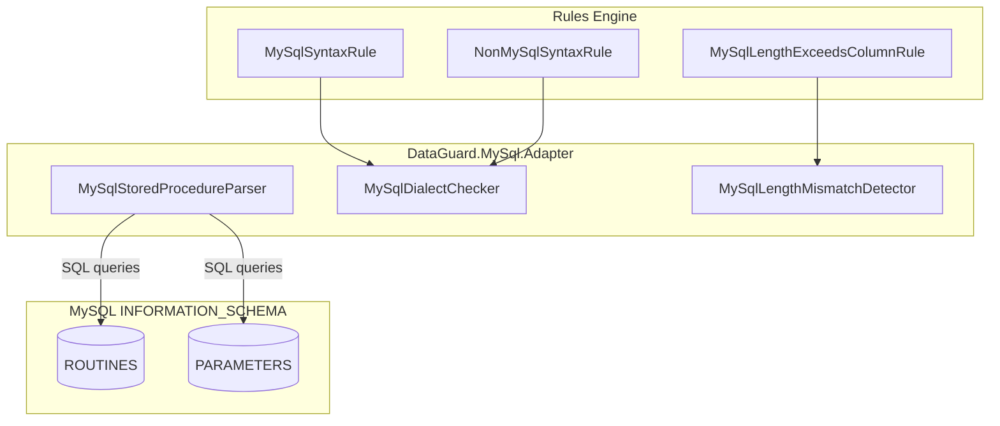

# MySQL Adapter

The MySQL Adapter provides contract validation between .NET entities and MySQL stored procedures using the MySqlConnector library and `INFORMATION_SCHEMA` views.

## Architecture


```mermaid
graph TB
    subgraph "DataGuard.MySql.Adapter"
        MSP[MySqlStoredProcedureParser]
        MDC[MySqlDialectChecker]
        MLMD[MySqlLengthMismatchDetector]
    end

    subgraph "MySQL INFORMATION_SCHEMA"
        R[(ROUTINES)]
        P[(PARAMETERS)]
    end

    subgraph "Rules Engine"
        MY001[MySqlSyntaxRule]
        MY002[NonMySqlSyntaxRule]
        MY003[MySqlLengthExceedsColumnRule]
    end

    MSP -->|SQL queries| R
    MSP -->|SQL queries| P

    MY001 --> MDC
    MY002 --> MDC
    MY003 --> MLMD
```

## Source Files

| File | Lines | Purpose |
|------|-------|---------|
| `MySqlStoredProcedureParser.cs` | ~110 | IContractSource implementation for MySQL SPs |
| `MySqlDialectChecker.cs` | ~100 | Dialect detection + MY001/MY002 rules |
| `MySqlLengthMismatchDetector.cs` | ~60 | Length mismatch detection + MY003 rule |

## Dependencies

```xml
<PackageReference Include="MySqlConnector" Version="2.4.3" />
<ProjectReference Include="..\DataGuard.Core\DataGuard.Core.csproj" />
```

## MySqlStoredProcedureParser

Implements `IContractSource` to extract stored procedure contracts from MySQL's `INFORMATION_SCHEMA`.

### Query Pattern

```sql
SELECT r.ROUTINE_NAME, p.PARAMETER_NAME, p.DATA_TYPE, p.PARAMETER_MODE,
       p.ORDINAL_POSITION, p.CHARACTER_MAXIMUM_LENGTH, p.NUMERIC_PRECISION,
       p.NUMERIC_SCALE, r.ROUTINE_SCHEMA
FROM information_schema.ROUTINES r
LEFT JOIN information_schema.PARAMETERS p
  ON r.SPECIFIC_SCHEMA = p.SPECIFIC_SCHEMA AND r.SPECIFIC_NAME = p.SPECIFIC_NAME
WHERE r.ROUTINE_TYPE = 'PROCEDURE' AND (@schema = '' OR r.ROUTINE_SCHEMA = @schema)
ORDER BY r.ROUTINE_SCHEMA, r.ROUTINE_NAME, p.ORDINAL_POSITION
```

### Key Design Decisions

- **LEFT JOIN**: Procedures without parameters appear as one row with NULL parameter fields. The parser creates their empty `StoredProcedureDescriptor`; it skips only parameter creation for that row.
- **Schema filtering**: Empty schema string means "all schemas"; otherwise filters by exact match.
- **Overload handling**: MySQL does not support procedure overloading, so each procedure name maps to exactly one contract.
- **Length normalization**: `CHARACTER_MAXIMUM_LENGTH` returns `BIGINT` — normalized to `int?` with overflow protection.

### Direction Mapping

| MySQL Mode | DataGuard Direction |
|------------|---------------------|
| `IN` | `Input` |
| `OUT` | `Output` |
| `INOUT` | `InputOutput` |

### Contract ID Format

```
mysql:{schema}.{procedure_name}
```

## MySqlDialectChecker

Detects MySQL-specific syntax in non-MySQL contexts and vice versa using keyword matching via `SqlKeywordMatcher.ContainsAny()`.

### MySQL-Only Keywords

| Keyword | Purpose |
|---------|---------|
| `ON DUPLICATE KEY` | MySQL upsert syntax |
| `REPLACE INTO` | MySQL replace syntax |
| `` ` `` (backtick) | MySQL identifier quoting |
| `ENGINE=InnoDB` | MySQL storage engine |
| `AUTO_INCREMENT` | MySQL auto-increment |

### Non-MySQL Keywords (detected in MySQL context)

| Keyword | Origin |
|---------|--------|
| `NVL` | Oracle |
| `TOP ` | SQL Server |
| `ROWNUM` | Oracle |
| `GETDATE` | SQL Server |
| `FETCH FIRST` | Standard SQL / PostgreSQL |

## MySqlLengthMismatchDetector

Compares entity `MaxLength` against MySQL column `CHARACTER_MAXIMUM_LENGTH`. Simple direct comparison — MySQL does not have Oracle's CHAR/BYTE semantics complexity.

### Detection Logic

```csharp
foreach (var property in entity.Properties)
{
    var column = columns.FirstOrDefault(c =>
        string.Equals(c.Name, property.ColumnName, StringComparison.OrdinalIgnoreCase));
    if (column == null || !property.MaxLength.HasValue || !column.MaxLength.HasValue)
        continue;

    if (property.MaxLength.Value > column.MaxLength.Value)
        yield return new ContractViolation("MY003", ...);
}
```

## Rules Reference

### MY001 — MySQL Syntax in Non-MySQL Context

| Property | Value |
|----------|-------|
| **Severity** | Warning |
| **Trigger** | MySQL keywords (`ON DUPLICATE KEY`, backticks, etc.) in non-MySQL SQL |
| **Message** | MySQL-specific syntax '{syntax}' used in non-MySQL context |
| **Context** | The descriptor's `ConnectionProviderHint`, or the catalog provider when there is no hint. The rule is a no-op when the context is `mysql`, so MySQL's own syntax is never reported under `--provider mysql`. Without a provider and a hint the context counts as non-MySQL. |

### MY002 — Non-MySQL Syntax in MySQL Context

| Property | Value |
|----------|-------|
| **Severity** | Warning |
| **Trigger** | Oracle/SQL Server keywords (`NVL`, `TOP`, `GETDATE`, etc.) in MySQL SQL |
| **Message** | Non-MySQL syntax '{syntax}' used in MySQL context |

### MY003 — Entity Length Exceeds MySQL Column Length

| Property | Value |
|----------|-------|
| **Severity** | Error |
| **Trigger** | `property.MaxLength > column.MaxLength` |
| **Message** | Entity property '{name}' MaxLength={n} exceeds column '{col}' length={m} |

The `MySqlVarcharByteLimitRule` form of MY003 also checks TEXT family columns. Those limits are bytes, so the entity length is converted the same way MY006 does it: `MaxLength × bytes per UTF-16 unit` (utf8mb4/utf8mb3/utf8 3, ucs2/utf16 2, single-byte sets 1, `byte[]` 1). A `string` with `MaxLength = 30000` on a utf8mb4 `TEXT` column (90,000 bytes) is reported: `may need 90000 bytes (3 per character in utf8mb4) but MySQL TEXT holds at most 65535 bytes`.

## Usage in CLI

```bash
# Validate MySQL contracts
dataguard validate --provider mysql --connection "Server=localhost;Database=mydb;Uid=root;..."

# With schema filter
dataguard validate --provider mysql --connection "..." --schema mydb
```

## MySQL-Specific Considerations

### No Package Support

Unlike Oracle, MySQL does not have packages. The `PackageName` field is always empty in MySQL contracts.

### INFORMATION_SCHEMA Limitations

MySQL's `INFORMATION_SCHEMA.PARAMETERS` may not be available for all MySQL versions or configurations. The adapter gracefully handles missing data by skipping NULL parameter rows.

### Character Set Awareness

MySQL's `CHARACTER_MAXIMUM_LENGTH` is always in characters (not bytes), regardless of the column's character set. This simplifies length comparison compared to Oracle's CHAR/BYTE semantics.

## Catalog and length semantics (Phase 3.3/3.7)

- **Routines**: `ROUTINE_TYPE IN ('PROCEDURE','FUNCTION')`. A function's `ReturnType` comes from `ROUTINES.DATA_TYPE`, and its return row (`ORDINAL_POSITION = 0`) is not a parameter. Procedures keep the Id `mysql:{schema}.{name}`. Functions live in a separate MySQL namespace and use `mysql:{schema}.{name}#function`.
- **Default schema**: when no schema is configured, the parser uses `SELECT DATABASE()`. If the connection has no default database, it reads every schema except `mysql`, `sys`, `information_schema` and `performance_schema`.
- **Table keys** follow `@@lower_case_table_names`. With `0`, keys are case-sensitive, so `Orders` and `orders` stay separate. With `1` or `2`, keys are lower-cased. `DatabaseTableDescriptor.Schema` is set.
- **Charset**: `ColumnDescriptor.Charset` carries `CHARACTER_SET_NAME`, and `CharUsed` is null. For older snapshots, a charset stored in `CharUsed` is still read.
- **MY006**: TEXT family limits are bytes (`TINYTEXT` 255, `TEXT` 65,535, `MEDIUMTEXT` 16,777,215, `LONGTEXT` 4,294,967,295). The entity side is `MaxLength × bytes per UTF-16 unit`: utf8mb4, utf8mb3 and utf8 are 3; ucs2 and utf16 are 2; single-byte sets are 1.
- **MY005**: row size. Each VARCHAR/CHAR column of the table is counted at the mapped property's `MaxLength` (or its own length) × the charset's maximum character width (utf8mb4 4, utf8mb3 3, latin1 1), plus 1–2 length bytes. A total over 65,535 bytes means the CREATE/ALTER TABLE from the model fails with ERROR 1118. Index-prefix limits (3072/767) are not checked, because the schema descriptor carries no index metadata.
- **MY007**: Pomelo maps a `string` with no `MaxLength` to `longtext`. The rule fires only when that property sits on a `varchar(n)`/`char(n)` column; a TEXT column is not a risk.
- `GetBytesPerChar` returns MySQL's maximum width per character: `utf8mb3` = 3 (it was wrongly 4), `utf8mb4` = 4.

