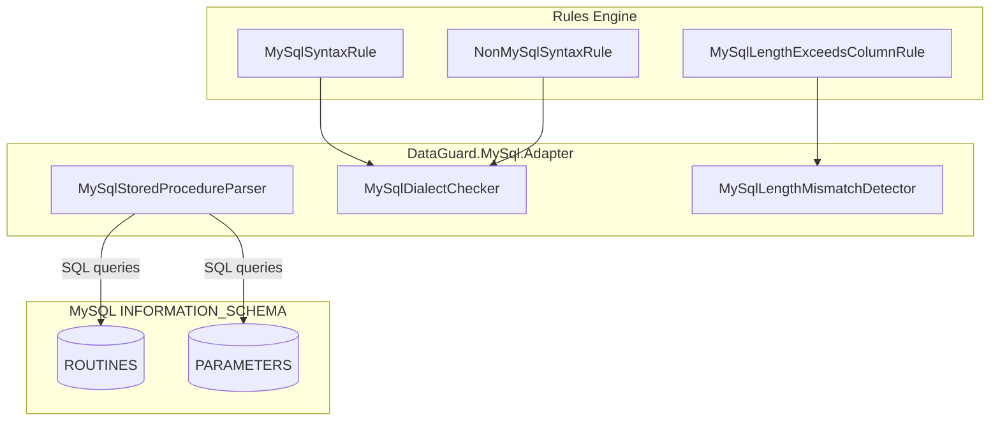

# Bộ Adapter MySQL

Bộ Adapter MySQL cung cấp xác thực contract giữa các entity .NET và stored procedure MySQL sử dụng thư viện MySqlConnector và các view `INFORMATION_SCHEMA`.

## Kiến trúc



## File nguồn

| File | Dòng | Mục đích |
|------|------|----------|
| `MySqlStoredProcedureParser.cs` | ~110 | Triển khai IContractSource cho MySQL SP |
| `MySqlDialectChecker.cs` | ~100 | Phát hiện phương ngữ + rules MY001/MY002 |
| `MySqlLengthMismatchDetector.cs` | ~60 | Phát hiện sai lệch độ dài + rule MY003 |

## Phụ thuộc

```xml
<PackageReference Include="MySqlConnector" Version="2.4.3" />
<ProjectReference Include="..\DataGuard.Core\DataGuard.Core.csproj" />
```

## MySqlStoredProcedureParser

Triển khai `IContractSource` để trích xuất contract stored procedure từ `INFORMATION_SCHEMA` của MySQL.

### Mẫu truy vấn

```sql
SELECT r.ROUTINE_NAME, p.PARAMETER_NAME, p.DATA_TYPE, p.PARAMETER_MODE,
       p.ORDINAL_POSITION, p.CHARACTER_MAXIMUM_LENGTH, p.NUMERIC_PRECISION,
       p.NUMERIC_SCALE, r.ROUTINE_SCHEMA
FROM information_schema.ROUTINES r
LEFT JOIN information_schema.PARAMETERS p
  ON r.SPECIFIC_SCHEMA = p.SPECIFIC_SCHEMA AND r.SPECIFIC_NAME = p.SPECIFIC_NAME
WHERE r.ROUTINE_TYPE = 'PROCEDURE' AND (@schema = '' OR r.ROUTINE_SCHEMA = @schema)
ORDER BY r.ROUTINE_SCHEMA, r.ROUTINE_NAME, p.ORDINAL_POSITION
```

### Quyết định thiết kế chính

- **LEFT JOIN**: Procedure không có tham số vẫn xuất hiện trong kết quả (dưới dạng một dòng với các trường tham số NULL). Chúng bị bỏ qua qua kiểm tra `reader.IsDBNull(1)`.
- **Lọc schema**: Chuỗi schema rỗng có nghĩa là "tất cả schema"; nếu không lọc chính xác.
- **Xử lý overload**: MySQL không hỗ trợ overload procedure, vì vậy mỗi tên procedure ánh xạ đúng một contract.
- **Chuẩn hóa độ dài**: `CHARACTER_MAXIMUM_LENGTH` trả về `BIGINT` — chuẩn hóa thành `int?` với bảo vệ tràn.

### Ánh xạ direction

| MySQL Mode | Direction DataGuard |
|------------|---------------------|
| `IN` | `Input` |
| `OUT` | `Output` |
| `INOUT` | `InputOutput` |

### Định dạng Contract ID

```
mysql:{schema}.{procedure_name}
```

## MySqlDialectChecker

Phát hiện cú pháp đặc thù MySQL trong ngữ cảnh không phải MySQL và ngược lại sử dụng khớp từ khóa qua `SqlKeywordMatcher.ContainsAny()`.

### Từ khóa chỉ MySQL

| Từ khóa | Mục đích |
|---------|----------|
| `ON DUPLICATE KEY` | Cú pháp upsert MySQL |
| `REPLACE INTO` | Cú pháp replace MySQL |
| `` ` `` (backtick) | Trích dẫn định danh MySQL |
| `ENGINE=InnoDB` | Storage engine MySQL |
| `AUTO_INCREMENT` | Tự động tăng MySQL |

### Từ khóa không phải MySQL (phát hiện trong ngữ cảnh MySQL)

| Từ khóa | Nguồn gốc |
|---------|-----------|
| `NVL` | Oracle |
| `TOP ` | SQL Server |
| `ROWNUM` | Oracle |
| `GETDATE` | SQL Server |
| `FETCH FIRST` | Standard SQL / PostgreSQL |

## MySqlLengthMismatchDetector

So sánh `MaxLength` của entity với `CHARACTER_MAXIMUM_LENGTH` của cột MySQL. So sánh trực tiếp đơn giản — MySQL không có độ phức tạp ngữ nghĩa CHAR/BYTE như Oracle.

### Logic phát hiện

```csharp
foreach (var property in entity.Properties)
{
    var column = columns.FirstOrDefault(c =>
        string.Equals(c.Name, property.ColumnName, StringComparison.OrdinalIgnoreCase));
    if (column == null || !property.MaxLength.HasValue || !column.MaxLength.HasValue)
        continue;

    if (property.MaxLength.Value > column.MaxLength.Value)
        yield return new ContractViolation("MY003", ...);
}
```

## Tham chiếu Rules

### MY001 — Cú pháp MySQL trong ngữ cảnh không phải MySQL

| Thuộc tính | Giá trị |
|------------|---------|
| **Mức độ** | Warning |
| **Kích hoạt** | Từ khóa MySQL (`ON DUPLICATE KEY`, backticks, etc.) trong SQL không phải MySQL |
| **Thông báo** | MySQL-specific syntax '{syntax}' used in non-MySQL context |

### MY002 — Cú pháp không phải MySQL trong ngữ cảnh MySQL

| Thuộc tính | Giá trị |
|------------|---------|
| **Mức độ** | Warning |
| **Kích hoạt** | Từ khóa Oracle/SQL Server (`NVL`, `TOP`, `GETDATE`, etc.) trong SQL MySQL |
| **Thông báo** | Non-MySQL syntax '{syntax}' used in MySQL context |

### MY003 — Độ dài entity vượt độ dài cột MySQL

| Thuộc tính | Giá trị |
|------------|---------|
| **Mức độ** | Error |
| **Kích hoạt** | `property.MaxLength > column.MaxLength` |
| **Thông báo** | Entity property '{name}' MaxLength={n} exceeds column '{col}' length={m} |

## Sử dụng trong CLI

```bash
# Xác thực contract MySQL
dataguard validate --provider mysql --connection "Server=localhost;Database=mydb;Uid=root;..."

# Với bộ lọc schema
dataguard validate --provider mysql --connection "..." --schema mydb
```

## Lưu ý đặc thù MySQL

### Không hỗ trợ package

Không giống Oracle, MySQL không có package. Trường `PackageName` luôn rỗng trong contract MySQL.

### Giới hạn INFORMATION_SCHEMA

`INFORMATION_SCHEMA.PARAMETERS` của MySQL có thể không có sẵn cho tất cả phiên bản hoặc cấu hình MySQL. Adapter xử lý gracefully dữ liệu thiếu bằng cách bỏ qua các dòng tham số NULL.

### Nhận biết bộ ký tự

`CHARACTER_MAXIMUM_LENGTH` của MySQL luôn tính bằng ký tự (không phải byte), bất kể bộ ký tự của cột. Điều này đơn giản hóa so sánh độ dài so với ngữ nghĩa CHAR/BYTE của Oracle.
