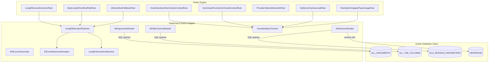
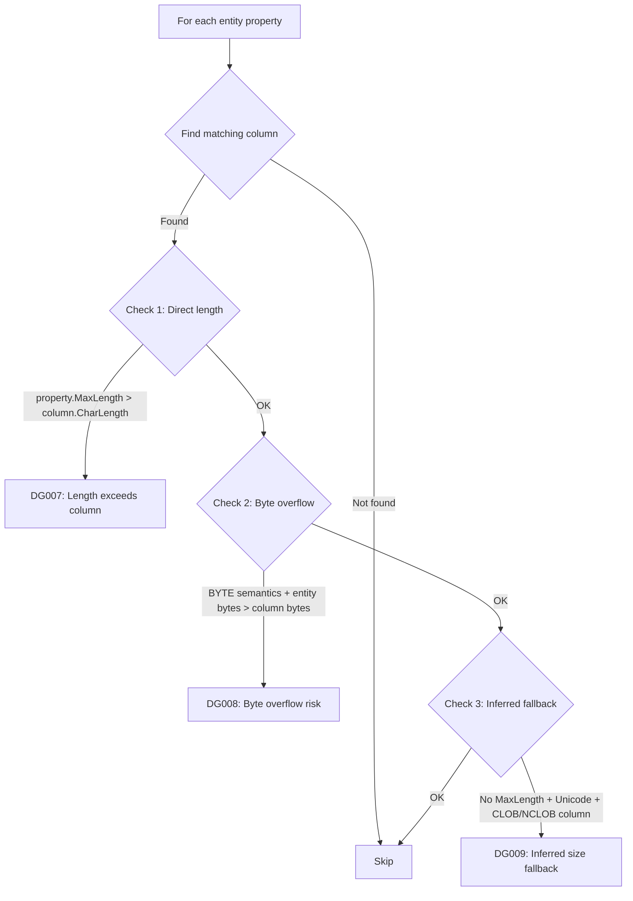

# Oracle Adapter

The Oracle Adapter is DataGuard's most feature-rich database adapter, providing deep integration with Oracle Database for contract validation between .NET Entity Framework Core entities and Oracle stored procedures, packages, and raw SQL.

## Architecture



## Source Files

| File | Size | Purpose |
|------|------|---------|
| `OracleReaders.cs` | 822 lines | AllArgumentsReader, AllTabColumnsReader, NlsSessionReader, RefCursorDescriber |
| `OracleDialectChecker.cs` | 380 lines | Dialect detection engine + 5 rules (DG010-DG014) |
| `LengthMismatch.cs` | 401 lines | EfCoreInferenceSimulator, LengthSemanticsResolver, LengthMismatchDetector + 3 rules (DG007-DG009) |

## Dependencies

```xml
<PackageReference Include="Oracle.ManagedDataAccess.Core" Version="23.26.300" />
<PackageReference Include="Microsoft.SqlServer.TransactSql.ScriptDom" Version="180.102.0" />
<ProjectReference Include="..\DataGuard.Core\DataGuard.Core.csproj" />
```

## AllArgumentsReader

Reads stored procedure parameters from Oracle's `ALL_ARGUMENTS` data dictionary view. Handles overloaded procedures by including `SEQUENCE` and `OVERLOAD` columns in the query key.

### Key Design Decisions

- **Overload handling**: Oracle allows multiple procedures with the same name (overloading). The reader groups parameters by `OVERLOAD` and `SUBPROGRAM_ID` to distinguish each overload signature.
- **Function return values**: Rows where `POSITION = 0` represent function return values and are skipped (not real parameters).
- **User-defined types**: When `TYPE_OWNER` and `TYPE_NAME` are present, the reader builds a fully-qualified type name (e.g., `HR.EMPLOYEE_TYPE`).
- **Defensive OVERLOAD reading**: The `OVERLOAD` column is `NUMBER` in some Oracle versions and `VARCHAR2` in others. `ReadOverload()` converts defensively using `Convert.ToString()`.

### Query Pattern

```sql
SELECT argument_name, in_out, data_type, data_length, data_precision,
       data_scale, position, sequence, overload, type_owner, type_name, type_subname
FROM all_arguments
WHERE owner = UPPER(:owner)
  AND (@packageName IS NULL OR package_name = :packageName)
  AND object_name = :procedureName
ORDER BY sequence, position
```

### Methods

| Method | Returns | Description |
|--------|---------|-------------|
| `GetParametersAsync()` | `IReadOnlyList<ParameterDescriptor>` | Parameters for a specific procedure overload |
| `GetOverloadsAsync()` | `IReadOnlyList<ProcedureOverloadInfo>` | All overloads grouped by overload ID |
| `GetProcedureNamesAsync()` | `IReadOnlyList<string>` | Distinct procedure/function names in a schema |

### ProcedureOverloadInfo

```csharp
public sealed class ProcedureOverloadInfo
{
    public int Sequence { get; init; }
    public int Overload { get; init; }
    public List<ParameterDescriptor> Parameters { get; init; } = new();
    public string SignatureKey => $"{Sequence}:{Overload}";
}
```

## AllTabColumnsReader

Reads column metadata from `ALL_TAB_COLUMNS`, including the critical `CHAR_USED` column that indicates whether a column's length is in bytes (`B`) or characters (`C`).

### Columns Read

| Oracle Column | Maps To | Notes |
|---------------|---------|-------|
| `COLUMN_NAME` | `Name` | Always uppercase in Oracle |
| `DATA_TYPE` | `DataType` | e.g., `VARCHAR2`, `NUMBER`, `CLOB` |
| `DATA_LENGTH` | `MaxLength` | Byte length |
| `CHAR_LENGTH` | `CharLength` | Character length (differs from byte for multi-byte charsets) |
| `DATA_PRECISION` | `Precision` | For NUMBER types |
| `DATA_SCALE` | `Scale` | For NUMBER types |
| `NULLABLE` | `IsNullable` | `Y` or `N` |
| `CHAR_USED` | `CharUsed` | `B`=BYTE, `C`=CHAR, null=session default |
| `DATA_DEFAULT` | `DataDefault` | Default value expression |
| `COLUMN_ID` | `ColumnId` | Ordinal position |

### Methods

| Method | Returns | Description |
|--------|---------|-------------|
| `GetColumnsAsync()` | `IReadOnlyList<ColumnDescriptor>` | Columns for a specific table |
| `GetAllColumnsAsync()` | `Dictionary<string, List<ColumnDescriptor>>` | All columns grouped by table name |

### CharUsed Normalization

The `NormalizeCharUsed()` method converts Oracle's single-character codes:

- `B` → `"BYTE"`
- `C` → `"CHAR"`
- `null` → `null` (falls back to session `NLS_LENGTH_SEMANTICS`)

## NlsSessionReader

Reads NLS session parameters that affect length semantics, character set, and database version.

### Parameters Read

| Parameter | Purpose |
|-----------|---------|
| `NLS_LENGTH_SEMANTICS` | Default length semantics (CHAR/BYTE) |
| `NLS_CHARACTERSET` | Database character set (e.g., `AL32UTF8`) |
| `NLS_NCHAR_CHARACTERSET` | National character set (e.g., `AL16UTF16`) |
| `NLS_LANGUAGE` | Language setting |
| `NLS_TERRITORY` | Territory setting |

### Database Version Detection

Queries `V$VERSION` and parses the banner string:

```
Oracle Database 19c Enterprise Edition Release 19.0.0.0.0 - Production
```

Extracts version number (`19.0.0.0.0`) and edition (`Enterprise`/`Standard`/`Express`).

## RefCursorDescriber

Describes `REF CURSOR` result sets using `DBMS_SQL` package. This is Oracle's mechanism for describing dynamic cursor output columns.

## EfCoreInferenceSimulator

Simulates the EF Core Oracle provider's type inference behavior, mirroring the behavior described in [dotnet/efcore#33218](https://github.com/dotnet/efcore/issues/33218).

### Inference Rules

| Condition | Inferred Type |
|-----------|---------------|
| Unicode + no MaxLength | `NVARCHAR2(2000)` |
| Non-Unicode + no MaxLength | `VARCHAR2(2000)` |
| Unicode + MaxLength > 4000 | `NCLOB` |
| Non-Unicode + MaxLength > 4000 | `CLOB` |
| Unicode + MaxLength ≤ 4000 | `NVARCHAR2(n)` |
| Non-Unicode + MaxLength ≤ 4000 | `VARCHAR2(n)` |

This simulation is critical for detecting the **NVARCHAR2(2000) fallback risk** (DG009) — when a `string` property has no `[MaxLength]` attribute, EF Core silently infers `NVARCHAR2(2000)`, which can cause `ORA-12899` at runtime if values exceed 2000 characters.

## LengthSemanticsResolver

Resolves the session-level `NLS_LENGTH_SEMANTICS` parameter to determine whether the database defaults to `CHAR` or `BYTE` semantics.

```sql
SELECT value FROM nls_session_parameters WHERE parameter = 'NLS_LENGTH_SEMANTICS'
```

## LengthMismatchDetector

The core detection engine that compares entity properties against Oracle columns. Runs three distinct checks per property:

### Detection Flow



### Check 1: Direct Length Mismatch (DG007)

Compares `property.MaxLength` (character count) against `column.CharLength` (character count). Falls back to `column.MaxLength` (byte count) only when `CharLength` is null.

### Check 2: Byte-Length Overflow Risk (DG008)

When the column uses BYTE semantics (`CHAR_USED = 'B'` or session default is BYTE), calculates the worst-case byte consumption:

- Unicode (`string`): 4 bytes per character (AL32UTF8 supplementary characters)
- Non-Unicode: 1 byte per character

If `entityMaxBytes > column.MaxLength`, reports a warning.

### Check 3: Inferred Size Fallback (DG009)

When a `string` property has no `[MaxLength]` and the Oracle column is `CLOB`/`NCLOB`, warns that EF Core will infer `NVARCHAR2(2000)` — a silent truncation risk.

## OracleDialectChecker

Detects cross-dialect SQL syntax issues. Uses word-boundary regex matching to avoid false positives on partial matches.

### Oracle-Exclusive Keywords

`DECODE`, `NVL`, `NVL2`, `DUAL`, `ROWNUM`, `CONNECT BY`, `START WITH`, `SYSDATE`, `SYSTIMESTAMP`, `NEXTVAL`, `CURRVAL`, `ROWID`, `LISTAGG`, `WM_CONCAT`, `XMLAGG`, `XMLFOREST`, `XMLELEMENT`, `REGEXP_LIKE`, `REGEXP_REPLACE`, `REGEXP_SUBSTR`, `REGEXP_INSTR`

### Oracle-Exclusive Operators

`(+)`, `||`, `**`, `CONCAT`

### SQL Server Keywords (detected in Oracle context)

`ISNULL`, `GETDATE`, `GETUTCDATE`, `DATEADD`, `DATEDIFF`, `DATEPART`, `DATENAME`, `IDENTITY`, `NEWID`, `NEWSEQUENTIALID`, `IIF`, `CHOOSE`, `FORMAT`, `TRY_CAST`, `TRY_CONVERT`, `TRY_PARSE`

## Rules Reference

### DG007 — Entity Length Exceeds Column Length

| Property | Value |
|----------|-------|
| **Severity** | Error |
| **Trigger** | `property.MaxLength > column.CharLength` |
| **Message** | Entity property '{name}' MaxLength={n} exceeds column '{col}' length={m} |

### DG008 — Byte-Length Overflow Risk

| Property | Value |
|----------|-------|
| **Severity** | Warning |
| **Trigger** | BYTE semantics + `entityMaxBytes > column.MaxLength` |
| **Message** | Byte overflow risk: property '{name}' may exceed column '{col}' byte capacity |

### DG009 — Inferred Size Fallback Risk

| Property | Value |
|----------|-------|
| **Severity** | Warning |
| **Trigger** | No MaxLength + Unicode + CLOB/NCLOB column |
| **Message** | EF Core will infer NVARCHAR2(2000) for property '{name}' — ORA-12899 risk |

### DG010 — Oracle Syntax in Non-Oracle Context

| Property | Value |
|----------|-------|
| **Severity** | Warning |
| **Trigger** | Oracle keywords/operators in non-Oracle SQL |
| **Message** | Oracle-specific keyword '{keyword}' used in non-Oracle context |

### DG011 — Non-Oracle Function in Oracle Context

| Property | Value |
|----------|-------|
| **Severity** | Warning |
| **Trigger** | SQL Server functions (`ISNULL`, `TOP`, `GETDATE`) in Oracle SQL |
| **Message** | SQL Server-specific keyword '{keyword}' used in Oracle context |

### DG012 — Provider Option Mismatch

| Property | Value |
|----------|-------|
| **Severity** | Error |
| **Trigger** | Oracle context but non-Oracle provider configured |
| **Message** | Oracle context detected but provider is '{provider}' |

### DG013 — SQL Server Syntax Leak

| Property | Value |
|----------|-------|
| **Severity** | Warning |
| **Trigger** | `EXEC dbo.Procedure` pattern in Oracle context |
| **Message** | SQL Server EXEC syntax used in Oracle context |

### DG014 — Raw SQL Unmapped Type Usage

| Property | Value |
|----------|-------|
| **Severity** | Warning |
| **Trigger** | SQL Server types (`UNIQUEIDENTIFIER`, `MONEY`, `DATETIME2`, etc.) in Oracle raw SQL |
| **Message** | Type '{type}' used with Oracle EF Core raw SQL but not mapped by provider |

## Usage in CLI

The Oracle adapter is activated when `--provider oracle` is passed:

```bash
# Full validation with Oracle provider
dataguard validate --provider oracle --connection "User Id=hr;Password=***;Data Source=ORCL"

# Oracle-specific dialect and length checks
dataguard oracle-check --connection "User Id=hr;Password=***;Data Source=ORCL" --schema HR

# Snapshot with Oracle schema capture
dataguard snapshot refresh --provider oracle --connection "..." --schema HR
```

The `oracle-check` command runs the full Oracle validation pipeline:

1. Resolves NLS length semantics (CHAR vs BYTE)
2. Reads the complete schema (all tables, all columns)
3. Runs dialect checks against column types
4. Reports unmapped type usage
