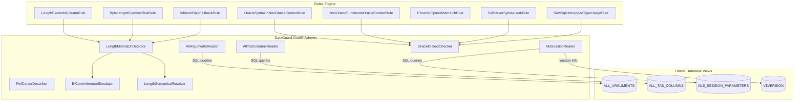
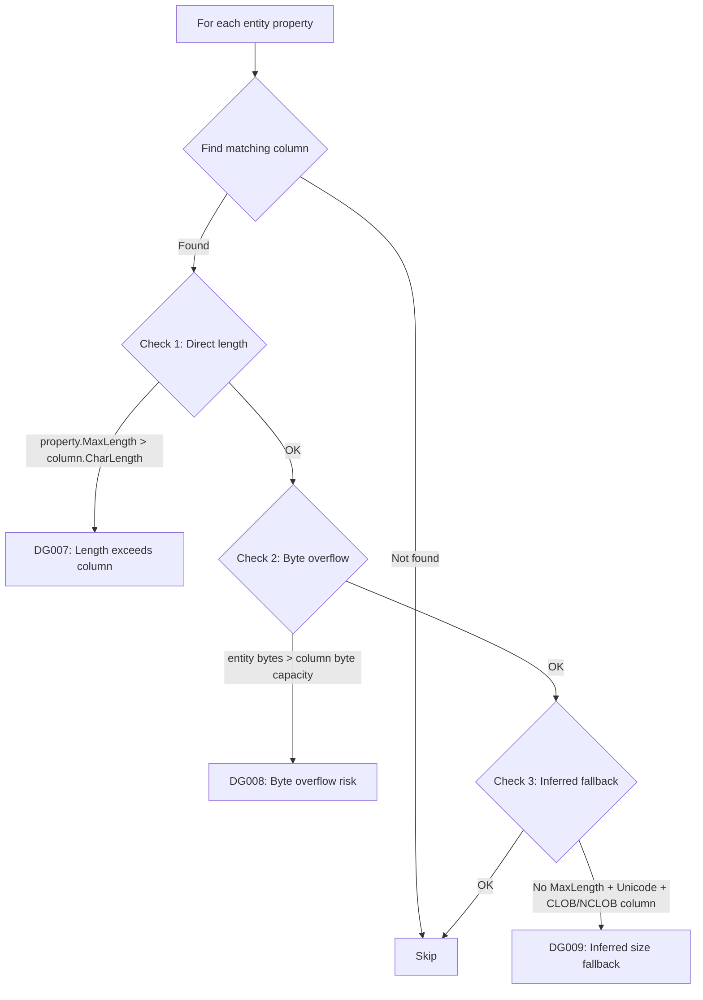

# Oracle Adapter

The Oracle Adapter is DataGuard's most feature-rich database adapter, providing deep integration with Oracle Database for contract validation between .NET Entity Framework Core entities and Oracle stored procedures, packages, and raw SQL.

## Architecture


```mermaid
graph TB
    subgraph "DataGuard.Oracle.Adapter"
        AAR[AllArgumentsReader]
        ATCR[AllTabColumnsReader]
        NSR[NlsSessionReader]
        RCD[RefCursorDescriber]
        ODC[OracleDialectChecker]
        LMD[LengthMismatchDetector]
        EIS[EfCoreInferenceSimulator]
        LSR[LengthSemanticsResolver]
    end

    subgraph "Oracle Database Views"
        AA[(ALL_ARGUMENTS)]
        ATC[(ALL_TAB_COLUMNS)]
        NSP[(NLS_SESSION_PARAMETERS)]
        VP[(V$VERSION)]
    end

    subgraph "Rules Engine"
        DG007[LengthExceedsColumnRule]
        DG008[ByteLengthOverflowRiskRule]
        DG009[InferredSizeFallbackRule]
        DG010[OracleSyntaxInNonOracleContextRule]
        DG011[NonOracleFunctionInOracleContextRule]
        DG012[ProviderOptionMismatchRule]
        DG013[SqlServerSyntaxLeakRule]
        DG014[RawSqlUnmappedTypeUsageRule]
    end

    AAR -->|SQL queries| AA
    ATCR -->|SQL queries| ATC
    NSR -->|SQL queries| NSP
    NSR -->|version info| VP

    LMD --> EIS
    LMD --> LSR
    DG007 --> LMD
    DG008 --> LMD
    DG009 --> LMD
    DG010 --> ODC
    DG011 --> ODC
    DG013 --> ODC
    DG014 --> ODC
```

## Source Files

| File | Size | Purpose |
|------|------|---------|
| `OracleReaders.cs` | ~830 lines | AllArgumentsReader, AllTabColumnsReader, NlsSessionReader, RefCursorDescriber |
| `OracleCatalog.cs` | ~400 lines | OracleProcedureCatalogEntry, OracleCatalog (row grouping, ids), OracleDatabaseSchemaDescriptor, OracleCatalogBuilder |
| `OracleDialectChecker.cs` | 380 lines | Dialect detection engine + 5 rules (DG010-DG014) |
| `LengthMismatch.cs` | ~600 lines | EfCoreInferenceSimulator, LengthSemanticsResolver, OracleCharsets, LengthMismatchDetector + 3 rules (DG007-DG009) |

## Dependencies

```xml
<PackageReference Include="Oracle.ManagedDataAccess.Core" Version="23.26.300" />
<PackageReference Include="Microsoft.SqlServer.TransactSql.ScriptDom" Version="180.102.0" />
<ProjectReference Include="..\DataGuard.Core\DataGuard.Core.csproj" />
```

## AllArgumentsReader

Reads the procedure catalog from `ALL_ARGUMENTS`, plus `ALL_PROCEDURES` header rows so subprograms without argument rows are kept.

### Key Design Decisions

- **One statement, grouped by `(package_name, object_name, subprogram_id)`**: `SUBPROGRAM_ID` is unique per overload inside a package (1 for standalone units). `SEQUENCE` is an argument ordinal, never an overload id.
- **0-argument subprograms**: Oracle 18c+ has no `ALL_ARGUMENTS` row for a 0-argument procedure, so the query unites `ALL_PROCEDURES` (`OBJECT_TYPE = 'PACKAGE'` with `PROCEDURE_NAME`, or `PROCEDURE`/`FUNCTION`). Legacy placeholder rows (no argument name, no data type) are ignored.
- **`ALL_PROCEDURES` has no `PACKAGE_NAME` column**: packaged subprograms are rows with `OBJECT_TYPE = 'PACKAGE'` and `PROCEDURE_NAME` set (the old filter raised ORA-00904).
- **Function return values**: the row with `POSITION = 0` and no argument name becomes `ReturnType`; it is not a parameter.
- **Defaults**: `DEFAULTED = 'Y'` sets `ParameterDescriptor.HasDefault`.
- **`DATA_LEVEL = 0`** only; `UPPER()` on both sides of name filters.
- **User-defined types**: `TYPE_OWNER.TYPE_NAME[.TYPE_SUBNAME]` becomes the parameter type. Argument groups of object-type methods (no `PACKAGE` row) are dropped.

### Query Pattern

```sql
SELECT 'A', a.package_name, a.object_name, a.subprogram_id, a.overload, a.position, a.sequence,
       a.argument_name, a.in_out, a.data_type, a.data_length, a.data_precision, a.data_scale,
       a.char_used, a.char_length, a.defaulted, a.type_owner, a.type_name, a.type_subname, NULL
FROM all_arguments a
WHERE a.owner = UPPER(:owner) AND a.data_level = 0 [AND package filter]
UNION ALL
SELECT 'P', CASE WHEN p.object_type = 'PACKAGE' THEN p.object_name END,
       NVL(p.procedure_name, p.object_name), p.subprogram_id, p.overload, NULL, ..., p.object_type
FROM all_procedures p
WHERE p.owner = UPPER(:owner)
  AND (p.object_type IN ('PROCEDURE','FUNCTION') OR (p.object_type = 'PACKAGE' AND p.procedure_name IS NOT NULL))
ORDER BY 2 NULLS FIRST, 3, 4, 1 DESC, 6
```

Package filter: `null` = every package and standalone unit; empty = standalone only (`package_name IS NULL`); otherwise `UPPER(package_name) = UPPER(:packageName)`.

### Methods

| Method | Returns | Description |
|--------|---------|-------------|
| `GetProceduresAsync(owner, packageFilter?)` | `IReadOnlyList<OracleProcedureCatalogEntry>` | Every subprogram/overload (including 0-argument ones) with parameters and return type |
| `GetParametersAsync()` | `IReadOnlyList<ParameterDescriptor>` | Parameters of one procedure (empty package = standalone); `sequence` selects a `SUBPROGRAM_ID` |
| `GetOverloadsAsync()` | `IReadOnlyList<ProcedureOverloadInfo>` | One entry per `SUBPROGRAM_ID`, 0-argument overloads included |
| `GetProcedureNamesAsync()` | `IReadOnlyList<string>` | Subprogram names of a package (`PROCEDURE_NAME`), or standalone procedure/function names |

### OracleProcedureCatalogEntry and ids

`OracleProcedureCatalogEntry { Owner, PackageName?, Name, SubprogramId, Overload, Parameters, ReturnType, ObjectType, RefCursorParameters }`. The CLI (`validate`, `snapshot refresh`) builds the catalog through `OracleCatalogBuilder.BuildAsync`, which emits one `StoredProcedureDescriptor` per entry with:

- `Id = oracle:{OWNER}.{PACKAGE or _}.{NAME}#{SUBPROGRAM_ID}` (for example `oracle:APP.CUST_PKG.GET_ONE#2`, `oracle:APP._.STANDALONE_P#1`)
- `PackageName` set (empty for standalone units), `ReturnType` for functions, `ReturnsRefCursor` from the catalog.

`DefaultPackage` no longer filters the catalog; every package of the owner is catalogued.

## AllTabColumnsReader

Reads column metadata from `ALL_TAB_COLUMNS`, including the critical `CHAR_USED` column that indicates whether a column's length is in bytes (`B`) or characters (`C`).

### Columns Read

| Oracle Column | Maps To | Notes |
|---------------|---------|-------|
| `COLUMN_NAME` | `Name` | Always uppercase in Oracle |
| `DATA_TYPE` | `DataType` | e.g., `VARCHAR2`, `NUMBER`, `CLOB` |
| `DATA_LENGTH` | `MaxLength` | Byte length |
| `CHAR_LENGTH` | `CharLength` | Character length (differs from byte for multi-byte charsets) |
| `DATA_PRECISION` | `Precision` | For NUMBER types |
| `DATA_SCALE` | `Scale` | For NUMBER types |
| `NULLABLE` | `IsNullable` | `Y` or `N` |
| `CHAR_USED` | `CharUsed` | `B`=BYTE, `C`=CHAR, null=session default |
| `DATA_DEFAULT` | `DataDefault` | Default value expression |
| `COLUMN_ID` | `ColumnId` | Ordinal position |

### Methods

| Method | Returns | Description |
|--------|---------|-------------|
| `GetColumnsAsync()` | `IReadOnlyList<ColumnDescriptor>` | Columns for a specific table |
| `GetAllColumnsAsync()` | `Dictionary<string, List<ColumnDescriptor>>` | All columns grouped by table name |

### CharUsed Normalization

The `NormalizeCharUsed()` method uses the `ColumnDescriptor` canonical codes:

- `B`/`BYTE` → `"B"`
- `C`/`CHAR` → `"C"`
- `null` → `null` (falls back to session `NLS_LENGTH_SEMANTICS`)

## NlsSessionReader

Reads the NLS facts that affect length checks. `GetNlsParametersAsync()` uses three sources:

| Parameter | Source | Purpose |
|-----------|--------|---------|
| `NLS_LENGTH_SEMANTICS` | `nls_session_parameters` | Default length semantics (CHAR/BYTE) |
| `NLS_LANGUAGE`, `NLS_TERRITORY` | `nls_session_parameters` | Informational |
| `NLS_CHARACTERSET` | `nls_database_parameters` | Database character set (e.g., `AL32UTF8`); not present in the session view |
| `NLS_NCHAR_CHARACTERSET` | `nls_database_parameters` | National character set (e.g., `AL16UTF16`) |
| `MAX_STRING_SIZE` | `v$parameter` | `STANDARD` (4000-byte VARCHAR2) or `EXTENDED` (32767); `STANDARD` when the account cannot read `v$parameter` |

`OracleCatalogBuilder` writes these facts into `OracleDatabaseSchemaDescriptor` (`DatabaseCharset`, `NationalCharset`, `MaxStringSize`) and stamps `ColumnDescriptor.Charset` on each character column (`NVARCHAR2`/`NCHAR`/`NCLOB` get the national set).

### Database Version Detection

Queries `V$VERSION` and parses the banner string:

```
Oracle Database 19c Enterprise Edition Release 19.0.0.0.0 - Production
```

Extracts version number (`19.0.0.0.0`) and edition (`Enterprise`/`Standard`/`Express`).

## RefCursorDescriber

Describes `REF CURSOR` result sets with `DBMS_SQL.DESCRIBE_COLUMNS3`. **It executes the procedure or function** inside an anonymous PL/SQL block.

By default the catalog never runs it: REF CURSOR subprograms are catalogued with `ReturnsRefCursor = true` and empty `ResultColumns`. Setting `Oracle.DescribeRefCursors: true` makes catalog extraction execute each subprogram that returns a REF CURSOR as its function result, or as its only OUT parameter. IN parameters are bound as NULL, or omitted when they have a default. A failing describe leaves the shape unknown. Enable it only with a read-only account on a database where running these procedures has no side effects. `UseRefCursorDescribe` is not honored for this purpose.

```yaml
Oracle:
  Owner: APP
  DescribeRefCursors: true   # executes REF CURSOR procedures to read their result columns
```

## EfCoreInferenceSimulator

Simulates the EF Core Oracle provider's type inference behavior, mirroring the behavior described in [dotnet/efcore#33218](https://github.com/dotnet/efcore/issues/33218).

### Inference Rules

| Condition | Inferred Type |
|-----------|---------------|
| Unicode + no MaxLength | `NVARCHAR2(2000)` |
| Non-Unicode + no MaxLength | `VARCHAR2(2000)` |
| Unicode + MaxLength > 4000 | `NCLOB` |
| Non-Unicode + MaxLength > 4000 | `CLOB` |
| Unicode + MaxLength ≤ 4000 | `NVARCHAR2(n)` |
| Non-Unicode + MaxLength ≤ 4000 | `VARCHAR2(n)` |

This simulation is critical for detecting the **NVARCHAR2(2000) fallback risk** (DG009) — when a `string` property has no `[MaxLength]` attribute, EF Core silently infers `NVARCHAR2(2000)`, which can cause `ORA-12899` at runtime if values exceed 2000 characters.

## LengthSemanticsResolver

Resolves the session-level `NLS_LENGTH_SEMANTICS` parameter to determine whether the database defaults to `CHAR` or `BYTE` semantics.

```sql
SELECT value FROM nls_session_parameters WHERE parameter = 'NLS_LENGTH_SEMANTICS'
```

## LengthMismatchDetector

The core detection engine that compares entity properties against Oracle columns. Runs three distinct checks per property:

### Detection Flow


```mermaid
flowchart TD
    A[For each entity property] --> B{Find matching column}
    B -->|Not found| Z[Skip]
    B -->|Found| C{Check 1: Direct length}
    C -->|property.MaxLength > column.CharLength| V1[DG007: Length exceeds column]
    C -->|OK| D{Check 2: Byte overflow}
    D -->|entity bytes > column byte capacity| V2[DG008: Byte overflow risk]
    D -->|OK| E{Check 3: Inferred fallback}
    E -->|No MaxLength + Unicode + CLOB/NCLOB column| V3[DG009: Inferred size fallback]
    E -->|OK| Z
```

### Check 1: Direct Length Mismatch (DG007)

Compares `property.MaxLength` (character count) against `column.CharLength` (character count). Falls back to `column.MaxLength` (byte count) only when `CharLength` is null.

### Check 2: Byte-Length Overflow Risk (DG008)

Entity worst case: `MaxLength × BytesPerUtf16Unit(charset, IsUnicode)`. EF `MaxLength` counts UTF-16 code units, so:

| Charset | Bytes per UTF-16 unit |
|---------|-----------------------|
| `AL32UTF8`, `UTF8` | 3 (a BMP character is at most 3 bytes; a supplementary character is 2 units / 4 bytes) |
| `AL16UTF16` | 2 |
| Single-byte (`US7*`, `WE8*`, `EE8*`, ...) | 1 |
| 16-bit multibyte (`ZHS16GBK`, `JA16SJIS`, ...) | 2 (EUC sets 3) |
| `ZHS32GB18030` | 4 |
| Unknown | 3 |

`IsUnicode` comes from `PropertyDescriptor.Annotations["IsUnicode"]`, which `EfModelSource` emits when the EF unicode facet is configured. When it is absent, the property is treated as Unicode. Non-Unicode data costs 1 byte, or 2 in a UTF-16 set. The charset is `ColumnDescriptor.Charset`, else the national or database set of `OracleDatabaseSchemaDescriptor`.

Column capacity:

- BYTE semantics (`CHAR_USED = 'B'`, or session BYTE when the column is silent): `DATA_LENGTH`.
- CHAR semantics: `min(CHAR_LENGTH × maxBytesPerChar(charset), ceiling)`. `maxBytesPerChar` is 4 for AL32UTF8, 3 for UTF8, 2 for AL16UTF16 and 1 for single-byte sets. The ceiling is 2000 for `CHAR`/`NCHAR`, and 4000 for `VARCHAR2`/`NVARCHAR2` (32767 when `MAX_STRING_SIZE = EXTENDED`).

DG008 fires when the entity worst case is strictly greater than the column capacity. For example, `[MaxLength(100)]` on `VARCHAR2(300 BYTE)` in AL32UTF8 is fine, but `VARCHAR2(299 BYTE)` fires DG008.

### Column and table lookup

A column matches on the EF column name first, then the property name upper-cased (`CustomerID` ⇒ `CUSTOMERID`), then UPPER_SNAKE_CASE (`CUSTOMER_ID`). An exact match wins over a case-insensitive one. Tables resolve by `(schema, name)`: `SCHEMA.TABLE` entity names match `DatabaseTableDescriptor.Schema` (or a qualified table name). An ambiguous bare name resolves to nothing.

### Check 3: Inferred Size Fallback (DG009)

When a `string` property has no `[MaxLength]` and the Oracle column is `CLOB`/`NCLOB`, warns that EF Core will infer `NVARCHAR2(2000)` — a silent truncation risk.

## OracleDialectChecker

Detects cross-dialect SQL syntax issues. Uses word-boundary regex matching to avoid false positives on partial matches.

### Oracle-Exclusive Keywords

`DECODE`, `NVL`, `NVL2`, `DUAL`, `ROWNUM`, `CONNECT BY`, `START WITH`, `SYSDATE`, `SYSTIMESTAMP`, `NEXTVAL`, `CURRVAL`, `ROWID`, `LISTAGG`, `WM_CONCAT`, `XMLAGG`, `XMLFOREST`, `XMLELEMENT`, `REGEXP_LIKE`, `REGEXP_REPLACE`, `REGEXP_SUBSTR`, `REGEXP_INSTR`

### Oracle-Exclusive Operators

`(+)`, `||`, `**`, `CONCAT`

### SQL Server Keywords (detected in Oracle context)

`ISNULL`, `GETDATE`, `GETUTCDATE`, `DATEADD`, `DATEDIFF`, `DATEPART`, `DATENAME`, `IDENTITY`, `NEWID`, `NEWSEQUENTIALID`, `IIF`, `CHOOSE`, `FORMAT`, `TRY_CAST`, `TRY_CONVERT`, `TRY_PARSE`

## Rules Reference

### DG007 — Entity Length Exceeds Column Length

| Property | Value |
|----------|-------|
| **Severity** | Error |
| **Trigger** | `property.MaxLength > column.CharLength` |
| **Message** | Entity property '{name}' MaxLength={n} exceeds column '{col}' length={m} |

### DG008 — Byte-Length Overflow Risk

| Property | Value |
|----------|-------|
| **Severity** | Warning |
| **Trigger** | `MaxLength × BytesPerUtf16Unit(charset, IsUnicode) > column byte capacity` (BYTE: `DATA_LENGTH`; CHAR: `min(CHAR_LENGTH × maxBytesPerChar, 2000/4000/32767)`) |
| **Message** | Byte overflow risk: property '{name}' may exceed column '{col}' byte capacity |

### DG009 — Inferred Size Fallback Risk

| Property | Value |
|----------|-------|
| **Severity** | Warning |
| **Trigger** | No MaxLength + Unicode + CLOB/NCLOB column |
| **Message** | EF Core will infer NVARCHAR2(2000) for property '{name}' — ORA-12899 risk |

### DG010 — Oracle Syntax in Non-Oracle Context

| Property | Value |
|----------|-------|
| **Severity** | Warning |
| **Trigger** | Oracle keywords/operators in non-Oracle SQL |
| **Message** | `[Migration: Oracle -> {targetProvider}] Keyword '{keyword}' is unsupported. {hint}. (If targeting Oracle, set 'default_provider: oracle' in .dataguard.yml)` |
| **Properties Bag** | `keyword`, `migration`, `targetProvider` |
| **Context / target** | The descriptor's `ConnectionProviderHint`, or the catalog provider the rule was built with (`ProviderRuleCatalog` passes it). The rule is a no-op when the context is `oracle`. Otherwise `{targetProvider}` is that context (`Oracle -> postgresql` under PostgreSQL, `Oracle -> mysql` under MySQL); `sqlserver` when neither is known. |

#### Migration Dictionary

Rather than a simple detection set, `DG010` is backed by a comprehensive migration dictionary that emits actionable ANSI SQL and SQL Server replacement hints directly in the diagnostic message and properties:

| Oracle Keyword / Operator | Recommended Migration Hint |
|---------------------------|----------------------------|
| `DECODE` | `CASE WHEN … THEN … ELSE … END (ANSI SQL)` |
| `NVL` | `COALESCE(expr, replacement) (ANSI SQL)` |
| `NVL2` | `CASE WHEN expr IS NOT NULL THEN a ELSE b END (ANSI SQL)` |
| `DUAL` | Remove `FROM DUAL` or use `FROM (VALUES (0)) AS dual(n) (SQL Server)` |
| `ROWNUM` | `TOP n` or `ROW_NUMBER() OVER (ORDER BY …) (ANSI SQL)` |
| `CONNECT BY` / `START WITH` | Recursive CTE: `WITH cte AS (… UNION ALL …) (ANSI SQL)` |
| `SYSDATE` / `SYSTIMESTAMP` | `GETDATE()` / `SYSDATETIME()` (SQL Server) or `CURRENT_TIMESTAMP` (ANSI SQL) |
| `NEXTVAL` | `NEXT VALUE FOR sequence_name (SQL Server 2012+)` or `IDENTITY` |
| `LISTAGG` / `WM_CONCAT` | `STRING_AGG(col, ',') WITHIN GROUP (ORDER BY col) (SQL Server 2017+)` |
| `REGEXP_LIKE` / `REGEXP_REPLACE` | `LIKE`, `PATINDEX`, `REPLACE`, or CLR-based regex functions |
| `(+)` | Replace outer-join `(+)` with ANSI `LEFT JOIN` / `RIGHT JOIN` |
| `**` | `POWER(base, exponent) (ANSI SQL)` |

For a `postgresql` or `mysql` target, the hints that name a SQL Server construct are replaced by the target's own (for example `SYSDATE` ⇒ `Use CURRENT_TIMESTAMP or NOW() (PostgreSQL)`, `LISTAGG` ⇒ `Use GROUP_CONCAT(col ORDER BY col SEPARATOR ',') (MySQL)`).

These hints are ingested by the VS Code extension (surfaced directly in editor tooltips via `DataGuardHoverProvider`) and the Visual Studio 2022 extension (displayed directly in the Error List message text).
### DG011 — Non-Oracle Function in Oracle Context

| Property | Value |
|----------|-------|
| **Severity** | Warning |
| **Trigger** | SQL Server functions (`ISNULL`, `TOP`, `GETDATE`) in Oracle SQL |
| **Message** | SQL Server-specific keyword '{keyword}' used in Oracle context |

### DG012 — Provider Option Mismatch

| Property | Value |
|----------|-------|
| **Severity** | Error |
| **Trigger** | Oracle context but non-Oracle provider configured |
| **Message** | Oracle context detected but provider is '{provider}' |

### DG013 — SQL Server Syntax Leak

| Property | Value |
|----------|-------|
| **Severity** | Warning |
| **Trigger** | `EXEC dbo.Procedure` pattern, or a T-SQL bracket-quoted identifier such as `[Col]` / `PIVOT ... IN ([Q1])`, in Oracle context (comments and literals are masked first) |
| **Message** | SQL Server EXEC syntax used in Oracle context / SQL Server bracket-quoted identifier '[{name}]' used in Oracle context |

### DG014 — Raw SQL Unmapped Type Usage

| Property | Value |
|----------|-------|
| **Severity** | Warning |
| **Trigger** | SQL Server types (`UNIQUEIDENTIFIER`, `MONEY`, `DATETIME2`, etc.) in Oracle raw SQL |
| **Message** | Type '{type}' used with Oracle EF Core raw SQL but not mapped by provider |

## Usage in CLI

The Oracle adapter is activated when `--provider oracle` is passed:

```bash
# Full validation with Oracle provider
dataguard validate --provider oracle --connection "User Id=hr;Password=***;Data Source=ORCL"

# Oracle-specific dialect and length checks
dataguard oracle-check --connection "User Id=hr;Password=***;Data Source=ORCL" --schema HR

# Snapshot with Oracle schema capture
dataguard snapshot refresh --provider oracle --connection "..." --schema HR
```

The `oracle-check` command runs the full Oracle validation pipeline:

1. Resolves NLS length semantics (CHAR vs BYTE)
2. Reads the complete schema (all tables, all columns)
3. Runs dialect checks against column types
4. Reports unmapped type usage
