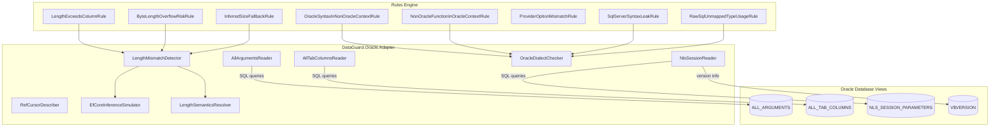
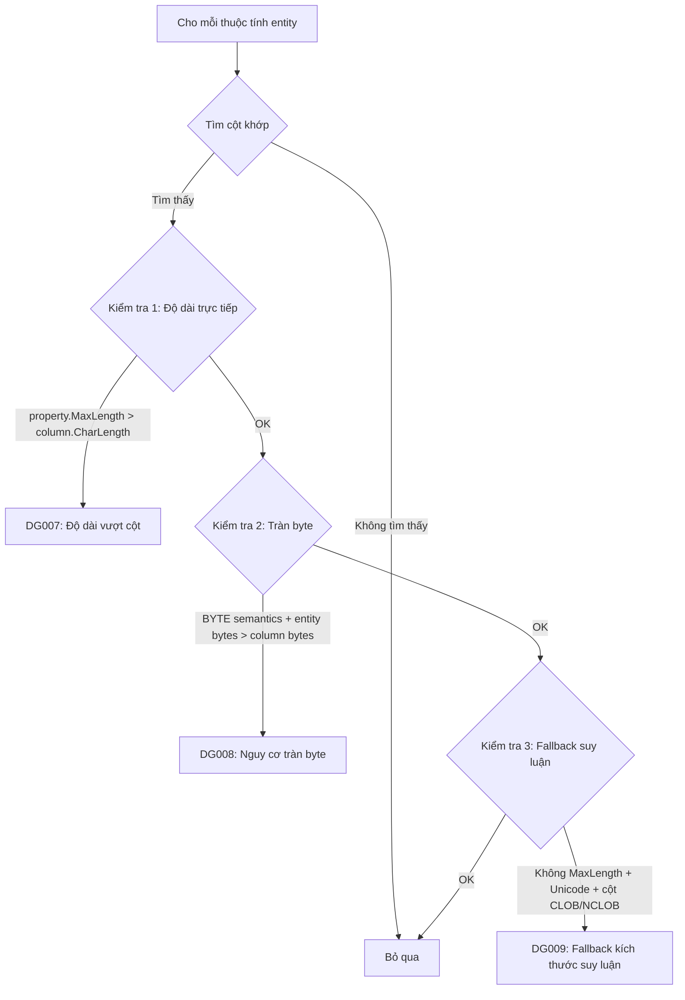

# Bộ Adapter Oracle

Bộ Adapter Oracle là adapter giàu tính năng nhất của DataGuard, cung cấp tích hợp sâu với Oracle Database để xác thực contract giữa các entity Entity Framework Core và stored procedure, package, raw SQL của Oracle.

## Kiến trúc



## File nguồn

| File | Kích thước | Mục đích |
|------|-----------|----------|
| `OracleReaders.cs` | 822 dòng | AllArgumentsReader, AllTabColumnsReader, NlsSessionReader, RefCursorDescriber |
| `OracleDialectChecker.cs` | 380 dòng | Engine phát hiện phương ngữ + 5 rules (DG010-DG014) |
| `LengthMismatch.cs` | 401 dòng | EfCoreInferenceSimulator, LengthSemanticsResolver, LengthMismatchDetector + 3 rules (DG007-DG009) |

## Phụ thuộc

```xml
<PackageReference Include="Oracle.ManagedDataAccess.Core" Version="23.26.300" />
<PackageReference Include="Microsoft.SqlServer.TransactSql.ScriptDom" Version="180.102.0" />
<ProjectReference Include="..\DataGuard.Core\DataGuard.Core.csproj" />
```

## AllArgumentsReader

Đọc tham số stored procedure từ view `ALL_ARGUMENTS` của Oracle. Xử lý procedure overloaded bằng cách bao gồm cột `SEQUENCE` và `OVERLOAD` trong khóa truy vấn.

### Quyết định thiết kế chính

- **Xử lý overload**: Oracle cho phép nhiều procedure cùng tên (overloading). Reader nhóm tham số theo `OVERLOAD` và `SUBPROGRAM_ID` để phân biệt từng chữ ký overload.
- **Giá trị trả về của function**: Các dòng có `POSITION = 0` đại diện cho giá trị trả về của function và bị bỏ qua (không phải tham số thực).
- **Kiểu do người dùng định nghĩa**: Khi `TYPE_OWNER` và `TYPE_NAME` có mặt, reader tạo tên kiểu đầy đủ (ví dụ: `HR.EMPLOYEE_TYPE`).
- **Đọc OVERLOAD phòng thủ**: Cột `OVERLOAD` là `NUMBER` trong một số phiên bản Oracle và `VARCHAR2` trong các phiên bản khác. `ReadOverload()` chuyển đổi phòng thủ bằng `Convert.ToString()`.

### Mẫu truy vấn

```sql
SELECT argument_name, in_out, data_type, data_length, data_precision,
       data_scale, position, sequence, overload, type_owner, type_name, type_subname
FROM all_arguments
WHERE owner = UPPER(:owner)
  AND (@packageName IS NULL OR package_name = :packageName)
  AND object_name = :procedureName
ORDER BY sequence, position
```

### Phương thức

| Phương thức | Trả về | Mô tả |
|-------------|--------|-------|
| `GetParametersAsync()` | `IReadOnlyList<ParameterDescriptor>` | Tham số cho một procedure overload cụ thể |
| `GetOverloadsAsync()` | `IReadOnlyList<ProcedureOverloadInfo>` | Tất cả overload được nhóm theo ID |
| `GetProcedureNamesAsync()` | `IReadOnlyList<string>` | Tên procedure/function duy nhất trong schema |

### ProcedureOverloadInfo

```csharp
public sealed class ProcedureOverloadInfo
{
    public int Sequence { get; init; }
    public int Overload { get; init; }
    public List<ParameterDescriptor> Parameters { get; init; } = new();
    public string SignatureKey => $"{Sequence}:{Overload}";
}
```

## AllTabColumnsReader

Đọc metadata cột từ `ALL_TAB_COLUMNS`, bao gồm cột quan trọng `CHAR_USED` cho biết độ dài cột tính bằng byte (`B`) hay ký tự (`C`).

### Cột được đọc

| Cột Oracle | Ánh xạ thành | Ghi chú |
|------------|---------------|---------|
| `COLUMN_NAME` | `Name` | Luôn viết hoa trong Oracle |
| `DATA_TYPE` | `DataType` | Ví dụ: `VARCHAR2`, `NUMBER`, `CLOB` |
| `DATA_LENGTH` | `MaxLength` | Độ dài byte |
| `CHAR_LENGTH` | `CharLength` | Độ dài ký tự (khác byte cho charset đa byte) |
| `DATA_PRECISION` | `Precision` | Cho kiểu NUMBER |
| `DATA_SCALE` | `Scale` | Cho kiểu NUMBER |
| `NULLABLE` | `IsNullable` | `Y` hoặc `N` |
| `CHAR_USED` | `CharUsed` | `B`=BYTE, `C`=CHAR, null=mặc định session |
| `DATA_DEFAULT` | `DataDefault` | Biểu thức giá trị mặc định |
| `COLUMN_ID` | `ColumnId` | Vị trí thứ tự |

### Phương thức

| Phương thức | Trả về | Mô tả |
|-------------|--------|-------|
| `GetColumnsAsync()` | `IReadOnlyList<ColumnDescriptor>` | Cột cho một bảng cụ thể |
| `GetAllColumnsAsync()` | `Dictionary<string, List<ColumnDescriptor>>` | Tất cả cột nhóm theo tên bảng |

### Chuẩn hóa CharUsed

Phương thức `NormalizeCharUsed()` chuyển đổi mã một ký tự của Oracle:

- `B` → `"BYTE"`
- `C` → `"CHAR"`
- `null` → `null` (quay lại `NLS_LENGTH_SEMANTICS` của session)

## NlsSessionReader

Đọc tham số session NLS ảnh hưởng đến ngữ nghĩa độ dài, bộ ký tự và phiên bản database.

### Tham số được đọc

| Tham số | Mục đích |
|---------|----------|
| `NLS_LENGTH_SEMANTICS` | Ngữ nghĩa độ dài mặc định (CHAR/BYTE) |
| `NLS_CHARACTERSET` | Bộ ký tự database (ví dụ: `AL32UTF8`) |
| `NLS_NCHAR_CHARACTERSET` | Bộ ký tự quốc gia (ví dụ: `AL16UTF16`) |
| `NLS_LANGUAGE` | Cài đặt ngôn ngữ |
| `NLS_TERRITORY` | Cài đặt vùng lãnh thổ |

### Phát hiện phiên bản database

Truy vấn `V$VERSION` và phân tích chuỗi banner:

```
Oracle Database 19c Enterprise Edition Release 19.0.0.0.0 - Production
```

Trích xuất số phiên bản (`19.0.0.0.0`) và edition (`Enterprise`/`Standard`/`Express`).

## RefCursorDescriber

Mô tả bộ kết quả `REF CURSOR` sử dụng package `DBMS_SQL`. Đây là cơ chế của Oracle để mô tả các cột output của con trỏ động.

## EfCoreInferenceSimulator

Mô phỏng hành vi suy luận kiểu của EF Core Oracle provider, phản ánh hành vi được mô tả trong [dotnet/efcore#33218](https://github.com/dotnet/efcore/issues/33218).

### Quy tắc suy luận

| Điều kiện | Kiểu suy luận |
|-----------|---------------|
| Unicode + không có MaxLength | `NVARCHAR2(2000)` |
| Không Unicode + không có MaxLength | `VARCHAR2(2000)` |
| Unicode + MaxLength > 4000 | `NCLOB` |
| Không Unicode + MaxLength > 4000 | `CLOB` |
| Unicode + MaxLength ≤ 4000 | `NVARCHAR2(n)` |
| Không Unicode + MaxLength ≤ 4000 | `VARCHAR2(n)` |

Mô phỏng này rất quan trọng để phát hiện **nguy cơ fallback NVARCHAR2(2000)** (DG009) — khi thuộc tính `string` không có attribute `[MaxLength]`, EF Core tự động suy luận `NVARCHAR2(2000)`, có thể gây ra `ORA-12899` tại runtime nếu giá trị vượt quá 2000 ký tự.

## LengthSemanticsResolver

Giải quyết tham số `NLS_LENGTH_SEMANTICS` cấp session để xác định database mặc định dùng `CHAR` hay `BYTE`.

```sql
SELECT value FROM nls_session_parameters WHERE parameter = 'NLS_LENGTH_SEMANTICS'
```

## LengthMismatchDetector

Engine phát hiện cốt lõi so sánh thuộc tính entity với cột Oracle. Chạy ba kiểm tra riêng biệt cho mỗi thuộc tính.

### Flow phát hiện



### Kiểm tra 1: Độ dài vượt cột (DG007)

So sánh `property.MaxLength` (số ký tự) với `column.CharLength` (số ký tự). Quay lại `column.MaxLength` (số byte) chỉ khi `CharLength` là null.

### Kiểm tra 2: Nguy cơ tràn byte (DG008)

Khi cột dùng ngữ nghĩa BYTE (`CHAR_USED = 'B'` hoặc mặc định session là BYTE), tính toán tiêu hao byte trường hợp xấu nhất:

- Unicode (`string`): 4 byte mỗi ký tự (ký tự bổ sung AL32UTF8)
- Không Unicode: 1 byte mỗi ký tự

Nếu `entityMaxBytes > column.MaxLength`, báo cáo warning.

### Kiểm tra 3: Fallback kích thước suy luận (DG009)

Khi thuộc tính `string` không có `[MaxLength]` và cột Oracle là `CLOB`/`NCLOB`, cảnh báo rằng EF Core sẽ suy luận `NVARCHAR2(2000)` — nguy cơ cắt ngắn im lặng.

## OracleDialectChecker

Phát hiện vấn đề cú pháp SQL cross-dialect. Sử dụng regex word-boundary để tránh false positive trên khớp một phần.

### Từ khóa chỉ Oracle

`DECODE`, `NVL`, `NVL2`, `DUAL`, `ROWNUM`, `CONNECT BY`, `START WITH`, `SYSDATE`, `SYSTIMESTAMP`, `NEXTVAL`, `CURRVAL`, `ROWID`, `LISTAGG`, `WM_CONCAT`, `XMLAGG`, `XMLFOREST`, `XMLELEMENT`, `REGEXP_LIKE`, `REGEXP_REPLACE`, `REGEXP_SUBSTR`, `REGEXP_INSTR`

### Toán tử chỉ Oracle

`(+)`, `||`, `**`, `CONCAT`

### Từ khóa SQL Server (phát hiện trong ngữ cảnh Oracle)

`ISNULL`, `GETDATE`, `GETUTCDATE`, `DATEADD`, `DATEDIFF`, `DATEPART`, `DATENAME`, `IDENTITY`, `NEWID`, `NEWSEQUENTIALID`, `IIF`, `CHOOSE`, `FORMAT`, `TRY_CAST`, `TRY_CONVERT`, `TRY_PARSE`

## Tham chiếu Rules

### DG007 — Độ dài entity vượt độ dài cột

| Thuộc tính | Giá trị |
|------------|---------|
| **Mức độ** | Error |
| **Kích hoạt** | `property.MaxLength > column.CharLength` |
| **Thông báo** | Entity property '{name}' MaxLength={n} exceeds column '{col}' length={m} |

### DG008 — Nguy cơ tràn byte

| Thuộc tính | Giá trị |
|------------|---------|
| **Mức độ** | Warning |
| **Kích hoạt** | BYTE semantics + `entityMaxBytes > column.MaxLength` |
| **Thông báo** | Byte overflow risk: property '{name}' may exceed column '{col}' byte capacity |

### DG009 — Nguy cơ fallback kích thước suy luận

| Thuộc tính | Giá trị |
|------------|---------|
| **Mức độ** | Warning |
| **Kích hoạt** | Không MaxLength + Unicode + cột CLOB/NCLOB |
| **Thông báo** | EF Core will infer NVARCHAR2(2000) for property '{name}' — ORA-12899 risk |

### DG010 — Cú pháp Oracle trong ngữ cảnh không phải Oracle

| Thuộc tính | Giá trị |
|------------|---------|
| **Mức độ** | Warning |
| **Kích hoạt** | Từ khóa/toán tử Oracle trong SQL không phải Oracle |
| **Thông báo** | Oracle-specific keyword '{keyword}' used in non-Oracle context |

### DG011 — Function không phải Oracle trong ngữ cảnh Oracle

| Thuộc tính | Giá trị |
|------------|---------|
| **Mức độ** | Warning |
| **Kích hoạt** | Function SQL Server (`ISNULL`, `TOP`, `GETDATE`) trong SQL Oracle |
| **Thông báo** | SQL Server-specific keyword '{keyword}' used in Oracle context |

### DG012 — Không khớp tùy chọn provider

| Thuộc tính | Giá trị |
|------------|---------|
| **Mức độ** | Error |
| **Kích hoạt** | Ngữ cảnh Oracle nhưng provider không phải Oracle |
| **Thông báo** | Oracle context detected but provider is '{provider}' |

### DG013 — Rò rỉ cú pháp SQL Server

| Thuộc tính | Giá trị |
|------------|---------|
| **Mức độ** | Warning |
| **Kích hoạt** | Mẫu `EXEC dbo.Procedure` trong ngữ cảnh Oracle |
| **Thông báo** | SQL Server EXEC syntax used in Oracle context |

### DG014 — Sử dụng kiểu không ánh xạ trong raw SQL

| Thuộc tính | Giá trị |
|------------|---------|
| **Mức độ** | Warning |
| **Kích hoạt** | Kiểu SQL Server (`UNIQUEIDENTIFIER`, `MONEY`, `DATETIME2`, etc.) trong raw SQL Oracle |
| **Thông báo** | Type '{type}' used with Oracle EF Core raw SQL but not mapped by provider |

## Sử dụng trong CLI

Bộ adapter Oracle được kích hoạt khi truyền `--provider oracle`:

```bash
# Xác thực đầy đủ với Oracle provider
dataguard validate --provider oracle --connection "User Id=hr;Password=***;Data Source=ORCL"

# Kiểm tra phương ngữ và độ dài Oracle
dataguard oracle-check --connection "User Id=hr;Password=***;Data Source=ORCL" --schema HR

# Snapshot với capture schema Oracle
dataguard snapshot refresh --provider oracle --connection "..." --schema HR
```

Lệnh `oracle-check` chạy toàn bộ pipeline xác thực Oracle:

1. Giải quyết ngữ nghĩa độ dài NLS (CHAR vs BYTE)
2. Đọc toàn bộ schema (tất cả bảng, tất cả cột)
3. Chạy kiểm tra phương ngữ với kiểu cột
4. Báo cáo sử dụng kiểu không ánh xạ
