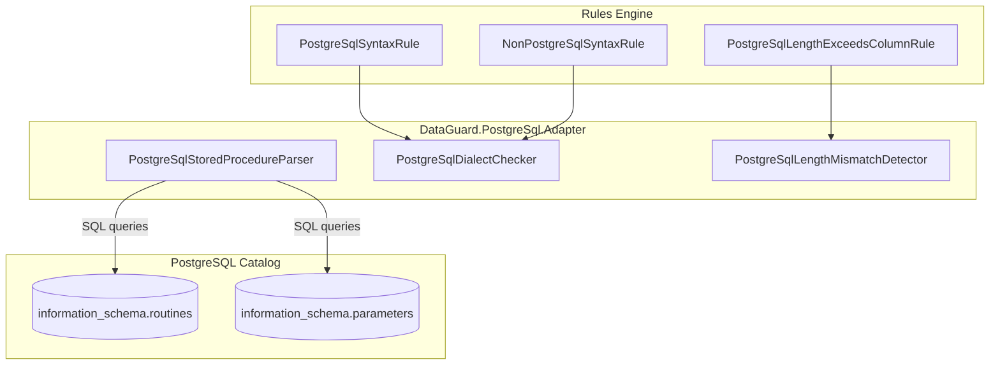

# PostgreSQL Adapter

The PostgreSQL Adapter provides contract validation between .NET entities and PostgreSQL stored procedures using the Npgsql library and `information_schema` / `pg_catalog` views.

## Architecture



## Source Files

| File | Lines | Purpose |
|------|-------|---------|
| `PostgreSqlStoredProcedureParser.cs` | ~90 | IContractSource implementation for PostgreSQL SPs |
| `PostgreSqlDialectChecker.cs` | ~90 | Dialect detection + PG001/PG002 rules |
| `PostgreSqlLengthMismatchDetector.cs` | ~60 | Length mismatch detection + PG003 rule |

## Dependencies

```xml
<PackageReference Include="Npgsql" Version="9.0.3" />
<ProjectReference Include="..\DataGuard.Core\DataGuard.Core.csproj" />
```

## PostgreSqlStoredProcedureParser

Implements `IContractSource` to extract stored procedure contracts from PostgreSQL's `information_schema`.

### Query Pattern

```sql
SELECT r.routine_name, p.parameter_name, p.data_type, p.parameter_mode,
       p.ordinal_position, p.character_maximum_length, p.numeric_precision,
       p.numeric_scale, r.specific_name
FROM information_schema.routines r
LEFT JOIN information_schema.parameters p
  ON r.specific_schema = p.specific_schema AND r.specific_name = p.specific_name
WHERE r.routine_type = 'PROCEDURE' AND r.routine_schema = @schema
ORDER BY r.routine_name, p.ordinal_position
```

### Key Design Decisions

- **Default schema**: Defaults to `"public"` (PostgreSQL convention) rather than empty string.
- **Overload handling**: PostgreSQL supports function overloading via `specific_name` (unique per overload). The parser keys by `specific_name` to prevent same-named overloads from merging.
- **NULL parameter skip**: When `ordinal_position IS NULL` (LEFT JOIN filler for parameterless procedures), the row is skipped.
- **No package support**: PostgreSQL does not have packages — `PackageName` is always empty.

### Direction Mapping

| PostgreSQL Mode | DataGuard Direction |
|-----------------|---------------------|
| `IN` | `Input` |
| `OUT` | `Output` |
| `INOUT` | `InputOutput` |

### Contract ID Format

```
postgres:{schema}.{specific_name}
```

The `specific_name` is used instead of `routine_name` to handle overloaded functions correctly.

## PostgreSqlDialectChecker

Detects PostgreSQL-specific syntax in non-PostgreSQL contexts and vice versa.

### PostgreSQL-Only Keywords

| Keyword | Purpose |
|---------|---------|
| `SERIAL` | Auto-incrementing integer |
| `BIGSERIAL` | Auto-incrementing bigint |
| `ILIKE` | Case-insensitive LIKE |
| `::` | Type cast operator |

### Non-PostgreSQL Keywords (detected in PostgreSQL context)

| Keyword | Origin |
|---------|--------|
| `NVL` | Oracle |
| `TOP ` | SQL Server |
| `ROWNUM` | Oracle |
| `GETDATE` | SQL Server |
| `CONVERT(` | SQL Server |
| `DATEPART` | SQL Server |

## PostgreSqlLengthMismatchDetector

Compares entity `MaxLength` against PostgreSQL column `character_maximum_length`. Direct comparison — PostgreSQL stores character length (not byte length) in `information_schema`.

### Detection Logic

```csharp
foreach (var property in entity.Properties)
{
    var column = columns.FirstOrDefault(c =>
        string.Equals(c.Name, property.ColumnName, StringComparison.OrdinalIgnoreCase));
    if (column == null || !property.MaxLength.HasValue || !column.MaxLength.HasValue)
        continue;

    if (property.MaxLength.Value > column.MaxLength.Value)
        yield return new ContractViolation("PG003", ...);
}
```

## Rules Reference

### PG001 — PostgreSQL Syntax in Non-PostgreSQL Context

| Property | Value |
|----------|-------|
| **Severity** | Warning |
| **Trigger** | PostgreSQL keywords (`SERIAL`, `ILIKE`, `::`, etc.) in non-PostgreSQL SQL |
| **Message** | PostgreSQL-specific syntax '{syntax}' used in non-PostgreSQL context |

### PG002 — Non-PostgreSQL Syntax in PostgreSQL Context

| Property | Value |
|----------|-------|
| **Severity** | Warning |
| **Trigger** | Oracle/SQL Server keywords (`NVL`, `TOP`, `GETDATE`, `CONVERT`, etc.) in PostgreSQL SQL |
| **Message** | Non-PostgreSQL syntax '{syntax}' used in PostgreSQL context |

### PG003 — Entity Length Exceeds PostgreSQL Column Length

| Property | Value |
|----------|-------|
| **Severity** | Error |
| **Trigger** | `property.MaxLength > column.MaxLength` |
| **Message** | Entity property '{name}' MaxLength={n} exceeds column '{col}' length={m} |

## Usage in CLI

```bash
# Validate PostgreSQL contracts
dataguard validate --provider postgresql --connection "Host=localhost;Database=mydb;Username=postgres;..."

# Short form
dataguard validate --provider postgres --connection "..." --schema public
```

Both `postgresql` and `postgres` are accepted as provider names.

## PostgreSQL-Specific Considerations

### Function vs Procedure

PostgreSQL 11+ introduced `PROCEDURE` as a distinct object from `FUNCTION`. The parser filters by `routine_type = 'PROCEDURE'` to match the DataGuard contract model. Functions with return values are not yet covered.

### Overloaded Functions

PostgreSQL allows multiple functions with the same name but different parameter types (overloading). The `specific_name` column in `information_schema.routines` is unique per overload and used as the contract key.

### Schema Qualification

PostgreSQL's `information_schema` is case-sensitive for schema names. The default `"public"` schema is lowercase, matching PostgreSQL conventions.

### Type System

PostgreSQL has a rich type system including arrays, composite types, and custom domains. The adapter currently reads only the base `data_type` from `information_schema.parameters`, which covers standard types but may not fully represent complex types.
