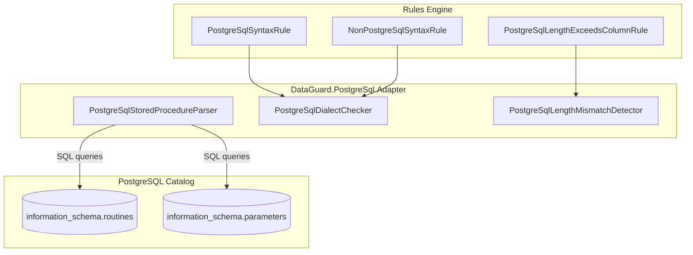

# PostgreSQL Adapter

The PostgreSQL Adapter provides contract validation between .NET entities and PostgreSQL stored procedures using the Npgsql library and `information_schema` / `pg_catalog` views.

## Architecture


```mermaid
graph TB
    subgraph "DataGuard.PostgreSql.Adapter"
        PSP[PostgreSqlStoredProcedureParser]
        PDC[PostgreSqlDialectChecker]
        PLMD[PostgreSqlLengthMismatchDetector]
    end

    subgraph "PostgreSQL Catalog"
        R[(information_schema.routines)]
        P[(information_schema.parameters)]
    end

    subgraph "Rules Engine"
        PG001[PostgreSqlSyntaxRule]
        PG002[NonPostgreSqlSyntaxRule]
        PG003[PostgreSqlLengthExceedsColumnRule]
    end

    PSP -->|SQL queries| R
    PSP -->|SQL queries| P

    PG001 --> PDC
    PG002 --> PDC
    PG003 --> PLMD
```

## Source Files

| File | Lines | Purpose |
|------|-------|---------|
| `PostgreSqlStoredProcedureParser.cs` | ~90 | IContractSource implementation for PostgreSQL SPs |
| `PostgreSqlDialectChecker.cs` | ~90 | Dialect detection + PG001/PG002 rules |
| `PostgreSqlLengthMismatchDetector.cs` | ~60 | Length mismatch detection + PG003 rule |

## Dependencies

```xml
<PackageReference Include="Npgsql" Version="9.0.3" />
<ProjectReference Include="..\DataGuard.Core\DataGuard.Core.csproj" />
```

## PostgreSqlStoredProcedureParser

Implements `IContractSource`. It reads functions and procedures from `pg_proc` + `pg_type`, and it reads tables, views and materialized views for the length rules.

### Query Pattern

```sql
SELECT p.proname, n.nspname, p.proargnames, p.proargtypes, p.proallargtypes, p.proargmodes,
       p.prorettype, p.oid, p.prokind, p.pronargs, p.pronargdefaults, p.proretset
FROM pg_proc p JOIN pg_namespace n ON n.oid = p.pronamespace
WHERE n.nspname = @schema AND p.prokind IN ('f', 'p')
```

Table columns come from `information_schema.columns`. Materialized views are not in that view, so their columns are read from `pg_matviews` joined to `pg_attribute`. Table keys are the exact catalog names, compared ordinally. Each `DatabaseTableDescriptor` has `Schema` set.

### Key Design Decisions

- **Default schema**: `"public"`.
- **RETURNS TABLE**: `proargmodes` `'t'` arguments become `ResultColumns` (name, `typname`) and are not parameters.
- **Defaults**: `pronargdefaults = N` sets `HasDefault` on the last N input (`i`/`b`/`v`) parameters.
- **Unnamed arguments**: an empty `proargnames` entry becomes `p{i}` (1-based).
- **Return type**: functions carry `ReturnType = typname(prorettype)`; `refcursor` sets `ReturnsRefCursor`.
- **No package support**: `PackageName` is always empty.

### Direction Mapping

| `proargmodes` | DataGuard |
|---------------|-----------|
| `i` | `Input` |
| `o` | `Output` |
| `b` | `InputOutput` |
| `v` (VARIADIC) | `Input` |
| `t` (TABLE) | result column |

### Contract ID Format

```
postgres:{schema}.{name}({in-arg type names})
```

For example, `postgres:public.find_orders(int4,text)`. The signature is built from `proargtypes`, the IN, INOUT and VARIADIC arguments, which is what PostgreSQL uses to resolve overloads. Unlike OIDs, the signature is stable across dump and restore.

## PostgreSqlDialectChecker

Detects PostgreSQL-specific syntax in non-PostgreSQL contexts and vice versa.

### PostgreSQL-Only Keywords

| Keyword | Purpose |
|---------|---------|
| `SERIAL` | Auto-incrementing integer |
| `BIGSERIAL` | Auto-incrementing bigint |
| `ILIKE` | Case-insensitive LIKE |
| `::` | Type cast operator |

### Non-PostgreSQL Keywords (detected in PostgreSQL context)

| Keyword | Origin |
|---------|--------|
| `NVL` | Oracle |
| `TOP ` | SQL Server |
| `ROWNUM` | Oracle |
| `GETDATE` | SQL Server |
| `CONVERT(` | SQL Server |
| `DATEPART` | SQL Server |

## PostgreSqlLengthMismatchDetector

Compares entity `MaxLength` against PostgreSQL `character_maximum_length`. PostgreSQL limits `varchar(n)`/`char(n)` in characters, so there is no byte check. Each property yields **at most one PG003**, picked in this order:

1. Entity `MaxLength` > column length (Error).
2. Entity `MaxLength` > VARCHAR maximum 10,485,760 (Error).
3. `MaxLength` on an unlimited column (`text`/`json`/`jsonb`/`bytea`) (Info).
4. No `MaxLength` but the column is `varchar(n)` (Warning).

Columns match on the EF column name, then the property name, then snake_case (`CustomerName` ⇒ `customer_name`); an exact-case match wins. Tables resolve by `(schema, name)`: the exact case first, then a fallback through `SchemaObjectName.Canonical("postgresql", ...)`.

## Rules Reference

### PG001 — PostgreSQL Syntax in Non-PostgreSQL Context

| Property | Value |
|----------|-------|
| **Severity** | Warning |
| **Trigger** | PostgreSQL keywords (`SERIAL`, `ILIKE`, `::`, etc.) in non-PostgreSQL SQL |
| **Message** | PostgreSQL-specific syntax '{syntax}' used in non-PostgreSQL context |
| **Context** | The descriptor's `ConnectionProviderHint`, or the catalog provider when there is no hint. The rule is a no-op when the context is `postgresql`, so PostgreSQL's own syntax is never reported under `--provider postgresql`. Without a provider and a hint the context counts as non-PostgreSQL. |

### PG002 — Non-PostgreSQL Syntax in PostgreSQL Context

| Property | Value |
|----------|-------|
| **Severity** | Warning |
| **Trigger** | Oracle/SQL Server keywords (`NVL`, `TOP`, `GETDATE`, `CONVERT`, etc.) in PostgreSQL SQL |
| **Message** | Non-PostgreSQL syntax '{syntax}' used in PostgreSQL context |

Each construct is reported once. The dedicated patterns (`TOP n`, `EXEC schema.proc`, `LIMIT offset, count`, `NVL(`, `DECODE(`, `ISNULL(`, `GETDATE()`, `IDENTITY(`) run first and carry a `suggestion`; a keyword they already reported is skipped by the keyword lists. PostgreSQL's own syntax is not reported: plain `LIMIT n`, `GENERATED ... AS IDENTITY`, and `COALESCE` (ANSI SQL, never listed as Oracle-specific in any dialect checker).

### PG003 — Entity Length Exceeds PostgreSQL Column Length

| Property | Value |
|----------|-------|
| **Severity** | Error |
| **Trigger** | `property.MaxLength > column.MaxLength` |
| **Message** | Entity property '{name}' MaxLength={n} exceeds column '{col}' length={m} |

## Usage in CLI

```bash
# Validate PostgreSQL contracts
dataguard validate --provider postgresql --connection "Host=localhost;Database=mydb;Username=postgres;..."

# Short form
dataguard validate --provider postgres --connection "..." --schema public
```

Both `postgresql` and `postgres` are accepted as provider names.

## PostgreSQL-Specific Considerations

### Function vs Procedure

PostgreSQL 11+ introduced `PROCEDURE` as a distinct object from `FUNCTION`. The parser reads both (`prokind IN ('f','p')`); functions carry `ReturnType`.

### Overloaded Functions

PostgreSQL allows multiple functions with the same name but different parameter types (overloading). The IN-argument type signature in the contract Id keeps overloads distinct.

### Schema Qualification

PostgreSQL's `information_schema` is case-sensitive for schema names. The default `"public"` schema is lowercase, matching PostgreSQL conventions.

### Type System

PostgreSQL has a rich type system including arrays, composite types, and custom domains. The adapter currently reads only the base `data_type` from `information_schema.parameters`, which covers standard types but may not fully represent complex types.
