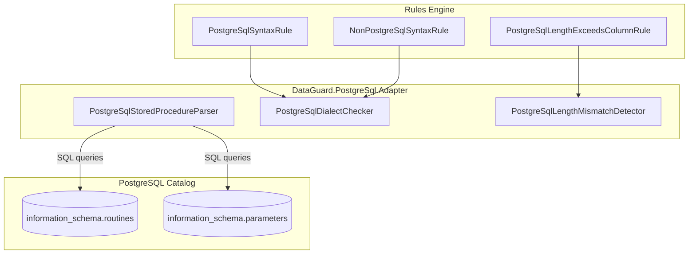

# Bộ Adapter PostgreSQL

Bộ Adapter PostgreSQL cung cấp xác thực contract giữa các entity .NET và stored procedure PostgreSQL sử dụng thư viện Npgsql và các view `information_schema` / `pg_catalog`.

## Kiến trúc



## File nguồn

| File | Dòng | Mục đích |
|------|------|----------|
| `PostgreSqlStoredProcedureParser.cs` | ~90 | Triển khai IContractSource cho PostgreSQL SP |
| `PostgreSqlDialectChecker.cs` | ~90 | Phát hiện phương ngữ + rules PG001/PG002 |
| `PostgreSqlLengthMismatchDetector.cs` | ~60 | Phát hiện sai lệch độ dài + rule PG003 |

## Phụ thuộc

```xml
<PackageReference Include="Npgsql" Version="9.0.3" />
<ProjectReference Include="..\DataGuard.Core\DataGuard.Core.csproj" />
```

## PostgreSqlStoredProcedureParser

Triển khai `IContractSource` để trích xuất contract stored procedure từ `information_schema` của PostgreSQL.

### Mẫu truy vấn

```sql
SELECT r.routine_name, p.parameter_name, p.data_type, p.parameter_mode,
       p.ordinal_position, p.character_maximum_length, p.numeric_precision,
       p.numeric_scale, r.specific_name
FROM information_schema.routines r
LEFT JOIN information_schema.parameters p
  ON r.specific_schema = p.specific_schema AND r.specific_name = p.specific_name
WHERE r.routine_type = 'PROCEDURE' AND r.routine_schema = @schema
ORDER BY r.routine_name, p.ordinal_position
```

### Quyết định thiết kế chính

- **Schema mặc định**: Mặc định là `"public"` (quy ước PostgreSQL) thay vì chuỗi rỗng.
- **Xử lý overload**: PostgreSQL hỗ trợ overload function qua `specific_name` (duy nhất cho mỗi overload). Parser dùng `specific_name` làm khóa để tránh merge các overload cùng tên.
- **Bỏ qua tham số NULL**: Khi `ordinal_position IS NULL` (dòng filler LEFT JOIN cho procedure không tham số), dòng bị bỏ qua.
- **Không hỗ trợ package**: PostgreSQL không có package — `PackageName` luôn rỗng.

### Ánh xạ direction

| PostgreSQL Mode | Direction DataGuard |
|-----------------|---------------------|
| `IN` | `Input` |
| `OUT` | `Output` |
| `INOUT` | `InputOutput` |

### Định dạng Contract ID

```
postgres:{schema}.{specific_name}
```

`specific_name` được sử dụng thay vì `routine_name` để xử lý chính xác các function overloaded.

## PostgreSqlDialectChecker

Phát hiện cú pháp đặc thù PostgreSQL trong ngữ cảnh không phải PostgreSQL và ngược lại.

### Từ khóa chỉ PostgreSQL

| Từ khóa | Mục đích |
|---------|----------|
| `SERIAL` | Integer tự động tăng |
| `BIGSERIAL` | Bigint tự động tăng |
| `ILIKE` | LIKE không phân biệt hoa thường |
| `::` | Toán tử chuyển đổi kiểu |

### Từ khóa không phải PostgreSQL (phát hiện trong ngữ cảnh PostgreSQL)

| Từ khóa | Nguồn gốc |
|---------|-----------|
| `NVL` | Oracle |
| `TOP ` | SQL Server |
| `ROWNUM` | Oracle |
| `GETDATE` | SQL Server |
| `CONVERT(` | SQL Server |
| `DATEPART` | SQL Server |

## PostgreSqlLengthMismatchDetector

So sánh `MaxLength` của entity với `character_maximum_length` của cột PostgreSQL. So sánh trực tiếp — PostgreSQL lưu độ dài ký tự (không phải byte) trong `information_schema`.

### Logic phát hiện

```csharp
foreach (var property in entity.Properties)
{
    var column = columns.FirstOrDefault(c =>
        string.Equals(c.Name, property.ColumnName, StringComparison.OrdinalIgnoreCase));
    if (column == null || !property.MaxLength.HasValue || !column.MaxLength.HasValue)
        continue;

    if (property.MaxLength.Value > column.MaxLength.Value)
        yield return new ContractViolation("PG003", ...);
}
```

## Tham chiếu Rules

### PG001 — Cú pháp PostgreSQL trong ngữ cảnh không phải PostgreSQL

| Thuộc tính | Giá trị |
|------------|---------|
| **Mức độ** | Warning |
| **Kích hoạt** | Từ khóa PostgreSQL (`SERIAL`, `ILIKE`, `::`, etc.) trong SQL không phải PostgreSQL |
| **Thông báo** | PostgreSQL-specific syntax '{syntax}' used in non-PostgreSQL context |

### PG002 — Cú pháp không phải PostgreSQL trong ngữ cảnh PostgreSQL

| Thuộc tính | Giá trị |
|------------|---------|
| **Mức độ** | Warning |
| **Kích hoạt** | Từ khóa Oracle/SQL Server (`NVL`, `TOP`, `GETDATE`, `CONVERT`, etc.) trong SQL PostgreSQL |
| **Thông báo** | Non-PostgreSQL syntax '{syntax}' used in PostgreSQL context |

### PG003 — Độ dài entity vượt độ dài cột PostgreSQL

| Thuộc tính | Giá trị |
|------------|---------|
| **Mức độ** | Error |
| **Kích hoạt** | `property.MaxLength > column.MaxLength` |
| **Thông báo** | Entity property '{name}' MaxLength={n} exceeds column '{col}' length={m} |

## Sử dụng trong CLI

```bash
# Xác thực contract PostgreSQL
dataguard validate --provider postgresql --connection "Host=localhost;Database=mydb;Username=postgres;..."

# Viết tắt
dataguard validate --provider postgres --connection "..." --schema public
```

Cả `postgresql` và `postgres` đều được chấp nhận làm tên provider.

## Lưu ý đặc thù PostgreSQL

### Function vs Procedure

PostgreSQL 11+ giới thiệu `PROCEDURE` như một đối tượng riêng biệt với `FUNCTION`. Parser lọc theo `routine_type = 'PROCEDURE'` để khớp mô hình contract DataGuard. Function có giá trị trả về chưa được hỗ trợ.

### Function overloaded

PostgreSQL cho phép nhiều function cùng tên nhưng khác kiểu tham số (overloading). Cột `specific_name` trong `information_schema.routines` là duy nhất cho mỗi overload và được dùng làm khóa contract.

### Qualification schema

`information_schema` của PostgreSQL phân biệt hoa thường cho tên schema. Schema mặc định `"public"` là chữ thường, khớp quy ước PostgreSQL.

### Hệ thống kiểu

PostgreSQL có hệ thống kiểu phong phú bao gồm array, kiểu composite, và domain tùy chỉnh. Adapter hiện chỉ đọc `data_type` cơ bản từ `information_schema.parameters`, bao gồm các kiểu tiêu chuẩn nhưng có thể không biểu diễn đầy đủ các kiểu phức tạp.
