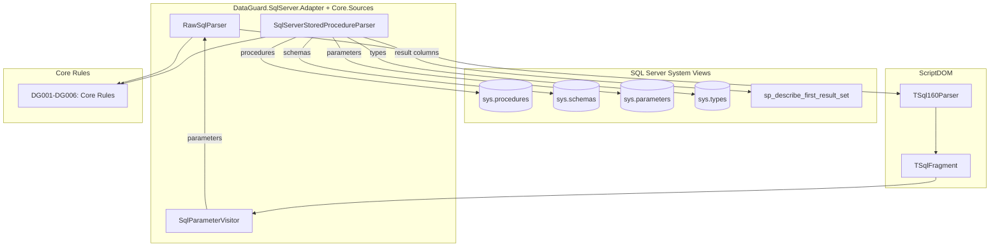
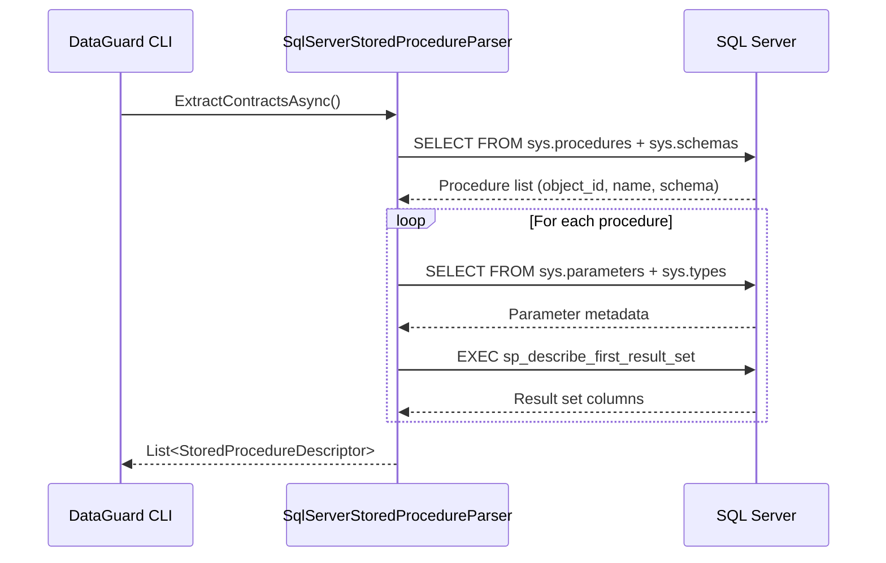

# SQL Server Adapter

The SQL Server Adapter is DataGuard's primary adapter, providing contract validation between .NET entities and SQL Server stored procedures, raw SQL, and ScriptDOM-based SQL parsing.

## Architecture



## Source Files

| File | Location | Lines | Purpose |
|------|----------|-------|---------|
| `SqlServerParsers.cs` | `DataGuard.Core/Sources/` | 346 | SqlServerStoredProcedureParser, RawSqlParser, SqlParameterVisitor |
| `DataGuard.SqlServer.Adapter.csproj` | `DataGuard.SqlServer.Adapter/` | — | Project file with dependencies |

## Dependencies

```xml
<PackageReference Include="Microsoft.Data.SqlClient" Version="7.0.2" />
<PackageReference Include="Microsoft.SqlServer.TransactSql.ScriptDom" Version="180.102.0" />
<PackageReference Include="Microsoft.EntityFrameworkCore" Version="9.0.19" />
<PackageReference Include="Microsoft.EntityFrameworkCore.Relational" Version="9.0.19" />
<ProjectReference Include="..\DataGuard.Core\DataGuard.Core.csproj" />
```

## SqlServerStoredProcedureParser

Implements `IContractSource` to extract stored procedure contracts from SQL Server system catalog views.

### Extraction Flow



### Procedure Discovery

Queries `sys.procedures` joined with `sys.schemas` to get all user-defined stored procedures:

```sql
SELECT p.object_id, p.name, s.name AS schema_name
FROM sys.procedures p
INNER JOIN sys.schemas s ON p.schema_id = s.schema_id
WHERE p.is_ms_shipped = 0
```

### Parameter Reading

For each procedure, reads parameters from `sys.parameters` joined with `sys.types`:

```sql
SELECT p.name, t.name AS DataType, p.max_length, p.precision,
       p.scale, p.is_nullable, p.parameter_id, p.is_output
FROM sys.parameters p
INNER JOIN sys.types t ON p.user_type_id = t.user_type_id
WHERE p.object_id = @ObjectId
ORDER BY p.parameter_id
```

**Key details:**
- `max_length = -1` indicates `MAX` types (e.g., `varchar(max)`) — normalized to `null`
- `is_output = true` maps to `ParameterDirection.InputOutput` (SQL Server uses `OUTPUT` keyword)
- Direction is simplified: SQL Server only has `INPUT` and `OUTPUT` (no `IN OUT` like Oracle)

### Result Column Discovery

Uses `sp_describe_first_result_set` to discover the shape of a stored procedure's first result set:

```sql
EXEC sp_describe_first_result_set N'EXEC [schema].[proc]', NULL, 1
```

**Result set columns:**

| Ordinal | Column | Maps To |
|---------|--------|---------|
| 0 | `is_hidden` | (skipped) |
| 1 | `column_ordinal` | OrdinalPosition |
| 2 | `name` | Name |
| 3 | `is_nullable` | IsNullable |
| 5 | `system_type_name` | DataType |
| 6 | `max_length` | MaxLength |
| 7 | `precision` | Precision |
| 8 | `scale` | Scale |

**Error handling:** SQL errors 11512/11513 indicate the procedure returns no result set — these are silently caught and return an empty column list.

### SQL Name Escaping

The `EscapeSqlName()` method escapes bracket-delimited identifiers by doubling closing brackets:

```csharp
private static string EscapeSqlName(string name) => name.Replace("]", "]]");
```

## RawSqlParser

Parses raw SQL text using Microsoft's ScriptDOM library (`TSql160Parser`) to extract parameter declarations and validate SQL structure.

### ScriptDOM Integration


### Parser Configuration

```csharp
var parser = new TSql160Parser(true); // true = initialQuotedIdentifiers
IList<ParseError> errors = new List<ParseError>();
var fragment = parser.Parse(new StringReader(_sqlText), out errors);
```

The `TSql160Parser` targets SQL Server 2022 (T-SQL 16.0) syntax. The `initialQuotedIdentifiers` flag enables quoted identifier parsing by default.

### SqlParameterVisitor

A `TSqlFragmentVisitor` subclass that visits `ProcedureParameter` nodes in the AST to extract parameter metadata.

**Type extraction strategy:**

The visitor extracts the SQL-facing type name (e.g., `varchar(50)`) rather than the .NET type name of the ScriptDOM AST node (`SqlDataTypeReference`). This ensures the type name matches what developers see in SQL Server Management Studio.

**Length/precision/scale extraction:**

ScriptDOM stores these as literal parameters in the `Parameters` collection:

| SQL Type | Parameters[0] | Parameters[1] |
|----------|---------------|---------------|
| `varchar(50)` | 50 (length) | — |
| `decimal(10,2)` | 10 (precision) | 2 (scale) |
| `varchar(max)` | special max literal | — |

The visitor dispatches on type category:
- **Char/binary types**: `Parameters[0]` → `MaxLength`
- **Numeric types**: `Parameters[0]` → `Precision`, `Parameters[1]` → `Scale`

### SqlParameterInfo

```csharp
internal record SqlParameterInfo(
    string Name,
    string DataType,
    int? MaxLength,
    byte? Precision,
    byte? Scale,
    int Ordinal);
```

## SQL Server-Specific Behavior

### No CHAR/BYTE Semantics

Unlike Oracle, SQL Server does not have CHAR vs BYTE length semantics. The `CharUsed` field is always `null` for SQL Server columns, and `CharLength` equals `MaxLength`.

### Direction Mapping

SQL Server's `OUTPUT` keyword maps to `ParameterDirection.InputOutput` in DataGuard's model. There is no pure `Output` direction in SQL Server — `OUTPUT` parameters can also receive input values.

### MAX Types

SQL Server's `varchar(max)`, `nvarchar(max)`, and `varbinary(max)` types have `max_length = -1` in system views. The parser normalizes these to `null` in the `MaxLength` field, indicating unlimited length.

## Usage in CLI

The SQL Server adapter is the default provider:

```bash
# Default validation (SQL Server)
dataguard validate --connection "Server=localhost;Database=MyDb;..."

# Explicit provider
dataguard validate --provider sqlserver --connection "..."

# Snapshot with SQL Server schema
dataguard snapshot refresh --provider sqlserver --connection "..." --schema dbo
```

When `--provider sqlserver` (or no provider specified), the CLI:

1. Discovers all stored procedures via `sys.procedures`
2. Reads parameters via `sys.parameters`
3. Describes result sets via `sp_describe_first_result_set`
4. Runs core rules (DG001-DG006) against the extracted contracts
