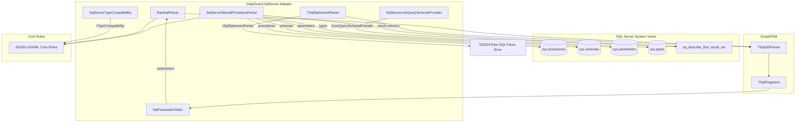
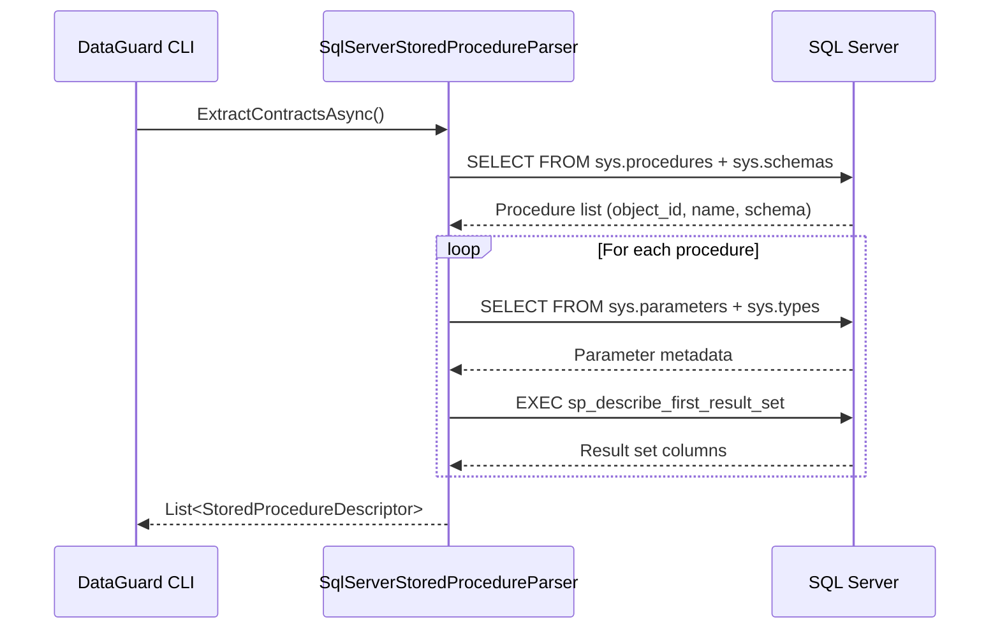

# SQL Server Adapter

The SQL Server Adapter is DataGuard's primary adapter, providing contract validation between .NET entities and SQL Server stored procedures, raw SQL, and ScriptDOM-based SQL parsing.

## Architecture


```mermaid
graph TB
    subgraph "DataGuard.SqlServer.Adapter"
        SPSp[SqlServerStoredProcedureParser]
        RSP[RawSqlParser]
        SV[SqlParameterVisitor]
        TSP[TSqlStatementParser]
        LQ[SqlServerLiveQuerySchemaProvider]
        TC[SqlServerTypeCompatibility]
    end

    subgraph "SQL Server System Views"
        SP[(sys.procedures)]
        SR[(sys.schemas)]
        SYSP[(sys.parameters)]
        SYST[(sys.types)]
        SDRS[sp_describe_first_result_set]
    end

    subgraph "ScriptDOM"
        P[TSql160Parser]
        F[TSqlFragment]
    end

    subgraph "Core Rules"
        DG001-DG006[DG001-DG006: Core Rules]
    end

    SPSp -->|procedures| SP
    SPSp -->|schemas| SR
    SPSp -->|parameters| SYSP
    SPSp -->|types| SYST
    SPSp -->|result columns| SDRS

    RSP --> P
    P --> F
    F --> SV
    SV -->|parameters| RSP

    SPSp --> DG001-DG006
    RSP --> DG001-DG006
    TSP --> P
    TSP -->|ISqlStatementParser| DG019[DG019 Raw SQL Parse Error]
    LQ -->|ILiveQuerySchemaProvider| SDRS
    TC -->|ITypeCompatibility| DG001-DG006
```

## Source Files

| File | Location | Lines | Purpose |
|------|----------|-------|---------|
All files live in `src/DataGuard.SqlServer.Adapter/` (namespace `DataGuard.SqlServer.Adapter`). Since red-team A1/R33, `DataGuard.Core` references neither `Microsoft.Data.SqlClient` nor ScriptDOM.

| File | Purpose |
|------|---------|
| `SqlServerParsers.cs` | `SqlServerStoredProcedureParser`, `RawSqlParser`, `SqlParameterVisitor` |
| `SqlServerLiveQuerySchemaProvider.cs` | `ILiveQuerySchemaProvider` via `sys.sp_describe_first_result_set` (DG018/DG020) |
| `SqlServerTypeCompatibility.cs` | `ITypeCompatibility` CLR ↔ SQL Server type table (DG002, DG018) |
| `TSqlStatementParser.cs` | `ISqlStatementParser` on `TSql160Parser`, injected into DG019 |
| `TSqlPhantomAnalyzer.cs`, `TSqlPhantomScopeVisitor.cs` | `IPhantomReferenceAnalyzer` on the ScriptDOM AST (DG015/DG016) |
| `DataGuard.SqlServer.Adapter.csproj` | Driver + ScriptDOM + `ProjectReference` Core; nothing else |

## Dependencies

```xml
<ProjectReference Include="..\DataGuard.Core\DataGuard.Core.csproj" />
<PackageReference Include="Microsoft.Data.SqlClient" Version="7.1.1" />
<PackageReference Include="Microsoft.SqlServer.TransactSql.ScriptDom" Version="180.117.0" />
```

## SqlServerStoredProcedureParser

Implements `IContractSource` to extract stored procedure contracts from SQL Server system catalog views.

### Extraction Flow


```mermaid
sequenceDiagram
    participant CLI as DataGuard CLI
    participant Parser as SqlServerStoredProcedureParser
    participant DB as SQL Server

    CLI->>Parser: ExtractContractsAsync()
    Parser->>DB: SELECT FROM sys.procedures + sys.schemas
    DB-->>Parser: Procedure list (object_id, name, schema)
    loop For each procedure
        Parser->>DB: SELECT FROM sys.parameters + sys.types
        DB-->>Parser: Parameter metadata
        Parser->>DB: EXEC sp_describe_first_result_set
        DB-->>Parser: Result set columns
    end
    Parser-->>CLI: List<StoredProcedureDescriptor>
```

### Procedure Discovery

Queries `sys.procedures` joined with `sys.schemas` to get all user-defined stored procedures:

```sql
SELECT p.object_id, p.name, s.name AS schema_name, m.definition
FROM sys.procedures p
INNER JOIN sys.schemas s ON p.schema_id = s.schema_id
LEFT JOIN sys.sql_modules m ON m.object_id = p.object_id
WHERE p.is_ms_shipped = 0
```

### Parameter Reading

For each procedure, reads parameters from `sys.parameters` joined with `sys.types`:

```sql
SELECT p.name, t.name AS DataType, p.max_length, p.precision,
       p.scale, p.is_nullable, p.parameter_id, p.is_output,
       t.system_type_id, p.has_default_value
FROM sys.parameters p
INNER JOIN sys.types t ON p.user_type_id = t.user_type_id
WHERE p.object_id = @ObjectId
ORDER BY p.parameter_id
```

**Key details:**
- `max_length = -1` indicates `MAX` types (e.g., `varchar(max)`) — normalized to `null`
- `max_length` is in bytes; `nchar`/`nvarchar` (system type 239/231, including `sysname`) are divided by 2 so `nvarchar(50)` ⇒ `MaxLength = 50` (characters, like `INFORMATION_SCHEMA`). The same normalization applies to `sp_describe_first_result_set` result columns (`SqlServerStoredProcedureParser.NormalizeMaxLength`).
- `is_output = true` maps to `ParameterDirection.InputOutput` (SQL Server uses `OUTPUT` keyword)
- **Defaults** (`ParameterDescriptor.HasDefault`): `sys.parameters.has_default_value` is set only for CLR procedures, so the procedure definition from `sys.sql_modules` is parsed with ScriptDOM (`TSql160Parser`) and every `@name type = <default>` parameter (`ProcedureParameter.Value != null`) gets `HasDefault = true` (`SqlServerStoredProcedureParser.ParseDefaultedParameters`). DG101 therefore does not report an omitted defaulted parameter as missing. An encrypted or unparsable definition yields no T-SQL defaults.
- Direction is simplified: SQL Server only has `INPUT` and `OUTPUT` (no `IN OUT` like Oracle)

### Result Column Discovery

Uses `sp_describe_first_result_set` to discover the shape of a stored procedure's first result set:

```sql
EXEC sp_describe_first_result_set N'EXEC [schema].[proc]', NULL, 1
```

**Result set columns:**

| Ordinal | Column | Maps To |
|---------|--------|---------|
| 0 | `is_hidden` | (skipped) |
| 1 | `column_ordinal` | OrdinalPosition |
| 2 | `name` | Name |
| 3 | `is_nullable` | IsNullable |
| 5 | `system_type_name` | DataType |
| 6 | `max_length` | MaxLength |
| 7 | `precision` | Precision |
| 8 | `scale` | Scale |

**Error handling:** SQL errors 11512/11513 indicate the procedure returns no result set; they are caught and return an empty column list. Any other `SqlException` for one procedure, such as 11526 for a temp-table result, no longer aborts extraction. The procedure is kept with an empty result shape and `ReturnType = "unknown:<error number>"`.

**Schema tables:** `DatabaseTableDescriptor.Name` is the bare table name and `Schema` holds the owner (`Orders` + `dbo`). The rules' table index resolves both `dbo.Orders` and `Orders`.

### SQL Name Escaping

The `EscapeSqlName()` method escapes bracket-delimited identifiers by doubling closing brackets:

```csharp
private static string EscapeSqlName(string name) => name.Replace("]", "]]");
```

## RawSqlParser

Parses raw SQL text using Microsoft's ScriptDOM library (`TSql160Parser`) to extract parameter declarations and validate SQL structure.

### ScriptDOM Integration


```mermaid
flowchart LR
    A[Raw SQL Text] --> B[TSql160Parser]
    B --> C[TSqlFragment AST]
    C --> D[SqlParameterVisitor]
    D --> E[SqlParameterInfo List]
    E --> F[ParameterDescriptor List]
```

### Parser Configuration

```csharp
var parser = new TSql160Parser(true); // true = initialQuotedIdentifiers
IList<ParseError> errors = new List<ParseError>();
var fragment = parser.Parse(new StringReader(_sqlText), out errors);
```

The `TSql160Parser` targets SQL Server 2022 (T-SQL 16.0) syntax. The `initialQuotedIdentifiers` flag enables quoted identifier parsing by default.

### SqlParameterVisitor

A `TSqlFragmentVisitor` subclass that visits `ProcedureParameter` nodes in the AST to extract parameter metadata.

**Type extraction strategy:**

The visitor extracts the SQL-facing type name (e.g., `varchar(50)`) rather than the .NET type name of the ScriptDOM AST node (`SqlDataTypeReference`). This ensures the type name matches what developers see in SQL Server Management Studio.

**Length/precision/scale extraction:**

ScriptDOM stores these as literal parameters in the `Parameters` collection:

| SQL Type | Parameters[0] | Parameters[1] |
|----------|---------------|---------------|
| `varchar(50)` | 50 (length) | — |
| `decimal(10,2)` | 10 (precision) | 2 (scale) |
| `varchar(max)` | special max literal | — |

The visitor dispatches on type category:
- **Char/binary types**: `Parameters[0]` → `MaxLength`
- **Numeric types**: `Parameters[0]` → `Precision`, `Parameters[1]` → `Scale`

### SqlParameterInfo

```csharp
internal record SqlParameterInfo(
    string Name,
    string DataType,
    int? MaxLength,
    byte? Precision,
    byte? Scale,
    int Ordinal);
```

## SQL Server-Specific Behavior

### No CHAR/BYTE Semantics

Unlike Oracle, SQL Server does not have CHAR vs BYTE length semantics. The `CharUsed` field is always `null` for SQL Server columns, and `CharLength` equals `MaxLength`.

### Direction Mapping

SQL Server's `OUTPUT` keyword maps to `ParameterDirection.InputOutput` in DataGuard's model. There is no pure `Output` direction in SQL Server — `OUTPUT` parameters can also receive input values.

### MAX Types

SQL Server's `varchar(max)`, `nvarchar(max)`, and `varbinary(max)` types have `max_length = -1` in system views. The parser normalizes these to `null` in the `MaxLength` field, indicating unlimited length.

## Usage in CLI

The SQL Server adapter is the default provider:

```bash
# Default validation (SQL Server)
dataguard validate --connection "Server=localhost;Database=MyDb;..."

# Explicit provider
dataguard validate --provider sqlserver --connection "..."

# Snapshot with SQL Server schema
dataguard snapshot refresh --provider sqlserver --connection "..." --schema dbo
```

When `--provider sqlserver` (or no provider specified), the CLI:

1. Discovers all stored procedures via `sys.procedures`
2. Reads parameters via `sys.parameters`
3. Describes result sets via `sp_describe_first_result_set`
4. Runs core rules (DG001-DG006) against the extracted contracts

## Composition (red-team A1/R33)

`ProviderRuleCatalog` (CLI) wires the adapter into the Core rules for `--provider sqlserver`; Core only holds the seams and
provider-neutral defaults:

| Core seam | Core default | SQL Server adapter implementation |
|-----------|--------------|-----------------------------------|
| `ILiveQuerySchemaProvider` (DG018/DG020) | none: a connection without a provider is reported unevaluated (DG020) | `SqlServerLiveQuerySchemaProvider` |
| `ITypeCompatibility` + `TypeCompatibilityRegistry` | `UnknownTypeCompatibility` (no findings) | `SqlServerTypeCompatibility` (registered for `sqlserver`) |
| `IPhantomReferenceAnalyzer` (DG015/DG016) | `PhantomSqlAnalyzer` (tokenizer) | `TSqlPhantomAnalyzer` |
| `ISqlStatementParser` (DG019) | `NoOpSqlStatementParser` (accepts everything) | `TSqlStatementParser` |

DG019 (`RawSqlParseStatusRule`) parses each raw SQL contract with the injected parser and reports the first ScriptDOM error
(`Line L, column C: message`) as an Error. Client placeholders (`:name`, `?`, `{0}`) are rewritten to `@` variables before
parsing; stored-procedure call sites and raw SQL whose connection hint names another provider are not parsed. Other
providers have no parser, so DG019 only reports a parse status set by an acquisition source.

Library callers that used `DataGuard.Core.Sources.SqlServerStoredProcedureParser`, `RawSqlParser`,
`DataGuard.Core.Rules.SqlServerLiveQuerySchemaProvider` or `DataGuard.Core.Rules.TypeCompatibility.SqlServerTypeCompatibility`
reference the `DataGuard.SqlServer.Adapter` package and change the `using` to `DataGuard.SqlServer.Adapter` (no type
forwarders). Code that resolved the SQL Server table through `TypeCompatibilityRegistry` without registering it now gets
`UnknownTypeCompatibility`; call `TypeCompatibilityRegistry.Register(SqlServerTypeCompatibility.Instance)` or inject the table.
