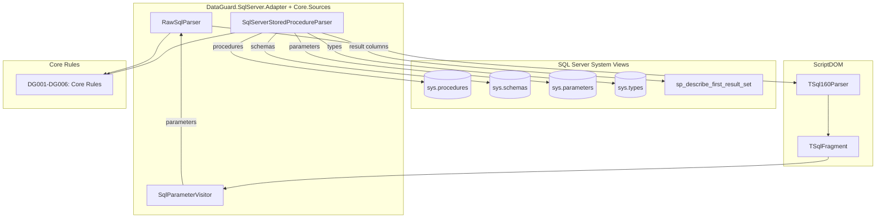
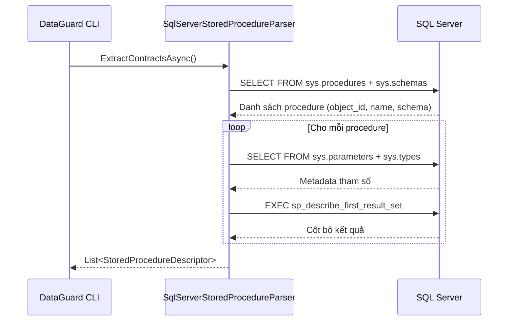
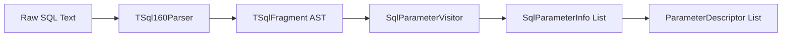

# Bộ Adapter SQL Server

Bộ Adapter SQL Server là adapter chính của DataGuard, cung cấp xác thực contract giữa các entity .NET và stored procedure SQL Server, raw SQL, và phân tích SQL dựa trên ScriptDOM.

## Kiến trúc



## File nguồn

| File | Vị trí | Dòng | Mục đích |
|------|--------|------|----------|
| `SqlServerParsers.cs` | `DataGuard.Core/Sources/` | 346 | SqlServerStoredProcedureParser, RawSqlParser, SqlParameterVisitor |
| `DataGuard.SqlServer.Adapter.csproj` | `DataGuard.SqlServer.Adapter/` | — | File project với phụ thuộc |

## Phụ thuộc

```xml
<PackageReference Include="Microsoft.Data.SqlClient" Version="7.0.2" />
<PackageReference Include="Microsoft.SqlServer.TransactSql.ScriptDom" Version="180.102.0" />
<PackageReference Include="Microsoft.EntityFrameworkCore" Version="9.0.19" />
<PackageReference Include="Microsoft.EntityFrameworkCore.Relational" Version="9.0.19" />
<ProjectReference Include="..\DataGuard.Core\DataGuard.Core.csproj" />
```

## SqlServerStoredProcedureParser

Triển khai `IContractSource` để trích xuất contract stored procedure từ các view hệ thống catalog của SQL Server.

### Flow trích xuất



### Khám phá procedure

Truy vấn `sys.procedures` kết hợp với `sys.schemas` để lấy tất cả stored procedure do người dùng định nghĩa:

```sql
SELECT p.object_id, p.name, s.name AS schema_name
FROM sys.procedures p
INNER JOIN sys.schemas s ON p.schema_id = s.schema_id
WHERE p.is_ms_shipped = 0
```

### Đọc tham số

Cho mỗi procedure, đọc tham số từ `sys.parameters` kết hợp với `sys.types`:

```sql
SELECT p.name, t.name AS DataType, p.max_length, p.precision,
       p.scale, p.is_nullable, p.parameter_id, p.is_output
FROM sys.parameters p
INNER JOIN sys.types t ON p.user_type_id = t.user_type_id
WHERE p.object_id = @ObjectId
ORDER BY p.parameter_id
```

**Chi tiết quan trọng:**
- `max_length = -1` biểu thị kiểu `MAX` (ví dụ: `varchar(max)`) — chuẩn hóa thành `null`
- `is_output = true` ánh xạ thành `ParameterDirection.InputOutput` (SQL Server dùng từ khóa `OUTPUT`)
- Direction được đơn giản hóa: SQL Server chỉ có `INPUT` và `OUTPUT` (không có `IN OUT` như Oracle)

### Khám phá cột bộ kết quả

Sử dụng `sp_describe_first_result_set` để khám phá hình dạng bộ kết quả đầu tiên của stored procedure:

```sql
EXEC sp_describe_first_result_set N'EXEC [schema].[proc]', NULL, 1
```

**Cột bộ kết quả:**

| Thứ tự | Cột | Ánh xạ thành |
|--------|-----|---------------|
| 0 | `is_hidden` | (bỏ qua) |
| 1 | `column_ordinal` | OrdinalPosition |
| 2 | `name` | Name |
| 3 | `is_nullable` | IsNullable |
| 5 | `system_type_name` | DataType |
| 6 | `max_length` | MaxLength |
| 7 | `precision` | Precision |
| 8 | `scale` | Scale |

**Xử lý lỗi:** Lỗi SQL 11512/11513 cho biết procedure không trả về bộ kết quả — được bắt im lặng và trả về danh sách cột rỗng.

### Thoát tên SQL

Phương thức `EscapeSqlName()` thoát các định danh phân cách bằng ngoặc vuông bằng cách nhân đôi ngoặc vuông đóng:

```csharp
private static string EscapeSqlName(string name) => name.Replace("]", "]]");
```

## RawSqlParser

Phân tích văn bản SQL thô sử dụng thư viện ScriptDOM của Microsoft (`TSql160Parser`) để trích xuất khai báo tham số và xác thực cấu trúc SQL.

### Tích hợp ScriptDOM



### Cấu hình parser

```csharp
var parser = new TSql160Parser(true); // true = initialQuotedIdentifiers
IList<ParseError> errors = new List<ParseError>();
var fragment = parser.Parse(new StringReader(_sqlText), out errors);
```

`TSql160Parser` nhắm đến cú pháp SQL Server 2022 (T-SQL 16.0). Cờ `initialQuotedIdentifiers` bật phân tích định danh được trích dẫn theo mặc định.

### SqlParameterVisitor

Lớp con `TSqlFragmentVisitor` truy cập các nút `ProcedureParameter` trong AST để trích xuất metadata tham số.

**Chiến lược trích xuất kiểu:**

Visitor trích xuất tên kiểu phía SQL (ví dụ: `varchar(50)`) thay vì tên kiểu .NET của nút AST ScriptDOM (`SqlDataTypeReference`). Điều này đảm bảo tên kiểu khớp với những gì developer thấy trong SQL Server Management Studio.

**Trích xuất độ dài/precision/scale:**

ScriptDOM lưu trữ chúng dưới dạng literal parameters trong collection `Parameters`:

| Kiểu SQL | Parameters[0] | Parameters[1] |
|----------|---------------|---------------|
| `varchar(50)` | 50 (độ dài) | — |
| `decimal(10,2)` | 10 (precision) | 2 (scale) |
| `varchar(max)` | special max literal | — |

Visitor phân loại theo loại kiểu:
- **Kiểu char/binary**: `Parameters[0]` → `MaxLength`
- **Kiểu numeric**: `Parameters[0]` → `Precision`, `Parameters[1]` → `Scale`

### SqlParameterInfo

```csharp
internal record SqlParameterInfo(
    string Name,
    string DataType,
    int? MaxLength,
    byte? Precision,
    byte? Scale,
    int Ordinal);
```

## Hành vi đặc thù SQL Server

### Không có ngữ nghĩa CHAR/BYTE

Không giống Oracle, SQL Server không có ngữ nghĩa độ dài CHAR vs BYTE. Trường `CharUsed` luôn là `null` cho cột SQL Server, và `CharLength` bằng `MaxLength`.

### Ánh xạ direction

Từ khóa `OUTPUT` của SQL Server ánh xạ thành `ParameterDirection.InputOutput` trong mô hình DataGuard. Không có direction `Output` thuần túy trong SQL Server — tham số `OUTPUT` cũng có thể nhận giá trị đầu vào.

### Kiểu MAX

Các kiểu `varchar(max)`, `nvarchar(max)`, và `varbinary(max)` của SQL Server có `max_length = -1` trong system views. Parser chuẩn hóa chúng thành `null` trong trường `MaxLength`, biểu thị độ dài không giới hạn.

## Sử dụng trong CLI

Bộ adapter SQL Server là provider mặc định:

```bash
# Xác thực mặc định (SQL Server)
dataguard validate --connection "Server=localhost;Database=MyDb;..."

# Provider rõ ràng
dataguard validate --provider sqlserver --connection "..."

# Snapshot với schema SQL Server
dataguard snapshot refresh --provider sqlserver --connection "..." --schema dbo
```

Khi `--provider sqlserver` (hoặc không chỉ định provider), CLI:

1. Khám phá tất cả stored procedure qua `sys.procedures`
2. Đọc tham số qua `sys.parameters`
3. Mô tả bộ kết quả qua `sp_describe_first_result_set`
4. Chạy core rules (DG001-DG006) với các contract đã trích xuất
