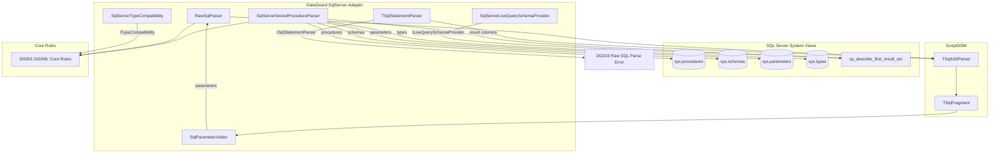
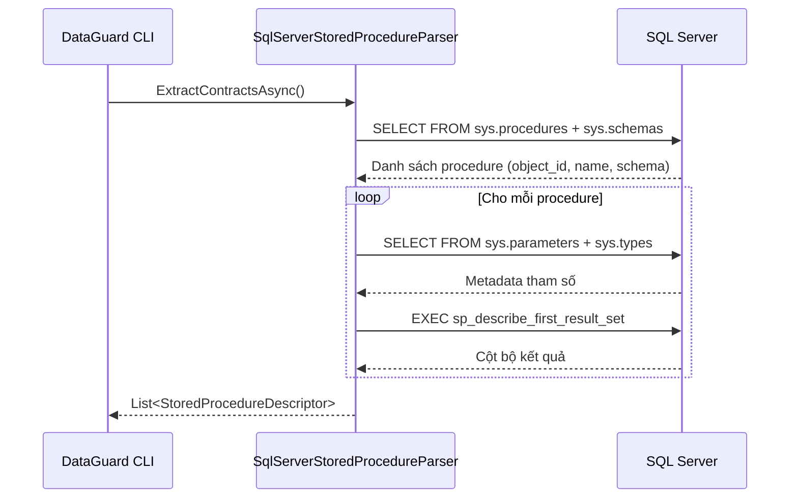
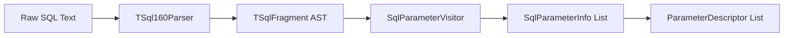

# Bộ Adapter SQL Server

Bộ Adapter SQL Server là adapter chính của DataGuard, cung cấp xác thực contract giữa các entity .NET và stored procedure SQL Server, raw SQL, và phân tích SQL dựa trên ScriptDOM.

## Kiến trúc


```mermaid
graph TB
    subgraph "DataGuard.SqlServer.Adapter"
        SPSp[SqlServerStoredProcedureParser]
        RSP[RawSqlParser]
        SV[SqlParameterVisitor]
        TSP[TSqlStatementParser]
        LQ[SqlServerLiveQuerySchemaProvider]
        TC[SqlServerTypeCompatibility]
    end

    subgraph "SQL Server System Views"
        SP[(sys.procedures)]
        SR[(sys.schemas)]
        SYSP[(sys.parameters)]
        SYST[(sys.types)]
        SDRS[sp_describe_first_result_set]
    end

    subgraph "ScriptDOM"
        P[TSql160Parser]
        F[TSqlFragment]
    end

    subgraph "Core Rules"
        DG001-DG006[DG001-DG006: Core Rules]
    end

    SPSp -->|procedures| SP
    SPSp -->|schemas| SR
    SPSp -->|parameters| SYSP
    SPSp -->|types| SYST
    SPSp -->|result columns| SDRS

    RSP --> P
    P --> F
    F --> SV
    SV -->|parameters| RSP

    SPSp --> DG001-DG006
    RSP --> DG001-DG006
    TSP --> P
    TSP -->|ISqlStatementParser| DG019[DG019 Raw SQL Parse Error]
    LQ -->|ILiveQuerySchemaProvider| SDRS
    TC -->|ITypeCompatibility| DG001-DG006
```

## File nguồn

Mọi file nằm trong `src/DataGuard.SqlServer.Adapter/` (namespace `DataGuard.SqlServer.Adapter`). Từ red-team A1/R33, `DataGuard.Core` không còn tham chiếu `Microsoft.Data.SqlClient` hay ScriptDOM.

| File | Mục đích |
|------|----------|
| `SqlServerParsers.cs` | `SqlServerStoredProcedureParser`, `RawSqlParser`, `SqlParameterVisitor` |
| `SqlServerLiveQuerySchemaProvider.cs` | `ILiveQuerySchemaProvider` qua `sys.sp_describe_first_result_set` (DG018/DG020) |
| `SqlServerTypeCompatibility.cs` | Bảng `ITypeCompatibility` CLR ↔ kiểu SQL Server (DG002, DG018) |
| `TSqlStatementParser.cs` | `ISqlStatementParser` dùng `TSql160Parser`, được inject vào DG019 |
| `TSqlPhantomAnalyzer.cs`, `TSqlPhantomScopeVisitor.cs` | `IPhantomReferenceAnalyzer` trên AST ScriptDOM (DG015/DG016) |
| `DataGuard.SqlServer.Adapter.csproj` | Driver + ScriptDOM + `ProjectReference` Core; không gì khác |

## Phụ thuộc

```xml
<ProjectReference Include="..\DataGuard.Core\DataGuard.Core.csproj" />
<PackageReference Include="Microsoft.Data.SqlClient" Version="7.1.1" />
<PackageReference Include="Microsoft.SqlServer.TransactSql.ScriptDom" Version="180.117.0" />
```

## SqlServerStoredProcedureParser

Triển khai `IContractSource` để trích xuất contract stored procedure từ các view hệ thống catalog của SQL Server.

### Flow trích xuất


```mermaid
sequenceDiagram
    participant CLI as DataGuard CLI
    participant Parser as SqlServerStoredProcedureParser
    participant DB as SQL Server

    CLI->>Parser: ExtractContractsAsync()
    Parser->>DB: SELECT FROM sys.procedures + sys.schemas
    DB-->>Parser: Danh sách procedure (object_id, name, schema)
    loop Cho mỗi procedure
        Parser->>DB: SELECT FROM sys.parameters + sys.types
        DB-->>Parser: Metadata tham số
        Parser->>DB: EXEC sp_describe_first_result_set
        DB-->>Parser: Cột bộ kết quả
    end
    Parser-->>CLI: List<StoredProcedureDescriptor>
```

### Khám phá procedure

Truy vấn `sys.procedures` kết hợp với `sys.schemas` để lấy tất cả stored procedure do người dùng định nghĩa:

```sql
SELECT p.object_id, p.name, s.name AS schema_name, m.definition
FROM sys.procedures p
INNER JOIN sys.schemas s ON p.schema_id = s.schema_id
LEFT JOIN sys.sql_modules m ON m.object_id = p.object_id
WHERE p.is_ms_shipped = 0
```

### Đọc tham số

Cho mỗi procedure, đọc tham số từ `sys.parameters` kết hợp với `sys.types`:

```sql
SELECT p.name, t.name AS DataType, p.max_length, p.precision,
       p.scale, p.is_nullable, p.parameter_id, p.is_output,
       t.system_type_id, p.has_default_value
FROM sys.parameters p
INNER JOIN sys.types t ON p.user_type_id = t.user_type_id
WHERE p.object_id = @ObjectId
ORDER BY p.parameter_id
```

**Chi tiết quan trọng:**
- `max_length = -1` biểu thị kiểu `MAX` (ví dụ: `varchar(max)`) — chuẩn hóa thành `null`
- `is_output = true` ánh xạ thành `ParameterDirection.InputOutput` (SQL Server dùng từ khóa `OUTPUT`)
- **Giá trị mặc định** (`ParameterDescriptor.HasDefault`): `sys.parameters.has_default_value` chỉ được điền cho procedure CLR, nên định nghĩa procedure trong `sys.sql_modules` được parse bằng ScriptDOM (`TSql160Parser`) và mọi tham số `@name type = <default>` (`ProcedureParameter.Value != null`) có `HasDefault = true` (`SqlServerStoredProcedureParser.ParseDefaultedParameters`). Vì vậy DG101 không báo tham số có mặc định bị bỏ qua là thiếu. Định nghĩa bị mã hóa hoặc không parse được thì không có mặc định T-SQL.
- Direction được đơn giản hóa: SQL Server chỉ có `INPUT` và `OUTPUT` (không có `IN OUT` như Oracle)

### Khám phá cột bộ kết quả

Sử dụng `sp_describe_first_result_set` để khám phá hình dạng bộ kết quả đầu tiên của stored procedure:

```sql
EXEC sp_describe_first_result_set N'EXEC [schema].[proc]', NULL, 1
```

**Cột bộ kết quả:**

| Thứ tự | Cột | Ánh xạ thành |
|--------|-----|---------------|
| 0 | `is_hidden` | (bỏ qua) |
| 1 | `column_ordinal` | OrdinalPosition |
| 2 | `name` | Name |
| 3 | `is_nullable` | IsNullable |
| 5 | `system_type_name` | DataType |
| 6 | `max_length` | MaxLength |
| 7 | `precision` | Precision |
| 8 | `scale` | Scale |

**Xử lý lỗi:** Lỗi SQL 11512/11513 cho biết procedure không trả về bộ kết quả — được bắt im lặng và trả về danh sách cột rỗng.

### Thoát tên SQL

Phương thức `EscapeSqlName()` thoát các định danh phân cách bằng ngoặc vuông bằng cách nhân đôi ngoặc vuông đóng:

```csharp
private static string EscapeSqlName(string name) => name.Replace("]", "]]");
```

## RawSqlParser

Phân tích văn bản SQL thô sử dụng thư viện ScriptDOM của Microsoft (`TSql160Parser`) để trích xuất khai báo tham số và xác thực cấu trúc SQL.

### Tích hợp ScriptDOM


```mermaid
flowchart LR
    A[Raw SQL Text] --> B[TSql160Parser]
    B --> C[TSqlFragment AST]
    C --> D[SqlParameterVisitor]
    D --> E[SqlParameterInfo List]
    E --> F[ParameterDescriptor List]
```

### Cấu hình parser

```csharp
var parser = new TSql160Parser(true); // true = initialQuotedIdentifiers
IList<ParseError> errors = new List<ParseError>();
var fragment = parser.Parse(new StringReader(_sqlText), out errors);
```

`TSql160Parser` nhắm đến cú pháp SQL Server 2022 (T-SQL 16.0). Cờ `initialQuotedIdentifiers` bật phân tích định danh được trích dẫn theo mặc định.

### SqlParameterVisitor

Lớp con `TSqlFragmentVisitor` truy cập các nút `ProcedureParameter` trong AST để trích xuất metadata tham số.

**Chiến lược trích xuất kiểu:**

Visitor trích xuất tên kiểu phía SQL (ví dụ: `varchar(50)`) thay vì tên kiểu .NET của nút AST ScriptDOM (`SqlDataTypeReference`). Điều này đảm bảo tên kiểu khớp với những gì developer thấy trong SQL Server Management Studio.

**Trích xuất độ dài/precision/scale:**

ScriptDOM lưu trữ chúng dưới dạng literal parameters trong collection `Parameters`:

| Kiểu SQL | Parameters[0] | Parameters[1] |
|----------|---------------|---------------|
| `varchar(50)` | 50 (độ dài) | — |
| `decimal(10,2)` | 10 (precision) | 2 (scale) |
| `varchar(max)` | special max literal | — |

Visitor phân loại theo loại kiểu:
- **Kiểu char/binary**: `Parameters[0]` → `MaxLength`
- **Kiểu numeric**: `Parameters[0]` → `Precision`, `Parameters[1]` → `Scale`

### SqlParameterInfo

```csharp
internal record SqlParameterInfo(
    string Name,
    string DataType,
    int? MaxLength,
    byte? Precision,
    byte? Scale,
    int Ordinal);
```

## Hành vi đặc thù SQL Server

### Không có ngữ nghĩa CHAR/BYTE

Không giống Oracle, SQL Server không có ngữ nghĩa độ dài CHAR vs BYTE. Trường `CharUsed` luôn là `null` cho cột SQL Server, và `CharLength` bằng `MaxLength`.

### Ánh xạ direction

Từ khóa `OUTPUT` của SQL Server ánh xạ thành `ParameterDirection.InputOutput` trong mô hình DataGuard. Không có direction `Output` thuần túy trong SQL Server — tham số `OUTPUT` cũng có thể nhận giá trị đầu vào.

### Kiểu MAX

Các kiểu `varchar(max)`, `nvarchar(max)`, và `varbinary(max)` của SQL Server có `max_length = -1` trong system views. Parser chuẩn hóa chúng thành `null` trong trường `MaxLength`, biểu thị độ dài không giới hạn.

## Sử dụng trong CLI

Bộ adapter SQL Server là provider mặc định:

```bash
# Xác thực mặc định (SQL Server)
dataguard validate --connection "Server=localhost;Database=MyDb;..."

# Provider rõ ràng
dataguard validate --provider sqlserver --connection "..."

# Snapshot với schema SQL Server
dataguard snapshot refresh --provider sqlserver --connection "..." --schema dbo
```

Khi `--provider sqlserver` (hoặc không chỉ định provider), CLI:

1. Khám phá tất cả stored procedure qua `sys.procedures`
2. Đọc tham số qua `sys.parameters`
3. Mô tả bộ kết quả qua `sp_describe_first_result_set`
4. Chạy core rules (DG001-DG006) với các contract đã trích xuất

## Cập nhật (Phase 3.3)

- `max_length` được chuẩn hóa về số ký tự ở cả `sys.parameters` và `sp_describe_first_result_set`: `nchar`/`nvarchar` chia 2, còn `-1` (MAX) thành `null`. Ví dụ `nvarchar(50)` cho `MaxLength = 50`.
- Lỗi describe của một procedure không còn dừng toàn bộ quá trình trích xuất: procedure đó có `ResultColumns` rỗng và `ReturnType = "unknown:<mã lỗi>"`.
- `DatabaseTableDescriptor.Name` là tên bảng trần, và `Schema` là owner.

## Kết nối thành phần (red-team A1/R33)

`ProviderRuleCatalog` (CLI) gắn adapter vào các rule của Core khi `--provider sqlserver`; Core chỉ giữ điểm nối và mặc định
trung lập với provider:

| Điểm nối trong Core | Mặc định của Core | Triển khai trong adapter SQL Server |
|---------------------|-------------------|-------------------------------------|
| `ILiveQuerySchemaProvider` (DG018/DG020) | không có: connection mà không có provider được báo là chưa đánh giá (DG020) | `SqlServerLiveQuerySchemaProvider` |
| `ITypeCompatibility` + `TypeCompatibilityRegistry` | `UnknownTypeCompatibility` (không báo lỗi) | `SqlServerTypeCompatibility` (đăng ký cho `sqlserver`) |
| `IPhantomReferenceAnalyzer` (DG015/DG016) | `PhantomSqlAnalyzer` (tokenizer) | `TSqlPhantomAnalyzer` |
| `ISqlStatementParser` (DG019) | `NoOpSqlStatementParser` (chấp nhận mọi thứ) | `TSqlStatementParser` |

DG019 (`RawSqlParseStatusRule`) parse từng contract raw SQL bằng parser được inject và báo lỗi ScriptDOM đầu tiên
(`Line L, column C: message`) ở mức Error. Placeholder phía client (`:name`, `?`, `{0}`) được đổi thành biến `@` trước khi
parse; lời gọi stored procedure và raw SQL có connection hint của provider khác không bị parse. Các provider khác không có
parser, nên DG019 chỉ báo trạng thái parse do nguồn thu thập đặt.

Code thư viện từng dùng `DataGuard.Core.Sources.SqlServerStoredProcedureParser`, `RawSqlParser`,
`DataGuard.Core.Rules.SqlServerLiveQuerySchemaProvider` hoặc `DataGuard.Core.Rules.TypeCompatibility.SqlServerTypeCompatibility`
cần tham chiếu package `DataGuard.SqlServer.Adapter` và đổi `using` sang `DataGuard.SqlServer.Adapter` (không có type
forwarder). Code resolve bảng SQL Server qua `TypeCompatibilityRegistry` mà không đăng ký giờ nhận `UnknownTypeCompatibility`;
hãy gọi `TypeCompatibilityRegistry.Register(SqlServerTypeCompatibility.Instance)` hoặc inject bảng trực tiếp.
