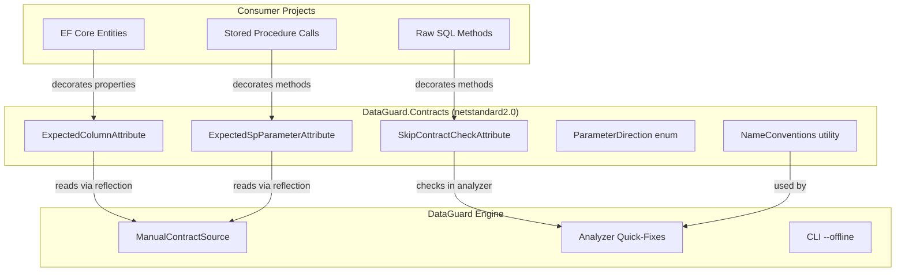
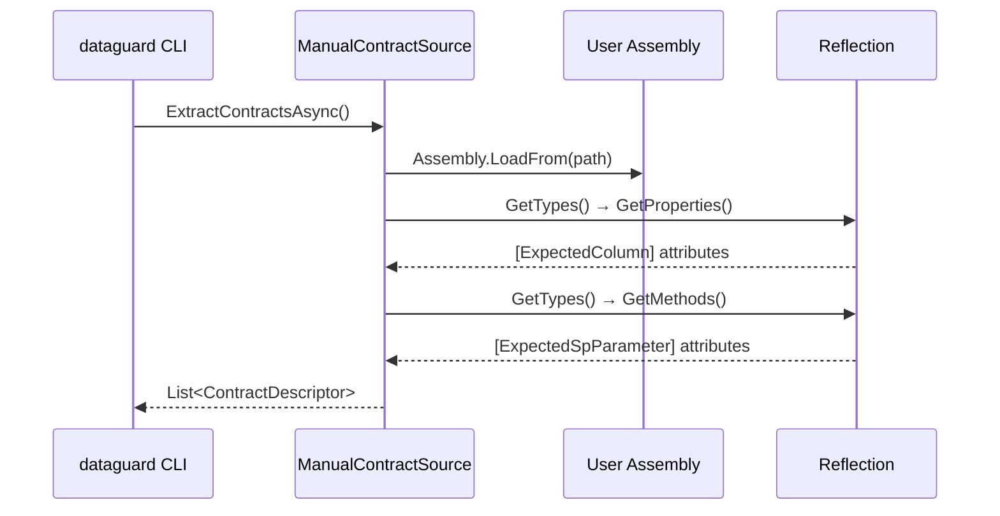

# Contract Attributes

The `DataGuard.Contracts` assembly provides attributes for manual ground-truth mode and validation control. These attributes live in a `netstandard2.0` assembly so they can be referenced by any .NET project without pulling in the full DataGuard engine.

## Architecture



## Source Files

| File | Lines | Purpose |
|------|-------|---------|
| `ContractAttributes.cs` | ~110 | SkipContractCheckAttribute, ExpectedColumnAttribute, ExpectedSpParameterAttribute, ParameterDirection |
| `NameConventions.cs` | ~60 | ToSnakeCase, ToPascalCase conversions |

## Project Configuration

```xml
<Project Sdk="Microsoft.NET.Sdk">
  <PropertyGroup>
    <TargetFramework>netstandard2.0</TargetFramework>
  </PropertyGroup>
</Project>
```

Targets `netstandard2.0` for maximum compatibility — can be referenced from .NET Framework 4.6.1+, .NET Core 2.0+, and .NET 5+.

## SkipContractCheckAttribute

Exempts a method or class from DataGuard contract validation. Used for dynamic SQL, complex queries, or cases where automatic validation is not applicable.

### Definition

```csharp
[AttributeUsage(AttributeTargets.Method | AttributeTargets.Class, AllowMultiple = false, Inherited = true)]
public sealed class SkipContractCheckAttribute : Attribute
{
    public string? Reason { get; set; }
}
```

### Usage

```csharp
// On a method
[SkipContractCheck(Reason = "Dynamic SQL - manual review required")]
public IQueryable<T> Search(string query)
{
    return DbSet.FromSqlRaw($"SELECT * FROM {query}");
}

// On a class (all methods skipped)
[SkipContractCheck(Reason = "Legacy code - migration in progress")]
public class LegacyRepository { ... }
```

### Behavior

| Component | Action |
|-----------|--------|
| Roslyn Analyzer | Suppresses DG001 diagnostic for decorated methods |
| CI Heavy Layer | Skips semantic analysis for decorated methods |
| CLI | Not checked (CLI validates contracts, not call sites) |

### Code Fix Integration

The `DataGuardCodeFixProvider` can automatically add this attribute as a quick-fix for DG001:

```csharp
// Quick-fix generates:
[global::DataGuard.Contracts.SkipContractCheck(Reason = "Dynamic SQL - manual review required")]
```

## ExpectedColumnAttribute

Declares expected database column metadata for manual ground-truth mode. Used when `--offline` mode is active and no database connection is available.

### Definition

```csharp
[AttributeUsage(AttributeTargets.Property, AllowMultiple = true)]
public sealed class ExpectedColumnAttribute : Attribute
{
    public ExpectedColumnAttribute(string columnName, string clrTypeName) { ... }

    public string ColumnName { get; }
    public string ClrTypeName { get; }
    public bool IsNullable { get; set; }
    public int MaxLength { get; set; }
}
```

### Usage

```csharp
public class Customer
{
    [ExpectedColumn("CUSTOMER_NAME", "string", IsNullable = false, MaxLength = 100)]
    public string Name { get; set; }

    [ExpectedColumn("CREATED_DATE", "DateTime")]
    public DateTime CreatedDate { get; set; }

    [ExpectedColumn("EMAIL", "string", IsNullable = true, MaxLength = 255)]
    public string? Email { get; set; }
}
```

### Parameters

| Parameter | Type | Required | Description |
|-----------|------|----------|-------------|
| `columnName` | `string` | Yes | Database column name |
| `clrTypeName` | `string` | Yes | Expected CLR type name (e.g., `"string"`, `"int"`, `"DateTime"`) |
| `IsNullable` | `bool` | No | Whether the column allows NULL (default: `false`) |
| `MaxLength` | `int` | No | Maximum column length (default: `0` = unspecified) |

### Multiple Attributes

A single property can have multiple `[ExpectedColumn]` attributes when it maps to multiple columns (rare, but supported):

```csharp
[ExpectedColumn("FIRST_NAME", "string", MaxLength = 50)]
[ExpectedColumn("LAST_NAME", "string", MaxLength = 50)]
public string FullName { get; set; }
```

## ExpectedSpParameterAttribute

Declares expected stored procedure parameter metadata for manual ground-truth mode.

### Definition

```csharp
[AttributeUsage(AttributeTargets.Method, AllowMultiple = true)]
public sealed class ExpectedSpParameterAttribute : Attribute
{
    public ExpectedSpParameterAttribute(string name, string dbType, string direction) { ... }

    public string Name { get; }
    public string DbType { get; }
    public ParameterDirection Direction { get; set; }
    public int MaxLength { get; set; }
    public byte? Precision { get; set; }
    public byte? Scale { get; set; }
    public string? ClrType { get; set; }
}
```

### Usage

```csharp
[ExpectedSpParameter("p_customer_id", "NUMBER", "Input", Precision = 10, Scale = 0)]
[ExpectedSpParameter("p_name", "VARCHAR2", "Input", MaxLength = 100)]
[ExpectedSpParameter("p_result_cursor", "REF CURSOR", "Output")]
public void GetCustomer(int customerId, string name) { ... }
```

### Parameters

| Parameter | Type | Required | Description |
|-----------|------|----------|-------------|
| `name` | `string` | Yes | Parameter name |
| `dbType` | `string` | Yes | Database type name (e.g., `"VARCHAR2"`, `"NUMBER"`) |
| `direction` | `string` | Yes | Direction: `"Input"`, `"Output"`, `"InputOutput"`, `"ReturnValue"` |
| `MaxLength` | `int` | No | Maximum parameter length |
| `Precision` | `byte?` | No | Numeric precision |
| `Scale` | `byte?` | No | Numeric scale |
| `ClrType` | `string?` | No | CLR type name for DG002 type-compatibility checks |

### Direction Parsing

The `direction` parameter is parsed leniently:

```csharp
Direction = Enum.TryParse(direction, true, out ParameterDirection parsed)
    ? parsed
    : ParameterDirection.Input; // Invalid values default to Input
```

## ParameterDirection Enum

```csharp
public enum ParameterDirection
{
    Input,       // Input-only parameter (default)
    Output,      // Output parameter (call site uses out)
    InputOutput, // Input/output parameter (call site uses ref)
    ReturnValue, // Function return value
}
```

This is a `netstandard2.0`-compatible mirror of the engine's direction enum, ensuring the IDE analyzer layer never needs a reference to the `net9.0` engine assembly.

## NameConventions Utility

Shared snake_case / PascalCase conversions used by the analyzer, code fixes, and rules engine — one implementation instead of three divergent copies.

### ToSnakeCase

Converts PascalCase to snake_case:

```csharp
NameConventions.ToSnakeCase("CustomerName")     // → "customer_name"
NameConventions.ToSnakeCase("ID")               // → "_i_d"
NameConventions.ToSnakeCase("XMLParser")        // → "_x_m_l_parser"
NameConventions.ToSnakeCase("")                 // → ""
```

**Algorithm:** Inserts `_` before each uppercase character (except the first), then lowercases everything.

### ToPascalCase

Converts snake_case, kebab-case, or dotted identifiers to PascalCase:

```csharp
NameConventions.ToPascalCase("customer_name")   // → "CustomerName"
NameConventions.ToPascalCase("my-table")        // → "MyTable"
NameConventions.ToPascalCase("schema.table")    // → "SchemaTable"
NameConventions.ToPascalCase("")                // → ""
```

**Algorithm:** Splits on `_`, `-`, `.`, capitalizes the first letter of each part, lowercases the rest.

### Usage Across Components

| Component | Uses |
|-----------|------|
| `NamingConventionFixProvider` | `ToSnakeCase()` for auto-rename quick-fix |
| `NamingConventionRule` (DG006) | Both directions for convention detection |
| `LengthMismatchDetector` | `ToOracleColumnName()` (similar pattern) |

## Manual Ground-Truth Mode

When the CLI runs with `--offline --assembly <path>`, it uses `ManualContractSource` to read these attributes via reflection:

```bash
dataguard validate --offline --assembly ./bin/Debug/net9.0/MyApp.dll --provider oracle
```

### Flow



### Limitations

- Only reads attributes from the specified assembly (not transitive dependencies)
- Requires the assembly to be compiled (not source-level analysis)
- Does not support generic type parameters in attribute arguments
