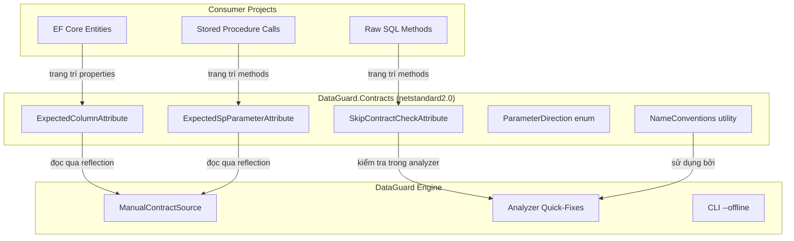
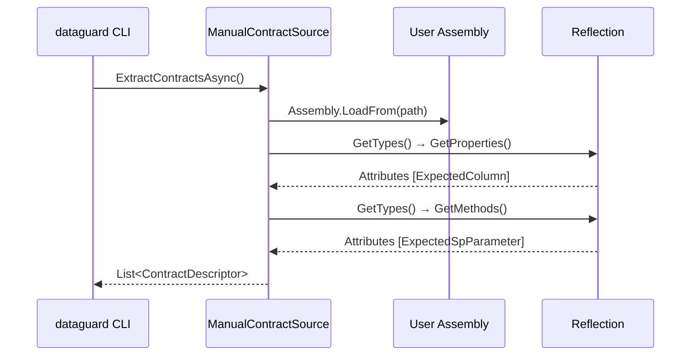

# Contract Attributes

Assembly `DataGuard.Contracts` cung cấp các attribute cho chế độ manual ground-truth và kiểm soát xác thực. Các attribute này nằm trong assembly `netstandard2.0` để có thể được tham chiếu từ bất kỳ project .NET nào mà không cần kéo theo toàn bộ engine DataGuard.

## Kiến trúc



## File nguồn

| File | Dòng | Mục đích |
|------|------|----------|
| `ContractAttributes.cs` | ~110 | SkipContractCheckAttribute, ExpectedColumnAttribute, ExpectedSpParameterAttribute, ParameterDirection |
| `NameConventions.cs` | ~60 | Chuyển đổi ToSnakeCase, ToPascalCase |

## Cấu hình project

```xml
<Project Sdk="Microsoft.NET.Sdk">
  <PropertyGroup>
    <TargetFramework>netstandard2.0</TargetFramework>
  </PropertyGroup>
</Project>
```

Nhắm đến `netstandard2.0` để tương thích tối đa — có thể được tham chiếu từ .NET Framework 4.6.1+, .NET Core 2.0+, và .NET 5+.

## SkipContractCheckAttribute

Miễn trừ method hoặc class khỏi xác thực contract DataGuard. Được sử dụng cho SQL động, truy vấn phức tạp, hoặc các trường hợp xác thực tự động không áp dụng được.

### Định nghĩa

```csharp
[AttributeUsage(AttributeTargets.Method | AttributeTargets.Class, AllowMultiple = false, Inherited = true)]
public sealed class SkipContractCheckAttribute : Attribute
{
    public string? Reason { get; set; }
}
```

### Sử dụng

```csharp
// Trên method
[SkipContractCheck(Reason = "Dynamic SQL - manual review required")]
public IQueryable<T> Search(string query)
{
    return DbSet.FromSqlRaw($"SELECT * FROM {query}");
}

// Trên class (tất cả method bị bỏ qua)
[SkipContractCheck(Reason = "Legacy code - migration in progress")]
public class LegacyRepository { ... }
```

### Hành vi

| Thành phần | Hành động |
|------------|-----------|
| Roslyn Analyzer | Ẩn diagnostic DG001 cho method được trang trí |
| CI Heavy Layer | Bỏ qua phân tích ngữ nghĩa cho method được trang trí |
| CLI | Không kiểm tra (CLI xác thực contract, không phải call site) |

### Tích hợp Code Fix

`DataGuardCodeFixProvider` có thể tự động thêm attribute này như quick-fix cho DG001:

```csharp
// Quick-fix tạo ra:
[global::DataGuard.Contracts.SkipContractCheck(Reason = "Dynamic SQL - manual review required")]
```

## ExpectedColumnAttribute

Khai báo metadata cột database mong đợi cho chế độ manual ground-truth. Được sử dụng khi chế độ `--offline` hoạt động và không có kết nối database.

### Định nghĩa

```csharp
[AttributeUsage(AttributeTargets.Property, AllowMultiple = true)]
public sealed class ExpectedColumnAttribute : Attribute
{
    public ExpectedColumnAttribute(string columnName, string clrTypeName) { ... }

    public string ColumnName { get; }
    public string ClrTypeName { get; }
    public bool IsNullable { get; set; }
    public int MaxLength { get; set; }
}
```

### Sử dụng

```csharp
public class Customer
{
    [ExpectedColumn("CUSTOMER_NAME", "string", IsNullable = false, MaxLength = 100)]
    public string Name { get; set; }

    [ExpectedColumn("CREATED_DATE", "DateTime")]
    public DateTime CreatedDate { get; set; }

    [ExpectedColumn("EMAIL", "string", IsNullable = true, MaxLength = 255)]
    public string? Email { get; set; }
}
```

### Tham số

| Tham số | Kiểu | Bắt buộc | Mô tả |
|---------|------|----------|-------|
| `columnName` | `string` | Có | Tên cột database |
| `clrTypeName` | `string` | Có | Tên kiểu CLR mong đợi (ví dụ: `"string"`, `"int"`, `"DateTime"`) |
| `IsNullable` | `bool` | Không | Cột có cho phép NULL không (mặc định: `false`) |
| `MaxLength` | `int` | Không | Độ dài cột tối đa (mặc định: `0` = không xác định) |

### Nhiều attributes

Một property có thể có nhiều attribute `[ExpectedColumn]` khi ánh xạ đến nhiều cột (hiếm, nhưng được hỗ trợ):

```csharp
[ExpectedColumn("FIRST_NAME", "string", MaxLength = 50)]
[ExpectedColumn("LAST_NAME", "string", MaxLength = 50)]
public string FullName { get; set; }
```

## ExpectedSpParameterAttribute

Khai báo metadata tham số stored procedure mong đợi cho chế độ manual ground-truth.

### Định nghĩa

```csharp
[AttributeUsage(AttributeTargets.Method, AllowMultiple = true)]
public sealed class ExpectedSpParameterAttribute : Attribute
{
    public ExpectedSpParameterAttribute(string name, string dbType, string direction) { ... }

    public string Name { get; }
    public string DbType { get; }
    public ParameterDirection Direction { get; set; }
    public int MaxLength { get; set; }
    public byte? Precision { get; set; }
    public byte? Scale { get; set; }
    public string? ClrType { get; set; }
}
```

### Sử dụng

```csharp
[ExpectedSpParameter("p_customer_id", "NUMBER", "Input", Precision = 10, Scale = 0)]
[ExpectedSpParameter("p_name", "VARCHAR2", "Input", MaxLength = 100)]
[ExpectedSpParameter("p_result_cursor", "REF CURSOR", "Output")]
public void GetCustomer(int customerId, string name) { ... }
```

### Tham số

| Tham số | Kiểu | Bắt buộc | Mô tả |
|---------|------|----------|-------|
| `name` | `string` | Có | Tên tham số |
| `dbType` | `string` | Có | Tên kiểu database (ví dụ: `"VARCHAR2"`, `"NUMBER"`) |
| `direction` | `string` | Có | Direction: `"Input"`, `"Output"`, `"InputOutput"`, `"ReturnValue"` |
| `MaxLength` | `int` | Không | Độ dài tham số tối đa |
| `Precision` | `byte?` | Không | Precision số |
| `Scale` | `byte?` | Không | Scale số |
| `ClrType` | `string?` | Không | Tên kiểu CLR cho kiểm tra tương thích DG002 |

### Phân tích direction

Tham số `direction` được phân tích khoan dung:

```csharp
Direction = Enum.TryParse(direction, true, out ParameterDirection parsed)
    ? parsed
    : ParameterDirection.Input; // Giá trị không hợp lệ mặc định là Input
```

## Enum ParameterDirection

```csharp
public enum ParameterDirection
{
    Input,       // Tham số chỉ đầu vào (mặc định)
    Output,      // Tham số đầu ra (call site dùng out)
    InputOutput, // Tham số đầu vào/đầu ra (call site dùng ref)
    ReturnValue, // Giá trị trả về của function
}
```

Đây là bản sao tương thích `netstandard2.0` của enum direction engine, đảm bảo lớp analyzer IDE không bao giờ cần tham chiếu đến assembly engine `net9.0`.

## Tiện ích NameConventions

Chuyển đổi snake_case / PascalCase được chia sẻ sử dụng bởi analyzer, code fixes, và rules engine — một triển khai thay vì ba bản sao phân kỳ.

### ToSnakeCase

Chuyển đổi PascalCase sang snake_case:

```csharp
NameConventions.ToSnakeCase("CustomerName")     // → "customer_name"
NameConventions.ToSnakeCase("ID")               // → "_i_d"
NameConventions.ToSnakeCase("XMLParser")        // → "_x_m_l_parser"
NameConventions.ToSnakeCase("")                 // → ""
```

**Thuật toán:** Chèn `_` trước mỗi ký tự viết hoa (trừ ký tự đầu), sau đó chuyển tất cả sang chữ thường.

### ToPascalCase

Chuyển đổi snake_case, kebab-case, hoặc định danh có dấu chấm sang PascalCase:

```csharp
NameConventions.ToPascalCase("customer_name")   // → "CustomerName"
NameConventions.ToPascalCase("my-table")        // → "MyTable"
NameConventions.ToPascalCase("schema.table")    // → "SchemaTable"
NameConventions.ToPascalCase("")                // → ""
```

**Thuật toán:** Tách theo `_`, `-`, `.`, viết hoa chữ cái đầu mỗi phần, viết thường phần còn lại.

### Sử dụng qua các thành phần

| Thành phần | Sử dụng |
|------------|---------|
| `NamingConventionFixProvider` | `ToSnakeCase()` cho quick-fix tự đổi tên |
| `NamingConventionRule` (DG006) | Cả hai hướng để phát hiện quy ước |
| `LengthMismatchDetector` | `ToOracleColumnName()` (tương tự) |

## Chế độ Manual Ground-Truth

Khi CLI chạy với `--offline --assembly <path>`, nó sử dụng `ManualContractSource` để đọc các attribute này qua reflection:

```bash
dataguard validate --offline --assembly ./bin/Debug/net9.0/MyApp.dll --provider oracle
```

### Flow



### Giới hạn

- Chỉ đọc attribute từ assembly được chỉ định (không phải phụ thuộc transit)
- Yêu cầu assembly đã được biên dịch (không phải phân tích cấp nguồn)
- Không hỗ trợ tham số kiểu generic trong đối số attribute
