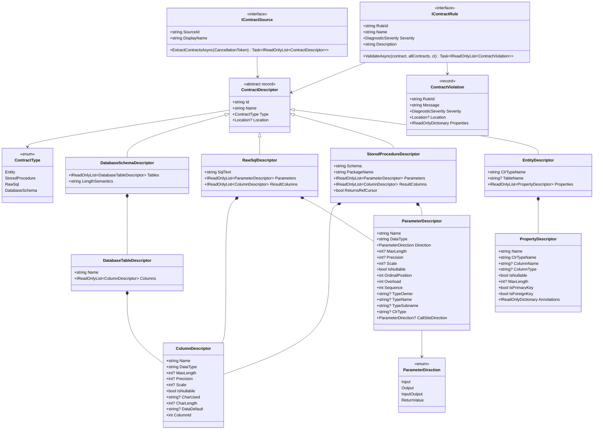

# Core Abstractions

> Source: `src/DataGuard.Core/Abstractions/Contracts.cs`

The core abstractions layer defines the domain model that every DataGuard component depends on. These types form the lingua franca between contract sources, validation rules, and reporting sinks.

## Design Principles

- **Immutable records** — every descriptor is a C# `record` with value semantics; no mutable state leaks across boundaries.
- **Roslyn-integrated** — `Location?` from `Microsoft.CodeAnalysis` threads through every descriptor and violation so IDE tooling can underline the exact span.
- **Provider-agnostic** — the same `ContractDescriptor` hierarchy covers SQL Server, Oracle, MySQL, and PostgreSQL.

## Class Diagram



## IContractSource Interface

The entry point for extracting contract metadata from any data source.

```csharp
public interface IContractSource
{
    string SourceId { get; }
    string DisplayName { get; }
    Task<IReadOnlyList<ContractDescriptor>> ExtractContractsAsync(
        CancellationToken cancellationToken = default);
}
```

| Property | Purpose |
|----------|---------|
| `SourceId` | Stable identifier used in logs and telemetry (e.g. `"ef-model"`, `"sqlserver-sp"`, `"manual"`) |
| `DisplayName` | Human-readable name for CLI output |
| `ExtractContractsAsync` | Returns all discovered descriptors; cancellation-safe |

Built-in implementations: `EfModelSource`, `SqlServerStoredProcedureParser`, `RawSqlParser`, `ManualContractSource`.

## IContractRule Interface

Every validation rule implements this contract.

```csharp
public interface IContractRule
{
    string RuleId { get; }           // e.g. "DG001"
    string Name { get; }             // e.g. "Parameter Count Match"
    DiagnosticSeverity Severity { get; }
    string Description { get; }
    Task<IReadOnlyList<ContractViolation>> ValidateAsync(
        ContractDescriptor contract,
        IReadOnlyList<ContractDescriptor> allContracts,
        CancellationToken cancellationToken = default);
}
```

Rules receive the target contract plus the full contract set (needed for cross-contract checks like entity-vs-SQL column shape matching).

## ContractDescriptor Hierarchy

### EntityDescriptor

Represents a C# entity class mapped to a database table via EF Core.

| Field | Type | Description |
|-------|------|-------------|
| `ClrTypeName` | `string` | Fully-qualified CLR type (e.g. `"MyApp.Models.Order"`) |
| `TableName` | `string?` | Database table with optional schema (e.g. `"dbo.Orders"`) |
| `Properties` | `IReadOnlyList<PropertyDescriptor>` | Mapped properties |

### StoredProcedureDescriptor

Represents a stored procedure with its parameters and result set columns.

| Field | Type | Description |
|-------|------|-------------|
| `Schema` | `string` | Database schema (e.g. `"dbo"`, `"HR"`) |
| `PackageName` | `string` | Oracle package name (empty for SQL Server) |
| `Parameters` | `IReadOnlyList<ParameterDescriptor>` | SP parameters |
| `ResultColumns` | `IReadOnlyList<ColumnDescriptor>` | Result set columns |
| `ReturnsRefCursor` | `bool` | Oracle REF CURSOR indicator |

### RawSqlDescriptor

Represents an inline SQL statement (e.g. Dapper query, raw ADO.NET command).

| Field | Type | Description |
|-------|------|-------------|
| `SqlText` | `string` | The SQL text |
| `Parameters` | `IReadOnlyList<ParameterDescriptor>` | Detected parameters |
| `ResultColumns` | `IReadOnlyList<ColumnDescriptor>` | Detected result columns |

### DatabaseSchemaDescriptor

Represents the ground-truth database schema used by length/dialect rules.

| Field | Type | Description |
|-------|------|-------------|
| `Tables` | `IReadOnlyList<DatabaseTableDescriptor>` | Tables with columns |
| `LengthSemantics` | `string` | Oracle length semantics (`"CHAR"` or `"BYTE"`) |

## PropertyDescriptor

Describes a single property on an entity.

| Field | Type | Description |
|-------|------|-------------|
| `Name` | `string` | C# property name |
| `ClrTypeName` | `string` | CLR type (e.g. `"System.String"`) |
| `ColumnName` | `string?` | Mapped database column |
| `ColumnType` | `string?` | Database column type (e.g. `"nvarchar(100)"`) |
| `IsNullable` | `bool` | Whether the property accepts null |
| `MaxLength` | `int?` | Max length annotation |
| `IsPrimaryKey` | `bool` | Primary key indicator |
| `IsForeignKey` | `bool` | Foreign key indicator |
| `Annotations` | `IReadOnlyDictionary?` | EF Core annotations |

## ParameterDescriptor

Describes a stored procedure parameter or raw SQL parameter.

| Field | Type | Description |
|-------|------|-------------|
| `Name` | `string` | Parameter name (e.g. `"@OrderId"`, `"P_ID"`) |
| `DataType` | `string` | Database type (e.g. `"NUMBER"`, `"varchar(50)"`) |
| `Direction` | `ParameterDirection` | IN / OUT / INOUT / ReturnValue |
| `MaxLength` | `int?` | Max length |
| `Precision` | `int?` | Numeric precision |
| `Scale` | `int?` | Numeric scale |
| `IsNullable` | `bool` | Nullable indicator |
| `OrdinalPosition` | `int` | Position in parameter list |
| `Overload` | `int` | Oracle overload number |
| `Sequence` | `int` | Oracle sequence within overload |
| `TypeOwner` | `string?` | Oracle type owner |
| `TypeName` | `string?` | Oracle type name |
| `TypeSubname` | `string?` | Oracle type subname |
| `ClrType` | `string?` | Expected CLR type from call site |
| `CallSiteDirection` | `ParameterDirection?` | Direction observed at call site |

## ColumnDescriptor

Describes a database column or result set column.

| Field | Type | Description |
|-------|------|-------------|
| `Name` | `string` | Column name |
| `DataType` | `string` | Database type |
| `MaxLength` | `int?` | Max length |
| `Precision` | `int?` | Numeric precision |
| `Scale` | `int?` | Numeric scale |
| `IsNullable` | `bool` | Nullable indicator |
| `CharUsed` | `string?` | Oracle: `'C'` (CHAR) or `'B'` (BYTE) |
| `CharLength` | `int?` | Oracle character length |
| `DataDefault` | `string?` | Default value expression |
| `ColumnId` | `int` | Column ordinal |

## ContractViolation

The output of every rule validation — an immutable diagnostic record.

```csharp
public record ContractViolation(
    string RuleId,
    string Message,
    DiagnosticSeverity Severity,
    Location? Location = null,
    IReadOnlyDictionary<string, object?>? Properties = null);
```

- `RuleId` — stable identifier (e.g. `"DG001"`) for filtering and baseline matching.
- `Severity` — maps to Roslyn's `DiagnosticSeverity` (Error / Warning / Info / Hidden).
- `Location` — optional Roslyn `Location` for IDE squiggles.
- `Properties` — rule-specific metadata (e.g. `{"table": "ORDERS", "column": "NAME"}`).

## Enumerations

### ContractType

| Value | Description |
|-------|-------------|
| `Entity` | EF Core entity class |
| `StoredProcedure` | Database stored procedure |
| `RawSql` | Inline SQL statement |
| `DatabaseSchema` | Ground-truth database schema |

### ParameterDirection

| Value | Description |
|-------|-------------|
| `Input` | Input-only parameter |
| `Output` | Output-only parameter |
| `InputOutput` | Bidirectional parameter |
| `ReturnValue` | Return value parameter |
