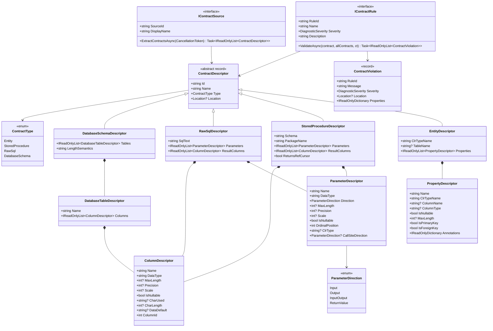

# Abstractions Cốt Lõi

> Nguồn: `src/DataGuard.Core/Abstractions/Contracts.cs`

Lớp abstractions cốt lõi định nghĩa domain model mà mọi thành phần DataGuard đều phụ thuộc. Các kiểu này hình thành ngôn ngữ chung giữa các contract sources, rules kiểm tra, và reporting sinks.

## Nguyên Tắc Thiết Kế

- **Bất biến (immutable records)** — mọi descriptor là C# `record` với value semantics; không có trạng thái mutable nào rò rỉ qua biên giới.
- **Tích hợp Roslyn** — `Location?` từ `Microsoft.CodeAnalysis` xuyên qua mọi descriptor và violation để IDE có thể gạch chân đúng vị trí.
- **Không phụ thuộc nhà cung cấp** — cùng một phân cấp `ContractDescriptor` bao phủ SQL Server, Oracle, MySQL, và PostgreSQL.

## Sơ Đồ Lớp



## Interface IContractSource

Điểm bắt đầu để trích xuất metadata contract từ bất kỳ nguồn dữ liệu nào.

```csharp
public interface IContractSource
{
    string SourceId { get; }
    string DisplayName { get; }
    Task<IReadOnlyList<ContractDescriptor>> ExtractContractsAsync(
        CancellationToken cancellationToken = default);
}
```

| Thuộc tính | Mục đích |
|------------|----------|
| `SourceId` | Định danh ổn định dùng trong log và telemetry (vd: `"ef-model"`, `"sqlserver-sp"`, `"manual"`) |
| `DisplayName` | Tên dễ đọc cho output CLI |
| `ExtractContractsAsync` | Trả về tất cả descriptors đã khám phá; hỗ trợ hủy |

Các triển khai tích hợp: `EfModelSource`, `SqlServerStoredProcedureParser`, `RawSqlParser`, `ManualContractSource`.

## Interface IContractRule

Mọi rule kiểm tra đều implement contract này.

```csharp
public interface IContractRule
{
    string RuleId { get; }           // vd: "DG001"
    string Name { get; }             // vd: "Parameter Count Match"
    DiagnosticSeverity Severity { get; }
    string Description { get; }
    Task<IReadOnlyList<ContractViolation>> ValidateAsync(
        ContractDescriptor contract,
        IReadOnlyList<ContractDescriptor> allContracts,
        CancellationToken cancellationToken = default);
}
```

Rules nhận contract mục tiêu cùng toàn bộ tập hợp contract (cần thiết cho kiểm tra cross-contract như so khớp entity-vs-SQL column shape).

## Phân Cấp ContractDescriptor

### EntityDescriptor

Đại diện cho một lớp entity C# được ánh xạ tới bảng database qua EF Core.

| Trường | Kiểu | Mô tả |
|--------|------|-------|
| `ClrTypeName` | `string` | CLR type đầy đủ (vd: `"MyApp.Models.Order"`) |
| `TableName` | `string?` | Bảng database với schema tùy chọn (vd: `"dbo.Orders"`) |
| `Properties` | `IReadOnlyList<PropertyDescriptor>` | Các thuộc tính được ánh xạ |

### StoredProcedureDescriptor

Đại diện cho stored procedure với các tham số và cột result set.

| Trường | Kiểu | Mô tả |
|--------|------|-------|
| `Schema` | `string` | Schema database (vd: `"dbo"`, `"HR"`) |
| `PackageName` | `string` | Tên package Oracle (trống cho SQL Server) |
| `Parameters` | `IReadOnlyList<ParameterDescriptor>` | Tham số SP |
| `ResultColumns` | `IReadOnlyList<ColumnDescriptor>` | Cột result set |
| `ReturnsRefCursor` | `bool` | Đánh dấu Oracle REF CURSOR |

### RawSqlDescriptor

Đại diện cho câu lệnh SQL inline (vd: query Dapper, lệnh ADO.NET thô).

| Trường | Kiểu | Mô tả |
|--------|------|-------|
| `SqlText` | `string` | Văn bản SQL |
| `Parameters` | `IReadOnlyList<ParameterDescriptor>` | Tham số đã phát hiện |
| `ResultColumns` | `IReadOnlyList<ColumnDescriptor>` | Cột result set đã phát hiện |

### DatabaseSchemaDescriptor

Đại diện cho schema database ground-truth được dùng bởi các rules kiểm tra length/dialect.

| Trường | Kiểu | Mô tả |
|--------|------|-------|
| `Tables` | `IReadOnlyList<DatabaseTableDescriptor>` | Bảng với cột |
| `LengthSemantics` | `string` | Oracle length semantics (`"CHAR"` hoặc `"BYTE"`) |

## PropertyDescriptor

Mô tả một thuộc tính trên entity.

| Trường | Kiểu | Mô tả |
|--------|------|-------|
| `Name` | `string` | Tên thuộc tính C# |
| `ClrTypeName` | `string` | Kiểu CLR (vd: `"System.String"`) |
| `ColumnName` | `string?` | Cột database được ánh xạ |
| `ColumnType` | `string?` | Kiểu cột database (vd: `"nvarchar(100)"`) |
| `IsNullable` | `bool` | Thuộc tính có chấp nhận null không |
| `MaxLength` | `int?` | Annotation độ dài tối đa |
| `IsPrimaryKey` | `bool` | Đánh dấu khóa chính |
| `IsForeignKey` | `bool` | Đánh dấu khóa ngoại |
| `Annotations` | `IReadOnlyDictionary?` | Annotations EF Core |

## ParameterDescriptor

Mô tả tham số stored procedure hoặc tham số SQL.

| Trường | Kiểu | Mô tả |
|--------|------|-------|
| `Name` | `string` | Tên tham số (vd: `"@OrderId"`, `"P_ID"`) |
| `DataType` | `string` | Kiểu database (vd: `"NUMBER"`, `"varchar(50)"`) |
| `Direction` | `ParameterDirection` | IN / OUT / INOUT / ReturnValue |
| `MaxLength` | `int?` | Độ dài tối đa |
| `Precision` | `int?` | Độ chính xác số |
| `Scale` | `int?` | Thập phân số |
| `IsNullable` | `bool` | Có nullable không |
| `OrdinalPosition` | `int` | Vị trí trong danh sách tham số |
| `ClrType` | `string?` | Kiểu CLR mong đợi từ call site |
| `CallSiteDirection` | `ParameterDirection?` | Hướng quan sát tại call site |

## ColumnDescriptor

Mô tả cột database hoặc cột result set.

| Trường | Kiểu | Mô tả |
|--------|------|-------|
| `Name` | `string` | Tên cột |
| `DataType` | `string` | Kiểu database |
| `MaxLength` | `int?` | Độ dài tối đa |
| `Precision` | `int?` | Độ chính xác số |
| `Scale` | `int?` | Thập phân số |
| `IsNullable` | `bool` | Có nullable không |
| `CharUsed` | `string?` | Oracle: `'C'` (CHAR) hoặc `'B'` (BYTE) |
| `CharLength` | `int?` | Độ dài ký tự Oracle |
| `DataDefault` | `string?` | Biểu thức giá trị mặc định |
| `ColumnId` | `int` | Thứ tự cột |

## ContractViolation

Đầu ra của mọi rule validation — một record diagnostic bất biến.

```csharp
public record ContractViolation(
    string RuleId,
    string Message,
    DiagnosticSeverity Severity,
    Location? Location = null,
    IReadOnlyDictionary<string, object?>? Properties = null);
```

- `RuleId` — định danh ổn định (vd: `"DG001"`) để lọc và so khớp baseline.
- `Severity` — ánh xạ tới `DiagnosticSeverity` của Roslyn (Error / Warning / Info / Hidden).
- `Location` — `Location` Roslyn tùy chọn cho gạch chân IDE.
- `Properties` — metadata đặc thù rule (vd: `{"table": "ORDERS", "column": "NAME"}`).

## Enumerations

### ContractType

| Giá trị | Mô tả |
|---------|-------|
| `Entity` | Lớp entity EF Core |
| `StoredProcedure` | Stored procedure database |
| `RawSql` | Câu lệnh SQL inline |
| `DatabaseSchema` | Schema database ground-truth |

### ParameterDirection

| Giá trị | Mô tả |
|---------|-------|
| `Input` | Tham số chỉ nhập |
| `Output` | Tham số chỉ xuất |
| `InputOutput` | Tham số hai chiều |
| `ReturnValue` | Tham số giá trị trả về |
