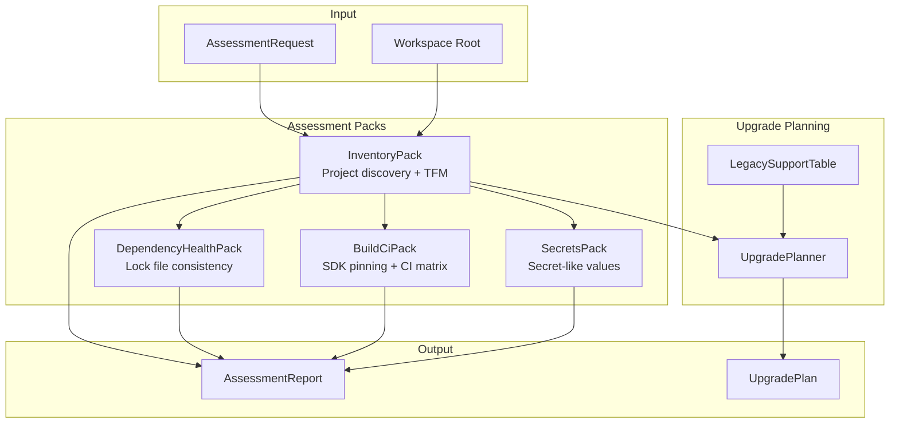
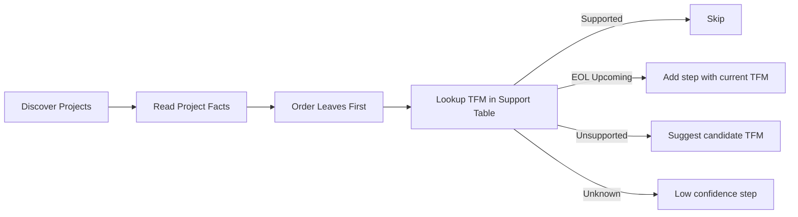

# Assessment Engine

> Source: `src/DataGuard.Core/Assessment/AssessmentEngine.cs`, `AssessmentContracts.cs`, `UpgradePlanner.cs`, `LegacySupportTable.cs`

The assessment engine provides read-only workspace analysis for .NET projects. It inventories projects, checks dependency health, scans for secrets, evaluates build/CI configuration, and produces an ordered upgrade path using curated lifecycle data.

## Assessment Flow



## AssessmentEngine

Static entry point for read-only workspace assessment.

```csharp
public static class AssessmentEngine
{
    public static AssessmentReport Run(
        AssessmentRequest request,
        LegacySupportTable? table = null) { ... }
}
```

### Execution Process

1. Validate workspace root exists
2. Discover projects via `InventoryPack.DiscoverProjects()`
3. Run `InventoryPack.Assess()` for TFM analysis
4. For each project, run `DependencyHealthPack.Assess()`
5. Run `BuildCiPack.Assess()` for CI/SDK analysis
6. Scan config files with `SecretsPack.AssessFile()`
7. Build `AssessmentReport` with summary counts

## AssessmentRequest

```csharp
public sealed record AssessmentRequest
{
    required public string WorkspaceRoot { get; init; }
    public IReadOnlyList<string> ProjectFilters { get; init; } = Array.Empty<string>();
    public bool AllowRemoteLookups { get; init; }
}
```

| Field | Description |
|-------|-------------|
| `WorkspaceRoot` | Absolute or relative path to solution/project root |
| `ProjectFilters` | Optional glob-like filters limiting assessed projects |
| `AllowRemoteLookups` | When true, remote advisory lookups may run (default: false) |

## AssessmentReport

```csharp
public sealed record AssessmentReport
{
    public string SchemaVersion { get; init; } = "1.0";
    required public string ToolVersion { get; init; }
    required public string Target { get; init; }
    required public DateTimeOffset GeneratedAt { get; init; }
    public IReadOnlyList<AssessmentFinding> Findings { get; init; }
    public IReadOnlyList<ToolError> Errors { get; init; }
    public AssessmentSummary Summary { get; init; }
}
```

## AssessmentFinding

```csharp
public sealed record AssessmentFinding
{
    required public string RuleId { get; init; }
    required public FindingSeverity Severity { get; init; }
    required public FindingConfidence Confidence { get; init; }
    required public string Message { get; init; }
    public IReadOnlyList<FindingEvidence> Evidence { get; init; }
    public string? SuggestedAction { get; init; }
    public IReadOnlyList<string> AppliesTo { get; init; }
}
```

### FindingSeverity

| Level | Description |
|-------|-------------|
| `Critical` | Blocking problem that invalidates an upgrade path |
| `Error` | Likely problem requiring attention |
| `Warning` | Suspected issue needing human review |
| `Information` | FYI context with no action implied |

### FindingConfidence

| Level | Description |
|-------|-------------|
| `High` | Deterministic fact from project/config metadata |
| `Medium` | Inferred from partial metadata |
| `Low` | Heuristic match requiring human confirmation |

### FindingEvidence

```csharp
public sealed record FindingEvidence
{
    required public string Path { get; init; }
    public string? Key { get; init; }
    public int? Line { get; init; }
    public string? ValuePreview { get; init; }
}
```

## Assessment Packs

### InventoryPack

Discovers projects and analyzes target framework monikers (TFMs).

```csharp
public static class InventoryPack
{
    public static IReadOnlyList<string> DiscoverProjects(
        string root, IReadOnlyList<string> filters) { ... }

    public static (IReadOnlyList<AssessmentFinding>, IReadOnlyList<ToolError>) Assess(
        string root, IReadOnlyList<string> projects, LegacySupportTable table) { ... }
}
```

**Checks:**
- Project file discovery (*.csproj, *.fsproj, *.vbproj)
- TFM analysis against curated support table
- Unsupported/EOL framework detection

### DependencyHealthPack

Checks lock file consistency and dependency health.

```csharp
public static class DependencyHealthPack
{
    public static IReadOnlyList<AssessmentFinding> Assess(
        string root, ProjectFacts facts) { ... }
}
```

**Checks:**
- `packages.lock.json` existence and freshness
- `packages.config` vs `PackageReference` migration
- Transitive dependency conflicts

### BuildCiPack

Evaluates SDK pinning and CI matrix coverage.

```csharp
public static class BuildCiPack
{
    public static IReadOnlyList<AssessmentFinding> Assess(string root) { ... }
}
```

**Checks:**
- `global.json` SDK version pinning
- CI configuration files (.github/workflows, azure-pipelines.yml)
- Build matrix coverage for target frameworks

### SecretsPack

Detects secret-like values in configuration files.

```csharp
public static class SecretsPack
{
    public static IReadOnlyList<AssessmentFinding> AssessFile(
        string root, string filePath) { ... }

    public static IReadOnlyList<AssessmentFinding> AssessMachinePaths(
        string root, string filePath) { ... }
}
```

**Checks:**
- Hardcoded connection strings in config files
- API keys, tokens, passwords in plain text
- Machine-specific paths that break portability

## ProjectInventoryReader

Reads MSBuild project files to extract project facts.

```csharp
public static class ProjectFacts
{
    public string ProjectPath { get; init; }
    public IReadOnlyList<string> TargetFrameworks { get; init; }
    public IReadOnlyList<string> ProjectReferences { get; init; }
    public IReadOnlyList<string> PackageReferences { get; init; }
    public bool? IsSdkStyle { get; init; }
    public bool ReadFailed { get; init; }
    public ToolError? Error { get; init; }
}
```

## PackagesConfigReader

Reads legacy `packages.config` files for migration assessment.

```csharp
public static class PackagesConfigReader
{
    public static IReadOnlyList<PackageEntry> Read(string filePath) { ... }
}
```

## UpgradePlanner

Produces an ordered upgrade path using curated lifecycle data.

```csharp
public static class UpgradePlanner
{
    public static UpgradePlan Plan(
        string workspaceRoot,
        LegacySupportTable? table = null) { ... }
}
```

### UpgradeStep

```csharp
public sealed record UpgradeStep
{
    required public string Project { get; init; }
    required public string SourceTarget { get; init; }
    public string? TargetCandidate { get; init; }
    public IReadOnlyList<string> BlockingFindingIds { get; init; }
    required public string ValidationCommand { get; init; }
    required public string RollbackArtifact { get; init; }
    public FindingConfidence Confidence { get; init; }
}
```

### UpgradePlan

```csharp
public sealed record UpgradePlan
{
    public IReadOnlyList<UpgradeStep> Steps { get; init; }
    public IReadOnlyList<ToolError> ManualBlockers { get; init; }
}
```

### Planning Algorithm



**Leaf-first ordering:** Projects not referenced by others upgrade first. This prevents breaking dependencies during incremental upgrades.

## LegacySupportTable

Curated, locally committed support status for .NET target frameworks.

```csharp
public sealed class LegacySupportTable
{
    public static LegacySupportTable Default { get; } = new(new[] {
        new SupportTableEntry { TargetFrameworkMoniker = "net461", Status = SupportStatus.Unsupported, ... },
        new SupportTableEntry { TargetFrameworkMoniker = "net462", Status = SupportStatus.EolUpcoming, EndOfSupport = new(2027, 1, 13), ... },
        new SupportTableEntry { TargetFrameworkMoniker = "net472", Status = SupportStatus.EolUpcoming, EndOfSupport = new(2028, 10, 10), ... },
        new SupportTableEntry { TargetFrameworkMoniker = "net480", Status = SupportStatus.Supported, ... },
        new SupportTableEntry { TargetFrameworkMoniker = "net481", Status = SupportStatus.Supported, ... },
        new SupportTableEntry { TargetFrameworkMoniker = "netstandard2.0", Status = SupportStatus.Supported, ... },
        new SupportTableEntry { TargetFrameworkMoniker = "net8.0", Status = SupportStatus.Supported, ... },
        new SupportTableEntry { TargetFrameworkMoniker = "net9.0", Status = SupportStatus.Supported, ... },
    });

    public SupportTableEntry? Lookup(string targetFrameworkMoniker) { ... }
}
```

### SupportStatus

| Status | Description |
|--------|-------------|
| `Supported` | In support with published end date |
| `EolUpcoming` | Still supported but end of support date published |
| `Unsupported` | Retired per curated source |

### SupportTableEntry

```csharp
public sealed record SupportTableEntry
{
    required public string TargetFrameworkMoniker { get; init; }
    required public SupportStatus Status { get; init; }
    public DateTimeOffset? EndOfSupport { get; init; }
    required public string SourceUrl { get; init; }
    required public string Retrieved { get; init; }
    public string SourceNote => $"{SourceUrl} (retrieved {Retrieved})";
}
```

Each entry includes provenance (source URL and retrieval date) for auditability.

## Usage

```csharp
var report = AssessmentEngine.Run(new AssessmentRequest
{
    WorkspaceRoot = "/path/to/workspace",
    ProjectFilters = new[] { "src/**/*.csproj" },
});

Console.WriteLine($"Findings: {report.Summary.TotalFindings}");
Console.WriteLine($"Critical: {report.Summary.Critical}");
Console.WriteLine($"Errors: {report.Summary.Errors_}");

var plan = UpgradePlanner.Plan("/path/to/workspace");
foreach (var step in plan.Steps)
{
    Console.WriteLine($"{step.Project}: {step.SourceTarget} → {step.TargetCandidate}");
}
```
