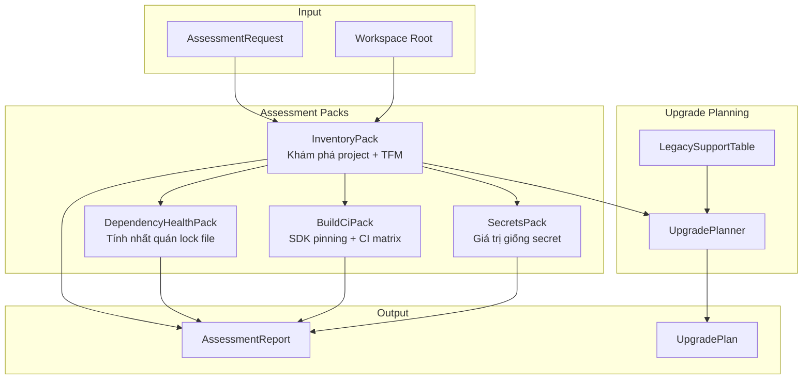
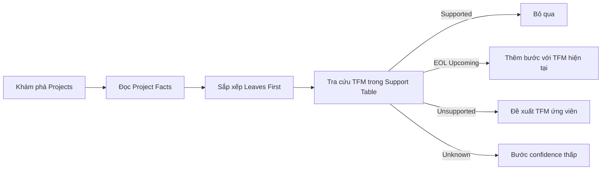

# Assessment Engine

> Nguồn: `src/DataGuard.Core/Assessment/AssessmentEngine.cs`, `AssessmentContracts.cs`, `UpgradePlanner.cs`, `LegacySupportTable.cs`

Assessment engine cung cấp phân tích workspace chỉ đọc cho các project .NET. Nó lập danh mục projects, kiểm tra sức khỏe dependencies, quét secrets, đánh giá cấu hình build/CI, và tạo đường dẫn nâng cấp có thứ tự sử dụng dữ liệu vòng đời đã tuyển chọn.

## Luồng Assessment



## AssessmentEngine

Điểm bắt đầu tĩnh cho phân tích workspace chỉ đọc.

```csharp
public static class AssessmentEngine
{
    public static AssessmentReport Run(
        AssessmentRequest request,
        LegacySupportTable? table = null) { ... }
}
```

### Quy Trình Thực Thi

1. Xác thực workspace root tồn tại
2. Khám phá projects qua `InventoryPack.DiscoverProjects()`
3. Chạy `InventoryPack.Assess()` cho phân tích TFM
4. Với mỗi project, chạy `DependencyHealthPack.Assess()`
5. Chạy `BuildCiPack.Assess()` cho phân tích CI/SDK
6. Quét config files với `SecretsPack.AssessFile()`
7. Tạo `AssessmentReport` với tổng hợp số lượng

## AssessmentRequest

```csharp
public sealed record AssessmentRequest
{
    required public string WorkspaceRoot { get; init; }
    public IReadOnlyList<string> ProjectFilters { get; init; } = Array.Empty<string>();
    public bool AllowRemoteLookups { get; init; }
}
```

## AssessmentReport

```csharp
public sealed record AssessmentReport
{
    public string SchemaVersion { get; init; } = "1.0";
    required public string ToolVersion { get; init; }
    required public string Target { get; init; }
    required public DateTimeOffset GeneratedAt { get; init; }
    public IReadOnlyList<AssessmentFinding> Findings { get; init; }
    public IReadOnlyList<ToolError> Errors { get; init; }
    public AssessmentSummary Summary { get; init; }
}
```

## AssessmentFinding

```csharp
public sealed record AssessmentFinding
{
    required public string RuleId { get; init; }
    required public FindingSeverity Severity { get; init; }
    required public FindingConfidence Confidence { get; init; }
    required public string Message { get; init; }
    public IReadOnlyList<FindingEvidence> Evidence { get; init; }
    public string? SuggestedAction { get; init; }
    public IReadOnlyList<string> AppliesTo { get; init; }
}
```

### FindingSeverity

| Mức độ | Mô tả |
|--------|-------|
| `Critical` | Vấn đề chặn đường nâng cấp |
| `Error` | Vấn đề có thể xảy ra cần chú ý |
| `Warning` | Vấn đề nghi ngờ cần xem xét thủ công |
| `Information` | Thông tin tham khảo, không yêu cầu hành động |

### FindingConfidence

| Mức độ | Mô tả |
|--------|-------|
| `High` | Sự thật deterministic từ metadata project/config |
| `Medium` | Suy luận từ metadata một phần |
| `Low` | Khớp heuristic cần xác nhận thủ công |

## Assessment Packs

### InventoryPack

Khám phá projects và phân tích target framework monikers (TFMs).

**Kiểm tra:**
- Khám phá file project (*.csproj, *.fsproj, *.vbproj)
- Phân tích TFM với bảng hỗ trợ đã tuyển chọn
- Phát hiện framework không hỗ trợ/EOL

### DependencyHealthPack

Kiểm tra tính nhất quán lock file và sức khỏe dependencies.

**Kiểm tra:**
- Sự tồn tại và tính mới của `packages.lock.json`
- Migration `packages.config` vs `PackageReference`
- Xung đột dependency transitives

### BuildCiPack

Đánh giá SDK pinning và phạm vi CI matrix.

**Kiểm tra:**
- SDK version pinning trong `global.json`
- Files cấu hình CI (.github/workflows, azure-pipelines.yml)
- Phạm vi build matrix cho target frameworks

### SecretsPack

Phát hiện giá trị giống secret trong config files.

**Kiểm tra:**
- Connection strings cứng trong config files
- API keys, tokens, passwords dạng plain text
- Đường dẫn đặc thù máy ảnh hưởng tính di động

## UpgradePlanner

Tạo đường dẫn nâng cấp có thứ tự sử dụng dữ liệu vòng đời đã tuyển chọn.

```csharp
public static class UpgradePlanner
{
    public static UpgradePlan Plan(
        string workspaceRoot,
        LegacySupportTable? table = null) { ... }
}
```

### UpgradeStep

```csharp
public sealed record UpgradeStep
{
    required public string Project { get; init; }
    required public string SourceTarget { get; init; }
    public string? TargetCandidate { get; init; }
    public IReadOnlyList<string> BlockingFindingIds { get; init; }
    required public string ValidationCommand { get; init; }
    required public string RollbackArtifact { get; init; }
    public FindingConfidence Confidence { get; init; }
}
```

### Thuật Toán Lập Kế Hoạch



**Sắp xếp leaf-first:** Projects không được tham chiếu bởi project khác nâng cấp trước. Điều này ngăn phá vỡ dependencies trong quá trình nâng cấp dần.

## LegacySupportTable

Bảng trạng thái hỗ trợ đã tuyển chọn, cam kết local cho các target frameworks .NET.

```csharp
public sealed class LegacySupportTable
{
    public static LegacySupportTable Default { get; } = new(new[] {
        new SupportTableEntry { TargetFrameworkMoniker = "net461", Status = SupportStatus.Unsupported, ... },
        new SupportTableEntry { TargetFrameworkMoniker = "net462", Status = SupportStatus.EolUpcoming, EndOfSupport = new(2027, 1, 13), ... },
        new SupportTableEntry { TargetFrameworkMoniker = "net472", Status = SupportStatus.EolUpcoming, EndOfSupport = new(2028, 10, 10), ... },
        new SupportTableEntry { TargetFrameworkMoniker = "net480", Status = SupportStatus.Supported, ... },
        new SupportTableEntry { TargetFrameworkMoniker = "net481", Status = SupportStatus.Supported, ... },
        new SupportTableEntry { TargetFrameworkMoniker = "netstandard2.0", Status = SupportStatus.Supported, ... },
        new SupportTableEntry { TargetFrameworkMoniker = "net8.0", Status = SupportStatus.Supported, ... },
        new SupportTableEntry { TargetFrameworkMoniker = "net9.0", Status = SupportStatus.Supported, ... },
    });

    public SupportTableEntry? Lookup(string targetFrameworkMoniker) { ... }
}
```

### SupportStatus

| Trạng thái | Mô tả |
|------------|-------|
| `Supported` | Đang hỗ trợ với ngày kết thúc đã công bố |
| `EolUpcoming` | Vẫn hỗ trợ nhưng ngày kết thúc đã công bố |
| `Unsupported` | Đã nghỉ hưu theo nguồn đã tuyển chọn |

### SupportTableEntry

```csharp
public sealed record SupportTableEntry
{
    required public string TargetFrameworkMoniker { get; init; }
    required public SupportStatus Status { get; init; }
    public DateTimeOffset? EndOfSupport { get; init; }
    required public string SourceUrl { get; init; }
    required public string Retrieved { get; init; }
    public string SourceNote => $"{SourceUrl} (retrieved {Retrieved})";
}
```

Mỗi entry bao gồm nguồn gốc (URL nguồn và ngày truy xuất) để kiểm toán.

## Sử Dụng

```csharp
var report = AssessmentEngine.Run(new AssessmentRequest
{
    WorkspaceRoot = "/path/to/workspace",
    ProjectFilters = new[] { "src/**/*.csproj" },
});

Console.WriteLine($"Findings: {report.Summary.TotalFindings}");
Console.WriteLine($"Critical: {report.Summary.Critical}");
Console.WriteLine($"Errors: {report.Summary.Errors_}");

var plan = UpgradePlanner.Plan("/path/to/workspace");
foreach (var step in plan.Steps)
{
    Console.WriteLine($"{step.Project}: {step.SourceTarget} → {step.TargetCandidate}");
}
```
