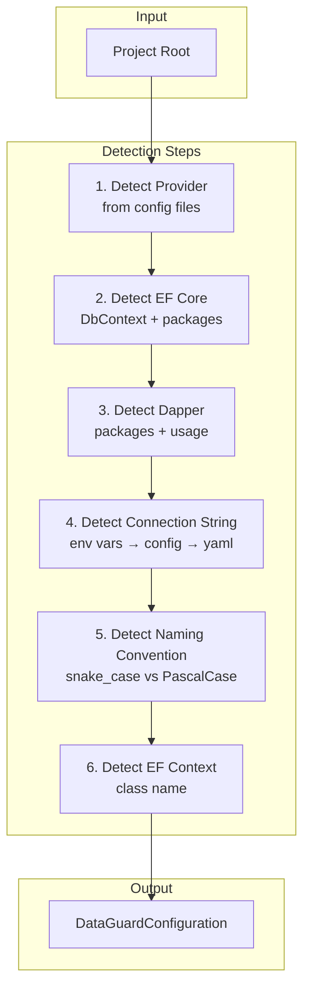
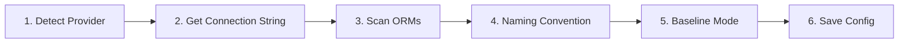

# Auto-Detection

> Source: `src/DataGuard.Core/AutoDetection/AutoDetectionEngine.cs`

The auto-detection engine scans a .NET project to automatically configure DataGuard with zero manual setup. It detects database providers, ORMs, connection strings, naming conventions, and EF Core contexts.

## Auto-Detection Flow



## AutoDetectionEngine

```csharp
public sealed class AutoDetectionEngine
{
    private readonly string _projectRoot;
    private readonly ILogger? _logger;

    public AutoDetectionEngine(string? projectRoot = null, ILogger? logger = null) { ... }

    public async Task<DataGuardConfiguration> DetectAsync(
        CancellationToken cancellationToken = default) { ... }
}
```

### Detection Process

| Step | Method | Sources | Priority |
|------|--------|---------|----------|
| 1 | `DetectProviderFromConfigAsync` | appsettings.json, appsettings.Development.json, .dataguard.yml, env vars | Highest |
| 2 | `DetectEfCoreAsync` | *.csproj packages, *.cs DbContext references | — |
| 3 | `DetectDapperAsync` | *.csproj packages, *.cs Dapper usage | — |
| 4 | `DetectConnectionStringAsync` | env vars → appsettings → .dataguard.yml | — |
| 5 | `DetectNamingConventionAsync` | snake_case vs PascalCase ratio in *.cs | — |
| 6 | `DetectEfCoreContextAsync` | `class X : DbContext` pattern | — |

## DatabaseProvider Detection

```csharp
public enum DatabaseProvider
{
    Unknown,
    SqlServer,
    Oracle,
    PostgreSQL,
    MySQL,
}
```

### Detection Strategy

**From connection strings:**
```csharp
// Oracle signatures checked first (more specific)
if (connStr.Contains("oracle") || connStr.Contains("service_name") ||
    connStr.Contains("connect_data"))
    return DatabaseProvider.Oracle;

// SQL Server
if (connStr.Contains("data source") || connStr.Contains("server="))
    return DatabaseProvider.SqlServer;
```

**From config files:**
- Parses `ConnectionStrings` section in appsettings.json
- Checks for `UseSqlServer`, `UseOracle` patterns
- Reads `provider:` from .dataguard.yml

**From environment variables:**
```csharp
var envProvider = Environment.GetEnvironmentVariable("DATAGUARD_PROVIDER");
if (Enum.TryParse<DatabaseProvider>(envProvider, true, out var parsed))
    return parsed;
```

## EF Core Detection

Scans for EF Core presence in two ways:

1. **Package references** — checks *.csproj for `Microsoft.EntityFrameworkCore`
2. **Source code** — checks *.cs files for `DbContext` usage

```csharp
private async Task<bool> DetectEfCoreAsync(CancellationToken ct)
{
    var csprojFiles = Directory.GetFiles(_projectRoot, "*.csproj", SearchOption.AllDirectories);
    foreach (var csproj in csprojFiles)
    {
        var content = await File.ReadAllTextAsync(csproj, ct);
        if (content.Contains("Microsoft.EntityFrameworkCore", StringComparison.OrdinalIgnoreCase))
            return true;
    }
    return false;
}
```

## Dapper Detection

Similar to EF Core detection:

1. **Package references** — checks *.csproj for `Dapper`
2. **Source code** — checks *.cs files for `Dapper.` usage

## Connection String Detection

Priority order:

| Priority | Source | Environment Variable |
|----------|--------|---------------------|
| 1 | Environment variable | `DATAGUARD_CONNECTION_STRING` |
| 2 | Environment variable | `ConnectionStrings__DefaultConnection` |
| 3 | Environment variable | `ConnectionStrings__Default` |
| 4 | appsettings.json | `ConnectionStrings.DefaultConnection` |
| 5 | appsettings.Development.json | `ConnectionStrings.DefaultConnection` |
| 6 | .dataguard.yml | `connectionString:` |

## Naming Convention Detection

Analyzes codebase to determine naming patterns:

```csharp
private async Task<NamingConvention?> DetectNamingConventionAsync(CancellationToken ct)
{
    var csFiles = Directory.GetFiles(_projectRoot, "*.cs", SearchOption.AllDirectories);
    var snakeCaseCount = 0;
    var pascalCaseCount = 0;

    foreach (var csFile in csFiles)
    {
        var content = await File.ReadAllTextAsync(csFile, ct);
        snakeCaseCount += Regex.Matches(content, @"\b[a-z]+_[a-z]+\b").Count;
        pascalCaseCount += Regex.Matches(content, @"public\s+\w+\s+[A-Z][a-z]+[A-Z][a-z]+\s*\{").Count;
    }

    if (snakeCaseCount > pascalCaseCount * 2)
        return NamingConvention.SnakeCaseToPascalCase;
    if (pascalCaseCount > snakeCaseCount * 2)
        return NamingConvention.PascalCaseToSnakeCase;
    return null; // Could not determine
}
```

## EF Core Context Detection

Finds DbContext class names by scanning for inheritance patterns:

```csharp
private async Task<string?> DetectEfCoreContextAsync(CancellationToken ct)
{
    var csFiles = Directory.GetFiles(_projectRoot, "*.cs", SearchOption.AllDirectories);
    foreach (var csFile in csFiles)
    {
        var content = await File.ReadAllTextAsync(csFile, ct);
        var matches = Regex.Matches(content, @"class\s+(\w+)\s*:\s*DbContext");
        if (matches.Count > 0)
            return matches[0].Groups[1].Value;
    }
    return null;
}
```

## InteractiveConfigBuilder

Zero-config setup wizard for legacy onboarding.

```csharp
public static class InteractiveConfigBuilder
{
    public static async Task<DataGuardConfiguration> RunWizardAsync(
        string projectRoot,
        IConsole console,
        CancellationToken cancellationToken = default) { ... }
}
```

### Wizard Steps



**Step 1:** Auto-detect database provider (default: SQL Server)
**Step 2:** Prompt for connection string or use `DATAGUARD_CONNECTION_STRING` env var
**Step 3:** Scan for EF Core and Dapper packages
**Step 4:** Choose naming convention (snake_case ↔ PascalCase, PascalCase ↔ snake_case, exact match)
**Step 5:** Choose ground truth mode (Snapshot, Baseline, Manual)
**Step 6:** Save `.dataguard.yml` configuration file

### Console Abstraction

```csharp
public interface IConsole
{
    void Write(string value);
    void WriteLine(string value);
    string? ReadLine();
    ConsoleKeyInfo ReadKey(bool intercept);
}
```

Allows testing the wizard without real console I/O.

## Provider-Specific Defaults

When a provider is detected, appropriate defaults are applied:

```csharp
private DataGuardConfiguration ApplyProviderDefaults(
    DataGuardConfiguration config, DatabaseProvider provider)
{
    return provider switch
    {
        DatabaseProvider.SqlServer => config with { SqlServer = new SqlServerConfiguration() },
        DatabaseProvider.Oracle => config with { Oracle = new OracleConfiguration() },
        _ => config
    };
}
```

## Usage

### Automatic Detection

```csharp
var engine = new AutoDetectionEngine(projectRoot);
var config = await engine.DetectAsync();
// config is ready to use with DataGuardApi.CreatePipeline(config)
```

### Interactive Wizard

```csharp
var config = await InteractiveConfigBuilder.RunWizardAsync(
    projectRoot, new SystemConsole());
// .dataguard.yml saved to projectRoot
```

### CLI Integration

```bash
dataguard init          # Runs auto-detection
dataguard init --wizard # Runs interactive wizard
```
