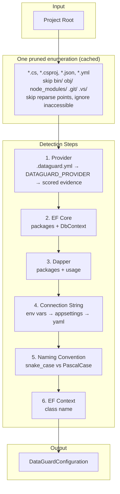
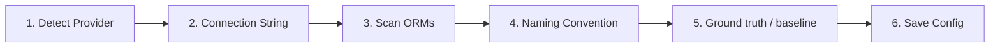

# Auto-Detection

> Source: `src/DataGuard.Core/AutoDetection/AutoDetectionEngine.cs`

The auto-detection engine scans a .NET project to suggest a DataGuard configuration: database provider, ORMs, connection string, naming convention and the EF Core context name. Its CLI caller is the `dataguard init --wizard` setup wizard (`InteractiveConfigBuilder`); plain `dataguard init` writes fixed defaults and does not scan.

## Auto-Detection Flow


```mermaid
flowchart TB
    subgraph Input
        ROOT[Project Root]
    end

    subgraph Scan["One pruned enumeration (cached)"]
        FILES[*.cs, *.csproj, *.json, *.yml<br/>skip bin/ obj/ node_modules/ .git/ .vs/<br/>skip reparse points, ignore inaccessible]
    end

    subgraph Detection Steps
        D1[1. Provider<br/>.dataguard.yml → DATAGUARD_PROVIDER → scored evidence]
        D2[2. EF Core<br/>packages + DbContext]
        D3[3. Dapper<br/>packages + usage]
        D4[4. Connection String<br/>env vars → appsettings → yaml]
        D5[5. Naming Convention<br/>snake_case vs PascalCase]
        D6[6. EF Context<br/>class name]
    end

    subgraph Output
        CONFIG[DataGuardConfiguration]
    end

    ROOT --> FILES --> D1 --> D2 --> D3 --> D4 --> D5 --> D6 --> CONFIG
```

## File enumeration

The project tree is enumerated **once** per engine instance with `EnumerationOptions { RecurseSubdirectories = true, IgnoreInaccessible = true, AttributesToSkip = ReparsePoint }` (a `FileSystemEnumerable` whose recurse predicate prunes `bin`, `obj`, `node_modules`, `.git` and `.vs` before descending). Only `*.cs`, `*.csproj`, `*.json` and `*.yml` files are kept, paths are ordered by depth and then ordinally (so the shallowest `appsettings.json` wins, deterministically), at most 50,000 files are listed, and each file's content is read at most once (files over 4 MB are treated as empty) and shared by every detection step.

## AutoDetectionEngine

```csharp
public sealed class AutoDetectionEngine
{
    public AutoDetectionEngine(string? projectRoot = null, ILogger? logger = null);

    public Task<DataGuardConfiguration> DetectAsync(CancellationToken cancellationToken = default);
    public Task<DatabaseProvider?> DetectProviderAsync(CancellationToken cancellationToken = default);
    public Task<bool> DetectEfCoreAsync(CancellationToken cancellationToken = default);
    public Task<bool> DetectDapperAsync(CancellationToken cancellationToken = default);

    public static DatabaseProvider? ParseProviderName(string? value); // sqlserver/mssql, oracle, postgresql/postgres/npgsql, mysql/mariadb
    public static string? ToProviderKey(DatabaseProvider provider);   // sqlserver, oracle, postgresql, mysql
}
```

### Detection Process

| Step | Method | Sources |
|------|--------|---------|
| 1 | `DetectProviderAsync` | `DefaultProvider:`/`provider:` in `.dataguard.yml`, then `DATAGUARD_PROVIDER`, then scored evidence |
| 2 | `DetectEfCoreAsync` | `*.csproj` containing `EntityFrameworkCore`, then `DbContext` in `*.cs` |
| 3 | `DetectDapperAsync` | `*.csproj` containing `Dapper`, then `using Dapper` / `Dapper.` in `*.cs` |
| 4 | `DetectConnectionStringAsync` | env vars → `appsettings.json` → `appsettings.Development.json` → `.dataguard.yml` |
| 5 | `DetectNamingConventionAsync` | snake_case identifiers vs PascalCase public members in `*.cs` |
| 6 | `DetectEfCoreContextAsync` | `class X : DbContext` (generic and namespace-qualified bases included); logged only |

The detected provider sets `DefaultProvider` (`sqlserver`, `oracle`, `postgresql`, `mysql`) and, for SQL Server and Oracle, the provider configuration block.

## Provider detection

```csharp
public enum DatabaseProvider { Unknown, SqlServer, Oracle, PostgreSQL, MySQL }
```

Explicit settings win: `DefaultProvider:` (or the legacy `provider:`) in `.dataguard.yml`, then the `DATAGUARD_PROVIDER` environment variable. Otherwise every piece of evidence adds to a per-provider score and the single highest score wins; a tie, or no evidence, is "not detected" (`null`).

| Evidence | Weight | Recognized |
|----------|--------|------------|
| Each `ConnectionStrings` value in `appsettings.json` / `appsettings.Development.json` | 3 | `ConnectionDiscovery.InferProviderFromConnectionString` (keys such as `Host`/`Search Path`, `Initial Catalog`/`Encrypt`, `Uid`/`SslMode`, Oracle `Data Source=host:port/service`, `postgres://`, `mysql://`, well-known ports) |
| Each `*.csproj` package reference | 2 | `Npgsql*` ⇒ PostgreSQL; `MySqlConnector`, `MySql.Data`, `Pomelo.EntityFrameworkCore.MySql`, `MySql.EntityFrameworkCore` ⇒ MySQL; `Oracle.ManagedDataAccess*`, `Oracle.EntityFrameworkCore` ⇒ Oracle; `Microsoft.EntityFrameworkCore.SqlServer`, `Microsoft.Data.SqlClient`, `System.Data.SqlClient` ⇒ SQL Server |
| Each `*.cs` file | 2 | `UseNpgsql(`/`NpgsqlConnection`, `UseMySql(`/`UseMySQL(`/`MySqlConnection`, `UseOracle(`/`OracleConnection`, `UseSqlServer(`/`new SqlConnection(` |

## EF Core and Dapper detection

Both check package references first and source usage second, over the cached file list.

### Stored Procedure Auto-Detection (Dapper & ADO.NET)

In addition to raw SQL string queries, the contract extraction engine auto-detects stored procedure calls without requiring SQL dialect prefixes:
- **Dapper Invocations**: Detects calls passing `commandType: CommandType.StoredProcedure` (e.g. `conn.QueryAsync<T>("SP_NAME", commandType: CommandType.StoredProcedure)`). Even if `"SP_NAME"` does not contain standard SQL query keywords (like `SELECT`), the proc name is captured, creating a `RawSqlDescriptor` with `IsStoredProcedure = true` and `ProcedureName = "SP_NAME"`.
- **ADO.NET Command Invocations**: Recognizes `cmd.CommandType = CommandType.StoredProcedure` assignments and back-fills the corresponding `SqlCommand` / `OracleCommand` / `NpgsqlCommand` `CommandText` as a stored procedure descriptor.

## Connection String Detection

| Priority | Source | Key |
|----------|--------|-----|
| 1 | Environment variable | `DATAGUARD_CONNECTION_STRING` |
| 2 | Environment variable | `ConnectionStrings__DefaultConnection` |
| 3 | Environment variable | `ConnectionStrings__Default` |
| 4 | appsettings.json (shallowest first) | first `ConnectionStrings` value that looks like a connection string (`Server=`, `Data Source=`, `Host=` or a recognized provider) |
| 5 | appsettings.Development.json | same |
| 6 | .dataguard.yml | `connectionString:` |

## Naming Convention Detection

Counts snake_case identifiers (`\b[a-z][a-z0-9]*(?:_[a-z0-9]+)+\b`) against PascalCase public members with **any number of humps** (`Id`, `Name`, `CustomerOrderId`), including generic, nullable and array member types (`List<OrderLine>`, `int?`, `byte[]`) and `static`/`virtual`/`override`/`required` modifiers. A count more than twice the other decides: snake_case ⇒ `SnakeCaseToPascalCase`, PascalCase ⇒ `PascalCaseToSnakeCase`; otherwise the default is kept. Regexes run with a 2-second timeout.

## InteractiveConfigBuilder

```csharp
public static class InteractiveConfigBuilder
{
    public static Task<DataGuardConfiguration> RunWizardAsync(string projectRoot, IConsole console, CancellationToken cancellationToken = default);
    public static Task<DataGuardConfiguration> RunWizardAsync(string projectRoot, IConsole console, string configPath, CancellationToken cancellationToken = default);
}
```

### Wizard Steps


```mermaid
flowchart LR
    S1[1. Detect Provider] --> S2[2. Connection String]
    S2 --> S3[3. Scan ORMs]
    S3 --> S4[4. Naming Convention]
    S4 --> S5[5. Ground truth / baseline]
    S5 --> S6[6. Save Config]
```

1. Detect the provider with `AutoDetectionEngine.DetectProviderAsync`.
2. Prompt for a connection string (Enter = `DATAGUARD_CONNECTION_STRING`). It is used **only** to infer the provider when step 1 found nothing (fallback: SQL Server) and is never written to the config file.
3. Scan for EF Core and Dapper with the same cached engine.
4. Naming convention: `1` snake_case ↔ PascalCase (default), `2` PascalCase ↔ snake_case, `3` exact match. The answer is written to the config.
5. Ground truth: `1` (default) ⇒ `GroundTruthMode: Snapshot`, `EnableBaseline: false`; `2` ⇒ `Snapshot` **plus** `EnableBaseline: true` (freeze current violations, fail only on new drift); `3` ⇒ `Manual`, `EnableBaseline: false`.
6. Write `GroundTruthMode`, `EnableSmartDefaults`, `EnableBaseline`, `NamingConvention`, `DefaultProvider`, plus `SnapshotFilePath: .dataguard-snapshot.json` (snapshot mode) and `BaselineFilePath: .dataguard-baseline.json` (baseline on) to the explicit config path.

### Console Abstraction

```csharp
public interface IConsole
{
    void Write(string value);
    void WriteLine(string value);
    string? ReadLine();
    ConsoleKeyInfo ReadKey(bool intercept);
}
```

Allows testing the wizard without real console I/O.

## Usage

```csharp
var engine = new AutoDetectionEngine(projectRoot);
var config = await engine.DetectAsync();

var wizardConfig = await InteractiveConfigBuilder.RunWizardAsync(projectRoot, new SystemConsole(), configPath);
```

```bash
dataguard init                              # writes default configuration (no scan)
dataguard init --wizard --output .dataguard.yml  # interactive wizard backed by auto-detection
```
