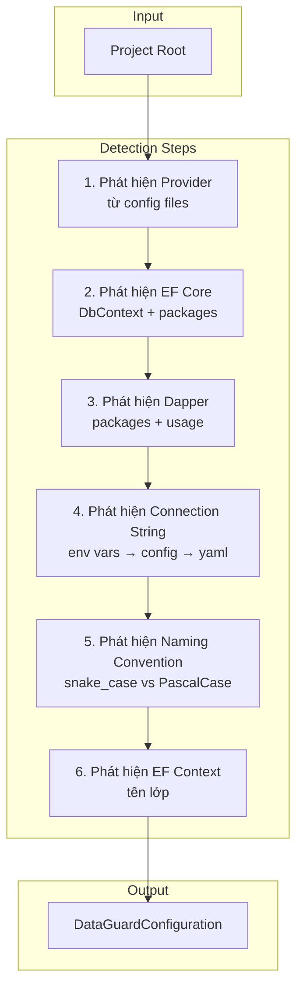
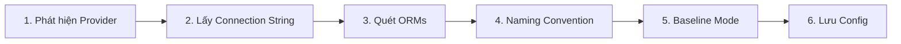

# Tự Động Phát Hiện

> Nguồn: `src/DataGuard.Core/AutoDetection/AutoDetectionEngine.cs`

Engine tự động phát hiện quét project .NET để tự động cấu hình DataGuard mà không cần thiết lập thủ công. Nó phát hiện nhà cung cấp database, ORM, connection strings, quy ước đặt tên, và EF Core contexts.

## Luồng Tự Động Phát Hiện



## AutoDetectionEngine

```csharp
public sealed class AutoDetectionEngine
{
    private readonly string _projectRoot;
    private readonly ILogger? _logger;

    public AutoDetectionEngine(string? projectRoot = null, ILogger? logger = null) { ... }

    public async Task<DataGuardConfiguration> DetectAsync(
        CancellationToken cancellationToken = default) { ... }
}
```

### Quy Trình Phát Hiện

| Bước | Phương thức | Nguồn | Ưu tiên |
|------|-------------|-------|---------|
| 1 | `DetectProviderFromConfigAsync` | appsettings.json, appsettings.Development.json, .dataguard.yml, env vars | Cao nhất |
| 2 | `DetectEfCoreAsync` | *.csproj packages, *.cs DbContext references | — |
| 3 | `DetectDapperAsync` | *.csproj packages, *.cs Dapper usage | — |
| 4 | `DetectConnectionStringAsync` | env vars → appsettings → .dataguard.yml | — |
| 5 | `DetectNamingConventionAsync` | Tỷ lệ snake_case vs PascalCase trong *.cs | — |
| 6 | `DetectEfCoreContextAsync` | Mẫu `class X : DbContext` | — |

## Phát Hiện DatabaseProvider

```csharp
public enum DatabaseProvider
{
    Unknown,
    SqlServer,
    Oracle,
    PostgreSQL,
    MySQL,
}
```

### Chiến Lược Phát Hiện

**Từ connection strings:**
```csharp
// Kiểm tra chữ ký Oracle trước (cụ thể hơn)
if (connStr.Contains("oracle") || connStr.Contains("service_name") ||
    connStr.Contains("connect_data"))
    return DatabaseProvider.Oracle;

// SQL Server
if (connStr.Contains("data source") || connStr.Contains("server="))
    return DatabaseProvider.SqlServer;
```

**Từ config files:**
- Phân tích section `ConnectionStrings` trong appsettings.json
- Kiểm tra mẫu `UseSqlServer`, `UseOracle`
- Đọc `provider:` từ .dataguard.yml

**Từ environment variables:**
```csharp
var envProvider = Environment.GetEnvironmentVariable("DATAGUARD_PROVIDER");
if (Enum.TryParse<DatabaseProvider>(envProvider, true, out var parsed))
    return parsed;
```

## Phát Hiện EF Core

Quét sự hiện diện của EF Core theo hai cách:

1. **Tham chiếu package** — kiểm tra *.csproj cho `Microsoft.EntityFrameworkCore`
2. **Mã nguồn** — kiểm tra *.cs files cho việc sử dụng `DbContext`

## Phát Hiện Dapper

Tương tự phát hiện EF Core:

1. **Tham chiếu package** — kiểm tra *.csproj cho `Dapper`
2. **Mã nguồn** — kiểm tra *.cs files cho việc sử dụng `Dapper.`

## Phát Hiện Connection String

Thứ tự ưu tiên:

| Ưu tiên | Nguồn | Environment Variable |
|---------|-------|---------------------|
| 1 | Environment variable | `DATAGUARD_CONNECTION_STRING` |
| 2 | Environment variable | `ConnectionStrings__DefaultConnection` |
| 3 | Environment variable | `ConnectionStrings__Default` |
| 4 | appsettings.json | `ConnectionStrings.DefaultConnection` |
| 5 | appsettings.Development.json | `ConnectionStrings.DefaultConnection` |
| 6 | .dataguard.yml | `connectionString:` |

## Phát Hiện Naming Convention

Phân tích codebase để xác định mẫu đặt tên:

```csharp
private async Task<NamingConvention?> DetectNamingConventionAsync(CancellationToken ct)
{
    var csFiles = Directory.GetFiles(_projectRoot, "*.cs", SearchOption.AllDirectories);
    var snakeCaseCount = 0;
    var pascalCaseCount = 0;

    foreach (var csFile in csFiles)
    {
        var content = await File.ReadAllTextAsync(csFile, ct);
        snakeCaseCount += Regex.Matches(content, @"\b[a-z]+_[a-z]+\b").Count;
        pascalCaseCount += Regex.Matches(content, @"public\s+\w+\s+[A-Z][a-z]+[A-Z][a-z]+\s*\{").Count;
    }

    if (snakeCaseCount > pascalCaseCount * 2)
        return NamingConvention.SnakeCaseToPascalCase;
    if (pascalCaseCount > snakeCaseCount * 2)
        return NamingConvention.PascalCaseToSnakeCase;
    return null; // Không thể xác định
}
```

## Phát Hiện EF Core Context

Tìm tên lớp DbContext bằng cách quét mẫu kế thừa:

```csharp
private async Task<string?> DetectEfCoreContextAsync(CancellationToken ct)
{
    var csFiles = Directory.GetFiles(_projectRoot, "*.cs", SearchOption.AllDirectories);
    foreach (var csFile in csFiles)
    {
        var content = await File.ReadAllTextAsync(csFile, ct);
        var matches = Regex.Matches(content, @"class\s+(\w+)\s*:\s*DbContext");
        if (matches.Count > 0)
            return matches[0].Groups[1].Value;
    }
    return null;
}
```

## InteractiveConfigBuilder

Wizard thiết lập zero-config cho onboarding legacy.

```csharp
public static class InteractiveConfigBuilder
{
    public static async Task<DataGuardConfiguration> RunWizardAsync(
        string projectRoot,
        IConsole console,
        CancellationToken cancellationToken = default) { ... }
}
```

### Các Bước Wizard



**Bước 1:** Tự động phát hiện nhà cung cấp database (mặc định: SQL Server)
**Bước 2:** Nhập connection string hoặc dùng env var `DATAGUARD_CONNECTION_STRING`
**Bước 3:** Quét packages EF Core và Dapper
**Bước 4:** Chọn naming convention (snake_case ↔ PascalCase, PascalCase ↔ snake_case, khớp chính xác)
**Bước 5:** Chọn ground truth mode (Snapshot, Baseline, Manual)
**Bước 6:** Lưu file cấu hình `.dataguard.yml`

### Console Abstraction

```csharp
public interface IConsole
{
    void Write(string value);
    void WriteLine(string value);
    string? ReadLine();
    ConsoleKeyInfo ReadKey(bool intercept);
}
```

Cho phép kiểm thử wizard mà không cần I/O console thực.

## Mặc Định Đặc thù Provider

Khi phát hiện provider, các giá trị mặc định phù hợp được áp dụng:

```csharp
private DataGuardConfiguration ApplyProviderDefaults(
    DataGuardConfiguration config, DatabaseProvider provider)
{
    return provider switch
    {
        DatabaseProvider.SqlServer => config with { SqlServer = new SqlServerConfiguration() },
        DatabaseProvider.Oracle => config with { Oracle = new OracleConfiguration() },
        _ => config
    };
}
```

## Sử Dụng

### Tự Động Phát Hiện

```csharp
var engine = new AutoDetectionEngine(projectRoot);
var config = await engine.DetectAsync();
// config sẵn sàng sử dụng với DataGuardApi.CreatePipeline(config)
```

### Wizard Tương Tác

```csharp
var config = await InteractiveConfigBuilder.RunWizardAsync(
    projectRoot, new SystemConsole());
// .dataguard.yml được lưu vào projectRoot
```

### Tích Hợp CLI

```bash
dataguard init          # Chạy tự động phát hiện
dataguard init --wizard # Chạy wizard tương tác
```
