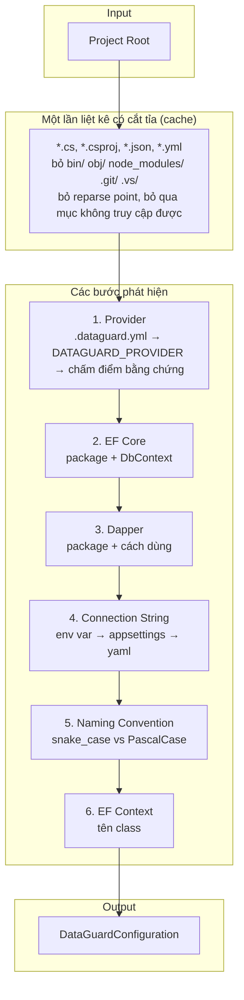
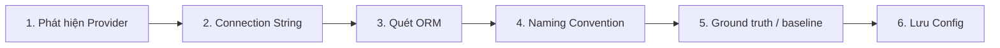

# Tự Động Phát Hiện

> Nguồn: `src/DataGuard.Core/AutoDetection/AutoDetectionEngine.cs`

Engine tự động phát hiện quét project .NET để gợi ý cấu hình DataGuard: database provider, ORM, connection string, quy ước đặt tên và tên EF Core context. Caller CLI của nó là wizard `dataguard init --wizard` (`InteractiveConfigBuilder`); `dataguard init` thường chỉ ghi cấu hình mặc định và không quét.

## Luồng Tự Động Phát Hiện


```mermaid
flowchart TB
    subgraph Input
        ROOT[Project Root]
    end

    subgraph Scan["Một lần liệt kê có cắt tỉa (cache)"]
        FILES[*.cs, *.csproj, *.json, *.yml<br/>bỏ bin/ obj/ node_modules/ .git/ .vs/<br/>bỏ reparse point, bỏ qua mục không truy cập được]
    end

    subgraph Steps["Các bước phát hiện"]
        D1[1. Provider<br/>.dataguard.yml → DATAGUARD_PROVIDER → chấm điểm bằng chứng]
        D2[2. EF Core<br/>package + DbContext]
        D3[3. Dapper<br/>package + cách dùng]
        D4[4. Connection String<br/>env var → appsettings → yaml]
        D5[5. Naming Convention<br/>snake_case vs PascalCase]
        D6[6. EF Context<br/>tên class]
    end

    subgraph Output
        CONFIG[DataGuardConfiguration]
    end

    ROOT --> FILES --> D1 --> D2 --> D3 --> D4 --> D5 --> D6 --> CONFIG
```

## Liệt kê file

Cây project được liệt kê **một lần** cho mỗi instance engine với `EnumerationOptions { RecurseSubdirectories = true, IgnoreInaccessible = true, AttributesToSkip = ReparsePoint }` (một `FileSystemEnumerable` có predicate recurse cắt bỏ `bin`, `obj`, `node_modules`, `.git` và `.vs` trước khi đi xuống). Chỉ giữ `*.cs`, `*.csproj`, `*.json`, `*.yml`; path được sắp theo độ sâu rồi theo thứ tự ordinal (nên `appsettings.json` nông nhất thắng, xác định), tối đa 50.000 file, và nội dung mỗi file chỉ đọc một lần (file trên 4 MB coi như rỗng) rồi dùng chung cho mọi bước.

## AutoDetectionEngine

```csharp
public sealed class AutoDetectionEngine
{
    public AutoDetectionEngine(string? projectRoot = null, ILogger? logger = null);

    public Task<DataGuardConfiguration> DetectAsync(CancellationToken cancellationToken = default);
    public Task<DatabaseProvider?> DetectProviderAsync(CancellationToken cancellationToken = default);
    public Task<bool> DetectEfCoreAsync(CancellationToken cancellationToken = default);
    public Task<bool> DetectDapperAsync(CancellationToken cancellationToken = default);

    public static DatabaseProvider? ParseProviderName(string? value); // sqlserver/mssql, oracle, postgresql/postgres/npgsql, mysql/mariadb
    public static string? ToProviderKey(DatabaseProvider provider);   // sqlserver, oracle, postgresql, mysql
}
```

### Quy Trình Phát Hiện

| Bước | Method | Nguồn |
|------|--------|-------|
| 1 | `DetectProviderAsync` | `DefaultProvider:`/`provider:` trong `.dataguard.yml`, rồi `DATAGUARD_PROVIDER`, rồi chấm điểm bằng chứng |
| 2 | `DetectEfCoreAsync` | `*.csproj` chứa `EntityFrameworkCore`, rồi `DbContext` trong `*.cs` |
| 3 | `DetectDapperAsync` | `*.csproj` chứa `Dapper`, rồi `using Dapper` / `Dapper.` trong `*.cs` |
| 4 | `DetectConnectionStringAsync` | env var → `appsettings.json` → `appsettings.Development.json` → `.dataguard.yml` |
| 5 | `DetectNamingConventionAsync` | identifier snake_case so với public member PascalCase trong `*.cs` |
| 6 | `DetectEfCoreContextAsync` | `class X : DbContext` (kể cả base generic và có namespace); chỉ ghi log |

Provider phát hiện được gán vào `DefaultProvider` (`sqlserver`, `oracle`, `postgresql`, `mysql`) và, với SQL Server/Oracle, khối cấu hình provider.

## Phát Hiện Provider

```csharp
public enum DatabaseProvider { Unknown, SqlServer, Oracle, PostgreSQL, MySQL }
```

Thiết lập tường minh thắng: `DefaultProvider:` (hoặc `provider:` cũ) trong `.dataguard.yml`, rồi biến môi trường `DATAGUARD_PROVIDER`. Ngoài ra mỗi bằng chứng cộng điểm cho provider tương ứng và provider có điểm cao nhất duy nhất thắng; hòa điểm hoặc không có bằng chứng là "không phát hiện" (`null`).

| Bằng chứng | Trọng số | Nhận diện |
|------------|----------|-----------|
| Mỗi giá trị `ConnectionStrings` trong `appsettings.json` / `appsettings.Development.json` | 3 | `ConnectionDiscovery.InferProviderFromConnectionString` (key như `Host`/`Search Path`, `Initial Catalog`/`Encrypt`, `Uid`/`SslMode`, Oracle `Data Source=host:port/service`, `postgres://`, `mysql://`, port quen thuộc) |
| Mỗi package reference trong `*.csproj` | 2 | `Npgsql*` ⇒ PostgreSQL; `MySqlConnector`, `MySql.Data`, `Pomelo.EntityFrameworkCore.MySql`, `MySql.EntityFrameworkCore` ⇒ MySQL; `Oracle.ManagedDataAccess*`, `Oracle.EntityFrameworkCore` ⇒ Oracle; `Microsoft.EntityFrameworkCore.SqlServer`, `Microsoft.Data.SqlClient`, `System.Data.SqlClient` ⇒ SQL Server |
| Mỗi file `*.cs` | 2 | `UseNpgsql(`/`NpgsqlConnection`, `UseMySql(`/`UseMySQL(`/`MySqlConnection`, `UseOracle(`/`OracleConnection`, `UseSqlServer(`/`new SqlConnection(` |

## Phát Hiện EF Core và Dapper

Cả hai kiểm tra package reference trước, cách dùng trong source sau, trên danh sách file đã cache.

### Tự Động Phát Hiện Stored Procedure (Dapper & ADO.NET)

Bên cạnh các truy vấn chuỗi SQL thô, engine trích xuất contract tự động phát hiện các lệnh gọi stored procedure mà không đòi hỏi tiền tố phương ngôn SQL:
- **Lệnh gọi Dapper**: Phát hiện các invocation truyền đối số `commandType: CommandType.StoredProcedure` (vd: `conn.QueryAsync<T>("SP_NAME", commandType: CommandType.StoredProcedure)`). Ngay cả khi `"SP_NAME"` không chứa các từ khóa SQL truy vấn thông thường (như `SELECT`), tên thủ tục vẫn được trích xuất an toàn và tạo `RawSqlDescriptor` với `IsStoredProcedure = true` cùng `ProcedureName = "SP_NAME"`.
- **Lệnh gọi ADO.NET Command**: Nhận diện phép gán `cmd.CommandType = CommandType.StoredProcedure` và trích xuất `CommandText` tương ứng của `SqlCommand` / `OracleCommand` / `NpgsqlCommand` thành stored procedure descriptor.

## Phát Hiện Connection String

| Ưu tiên | Nguồn | Key |
|---------|-------|-----|
| 1 | Environment variable | `DATAGUARD_CONNECTION_STRING` |
| 2 | Environment variable | `ConnectionStrings__DefaultConnection` |
| 3 | Environment variable | `ConnectionStrings__Default` |
| 4 | appsettings.json (nông nhất trước) | giá trị `ConnectionStrings` đầu tiên trông như connection string (`Server=`, `Data Source=`, `Host=` hoặc provider nhận diện được) |
| 5 | appsettings.Development.json | như trên |
| 6 | .dataguard.yml | `connectionString:` |

## Phát Hiện Naming Convention

Đếm identifier snake_case (`\b[a-z][a-z0-9]*(?:_[a-z0-9]+)+\b`) so với public member PascalCase có **số "bướu" bất kỳ** (`Id`, `Name`, `CustomerOrderId`), kể cả kiểu generic, nullable, mảng (`List<OrderLine>`, `int?`, `byte[]`) và modifier `static`/`virtual`/`override`/`required`. Bên nào lớn hơn gấp đôi bên kia sẽ quyết định: snake_case ⇒ `SnakeCaseToPascalCase`, PascalCase ⇒ `PascalCaseToSnakeCase`; ngược lại giữ mặc định. Regex chạy với timeout 2 giây.

## InteractiveConfigBuilder

```csharp
public static class InteractiveConfigBuilder
{
    public static Task<DataGuardConfiguration> RunWizardAsync(string projectRoot, IConsole console, CancellationToken cancellationToken = default);
    public static Task<DataGuardConfiguration> RunWizardAsync(string projectRoot, IConsole console, string configPath, CancellationToken cancellationToken = default);
}
```

### Các Bước Wizard


```mermaid
flowchart LR
    S1[1. Phát hiện Provider] --> S2[2. Connection String]
    S2 --> S3[3. Quét ORM]
    S3 --> S4[4. Naming Convention]
    S4 --> S5[5. Ground truth / baseline]
    S5 --> S6[6. Lưu Config]
```

1. Phát hiện provider bằng `AutoDetectionEngine.DetectProviderAsync`.
2. Hỏi connection string (Enter = `DATAGUARD_CONNECTION_STRING`). Giá trị **chỉ** dùng để suy ra provider khi bước 1 không tìm thấy (mặc định cuối: SQL Server) và không bao giờ được ghi vào file config.
3. Quét EF Core và Dapper bằng cùng engine đã cache.
4. Naming convention: `1` snake_case ↔ PascalCase (mặc định), `2` PascalCase ↔ snake_case, `3` khớp chính xác. Lựa chọn được ghi vào config.
5. Ground truth: `1` (mặc định) ⇒ `GroundTruthMode: Snapshot`, `EnableBaseline: false`; `2` ⇒ `Snapshot` **kèm** `EnableBaseline: true` (đóng băng vi phạm hiện có, chỉ fail với drift mới); `3` ⇒ `Manual`, `EnableBaseline: false`.
6. Ghi `GroundTruthMode`, `EnableSmartDefaults`, `EnableBaseline`, `NamingConvention`, `DefaultProvider`, cùng `SnapshotFilePath: .dataguard-snapshot.json` (chế độ snapshot) và `BaselineFilePath: .dataguard-baseline.json` (khi bật baseline) vào đường dẫn config tường minh.

### Console Abstraction

```csharp
public interface IConsole
{
    void Write(string value);
    void WriteLine(string value);
    string? ReadLine();
    ConsoleKeyInfo ReadKey(bool intercept);
}
```

Cho phép test wizard mà không cần console I/O thật.

## Sử Dụng

```csharp
var engine = new AutoDetectionEngine(projectRoot);
var config = await engine.DetectAsync();

var wizardConfig = await InteractiveConfigBuilder.RunWizardAsync(projectRoot, new SystemConsole(), configPath);
```

```bash
dataguard init                                   # ghi cấu hình mặc định (không quét)
dataguard init --wizard --output .dataguard.yml  # wizard tương tác dùng auto-detection
```
