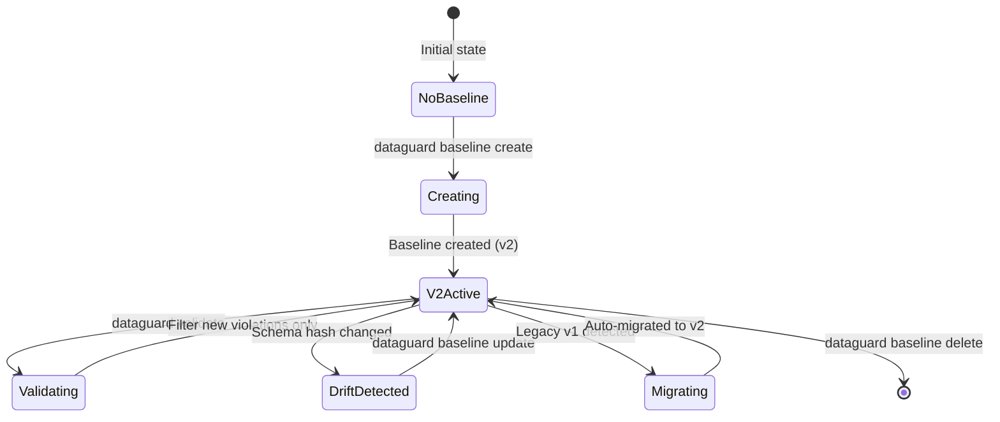
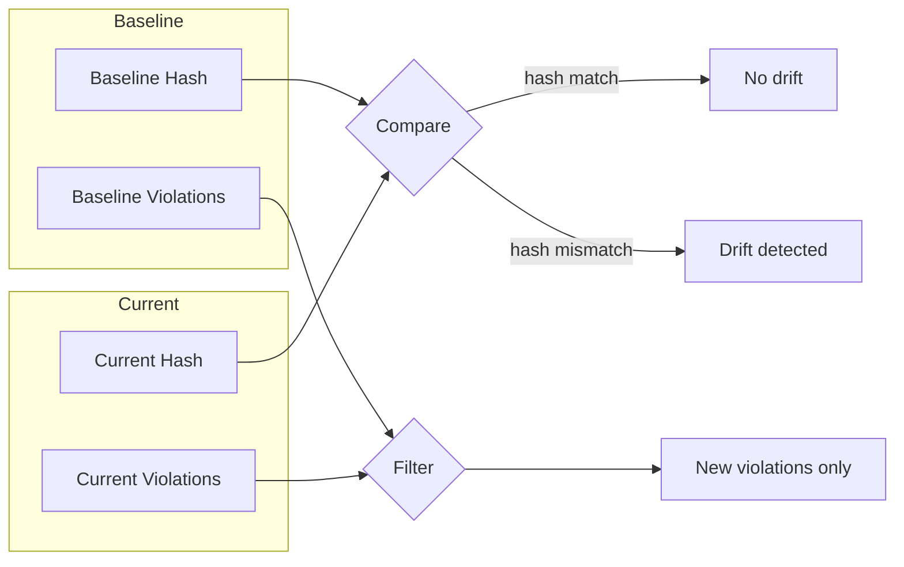

# Baseline Management

> Source: `src/DataGuard.Core/Baseline/BaselineManager.cs`

Baseline management enables DataGuard to work with legacy codebases that already have known violations. Instead of failing on every existing issue, the baseline captures the current state and only reports **new** violations (drift).

## Baseline Lifecycle



## BaselineManager

Core class for creating, loading, validating, and migrating baseline files.

```csharp
public class BaselineManager
{
    private readonly string _baselineFilePath;

    public BaselineManager(string baselineFilePath) { ... }

    public async Task<BaselineFile> CreateBaselineAsync(
        IEnumerable<ContractViolation> violations,
        string schemaVersion,
        string groundTruthMode,
        string? databaseVersion = null,
        string? schemaHash = null,
        IReadOnlyList<SnapshotTable>? schema = null,
        CancellationToken cancellationToken = default) { ... }

    public async Task<BaselineFile?> LoadAsync(CancellationToken ct = default) { ... }

    public IEnumerable<ContractViolation> FilterNewViolations(
        IEnumerable<ContractViolation> current,
        BaselineFile baseline) { ... }
}
```

## BaselineFile v2 Format

The current baseline format (version 2) adds database version tracking and schema hash for drift detection.

```json
{
  "version": 2,
  "createdAt": "2026-08-25T10:30:00Z",
  "schemaVersion": "1.0",
  "groundTruthMode": "Snapshot",
  "databaseVersion": "19c",
  "schemaHash": "A1B2C3D4E5F67890",
  "violations": [
    {
      "ruleId": "DG002",
      "message": "Parameter 'P_ID' has CLR type 'int' but database type 'VARCHAR2' is not compatible",
      "severity": "Error",
      "location": {
        "filePath": "src/Models/Order.cs",
        "startLine": 42,
        "startColumn": 8,
        "endLine": 42,
        "endColumn": 30
      },
      "properties": null
    }
  ],
  "schema": [
    {
      "name": "ORDERS",
      "columns": [
        {
          "name": "ORDER_ID",
          "dataType": "NUMBER",
          "maxLength": null,
          "charLength": null,
          "precision": 10,
          "scale": 0,
          "isNullable": false,
          "charUsed": null
        }
      ]
    }
  ]
}
```

### Field Reference

| Field | Type | Description |
|-------|------|-------------|
| `version` | `int` | Format version (always 2) |
| `createdAt` | `DateTimeOffset` | UTC creation timestamp |
| `schemaVersion` | `string` | User-defined schema version |
| `groundTruthMode` | `string` | `"Full"`, `"Snapshot"`, or `"Manual"` |
| `databaseVersion` | `string` | Database version (e.g. `"19c"`, `"2022"`) |
| `schemaHash` | `string` | SHA256 hash for drift detection |
| `violations` | `BaselineViolation[]` | Known violations at baseline time |
| `schema` | `SnapshotTable[]?` | Optional offline schema snapshot |

## SnapshotTable / SnapshotColumn

Serializable ground-truth schema for offline validation (no database connection needed).

```csharp
public record SnapshotTable(
    string Name,
    IReadOnlyList<SnapshotColumn> Columns);

public record SnapshotColumn(
    string Name,
    string DataType,
    int? MaxLength,
    int? CharLength,
    int? Precision,
    int? Scale,
    bool IsNullable,
    string? CharUsed);
```

When a baseline includes `schema`, DataGuard can validate against the snapshot without connecting to the database — useful for CI/CD pipelines that don't have database access.

## Schema Hash Computation

Two hash computation strategies:

### Violation-based Hash (Legacy)

```csharp
public static string ComputeSchemaHash(IEnumerable<ContractViolation> violations)
{
    var data = string.Join("|", violations
        .OrderBy(v => v.RuleId).ThenBy(v => v.Message)
        .Select(v => $"{v.RuleId}:{v.Message}"));
    return SHA256(data)[..16]; // 16-hex prefix
}
```

### Schema-based Hash (Full)

```csharp
public static string ComputeSchemaHash(IReadOnlyList<SnapshotTable> schema)
{
    var canonical = string.Join("|", schema
        .OrderBy(t => t.Name)
        .Select(t => $"{t.Name}{{{columns_canonicalized}}}"));
    return SHA256(canonical); // Full 64-hex
}
```

The schema-based hash detects changes even when they produce no violations (e.g. adding a nullable column).

## Drift Detection



**Drift detection process:**
1. Load baseline file
2. Compute current schema hash
3. Compare with baseline `SchemaHash`
4. If different → drift detected
5. Filter current violations against baseline signatures (`RuleId:Message`)
6. Report only new violations

## Legacy v1 → v2 Migration

Automatic migration from legacy baseline format:

```csharp
private static BaselineFile MigrateFromLegacy(LegacyBaselineFile legacy)
{
    return new BaselineFile(
        Version: 2,
        CreatedAt: legacy.CreatedAt,
        SchemaVersion: legacy.SchemaVersion,
        GroundTruthMode: legacy.GroundTruthMode,
        DatabaseVersion: "unknown",
        SchemaHash: ComputeSchemaHashFromLegacy(legacy),
        Violations: legacy.Violations);
}
```

**Migration process:**
1. `LoadAsync()` attempts v2 deserialization
2. On `JsonException`, falls back to v1 format
3. `MigrateFromLegacy()` converts v1 → v2
4. `MigrateBaselineAsync()` performs in-place migration and saves

### Legacy v1 Format

```csharp
internal record LegacyBaselineFile(
    int Version,           // 1
    DateTimeOffset CreatedAt,
    string SchemaVersion,
    string GroundTruthMode,
    IReadOnlyList<BaselineViolation> Violations);
```

Missing fields in v1: `DatabaseVersion`, `SchemaHash`, `Schema`.

## Performance Optimizations

### Memory-Mapped Files

For baseline files > 1MB, uses `MemoryMappedFile` for efficient I/O:

```csharp
private async Task<BaselineFile?> LoadWithMemoryMappedFileAsync(CancellationToken ct)
{
    using var mmf = MemoryMappedFile.CreateFromFile(_baselineFilePath, FileMode.Open, null, 0, MemoryMappedFileAccess.Read);
    using var accessor = mmf.CreateViewAccessor(0, 0, MemoryMappedFileAccess.Read);
    // Read directly from memory-mapped region
}
```

### Schema Hash Caching

Uses `MemoryCache` for schema hash computation results:

```csharp
private static readonly MemoryCache _schemaHashCache = new MemoryCache(new MemoryCacheOptions
{
    SizeLimit = 10000,
    ExpirationScanFrequency = TimeSpan.FromMinutes(5),
});
```

### Atomic Writes

Large baseline files use atomic write pattern:

```csharp
private async Task SaveWithMemoryMappedFileAsync(byte[] data)
{
    var tempPath = _baselineFilePath + ".tmp";
    await File.WriteAllBytesAsync(tempPath, data);
    File.Replace(tempPath, _baselineFilePath, null, false);
}
```

## BaselineViolation

Serializable violation record for baseline storage.

```csharp
public record BaselineViolation(
    string RuleId,
    string Message,
    string Severity,
    BaselineLocation? Location,
    IReadOnlyDictionary<string, object?>? Properties);

public record BaselineLocation(
    string FilePath,
    int StartLine,
    int StartColumn,
    int EndLine,
    int EndColumn);
```

## BaselineInfo

Summary information about a baseline file.

```csharp
public record BaselineInfo(
    string FilePath,
    long FileSizeBytes,
    DateTimeOffset LastModified,
    BaselineFile? Baseline,
    string? ErrorMessage = null)
{
    public bool IsValid => Baseline != null;
    public bool HasViolations => Baseline?.Violations?.Count > 0;
}
```

## Usage Patterns

### CI/CD Pipeline

```bash
# First run: create baseline
dataguard baseline create --schema-version 1.0

# Subsequent runs: only fail on new violations
dataguard validate --baseline .dataguard-baseline.json

# After schema changes: update baseline
dataguard baseline update
```

### Programmatic Usage

```csharp
var manager = new BaselineManager(".dataguard-baseline.json");
var baseline = await manager.LoadAsync();

if (baseline != null)
{
    var newViolations = manager.FilterNewViolations(currentViolations, baseline);
    if (newViolations.Any())
    {
        // Fail CI: new violations detected
    }
}
```
