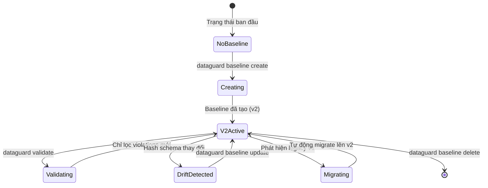
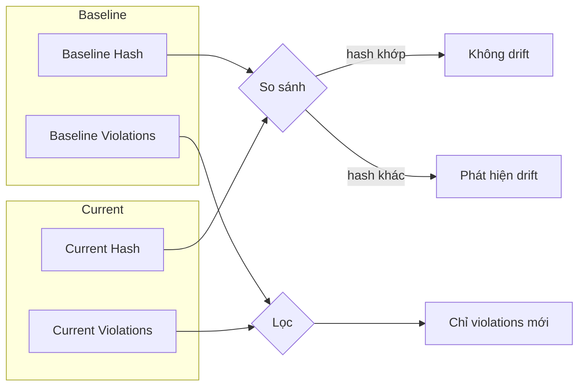

# Quản Lý Baseline

> **Giới hạn thực thi hiện tại (2026-09-13):** C# suite cục bộ và các gate
> integration parser provider đều pass. Metadata snapshot v3 và capture schema
> theo provider đã triển khai; ma trận refresh/diff đầy đủ bốn provider vẫn là gate
> acceptance. Persistence dùng contract ghi nguyên tử có giới hạn bên dưới.

> Nguồn: `src/DataGuard.Core/Baseline/BaselineManager.cs`

Quản lý baseline cho phép DataGuard làm việc với codebase legacy đã có các violations đã biết. Thay vì thất bại trên mọi vấn đề hiện có, baseline chụp trạng thái hiện tại và chỉ báo cáo các violations **mới** (drift).

## Vòng Đời Baseline



## BaselineManager

Lớp cốt lõi để tạo, tải, kiểm tra, và migrate baseline files.

```csharp
public class BaselineManager
{
    private readonly string _baselineFilePath;

    public BaselineManager(string baselineFilePath) { ... }

    public async Task<BaselineFile> CreateBaselineAsync(
        IEnumerable<ContractViolation> violations,
        string schemaVersion,
        string groundTruthMode,
        string? databaseVersion = null,
        string? schemaHash = null,
        IReadOnlyList<SnapshotTable>? schema = null,
        string? schemaHashKind = null,
        string? provider = null,
        string? schemaScope = null,
        string? schemaCanonicalizationVersion = null,
        CancellationToken cancellationToken = default) { ... }

    public async Task<BaselineFile?> LoadAsync(CancellationToken ct = default) { ... }

    public IEnumerable<ContractViolation> FilterNewViolations(
        IEnumerable<ContractViolation> current,
        BaselineFile baseline) { ... }
}
```

## Định Dạng BaselineFile v2/v3

Version 2 thêm theo dõi phiên bản database và schema hash. Baseline có schema dùng
version 3 và ghi `schemaHashKind`, `provider`, `schemaScope`, cùng
`schemaCanonicalizationVersion`; các file v1/v2 cũ vẫn đọc được.

```json
{
  "version": 3,
  "createdAt": "2026-08-25T10:30:00Z",
  "schemaVersion": "1.0",
  "groundTruthMode": "Snapshot",
  "databaseVersion": "19c",
  "schemaHash": "A1B2C3D4E5F67890",
  "schemaHashKind": "canonical-schema-v1",
  "provider": "sqlserver",
  "schemaScope": "dbo",
  "schemaCanonicalizationVersion": "v1",
  "violations": [
    {
      "ruleId": "DG002",
      "message": "Parameter 'P_ID' has CLR type 'int' but database type 'VARCHAR2' is not compatible",
      "severity": "Error",
      "location": {
        "filePath": "src/Models/Order.cs",
        "startLine": 42,
        "startColumn": 8,
        "endLine": 42,
        "endColumn": 30
      },
      "properties": null
    }
  ],
  "schema": [
    {
      "name": "ORDERS",
      "columns": [
        {
          "name": "ORDER_ID",
          "dataType": "NUMBER",
          "maxLength": null,
          "precision": 10,
          "scale": 0,
          "isNullable": false,
          "charUsed": null
        }
      ]
    }
  ]
}
```

### Tham Chiếu Trường

| Trường | Kiểu | Mô tả |
|--------|------|-------|
| `version` | `int` | Phiên bản định dạng (2 chỉ violation, 3 có schema) |
| `createdAt` | `DateTimeOffset` | Thời gian tạo UTC |
| `schemaVersion` | `string` | Phiên bản schema do người dùng định nghĩa |
| `groundTruthMode` | `string` | `"Full"`, `"Snapshot"`, hoặc `"Manual"` |
| `databaseVersion` | `string` | Phiên bản database (vd: `"19c"`, `"2022"`) |
| `schemaHash` | `string` | Hash SHA256 để phát hiện drift |
| `schemaHashKind` | `string?` | Định danh biểu diễn hash |
| `provider` | `string?` | Provider dùng để capture schema |
| `schemaScope` | `string?` | Phạm vi schema/database/owner đã chọn |
| `schemaCanonicalizationVersion` | `string?` | Phiên bản canonicalizer (hiện là `v1`) |
| `violations` | `BaselineViolation[]` | Các violations đã biết tại thời điểm baseline |
| `schema` | `SnapshotTable[]?` | Snapshot schema offline tùy chọn |

## SnapshotTable / SnapshotColumn

Schema ground-truth có thể serialize cho kiểm tra offline (không cần kết nối database).

```csharp
public record SnapshotTable(
    string Name,
    IReadOnlyList<SnapshotColumn> Columns);

public record SnapshotColumn(
    string Name,
    string DataType,
    int? MaxLength,
    int? CharLength,
    int? Precision,
    int? Scale,
    bool IsNullable,
    string? CharUsed,
    string? DataDefault = null,
    int? ColumnId = null);
```

Khi baseline bao gồm `schema`, DataGuard có thể kiểm tra với snapshot mà không cần kết nối database — hữu ích cho CI/CD pipeline không có quyền truy cập database. Schema hash bao gồm giá trị mặc định và thứ tự cột khi có dữ liệu.

## Tính Toán Schema Hash

Hai chiến lược tính toán hash:

### Hash Dựa Trên Violation (Legacy)

```csharp
public static string ComputeSchemaHash(IEnumerable<ContractViolation> violations)
{
    var data = string.Join("|", violations
        .OrderBy(v => v.RuleId).ThenBy(v => v.Message)
        .Select(v => $"{v.RuleId}:{v.Message}"));
    return SHA256(data)[..16]; // Tiền tố 16-hex
}
```

### Hash Dựa Trên Schema (Đầy Đủ)

```csharp
public static string ComputeSchemaHash(IReadOnlyList<SnapshotTable> schema)
{
    var canonical = string.Join("|", schema
        .OrderBy(t => t.Name)
        .Select(t => $"{t.Name}{{{columns_canonicalized}}}"));
    return SHA256(canonical); // Đầy đủ 64-hex
}
```

Hash dựa trên schema phát hiện thay đổi ngay cả khi chúng không tạo violations (vd: thêm cột nullable).

## Phát Hiện Drift



**Quy trình phát hiện drift:**
1. Tải baseline file
2. Tính hash schema hiện tại
3. So sánh với `SchemaHash` baseline
4. Nếu khác → phát hiện drift
5. Lọc violations hiện tại với chữ ký baseline (`RuleId:Message`)
6. Chỉ báo cáo violations mới

## Migration Legacy v1 → v2

Tự động migrate từ định dạng baseline legacy:

```csharp
private static BaselineFile MigrateFromLegacy(LegacyBaselineFile legacy)
{
    return new BaselineFile(
        Version: 2,
        CreatedAt: legacy.CreatedAt,
        SchemaVersion: legacy.SchemaVersion,
        GroundTruthMode: legacy.GroundTruthMode,
        DatabaseVersion: "unknown",
        SchemaHash: ComputeSchemaHashFromLegacy(legacy),
        Violations: legacy.Violations);
}
```

**Quy trình migration:**
1. `LoadAsync()` thử deserialize v2
2. Khi `JsonException`, fallback về định dạng v1
3. `MigrateFromLegacy()` chuyển đổi v1 → v2
4. `MigrateBaselineAsync()` thực hiện migration tại chỗ và lưu

### Định Dạng Legacy v1

```csharp
internal record LegacyBaselineFile(
    int Version,           // 1
    DateTimeOffset CreatedAt,
    string SchemaVersion,
    string GroundTruthMode,
    IReadOnlyList<BaselineViolation> Violations);
```

Các trường thiếu trong v1: `DatabaseVersion`, `SchemaHash`, `Schema`.

## Tối Ưu Hiệu Suất

### Memory-Mapped Files

Cho baseline files > 1MB, sử dụng `MemoryMappedFile` cho I/O hiệu quả:

```csharp
private async Task<BaselineFile?> LoadWithMemoryMappedFileAsync(CancellationToken ct)
{
    using var mmf = MemoryMappedFile.CreateFromFile(_baselineFilePath, FileMode.Open, null, 0, MemoryMappedFileAccess.Read);
    using var accessor = mmf.CreateViewAccessor(0, 0, MemoryMappedFileAccess.Read);
    // Đọc trực tiếp từ vùng memory-mapped
}
```

### Cache baseline theo content-address

`LoadAsync` dùng `MemoryCache` process-local có giới hạn, key là SHA-256 digest của
toàn bộ nội dung baseline. Entry hết hạn sau một giờ và chỉ xuất hit/miss counter.
File thay đổi tạo key mới, vì vậy cache không bao giờ là bằng chứng để bỏ qua fresh
live acquisition hoặc drift comparison.

```csharp
private static readonly MemoryCache _schemaHashCache = new MemoryCache(new MemoryCacheOptions
{
    SizeLimit = 10000,
    ExpirationScanFrequency = TimeSpan.FromMinutes(5),
});
```

### Ghi Nguyên Tử Có Giới Hạn

Mọi lần ghi baseline bị giới hạn kích thước (16 MiB), hỗ trợ cancellation, và dùng
file tạm duy nhất trong cùng thư mục. Dữ liệu được flush trước khi thay thế nguyên tử;
cancellation trước publish giữ nguyên file đích cũ. Việc dọn file tạm lỗi là best effort.

```csharp
private async Task SaveAtomicallyAsync(byte[] data, CancellationToken ct)
{
    // cùng thư mục để không thay thế chéo volume
    await stream.WriteAsync(data, ct);
    await stream.FlushAsync(ct);
    stream.Flush(flushToDisk: true);
    File.Move(tempPath, _baselineFilePath, overwrite: true);
}
```

## Mẫu Sử Dụng

### CI/CD Pipeline

```bash
# Lần chạy đầu: tạo baseline
dataguard baseline create --schema-version 1.0

# Các lần sau: chỉ lỗi trên violations mới
dataguard validate --baseline .dataguard-baseline.json

# Sau thay đổi schema: cập nhật baseline
dataguard baseline update
```

### Sử Dụng Chương Trình

```csharp
var manager = new BaselineManager(".dataguard-baseline.json");
var baseline = await manager.LoadAsync();

if (baseline != null)
{
    var newViolations = manager.FilterNewViolations(currentViolations, baseline);
    if (newViolations.Any())
    {
        // Lỗi CI: phát hiện violations mới
    }
}
```
