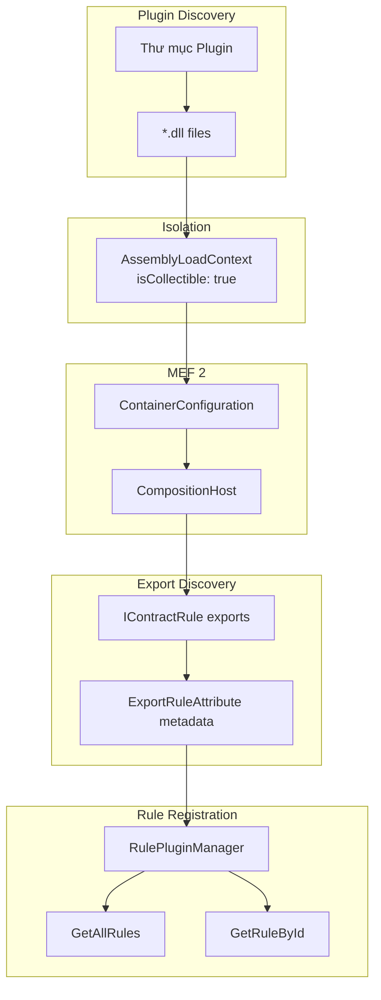
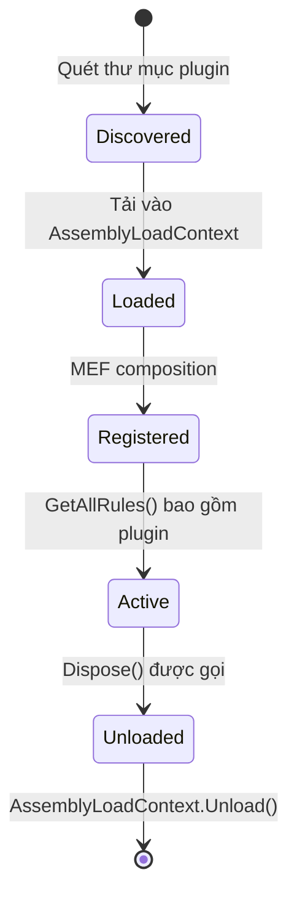

# Kiến Trúc Plugin

> Nguồn: `src/DataGuard.Core/Plugins/RulePluginManager.cs`

Hệ thống plugin của DataGuard cho phép các assembly bên ngoài mở rộng rules engine. Nó sử dụng MEF 2 (Managed Extensibility Framework) để khám phá và tải, với cô lập `AssemblyLoadContext` để unload plugin an toàn.

## Luồng Tải Plugin



## RulePluginManager

Quản lý trung tâm cho khám phá, tải, và giải quyết plugin.

```csharp
public sealed class RulePluginManager : IDisposable
{
    private readonly CompositionHost _container;
    private readonly ImmutableArray<Lazy<IContractRule, IRuleMetadata>> _rulePlugins;
    private readonly List<AssemblyLoadContext> _pluginContexts = new();

    public RulePluginManager(
        string? pluginDirectory = null,
        ILogger<RulePluginManager>? logger = null) { ... }

    public ImmutableArray<IContractRule> GetAllRules(
        ImmutableArray<IContractRule> builtInRules) { ... }

    public IContractRule? GetRuleById(
        string ruleId,
        ImmutableArray<IContractRule> builtInRules) { ... }

    public ImmutableArray<IRuleMetadata> GetRuleMetadata() { ... }
}
```

### Thư Mục Plugin

Chỉ thư mục plugin được cung cấp rõ ràng mới được quét. Vị trí mặc định (`%APPDATA%/DataGuard/Plugins`) có thể ghi bởi người dùng và không bao giờ tự động tải code.

```csharp
var dir = pluginDirectory;
if (dir != null && Directory.Exists(dir))
{
    foreach (var assemblyFile in Directory.GetFiles(dir, "*.dll"))
    {
        var alc = new AssemblyLoadContext(
            $"DataGuard.Plugin:{Path.GetFileName(assemblyFile)}",
            isCollectible: true);
        var assembly = alc.LoadFromAssemblyPath(assemblyFile);
        config = config.WithAssembly(assembly);
    }
}
```

### Cô Lập AssemblyLoadContext

Mỗi assembly plugin được tải vào `AssemblyLoadContext` collectible riêng biệt:

| Thuộc tính | Giá trị | Mục đích |
|------------|---------|----------|
| `Name` | `DataGuard.Plugin:{filename}` | Nhận diện context |
| `isCollectible` | `true` | Cho phép unload |

**Lợi ích cô lập:**
- Types plugin không can thiệp vào giải quyết type của host
- Plugins có thể được unload (thu hồi bộ nhớ)
- Lỗi plugin không crash host

## ExportRuleAttribute

Thuộc tính metadata cho rule plugins. Kết hợp `ExportAttribute` của MEF với metadata đặc thù rule.

```csharp
[MetadataAttribute]
[AttributeUsage(AttributeTargets.Class, AllowMultiple = false)]
public sealed class ExportRuleAttribute : ExportAttribute, IRuleMetadata
{
    public ExportRuleAttribute(string ruleId) : base(typeof(IContractRule))
    {
        RuleId = ruleId;
    }

    public string RuleId { get; }
    public string Name { get; set; } = "";
    public string Description { get; set; } = "";
    public string Category { get; set; } = "Custom";
    public string DefaultSeverity { get; set; } = "Warning";
    public string MinDataGuardVersion { get; set; } = "1.0.0";
    public string Author { get; set; } = "";
    public string[] Tags { get; set; } = Array.Empty<string>();
}
```

### Ví Dụ Plugin

```csharp
[ExportRule(
    "CUSTOM001",
    Name = "Custom Naming Convention",
    Description = "Enforces custom naming convention for specific schemas",
    Category = "Naming",
    DefaultSeverity = "Warning",
    MinDataGuardVersion = "1.0.0",
    Author = "DataGuard Team",
    Tags = new[] { "naming", "custom" })]
public sealed class CustomNamingConventionRule : IContractRule
{
    public string RuleId => "CUSTOM001";
    public string Name => "Custom Naming Convention";
    public DiagnosticSeverity Severity => DiagnosticSeverity.Warning;

    public async Task<IReadOnlyList<ContractViolation>> ValidateAsync(
        ContractDescriptor contract,
        IReadOnlyList<ContractDescriptor> allContracts,
        CancellationToken cancellationToken = default)
    {
        var violations = new List<ContractViolation>();

        if (contract is StoredProcedureDescriptor sp &&
            sp.Schema.StartsWith("LEGACY_", StringComparison.OrdinalIgnoreCase))
        {
            foreach (var param in sp.Parameters)
            {
                if (!param.Name.StartsWith("P_", StringComparison.OrdinalIgnoreCase))
                {
                    violations.Add(new ContractViolation(
                        RuleId: "CUSTOM001",
                        Message: $"Parameter '{param.Name}' should start with 'P_'",
                        Severity: DiagnosticSeverity.Warning));
                }
            }
        }

        return await Task.FromResult(violations);
    }
}
```

## IExternalToolPlugin

Interface để tích hợp công cụ phân tích bên ngoài (SonarQube, custom linters).

```csharp
public interface IExternalToolPlugin
{
    string ToolName { get; }
    string Version { get; }

    Task<PluginAnalysisResult> AnalyzeAsync(
        IReadOnlyList<ContractDescriptor> contracts,
        CancellationToken cancellationToken = default);
}
```

### PluginAnalysisResult

```csharp
public sealed record PluginAnalysisResult(
    string ToolName,
    IReadOnlyList<ContractViolation> Violations,
    IReadOnlyList<PluginMetric> Metrics,
    TimeSpan Duration);
```

### PluginMetric

```csharp
public sealed record PluginMetric(
    string Name,
    double Value,
    string Unit,
    string Description);
```

## Tương Thích Phiên Bản

Plugins khai báo phiên bản DataGuard tối thiểu qua `MinDataGuardVersion`:

```csharp
private bool IsCompatible(IRuleMetadata metadata)
{
    var currentVersion = Assembly.GetExecutingAssembly().GetName().Version;
    if (!Version.TryParse(metadata.MinDataGuardVersion ?? "", out var minVersion))
        minVersion = new Version(1, 0, 0);
    return currentVersion >= minVersion;
}
```

Plugins không tương thích bị loại trừ im lặng khỏi `GetAllRules()`.

## Vòng Đời Plugin



## Tạo Plugin

### 1. Tạo Class Library

```xml
<Project Sdk="Microsoft.NET.Sdk">
  <PropertyGroup>
    <TargetFramework>net9.0</TargetFramework>
  </PropertyGroup>
  <ItemGroup>
    <PackageReference Include="DataGuard.Core" Version="1.0.0" />
  </ItemGroup>
</Project>
```

### 2. Implement IContractRule

```csharp
using DataGuard.Core.Abstractions;
using DataGuard.Core.Plugins;

[ExportRule("CUSTOM001",
    Name = "My Custom Rule",
    Description = "Validates custom business logic",
    Category = "Business",
    DefaultSeverity = "Warning")]
public class MyCustomRule : IContractRule
{
    // Implementation
}
```

### 3. Triển Khai

Sao chép DLL đã biên dịch vào thư mục plugin:
```bash
cp bin/Release/net9.0/MyPlugin.dll ~/.local/share/DataGuard/Plugins/
```

### 4. Xác Minh

```bash
dataguard validate --list-rules
# Nên hiển thị CUSTOM001: My Custom Rule
```
