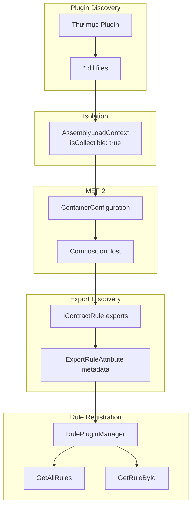
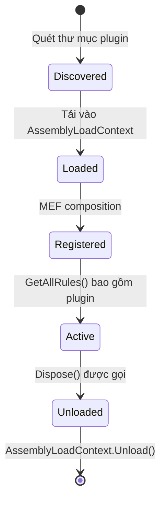

# Kiến Trúc Plugin

> Nguồn: `src/DataGuard.Core/Plugins/RulePluginManager.cs`

Hệ thống plugin của DataGuard cho phép các assembly bên ngoài mở rộng rules engine. Nó sử dụng MEF 2 (Managed Extensibility Framework) để khám phá và tải, với cô lập `AssemblyLoadContext` để unload plugin an toàn.

## Luồng Tải Plugin


```mermaid
flowchart TB
    subgraph Plugin Discovery
        DIR[Thư mục Plugin]
        DLL[*.dll files]
        DIR --> DLL
    end

    subgraph Isolation
        ALC[AssemblyLoadContext<br/>isCollectible: true]
        DLL --> ALC
    end

    subgraph MEF 2
        CC[ContainerConfiguration]
        CH[CompositionHost]
        ALC --> CC
        CC --> CH
    end

    subgraph Export Discovery
        EXP[IContractRule exports]
        META[ExportRuleAttribute metadata]
        CH --> EXP
        EXP --> META
    end

    subgraph Rule Registration
        RPM[RulePluginManager]
        ALL[GetAllRules]
        GID[GetRuleById]
        RPM --> ALL
        RPM --> GID
    end

    META --> RPM
```

## RulePluginManager

Quản lý trung tâm cho khám phá, tải, và giải quyết plugin.

```csharp
public sealed class RulePluginManager : IDisposable
{
    private readonly CompositionHost _container;
    private readonly ImmutableArray<Lazy<IContractRule, IRuleMetadata>> _rulePlugins;
    private readonly List<AssemblyLoadContext> _pluginContexts = new();

    public RulePluginManager(
        string? pluginDirectory = null,
        ILogger<RulePluginManager>? logger = null) { ... }

    public ImmutableArray<IContractRule> GetAllRules(
        ImmutableArray<IContractRule> builtInRules) { ... }

    public IContractRule? GetRuleById(
        string ruleId,
        ImmutableArray<IContractRule> builtInRules) { ... }

    public ImmutableArray<IRuleMetadata> GetRuleMetadata() { ... }
}
```

### Thư Mục Plugin

Chỉ thư mục plugin được cung cấp rõ ràng mới được quét. Vị trí mặc định (`%APPDATA%/DataGuard/Plugins`) có thể ghi bởi người dùng và không bao giờ tự động tải code. Trước khi tạo `AssemblyLoadContext`, DataGuard yêu cầu manifest `.dataguard-plugin.json` kề DLL để bind plugin ID, rule ID, version, host API version và SHA-256 digest. Policy mặc định cũng yêu cầu provenance verifier do operator cung cấp; verifier nhận manifest cùng snapshot copy của main/dependency bytes đã admission thay vì tự đọc lại path. Plugin thiếu, malformed, symlinked, incompatible, unsigned, sai digest, trùng rule hoặc xung đột rule built-in bị từ chối trước load và được ghi thành admission result. Admission giữ lại managed bytes đã hash, gồm từng entry `managedDependencies` đã khai báo. Collectible context chỉ resolve các dependency đã khai báo từ bytes đã xác thực và không probe lại thư mục plugin. Native dependency bị từ chối. Admission đọc metadata PE của DLL chính và mọi dependency đã khai báo: reference managed ngoài framework/host allowlist phải có entry manifest với assembly identity khớp. Vẫn còn acceptance work về one-handle/no-follow và signed provenance. Load context chỉ cô lập lifecycle, không sandbox code đã được nhận. Interface provenance verifier là điểm tích hợp, không phải bằng chứng signed provenance đã được xác minh.

```csharp
var dir = pluginDirectory;
if (dir != null && Directory.Exists(dir))
{
    foreach (var assemblyFile in Directory.GetFiles(dir, "*.dll"))
    {
        var alc = new AssemblyLoadContext(
            $"DataGuard.Plugin:{Path.GetFileName(assemblyFile)}",
            isCollectible: true);
        var assembly = alc.LoadFromStream(verifiedStream);
        config = config.WithAssembly(assembly);
    }
}
```

### Cô Lập AssemblyLoadContext

Mỗi assembly plugin được tải vào `AssemblyLoadContext` collectible riêng biệt:

| Thuộc tính | Giá trị | Mục đích |
|------------|---------|----------|
| `Name` | `DataGuard.Plugin:{filename}` | Nhận diện context |
| `isCollectible` | `true` | Cho phép unload |

**Lợi ích cô lập:**
- Types plugin không can thiệp vào giải quyết type của host
- Plugins có thể được unload (thu hồi bộ nhớ)
- Lỗi plugin không crash host

## ExportRuleAttribute

Thuộc tính metadata cho rule plugins. Kết hợp `ExportAttribute` của MEF với metadata đặc thù rule.

```csharp
[MetadataAttribute]
[AttributeUsage(AttributeTargets.Class, AllowMultiple = false)]
public sealed class ExportRuleAttribute : ExportAttribute, IRuleMetadata
{
    public ExportRuleAttribute(string ruleId) : base(typeof(IContractRule))
    {
        RuleId = ruleId;
    }

    public string RuleId { get; }
    public string Name { get; set; } = "";
    public string Description { get; set; } = "";
    public string Category { get; set; } = "Custom";
    public string DefaultSeverity { get; set; } = "Warning";
    public string MinDataGuardVersion { get; set; } = "1.0.0";
    public string Author { get; set; } = "";
    public string[] Tags { get; set; } = Array.Empty<string>();
}
```

### Ví Dụ Plugin

Ví dụ nằm ở `samples/plugins/DataGuard.Samples.NamingPlugin/` (không còn trong `DataGuard.Core`, không có trong `DataGuard.sln`; `PluginLoadingTests` biên dịch mã nguồn này trong test và chạy qua `ValidationPipeline.WithPlugins`).

`RulePluginManager` đọc metadata từ `[ExportRule]` (RuleId, Name, Description, Category, DefaultSeverity, MinDataGuardVersion, Author, Tags); rule export bằng attribute MEF thường thì dùng `[ExportMetadata]` và `RuleId` runtime. Sau khi nạp, `ruleId` của manifest, RuleId của `[ExportRule]` và `IContractRule.RuleId` runtime phải bằng nhau; nếu không, admission bị đánh dấu từ chối (ví dụ `Plugin manifest RuleId 'X' does not match runtime RuleId 'Y' (Type)`) và không rule nào của assembly đó chạy.

```csharp
[ExportRule(
    "CUSTOM001",
    Name = "Custom Naming Convention",
    Description = "Enforces custom naming convention for specific schemas",
    Category = "Naming",
    DefaultSeverity = "Warning",
    MinDataGuardVersion = "1.0.0",
    Author = "DataGuard Team",
    Tags = new[] { "naming", "custom" })]
public sealed class CustomNamingConventionRule : IContractRule
{
    public string RuleId => "CUSTOM001";
    public string Name => "Custom Naming Convention";
    public DiagnosticSeverity Severity => DiagnosticSeverity.Warning;

    public async Task<IReadOnlyList<ContractViolation>> ValidateAsync(
        ContractDescriptor contract,
        IReadOnlyList<ContractDescriptor> allContracts,
        CancellationToken cancellationToken = default)
    {
        var violations = new List<ContractViolation>();

        if (contract is StoredProcedureDescriptor sp &&
            sp.Schema.StartsWith("LEGACY_", StringComparison.OrdinalIgnoreCase))
        {
            foreach (var param in sp.Parameters)
            {
                if (!param.Name.StartsWith("P_", StringComparison.OrdinalIgnoreCase))
                {
                    violations.Add(new ContractViolation(
                        RuleId: "CUSTOM001",
                        Message: $"Parameter '{param.Name}' should start with 'P_'",
                        Severity: DiagnosticSeverity.Warning));
                }
            }
        }

        return await Task.FromResult(violations);
    }
}
```

## IExternalToolPlugin

Interface để tích hợp công cụ phân tích bên ngoài (SonarQube, custom linters).

```csharp
public interface IExternalToolPlugin
{
    string ToolName { get; }
    string Version { get; }

    Task<PluginAnalysisResult> AnalyzeAsync(
        IReadOnlyList<ContractDescriptor> contracts,
        CancellationToken cancellationToken = default);
}
```

### PluginAnalysisResult

```csharp
public sealed record PluginAnalysisResult(
    string ToolName,
    IReadOnlyList<ContractViolation> Violations,
    IReadOnlyList<PluginMetric> Metrics,
    TimeSpan Duration);
```

### PluginMetric

```csharp
public sealed record PluginMetric(
    string Name,
    double Value,
    string Unit,
    string Description);
```

## Tương Thích Phiên Bản

Plugins khai báo phiên bản DataGuard tối thiểu qua `MinDataGuardVersion`:

```csharp
internal static bool IsCompatible(IRuleMetadata metadata, Version? hostVersion, ILogger? logger = null)
{
    if (hostVersion is null || hostVersion == new Version(0, 0, 0, 0))
    {
        logger?.LogInformation("DataGuard host is unversioned; ... treated as compatible.", ...);
        return true; // build chưa có release tag (MinVer 0.0.0.0) không so được với phiên bản tối thiểu
    }

    if (!Version.TryParse(metadata.MinDataGuardVersion ?? "", out var minVersion))
        minVersion = new Version(1, 0, 0);
    return hostVersion >= minVersion;
}
```

Plugins không tương thích bị loại khỏi `GetAllRules()` / `GetPluginRules()`.

## Vòng Đời Plugin


```mermaid
stateDiagram-v2
    [*] --> Discovered: Quét thư mục plugin
    Discovered --> Loaded: Tải vào AssemblyLoadContext
    Loaded --> Registered: MEF composition
    Registered --> Active: GetAllRules() bao gồm plugin
    Active --> Unloaded: Dispose() được gọi
    Unloaded --> [*]: AssemblyLoadContext.Unload()
```

`ValidationPipeline.WithPlugins(...)` sở hữu mọi manager được tạo, kể cả khi gọi
nhiều lần. Khi dispose pipeline, tất cả manager được sở hữu sẽ được dispose và xóa
tham chiếu; việc unload là hợp tác và có thể bị trì hoãn nếu bên ngoài vẫn giữ
tham chiếu plugin.

## Tạo Plugin

### 1. Tạo Class Library

```xml
<Project Sdk="Microsoft.NET.Sdk">
  <PropertyGroup>
    <TargetFramework>net9.0</TargetFramework>
  </PropertyGroup>
  <ItemGroup>
    <PackageReference Include="DataGuard.Core" Version="1.0.0" />
  </ItemGroup>
</Project>
```

### 2. Implement IContractRule

```csharp
using DataGuard.Core.Abstractions;
using DataGuard.Core.Plugins;

[ExportRule("CUSTOM001",
    Name = "My Custom Rule",
    Description = "Validates custom business logic",
    Category = "Business",
    DefaultSeverity = "Warning")]
public class MyCustomRule : IContractRule
{
    // Implementation
}
```

### 3. Triển Khai

Sao chép DLL plugin đã biên dịch (không gồm `DataGuard.Core`/`DataGuard.Contracts`, host đã cung cấp) vào một thư mục tùy chọn và viết manifest kèm theo `<dll>.dataguard-plugin.json`:

```json
{ "pluginId": "my-plugin", "version": "1.0.0", "hostApiVersion": "1", "sha256": "<SHA-256 của DLL, hex>", "ruleId": "CUSTOM001" }
```

Khai báo mọi dependency managed ngoài host trong `managedDependencies`. Không có gì được nạp từ vị trí mặc định.

### 4. Chạy

```bash
dataguard validate --plugins-dir ./plugins --config .dataguard.yml
```

CLI nạp plugin với trust policy mặc định: bắt buộc signed provenance, và CLI không có provenance verifier, nên mọi plugin bị từ chối (`Plugin X.dll not loaded: Signed provenance verifier is required.`) trừ khi config chủ động cho phép plugin build cục bộ, đáng tin:

```yaml
Plugins:
  AllowUnsignedLocal: true   # vẫn kiểm tra manifest, digest, dependency closure và rule ID
```

Plugin bị từ chối được báo như rule unavailable (thoát 3 chỉ khi có `--fail-on-unavailable`). `--plugins-dir` bị từ chối khi dùng `--ide-safe` (thoát 2); thư mục không tồn tại thoát 2.
