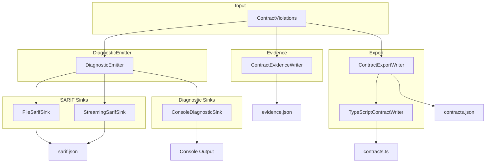
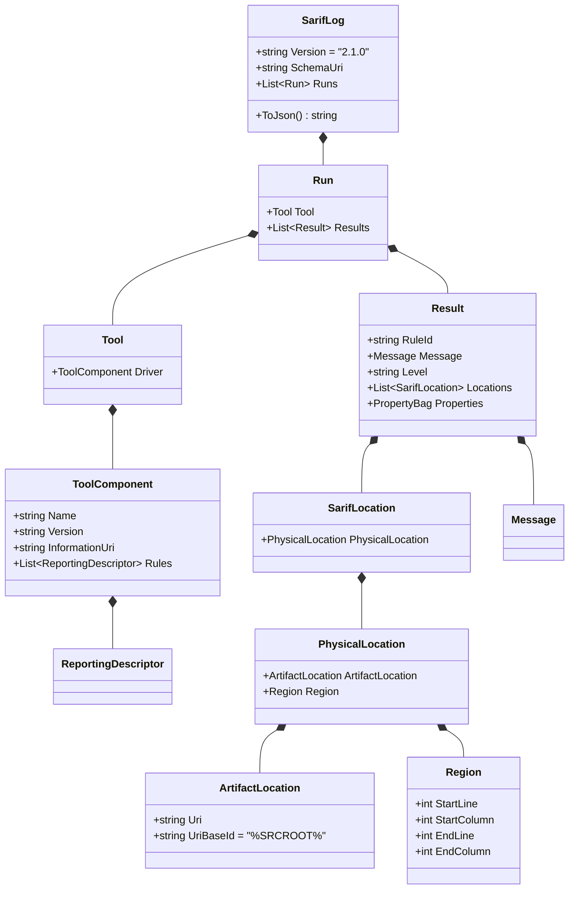

# Reporting Subsystem

> Source: `src/DataGuard.Core/Reporting/DiagnosticEmitter.cs`, `ContractEvidence.cs`, `ContractExport.cs`, `SarifTypes.cs`

The reporting subsystem converts validation results into machine-readable and human-readable output formats. It supports SARIF 2.1.0 (the industry standard for static analysis results), console output, streaming for large codebases, evidence artifacts for CI, and contract export with TypeScript DTO generation.

## Reporting Flow



## DiagnosticEmitter

Central hub for multi-format diagnostic output. Manages SARIF and diagnostic sinks.

```csharp
public class DiagnosticEmitter
{
    private readonly List<ISarifSink> _sarifSinks = new();
    private readonly List<IDiagnosticSink> _diagnosticSinks = new();

    public void AddSarifSink(ISarifSink sink) => _sarifSinks.Add(sink);
    public void AddDiagnosticSink(IDiagnosticSink sink) => _diagnosticSinks.Add(sink);

    public async Task EmitAsync(
        IEnumerable<ContractViolation> violations,
        CancellationToken cancellationToken = default)
    {
        var sarifLog = CreateSarifLog(violations);
        foreach (var sink in _sarifSinks)
            await sink.WriteAsync(sarifLog, cancellationToken);
        foreach (var sink in _diagnosticSinks)
            await sink.WriteAsync(violations, cancellationToken);
    }
}
```

### Security: Sensitive Value Filtering

The emitter maintains a whitelist of safe property keys and filters sensitive values:

```csharp
private static readonly HashSet<string> SafePropertyKeys = new(StringComparer.Ordinal)
{
    "column", "columnMaxBytes", "columnMaxLength", "dbColumnType",
    "entityMaxBytes", "entityMaxLength", "function", "inferredType",
    "keyword", "operator", "property", "referencedIssue", "semantics",
    "suggestion", "syntax", "table", "type",
};
```

`ContainsSensitiveValue()` detects patterns like `password=`, `token=`, `secret=`, `authorization: bearer`, and JWT tokens (starting with `eyJ`).

## SARIF Output

### SarifTypes

Minimal SARIF 2.1.0 type system:



### FileSarifSink

Writes SARIF output to a file. Supports both buffered and streaming modes.

```csharp
public class FileSarifSink : ISarifSink
{
    private readonly string _outputPath;
    private readonly bool _streaming;

    public FileSarifSink(string outputPath, bool streaming = false) { ... }
}
```

**Streaming mode** uses `Utf8JsonWriter` to write directly to file without buffering the full object graph — essential for large codebases with thousands of violations.

### StreamingSarifSink

Dedicated streaming sink that writes violations one-by-one with periodic flushing:

```csharp
public class StreamingSarifSink : ISarifSink
{
    public async Task WriteAsync(IEnumerable<ContractViolation> violations, CancellationToken ct)
    {
        // Write header, tool info, rules
        foreach (var violation in violations)
        {
            // Write each result
            if (++flushCounter % 1000 == 0)
                await writer.FlushAsync(ct);
        }
        // Write footer
    }
}
```

Flushes every 1000 results to balance I/O efficiency with memory usage.

### ConsoleDiagnosticSink

Simple console output for development:

```csharp
public class ConsoleDiagnosticSink : IDiagnosticSink
{
    public async Task WriteAsync(IEnumerable<ContractViolation> violations, CancellationToken ct)
    {
        foreach (var violation in violations)
        {
            var severity = violation.Severity.ToString().ToUpperInvariant();
            var location = violation.Location != null
                ? $" ({line}:{column})"
                : "";
            Console.WriteLine($"[{severity}] {violation.RuleId}: {violation.Message}{location}");
        }
    }
}
```

Output format: `[ERROR] DG002: Parameter 'P_ID' has CLR type 'int'... (42:8)`

## ContractEvidence

Versioned, redacted evidence artifact for CI and downstream consumers.

```csharp
public sealed class ContractEvidence
{
    public int SchemaVersion { get; set; } = 1;
    public string Provider { get; set; } = string.Empty;
    public List<ContractEvidenceViolation> Violations { get; set; } = new();
}
```

### Evidence Writer

```csharp
public static class ContractEvidenceWriter
{
    public static Task WriteAsync(
        string outputPath,
        string provider,
        IEnumerable<ContractViolation> violations,
        CancellationToken ct = default)
    {
        // Redact sensitive values
        // Sort deterministically (RuleId, Severity, Message)
        // Write JSON with camelCase naming
    }
}
```

**Key properties:**
- **Deterministic output** — sorted by RuleId, Severity, Message for reproducible builds
- **Redacted** — sensitive values (passwords, tokens) replaced with `[REDACTED]`
- **Versioned** — `SchemaVersion` field for forward compatibility

## ContractExport

Machine-readable export of validated contracts.

```csharp
public sealed class ContractExport
{
    public int SchemaVersion { get; set; } = 1;
    public string Provider { get; set; } = string.Empty;
    public List<EntityExport> Entities { get; set; } = new();
    public List<StoredProcedureExport> StoredProcedures { get; set; } = new();
    public List<TableExport> Tables { get; set; } = new();
}
```

### Export Types

| Type | Fields |
|------|--------|
| `EntityExport` | Name, ClrTypeName, TableName, Properties[] |
| `PropertyExport` | Name, ClrTypeName, ColumnName, ColumnType, IsNullable, MaxLength, IsPrimaryKey, IsForeignKey |
| `StoredProcedureExport` | Name, Schema, PackageName, Parameters[], ResultColumns[] |
| `ParameterExport` | Name, DataType, Direction, MaxLength, Precision, Scale, IsNullable, OrdinalPosition |
| `ColumnExport` | Name, DataType, MaxLength, Precision, Scale, IsNullable |
| `TableExport` | Name, Columns[] |

### ContractExportWriter

```csharp
public static class ContractExportWriter
{
    public static ContractExport Build(string provider, IEnumerable<ContractDescriptor> contracts) { ... }

    public static async Task WriteJsonAsync(
        string outputPath,
        string provider,
        IEnumerable<ContractDescriptor> contracts,
        CancellationToken ct = default) { ... }
}
```

Builds a deterministic export with sorted entities, procedures, and tables.

## TypeScript DTO Generation

Generates TypeScript interfaces from validated entity contracts.

```csharp
public static class TypeScriptContractWriter
{
    public static async Task WriteAsync(
        string outputPath,
        IEnumerable<EntityDescriptor> entities,
        CancellationToken ct = default) { ... }
}
```

### Type Mapping

| CLR Type | TypeScript Type |
|----------|----------------|
| `string`, `Guid`, `DateTime`, `DateTimeOffset`, `DateOnly`, `TimeOnly`, `byte[]` | `string` |
| `bool` | `boolean` |
| `int`, `long`, `short`, `byte`, `decimal`, `double`, `float` | `number` |

### Generated Output

```typescript
// Generated by DataGuard. Do not edit manually.

export interface Order {
  orderId: number;
  customerName: string;
  orderDate: string;
  totalAmount: number;
  isCancelled?: boolean;
}
```

Nullable properties get the `?` optional marker.

## Sink Interfaces

```csharp
public interface ISarifSink
{
    Task WriteAsync(SarifLog log, CancellationToken cancellationToken = default);
}

public interface IDiagnosticSink
{
    Task WriteAsync(IEnumerable<ContractViolation> violations, CancellationToken cancellationToken = default);
}
```

## Usage Example

```csharp
var emitter = new DiagnosticEmitter();
emitter.AddSarifSink(new FileSarifSink("results.sarif", streaming: true));
emitter.AddDiagnosticSink(new ConsoleDiagnosticSink());

await emitter.EmitAsync(violations);

// Evidence for CI
await ContractEvidenceWriter.WriteAsync("evidence.json", "oracle", violations);

// Export contracts
await ContractExportWriter.WriteJsonAsync("contracts.json", "oracle", contracts);

// TypeScript DTOs
await TypeScriptContractWriter.WriteAsync("contracts.ts", entities);
```
