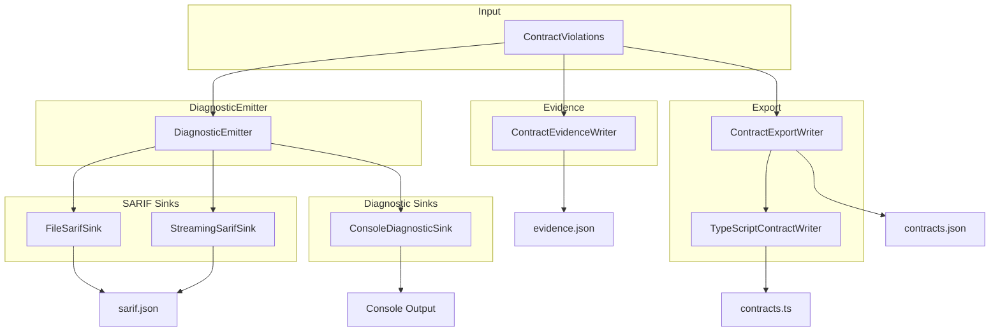
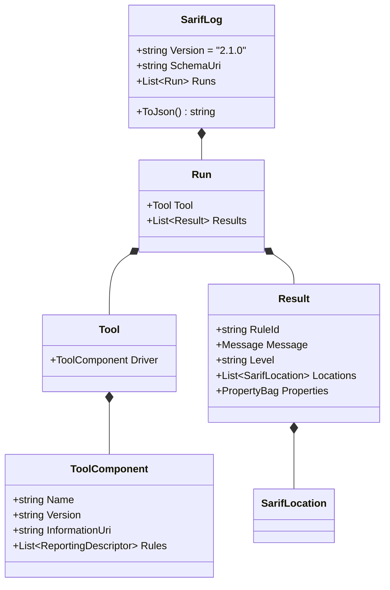

# Hệ Thống Báo Cáo

> Nguồn: `src/DataGuard.Core/Reporting/DiagnosticEmitter.cs`, `ContractEvidence.cs`, `ContractExport.cs`, `SarifTypes.cs`

Hệ thống báo cáo chuyển đổi kết quả validation thành định dạng đầu ra máy đọc và người đọc. Hỗ trợ SARIF 2.1.0 (tiêu chuẩn ngành cho kết quả phân tích tĩnh), đầu ra console, streaming cho codebase lớn, artifacts bằng chứng cho CI, và export contract với tạo TypeScript DTO.

## Luồng Báo Cáo



## DiagnosticEmitter

Trung tâm điều phối cho đầu ra diagnostic đa định dạng. Quản lý SARIF và diagnostic sinks.

```csharp
public class DiagnosticEmitter
{
    private readonly List<ISarifSink> _sarifSinks = new();
    private readonly List<IDiagnosticSink> _diagnosticSinks = new();

    public void AddSarifSink(ISarifSink sink) => _sarifSinks.Add(sink);
    public void AddDiagnosticSink(IDiagnosticSink sink) => _diagnosticSinks.Add(sink);

    public async Task EmitAsync(
        IEnumerable<ContractViolation> violations,
        CancellationToken cancellationToken = default)
    {
        var sarifLog = CreateSarifLog(violations);
        foreach (var sink in _sarifSinks)
            await sink.WriteAsync(sarifLog, cancellationToken);
        foreach (var sink in _diagnosticSinks)
            await sink.WriteAsync(violations, cancellationToken);
    }
}
```

### Bảo Mật: Lọc Giá Trị Nhạy Cảm

Emitter duy trì danh sách trắng các khóa thuộc tính an toàn và lọc giá trị nhạy cảm:

```csharp
private static readonly HashSet<string> SafePropertyKeys = new(StringComparer.Ordinal)
{
    "column", "columnMaxBytes", "columnMaxLength", "dbColumnType",
    "entityMaxBytes", "entityMaxLength", "function", "inferredType",
    "keyword", "operator", "property", "referencedIssue", "semantics",
    "suggestion", "syntax", "table", "type",
};
```

`ContainsSensitiveValue()` phát hiện các mẫu như `password=`, `token=`, `secret=`, `authorization: bearer`, và JWT tokens (bắt đầu bằng `eyJ`).

## SARIF Output

### SarifTypes

Hệ thống kiểu SARIF 2.1.0 tối thiểu:



### FileSarifSink

Ghi đầu ra SARIF vào file. Hỗ trợ cả chế độ buffered và streaming.

```csharp
public class FileSarifSink : ISarifSink
{
    private readonly string _outputPath;
    private readonly bool _streaming;

    public FileSarifSink(string outputPath, bool streaming = false) { ... }
}
```

**Chế độ streaming** sử dụng `Utf8JsonWriter` để ghi trực tiếp vào file mà không buffer toàn bộ đồ thị đối tượng — cần thiết cho codebase lớn với hàng nghìn violations.

### StreamingSarifSink

Sink streaming chuyên dụng ghi violations từng cái một với flushing định kỳ:

```csharp
public class StreamingSarifSink : ISarifSink
{
    public async Task WriteAsync(IEnumerable<ContractViolation> violations, CancellationToken ct)
    {
        // Ghi header, tool info, rules
        foreach (var violation in violations)
        {
            // Ghi mỗi result
            if (++flushCounter % 1000 == 0)
                await writer.FlushAsync(ct);
        }
        // Ghi footer
    }
}
```

Flush mỗi 1000 results để cân bằng hiệu quả I/O với sử dụng bộ nhớ.

### ConsoleDiagnosticSink

Đầu ra console đơn giản cho phát triển:

```csharp
public class ConsoleDiagnosticSink : IDiagnosticSink
{
    public async Task WriteAsync(IEnumerable<ContractViolation> violations, CancellationToken ct)
    {
        foreach (var violation in violations)
        {
            var severity = violation.Severity.ToString().ToUpperInvariant();
            Console.WriteLine($"[{severity}] {violation.RuleId}: {violation.Message}{location}");
        }
    }
}
```

Định dạng đầu ra: `[ERROR] DG002: Parameter 'P_ID' has CLR type 'int'... (42:8)`

## ContractEvidence

Artifact bằng chứng có phiên bản, đã redact cho CI và người tiêu dùng downstream.

```csharp
public sealed class ContractEvidence
{
    public int SchemaVersion { get; set; } = 1;
    public string Provider { get; set; } = string.Empty;
    public List<ContractEvidenceViolation> Violations { get; set; } = new();
}
```

### Evidence Writer

```csharp
public static class ContractEvidenceWriter
{
    public static Task WriteAsync(
        string outputPath,
        string provider,
        IEnumerable<ContractViolation> violations,
        CancellationToken ct = default)
    {
        // Redact giá trị nhạy cảm
        // Sắp xếp deterministic (RuleId, Severity, Message)
        // Ghi JSON với camelCase naming
    }
}
```

**Thuộc tính chính:**
- **Đầu ra deterministic** — sắp xếp theo RuleId, Severity, Message cho build có thể tái tạo
- **Đã redact** — giá trị nhạy cảm (passwords, tokens) thay thế bằng `[REDACTED]`
- **Có phiên bản** — trường `SchemaVersion` cho tương thích tiến

## ContractExport

Export máy đọc của các contracts đã kiểm tra.

```csharp
public sealed class ContractExport
{
    public int SchemaVersion { get; set; } = 1;
    public string Provider { get; set; } = string.Empty;
    public List<EntityExport> Entities { get; set; } = new();
    public List<StoredProcedureExport> StoredProcedures { get; set; } = new();
    public List<TableExport> Tables { get; set; } = new();
}
```

### Các Kiểu Export

| Kiểu | Trường |
|------|--------|
| `EntityExport` | Name, ClrTypeName, TableName, Properties[] |
| `PropertyExport` | Name, ClrTypeName, ColumnName, ColumnType, IsNullable, MaxLength, IsPrimaryKey, IsForeignKey |
| `StoredProcedureExport` | Name, Schema, PackageName, Parameters[], ResultColumns[] |
| `ParameterExport` | Name, DataType, Direction, MaxLength, Precision, Scale, IsNullable, OrdinalPosition |
| `ColumnExport` | Name, DataType, MaxLength, Precision, Scale, IsNullable |
| `TableExport` | Name, Columns[] |

## Tạo TypeScript DTO

Tạo TypeScript interfaces từ entity contracts đã kiểm tra.

```csharp
public static class TypeScriptContractWriter
{
    public static async Task WriteAsync(
        string outputPath,
        IEnumerable<EntityDescriptor> entities,
        CancellationToken ct = default) { ... }
}
```

### Ánh Xạ Kiểu

| Kiểu CLR | Kiểu TypeScript |
|----------|----------------|
| `string`, `Guid`, `DateTime`, `DateTimeOffset`, `byte[]` | `string` |
| `bool` | `boolean` |
| `int`, `long`, `short`, `byte`, `decimal`, `double`, `float` | `number` |

### Đầu Ra Được Tạo

```typescript
// Generated by DataGuard. Do not edit manually.

export interface Order {
  orderId: number;
  customerName: string;
  orderDate: string;
  totalAmount: number;
  isCancelled?: boolean;
}
```

Thuộc tính nullable nhận marker tùy chọn `?`.

## Mẫu Sử Dụng

```csharp
var emitter = new DiagnosticEmitter();
emitter.AddSarifSink(new FileSarifSink("results.sarif", streaming: true));
emitter.AddDiagnosticSink(new ConsoleDiagnosticSink());

await emitter.EmitAsync(violations);

// Bằng chứng cho CI
await ContractEvidenceWriter.WriteAsync("evidence.json", "oracle", violations);

// Export contracts
await ContractExportWriter.WriteJsonAsync("contracts.json", "oracle", contracts);

// TypeScript DTOs
await TypeScriptContractWriter.WriteAsync("contracts.ts", entities);
```
