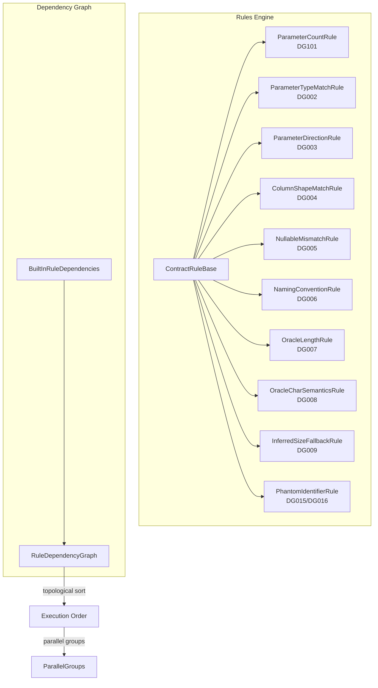
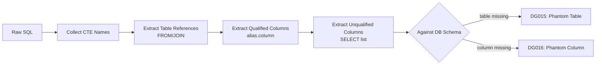
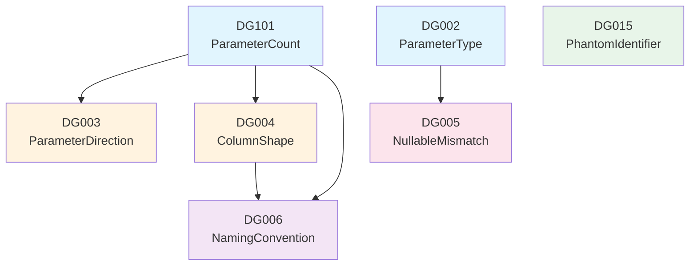

# Rules Engine

> Source: `src/DataGuard.Core/Rules/ContractRules.cs`, `PhantomIdentifierRule.cs`, `RuleDependencyGraph.cs`

The rules engine is the heart of DataGuard. It contains 11 built-in validation rules (DG001–DG009, DG015–DG016), a dependency graph for optimal execution ordering, and the abstract base class that all rules extend.

## Architecture



## ContractRuleBase

Abstract base class implementing `IContractRule`. Provides the template method pattern: public `ValidateAsync` delegates to protected `ValidateCoreAsync`.

```csharp
public abstract class ContractRuleBase : IContractRule
{
    public abstract string RuleId { get; }
    public abstract string Name { get; }
    public abstract DiagnosticSeverity Severity { get; }
    public abstract string Description { get; }

    public virtual async Task<IReadOnlyList<ContractViolation>> ValidateAsync(
        ContractDescriptor contract,
        IReadOnlyList<ContractDescriptor> allContracts,
        CancellationToken cancellationToken = default)
    {
        var violations = new List<ContractViolation>();
        await ValidateCoreAsync(contract, allContracts, violations, cancellationToken);
        return violations;
    }

    protected abstract Task ValidateCoreAsync(
        ContractDescriptor contract,
        IReadOnlyList<ContractDescriptor> allContracts,
        List<ContractViolation> violations,
        CancellationToken cancellationToken);
}
```

The base class also provides a static `CreateViolation` helper for consistent violation construction.

## Built-in Rules

### DG101 — ParameterCountRule

**Severity:** Error
**Scope:** `RawSqlDescriptor`

Validates that stored procedure calls have the expected number of parameters. For SQL text starting with `EXEC`/`EXECUTE`, it counts `@`-prefixed parameter tokens and flags when zero parameters are detected.

### DG002 — ParameterTypeMatchRule

**Severity:** Error
**Scope:** `RawSqlDescriptor`

Validates CLR type ↔ database type compatibility. Maintains two static type maps:

| CLR Type | SQL Server Types | Oracle Types |
|----------|-----------------|--------------|
| `int` | `int` | `NUMBER`, `INTEGER`, `INT` |
| `string` | `nvarchar`, `varchar`, `nchar`, `char`, `ntext`, `text` | `VARCHAR2`, `NVARCHAR2`, `CHAR`, `NCHAR`, `CLOB`, `NCLOB` |
| `DateTime` | `datetime`, `datetime2`, `smalldatetime`, `date`, `time` | `DATE`, `TIMESTAMP`, `TIMESTAMP WITH TIME ZONE` |
| `decimal` | `decimal`, `numeric`, `money`, `smallmoney` | `NUMBER`, `DECIMAL`, `NUMERIC` |
| `Guid` | `uniqueidentifier` | `RAW(16)` |
| `byte[]` | `varbinary`, `binary`, `image` | `RAW`, `BLOB` |

Uses exact token matching (never substring) to prevent false positives like `"POINT"` matching `"int"`.

### DG003 — ParameterDirectionRule

**Severity:** Error
**Scope:** `RawSqlDescriptor`

Flags when a stored procedure requires `OUT`/`INOUT`/`ReturnValue` but the call site passes the parameter as `Input`-only. Only checks when `CallSiteDirection` is known (avoids false positives without call-site analysis).

### DG004 — ColumnShapeMatchRule

**Severity:** Error
**Scope:** `EntityDescriptor` + `RawSqlDescriptor`

Compares result set columns extracted from SQL `SELECT` clauses against entity properties. Reports:
- Missing required columns (entity properties not found in result set)
- Excessive extra columns (more unmapped columns than half the entity property count)

Uses regex-based column extraction that handles `AS` aliases, skips expressions, and ignores SQL keywords.

### DG005 — NullableMismatchRule

**Severity:** Warning
**Scope:** `EntityDescriptor` + `DatabaseSchemaDescriptor`

Compares entity property nullability annotations against database column nullability:
- `[Required]` property + nullable DB column → violation
- Optional property + `NOT NULL` DB column → violation

### DG006 — NamingConventionRule

**Severity:** Info
**Scope:** `EntityDescriptor`

Checks that database column names follow the expected naming convention relative to C# property names. Supports `SnakeCaseToPascalCase`, `PascalCaseToSnakeCase`, and `ExactMatch` conventions.

### DG007/DG008 — Oracle Length Rules

**Severity:** Error/Warning
**Scope:** `DatabaseSchemaDescriptor` + `EntityDescriptor`

Oracle-specific rules validating `VARCHAR2`/`NVARCHAR2` length semantics:
- DG007: MaxLength mismatch between entity annotation and database column
- DG008: CHAR vs BYTE semantics mismatch (Oracle's `CHAR` counts characters, `BYTE` counts bytes)

### DG009 — InferredSizeFallbackRule

**Severity:** Warning
**Scope:** `EntityDescriptor`

Flags properties where `MaxLength` is inferred from CLR type defaults rather than explicitly configured — a common source of truncation bugs when the database column is smaller than the default.

### DG015/DG016 — PhantomIdentifierRule

**Severity:** Error
**Scope:** `RawSqlDescriptor` + `DatabaseSchemaDescriptor`

Detects table/column references in raw SQL that do not exist in the database schema — a common **AI hallucination failure mode** when LLMs generate SQL queries.



**Detection strategy:**
1. Collect CTE names (`WITH X AS (...)`) to exclude from phantom checks
2. Extract table references from `FROM`/`JOIN` clauses (strips schema qualifiers)
3. Check qualified column references (`alias.column`) against known table columns
4. Check unqualified columns in `SELECT` list against the primary table

## RuleDependencyGraph

A directed acyclic graph (DAG) that determines optimal rule execution order using topological sort.



### Key Features

| Feature | Description |
|---------|-------------|
| **Topological sort** | `GetExecutionOrder()` returns rules in dependency order |
| **Parallel groups** | `GetParallelGroups()` returns rules that can run concurrently at each level |
| **Cycle detection** | `Validate()` detects circular dependencies |
| **Transitive queries** | `GetTransitiveDependents()` / `GetTransitiveDependencies()` for impact analysis |
| **Placeholder nodes** | Dependencies on unregistered rules create placeholder nodes |

### BuiltInRuleDependencies

Pre-configured dependency graph for all built-in rules:

```csharp
public static RuleDependencyGraph CreateDefault()
{
    var graph = new RuleDependencyGraph();

    // Level 1: Basic parameter checks (no dependencies)
    graph.AddRule(new ParameterCountRule());        // DG101
    graph.AddRule(new ParameterTypeMatchRule());    // DG002

    // Level 2: Parameter direction (depends on parameter existence)
    graph.AddRule(new ParameterDirectionRule(), "DG101");

    // Level 3: Column shape (depends on parameter existence)
    graph.AddRule(new ColumnShapeMatchRule(), "DG101");

    // Level 4: Nullable and type matching (depends on parameter type info)
    graph.AddRule(new NullableMismatchRule(), "DG002");

    // Level 5: Naming convention (depends on parameter/column names)
    graph.AddRule(new NamingConventionRule(), "DG101", "DG004");

    // Level 6: Phantom identifiers (schema ground truth)
    graph.AddRule(new PhantomIdentifierRule());

    return graph;
}
```

### Fluent API

```csharp
var graph = new RuleDependencyGraph()
    .AddRule(new ParameterCountRule())
    .AddRule(new ParameterDirectionRule(), "DG101")
    .WithDependency("DG006", "DG101", "DG004");
```

## Rule Summary Table

| Rule ID | Name | Severity | Scope | Description |
|---------|------|----------|-------|-------------|
| DG101 | Parameter Count Match | Error | RawSql | SP parameter count must match call site |
| DG002 | Parameter Type Match | Error | RawSql | CLR types must match database types |
| DG003 | Parameter Direction | Error | RawSql | Direction must match (IN/OUT/INOUT) |
| DG004 | Column Shape Match | Error | Entity+RawSql | Result columns must match entity properties |
| DG005 | Nullable Match | Warning | Entity+Schema | Nullability must match between DB and entity |
| DG006 | Naming Convention | Info | Entity | Column names must follow naming convention |
| DG007 | Oracle Length | Error | Entity+Schema | MaxLength mismatch for Oracle types |
| DG008 | Oracle Char Semantics | Warning | Entity+Schema | CHAR vs BYTE semantics mismatch |
| DG009 | Inferred Size Fallback | Warning | Entity | MaxLength inferred from defaults, not explicit |
| DG015 | Phantom Table | Error | RawSql+Schema | SQL references non-existent table |
| DG016 | Phantom Column | Error | RawSql+Schema | SQL references non-existent column |
