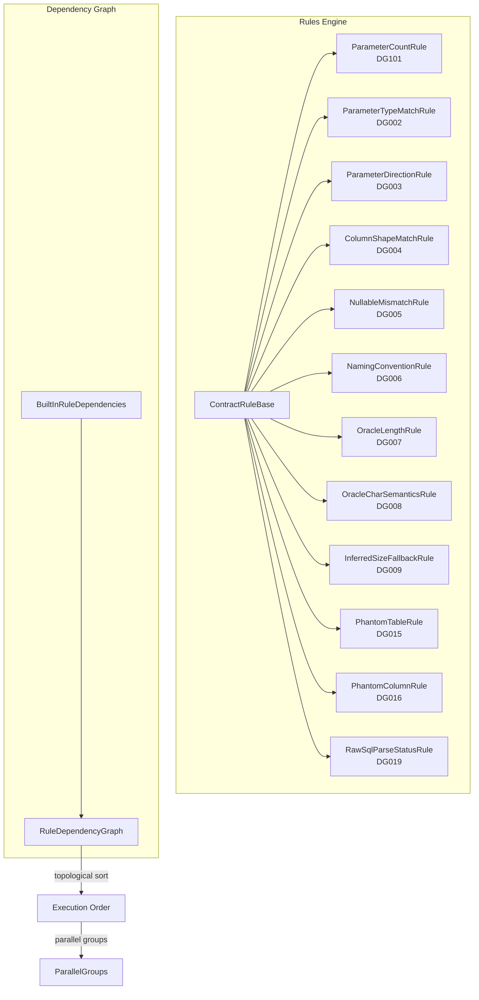
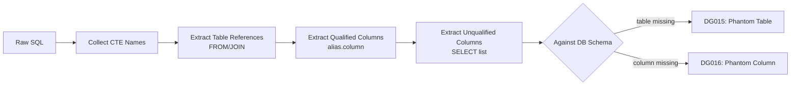
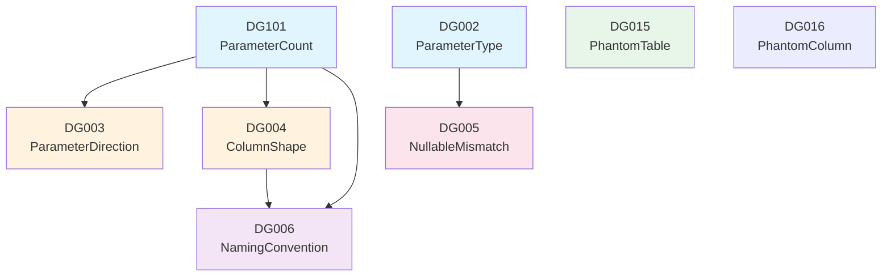

# Rules Engine

> Source: `src/DataGuard.Core/Rules/ContractRules.cs`, `PhantomTableRule.cs`, `PhantomColumnRule.cs`, `Sql/`, `RuleDependencyGraph.cs`

The rules engine is the heart of DataGuard. It contains 11 built-in validation rules (DG001–DG009, DG015–DG016), a dependency graph for optimal execution ordering, and the abstract base class that all rules extend.

## Architecture


```mermaid
flowchart TB
    subgraph Rules Engine
        CRB[ContractRuleBase]
        CRB --> PCR[ParameterCountRule<br/>DG101]
        CRB --> PTR[ParameterTypeMatchRule<br/>DG002]
        CRB --> PDR[ParameterDirectionRule<br/>DG003]
        CRB --> CSM[ColumnShapeMatchRule<br/>DG004]
        CRB --> NMR[NullableMismatchRule<br/>DG005]
        CRB --> NCR[NamingConventionRule<br/>DG006]
        CRB --> OLR1[OracleLengthRule<br/>DG007]
        CRB --> OLR2[OracleCharSemanticsRule<br/>DG008]
        CRB --> ISF[InferredSizeFallbackRule<br/>DG009]
        CRB --> PTB[PhantomTableRule<br/>DG015]
        CRB --> PCL[PhantomColumnRule<br/>DG016]
        CRB --> RPS[RawSqlParseStatusRule<br/>DG019]
    end

    subgraph Dependency Graph
        RDG[RuleDependencyGraph]
        BRD[BuiltInRuleDependencies]
        BRD --> RDG
    end

    RDG --> |topological sort| EXEC[Execution Order]
    EXEC --> |parallel groups| PAR[ParallelGroups]
```

## ContractRuleBase

Abstract base class implementing `IContractRule`. Provides the template method pattern: public `ValidateAsync` delegates to protected `ValidateCoreAsync`.

```csharp
public abstract class ContractRuleBase : IContractRule
{
    public abstract string RuleId { get; }
    public abstract string Name { get; }
    public abstract DiagnosticSeverity Severity { get; }
    public abstract string Description { get; }

    public virtual async Task<IReadOnlyList<ContractViolation>> ValidateAsync(
        ContractDescriptor contract,
        IReadOnlyList<ContractDescriptor> allContracts,
        CancellationToken cancellationToken = default)
    {
        var violations = new List<ContractViolation>();
        await ValidateCoreAsync(contract, allContracts, violations, cancellationToken);
        return violations;
    }

    protected abstract Task ValidateCoreAsync(
        ContractDescriptor contract,
        IReadOnlyList<ContractDescriptor> allContracts,
        List<ContractViolation> violations,
        CancellationToken cancellationToken);
}
```

The base class also provides a static `CreateViolation` helper for consistent violation construction.

## Built-in Rules

### DG101 — ParameterCountRule

**Severity:** Error
**Scope:** `RawSqlDescriptor`

Validates that stored procedure calls have the expected number of parameters. For raw SQL text starting with `EXEC`/`EXECUTE`, it counts `@`-prefixed parameter tokens and flags when zero parameters are detected.

**Stored Procedure Handling:**
- When a descriptor represents an explicit stored procedure call (`RawSqlDescriptor.IsStoredProcedure == true`), parameters are passed out-of-band (e.g. via Dapper parameters or ADO.NET `DbParameterCollection`) rather than inline `@`-tokens.
- `DG101` is suppressed for descriptors with `IsStoredProcedure == true` to prevent false positive zero-parameter flags.
### DG002 — ParameterTypeMatchRule

**Severity:** Error
**Scope:** `RawSqlDescriptor`

Validates CLR type ↔ database type compatibility. Maintains two static type maps:

| CLR Type | SQL Server Types | Oracle Types |
|----------|-----------------|--------------|
| `int` | `int` | `NUMBER`, `INTEGER`, `INT` |
| `string` | `nvarchar`, `varchar`, `nchar`, `char`, `ntext`, `text` | `VARCHAR2`, `NVARCHAR2`, `CHAR`, `NCHAR`, `CLOB`, `NCLOB` |
| `DateTime` | `datetime`, `datetime2`, `smalldatetime`, `date`, `time` | `DATE`, `TIMESTAMP`, `TIMESTAMP WITH TIME ZONE` |
| `decimal` | `decimal`, `numeric`, `money`, `smallmoney` | `NUMBER`, `DECIMAL`, `NUMERIC` |
| `Guid` | `uniqueidentifier` | `RAW(16)` |
| `byte[]` | `varbinary`, `binary`, `image` | `RAW`, `BLOB` |

Uses exact token matching (never substring) to prevent false positives like `"POINT"` matching `"int"`.

### DG003 — ParameterDirectionRule

**Severity:** Error
**Scope:** `RawSqlDescriptor`

Flags when a stored procedure requires `OUT`/`INOUT`/`ReturnValue` but the call site passes the parameter as `Input`-only. Only checks when `CallSiteDirection` is known (avoids false positives without call-site analysis).

### DG004 — ColumnShapeMatchRule

**Severity:** Error
**Scope:** `EntityDescriptor` + `RawSqlDescriptor`

Compares result set columns extracted from SQL `SELECT` clauses against entity properties. Reports:
- Missing required columns (entity properties not found in result set)
- Excessive extra columns (more unmapped columns than half the entity property count)

Uses regex-based column extraction that handles `AS` aliases, skips expressions, and ignores SQL keywords.

### DG005 — NullableMismatchRule

**Severity:** Warning
**Scope:** `EntityDescriptor` + `DatabaseSchemaDescriptor`

Compares `PropertyDescriptor.IsNullable` (a `Required` annotation forces non-nullable) against the nullability of the column resolved by `(entity.TableName, property.ColumnName)`. `SCHEMA.TABLE` entity names resolve by full key first, then bare name; a bare name shared by several schemas, an unknown table or an unknown column produces no finding. Columns are never merged across tables. Both directions are Warnings with distinct messages and `Properties` `{entity, property, table, column}`:
- Non-nullable property + nullable DB column → violation (reading NULL fails at runtime)
- Nullable property + `NOT NULL` DB column → violation (writing null fails with a constraint violation)

### DG006 — NamingConventionRule

**Severity:** Info
**Scope:** `EntityDescriptor`

Checks that database column names follow the expected naming convention relative to C# property names. Supports `SnakeCaseToPascalCase`, `PascalCaseToSnakeCase`, and `ExactMatch` conventions.

### DG007/DG008 — Oracle Length Rules

**Severity:** Error/Warning
**Scope:** `DatabaseSchemaDescriptor` + `EntityDescriptor`

Oracle-specific rules validating `VARCHAR2`/`NVARCHAR2` length semantics:
- DG007: MaxLength mismatch between entity annotation and database column
- DG008: CHAR vs BYTE semantics mismatch (Oracle's `CHAR` counts characters, `BYTE` counts bytes)

### DG009 — InferredSizeFallbackRule

**Severity:** Warning
**Scope:** `EntityDescriptor`

Flags properties where `MaxLength` is inferred from CLR type defaults rather than explicitly configured — a common source of truncation bugs when the database column is smaller than the default.

### DG015 — PhantomTableRule / DG016 — PhantomColumnRule

**Severity:** Error
**Scope:** `RawSqlDescriptor` + `DatabaseSchemaDescriptor`
**Source:** `PhantomTableRule.cs`, `PhantomColumnRule.cs`, analyzer contract `Sql/IPhantomReferenceAnalyzer.cs`, default tokenizer analyzer `Sql/PhantomSqlAnalyzer.cs` (tokenizer `Sql/SqlTokenizer.cs`, catalog lookup `Sql/SchemaTableIndex.cs`, names `Sql/SqlIdentifier.cs`); SQL Server AST analyzer `src/DataGuard.SqlServer.Adapter/TSqlPhantomAnalyzer.cs` + `TSqlPhantomScopeVisitor.cs`

Detects table/column references in raw SQL that do not exist in the database schema — a common **AI hallucination failure mode** when LLMs generate SQL queries. The two IDs are separate rules, so `--skip-rules DG015` or `--skip-rules DG016` disables exactly one finding kind. Raw SQL parse errors are a different rule, **DG019** (`RawSqlParseStatusRule`).


```mermaid
flowchart LR
    SQL[Raw SQL] --> CTE[Collect CTE Names]
    CTE --> TREF[Extract Table References<br/>FROM/JOIN]
    TREF --> QCOL[Extract Qualified Columns<br/>alias.column]
    QCOL --> UCOL[Extract Unqualified Columns<br/>SELECT list]
    UCOL --> CHECK{Against DB Schema}
    CHECK --> |table missing| DG015[DG015: Phantom Table]
    CHECK --> |column missing| DG016[DG016: Phantom Column]
```

**Detection strategy (token-based, no regex):**
1. Tokenize with comments (`--`, `/* */`) and string literals masked, so `FROM`/identifiers inside them are never scanned
2. Index catalog tables by both `(schema, name)` and bare `name` (catalog keys such as `dbo.Orders` are split with `SchemaObjectName.Parse`); a reference resolves by full key first, then bare name
3. Collect every CTE name of `WITH [RECURSIVE] a AS (...), b AS (...)`
4. Extract table references from `FROM`/`JOIN`, ignoring the `FROM` inside `EXTRACT(`, `TRIM(`, `SUBSTRING(`, `OVERLAY(` and `IS [NOT] DISTINCT FROM`
5. Treat as unknown (never phantom, columns not checked): CTEs, derived tables, table-valued functions (`name(`), `#temp`, `@table` variables, three-part cross-database names, `table@dblink`, `DUAL`, `sys.*`, `INFORMATION_SCHEMA.*`, `pg_catalog.*`
6. Check qualified `alias.column` against the nearest table reference in scope (innermost subquery first, so an alias reused in a subquery resolves to the subquery's table)
7. Check single-identifier items of each `SELECT` list (parenthesis-aware split) against the union of all tables that `SELECT` references; `AS alias` and implicit trailing aliases are output names, never column references

Both rules take an optional `IPhantomReferenceAnalyzer` (default: the tokenizer above); one result per raw SQL contract is cached and shared by DG015 and DG016. `ProviderRuleCatalog` passes `TSqlPhantomAnalyzer` for `--provider sqlserver`; every other provider keeps the tokenizer (AST parsing of non-T-SQL dialects is out of scope).

**SQL Server (`TSqlPhantomAnalyzer`, ScriptDOM `TSql160Parser`, quoted identifiers on):**
1. Client placeholders that are not T-SQL (`:name`, `{0}`, `?`) are rewritten to `@` variables outside literals/comments; any remaining parse error ⇒ `ParseFailed`, no DG015/DG016 (DG019 reports the parse error)
2. One scope per query specification and per DML statement. Base tables: `NamedTableReference` and DML targets (`INSERT INTO t`, `UPDATE t`, `DELETE FROM t`, `MERGE INTO t`; `UPDATE o … FROM dbo.Orders o` resolves `o` to the FROM source). Unqualified names default to schema `dbo`; lookup uses `(schema, name)` then bare name like the tokenizer
3. Opaque sources (never reported; columns not checked): CTE names of the statement's `WITH` (also inside recursive CTE bodies), derived and `VALUES` tables, TVFs (`dbo.fn_X(@id)`, `STRING_SPLIT`), `OPENJSON`/`OPENROWSET`/`OPENQUERY`, `PIVOT`/`UNPIVOT` output, `#temp`/`##temp`, `@table` variables, three/four-part names, `sys.*`, `INFORMATION_SCHEMA.*`, legacy `sysobjects`-style views. Synonyms and views are checked as tables unless the catalog contains them
4. `alias.column` / `schema.table.column` resolve through the scope chain, innermost first; an unknown qualifier (`inserted`, `deleted`) is skipped
5. Unqualified columns: skipped when any scope on the chain holding sources has an opaque source; otherwise found in the innermost scope's tables (union for joins) or an outer scope (correlated subquery), else reported against the innermost scope's tables. Output aliases (`AS x`, `x = expr`, alias without `AS`), `SELECT *`/`o.*`, date-part arguments, and `ORDER BY` of a `UNION` are never column references

## RuleDependencyGraph

A directed acyclic graph (DAG) that determines optimal rule execution order using topological sort.


```mermaid
graph TD
    DG101[DG101<br/>ParameterCount] --> DG003[DG003<br/>ParameterDirection]
    DG101 --> DG004[DG004<br/>ColumnShape]
    DG002[DG002<br/>ParameterType] --> DG005[DG005<br/>NullableMismatch]
    DG101 --> DG006[DG006<br/>NamingConvention]
    DG004 --> DG006
    DG015[DG015<br/>PhantomTable]
    DG016[DG016<br/>PhantomColumn]

    style DG101 fill:#e1f5fe
    style DG002 fill:#e1f5fe
    style DG003 fill:#fff3e0
    style DG004 fill:#fff3e0
    style DG005 fill:#fce4ec
    style DG006 fill:#f3e5f5
    style DG015 fill:#e8f5e9
```

### Key Features

| Feature | Description |
|---------|-------------|
| **Topological sort** | `GetExecutionOrder()` returns rules in dependency order |
| **Parallel groups** | `GetParallelGroups()` returns rules that can run concurrently at each level |
| **Cycle detection** | `Validate()` detects circular dependencies |
| **Transitive queries** | `GetTransitiveDependents()` / `GetTransitiveDependencies()` for impact analysis |
| **Placeholder nodes** | Dependencies on unregistered rules create placeholder nodes |

### BuiltInRuleDependencies

Pre-configured dependency graph for all built-in rules:

```csharp
public static RuleDependencyGraph CreateDefault()
{
    var graph = new RuleDependencyGraph();

    // Level 1: Basic parameter checks (no dependencies)
    graph.AddRule(new ParameterCountRule());        // DG101
    graph.AddRule(new ParameterTypeMatchRule());    // DG002

    // Level 2: Parameter direction (depends on parameter existence)
    graph.AddRule(new ParameterDirectionRule(), "DG101");

    // Level 3: Column shape (depends on parameter existence)
    graph.AddRule(new ColumnShapeMatchRule(), "DG101");

    // Level 4: Nullable and type matching (depends on parameter type info)
    graph.AddRule(new NullableMismatchRule(), "DG002");

    // Level 5: Naming convention (depends on parameter/column names)
    graph.AddRule(new NamingConventionRule(), "DG101", "DG004");

    // Level 6: Phantom identifiers (schema ground truth)
    graph.AddRule(new PhantomTableRule());       // DG015
    graph.AddRule(new PhantomColumnRule());      // DG016
    graph.AddRule(new RawSqlParseStatusRule());  // DG019
    graph.AddRule(new SelectStarUsageRule());    // DG017

    return graph;
}
```

### Fluent API

```csharp
var graph = new RuleDependencyGraph()
    .AddRule(new ParameterCountRule())
    .AddRule(new ParameterDirectionRule(), "DG101")
    .WithDependency("DG006", "DG101", "DG004");
```

## Rule Summary Table

| Rule ID | Name | Severity | Scope | Description |
|---------|------|----------|-------|-------------|
| DG101 | Parameter Count Match | Error | RawSql | SP parameter count must match call site |
| DG002 | Parameter Type Match | Error | RawSql | CLR types must match database types |
| DG003 | Parameter Direction | Error | RawSql | Direction must match (IN/OUT/INOUT) |
| DG004 | Column Shape Match | Error | Entity+RawSql | Result columns must match entity properties |
| DG005 | Nullable Match | Warning | Entity+Schema | Nullability must match between DB and entity |
| DG006 | Naming Convention | Info | Entity | Column names must follow naming convention |
| DG007 | Oracle Length | Error | Entity+Schema | MaxLength mismatch for Oracle types |
| DG008 | Oracle Char Semantics | Warning | Entity+Schema | CHAR vs BYTE semantics mismatch |
| DG009 | Inferred Size Fallback | Warning | Entity | MaxLength inferred from defaults, not explicit |
| DG015 | Phantom Table | Error | RawSql+Schema | SQL references non-existent table |
| DG016 | Phantom Column | Error | RawSql+Schema | SQL references non-existent column |
